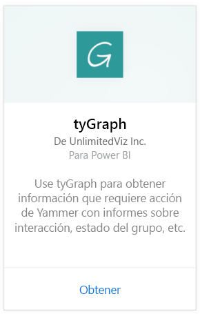
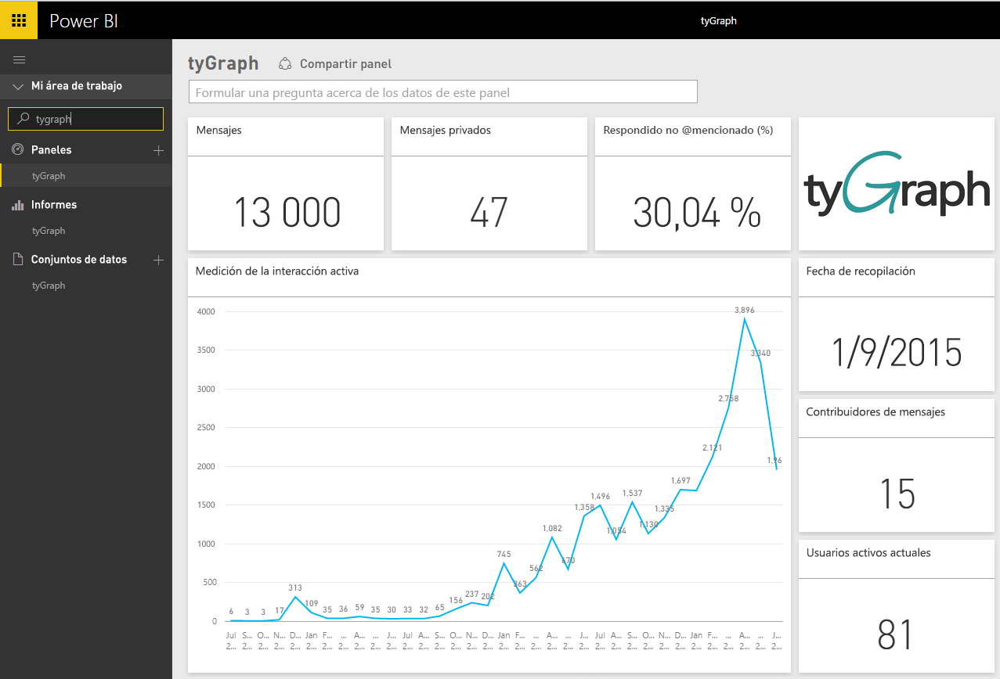

# Conexión a tyGraph con Power BI
Vea y explore los datos de tyGraph en Power BI con el paquete de contenido de Power BI. Empiece por conectar a su cuenta de tyGraph y cargar el panel, los informes y el conjunto de datos. El contenido original incluye información como, por ejemplo, la medida de contratación activa (puntuación MAE) y los principales colaboradores. Personalice el contenido para resaltar la información que más le interese.  Los datos se actualizarán automáticamente según la programación que establezca.

Conéctese a [tyGraph para Power BI](https://app.powerbi.com/getdata/services/tygraph).

## Cómo conectarse
1. Seleccione **Obtener datos** en la parte inferior del panel de navegación izquierdo.
   
   
2. En el cuadro **Servicios** , seleccione **Obtener**.
   
   
3. Seleccione **tyGraph** \> **Obtener**.
   
   
4. Especifique los grupos y el intervalo de tiempo con el que le gustaría conectarse, de lo contrario, especifique "Todo" para ver todos los datos. Tenga en cuenta el formato de fecha esperado (AAAA/MM/DD). A continuación, consulte los detalles sobre cómo [encontrar los parámetros](#FindingParams).
   
   
5. Proporcione la clave de tyGraph para conectarse. Consulte los detalles que se muestran a continuación sobre cómo buscar este valor.
   
    **Si es administrador comprobado de Yammer**  
    Su clave de API se enviará en un correo electrónico cuando se haya creado correctamente la cuenta de tyGraph. Si no puede encontrar la clave, puede solicitar una nueva mediante el envío de un mensaje de correo electrónico a support@unlimitedviz.com. Si aún no dispone de una cuenta de tyGraph, puede iniciar una versión de prueba en [http://www.tygraph.com/](http://www.tygraph.com/). 
   
    **Si no es un administrador comprobado de Yammer**
   
    El paquete de contenido de tyGraph requiere que un administrador comprobado de Yammer haya creado una cuenta de tyGraph. Una vez creada, es posible emitir claves adicionales a los usuarios de la misma organización. Si su administrador comprobado aún no ha creado una cuenta de tyGraph, póngase en contacto con ellos para que lo haga. Si ya tiene la cuenta creada, puede solicitar una clave mediante el envío de un mensaje de correo electrónico a <support@unlimitedviz.com>.
   
    
6. Después de la correcta autenticación, el proceso de importación se iniciará automáticamente. Cuando haya finalizado, aparecerá un nuevo panel, informes y modelo en el panel de navegación. Seleccione el panel para ver los datos importados.
   
    

**¿Qué más?**

* Pruebe a [hacer una pregunta en el cuadro de preguntas y respuestas](power-bi-q-and-a.md), en la parte superior del panel.
* [Cambie los iconos](service-dashboard-edit-tile.md) en el panel.
* [Seleccione un icono](service-dashboard-tiles.md) para abrir el informe subyacente.
* Aunque el conjunto de datos se programará para actualizarse diariamente, puede cambiar la programación de actualización o actualizarlo a petición mediante **Actualizar ahora**.

## Búsqueda de parámetros
Puede traer datos en todos los grupos a los que tiene acceso, o bien puede especificar un subconjunto. También puede crear un subconjunto de datos por fecha. Puede crear varios paneles de tyGraph para supervisar conjuntos específicos de grupos o fechas. A continuación se muestran detalles sobre estos parámetros.

**Grupos**

La API de tyGraph puede filtrar los datos por identificador de grupo específico. Estos se proporcionan al paquete de contenido en una lista de valores separados por comas. 

    Example: 2427647,946595,1154464

Para identificar el identificador de grupo de un grupo determinado de Yammer, desplácese a la fuente del grupo y examine la dirección URL.

En el ejemplo anterior, el identificador de grupo de Yammer es 4054844.

**Desde fecha**

Desde fecha permite restringir el primer valor de los datos devueltos. Solo se cargarán en el paquete de contenido los datos creados en la fecha especificada o posteriores a dicha fecha. El formato de Desde fecha es AAAA/MM/DD. 

    Example: 2013/10/29

En el ejemplo anterior, en el paquete de contenido se cargarán todos los datos con fecha del 29 de octubre de 2013 o posteriores. 

**Hasta la fecha** El valor Hasta la fecha permite restringir el valor más reciente de los datos devueltos. Puede usarse junto con la Fecha desde para cargar datos de un intervalo de fechas. Solo se cargarán en el paquete de contenido los datos creados antes de la fecha especificada. El formato de Hasta la fecha AAAA/MM/DD. 

    Example: 2014/10/20

En el ejemplo anterior, en el paquete de contenido se cargarán todos los datos con fecha del 20 de octubre de 2014 o anteriores. 

## Pasos siguientes
[Introducción a Power BI](service-get-started.md)

[Obtener datos en Power BI](service-get-data.md)

