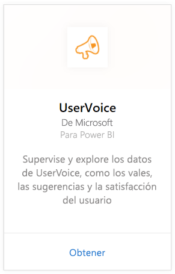
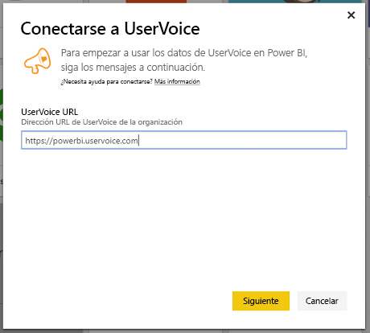
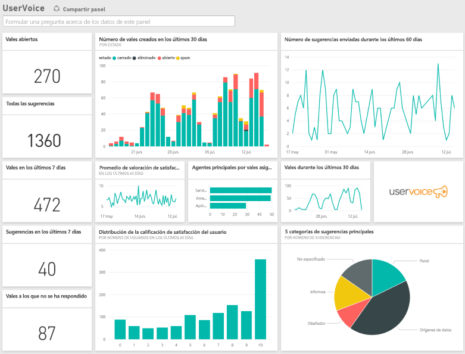

# Conexión a UserVoice con Power BI
Explorar y realizar un seguimiento de los datos de UserVoice es fácil con Power BI y el paquete de contenido de UserVoice. Power BI recupera los datos, incluidos los vales, las sugerencias y las calificaciones de satisfacción para, a continuación, crear un panel e informes basados en los datos listos para usar.

Conéctese al [paquete de contenido de UserVoice](https://app.powerbi.com/getdata/services/uservoice) para Power BI.

>[!NOTE]
>Se necesita una cuenta de administrador para conectarse al paquete de contenido de Power BI. El paquete de contenido también aprovecha la API de UserVoice y su uso se tendrá en cuenta para los límites de UserVoice. A continuación encontrará más información.

## Cómo conectarse
1. Seleccione **Obtener datos** en la parte inferior del panel de navegación izquierdo.
   
   
2. En el cuadro **Servicios** , seleccione **Obtener**.
   
    
3. Seleccione **UserVoice**y, a continuación, seleccione **Obtener**.
   
   
4. Cuando se solicite, escriba la dirección URL de UserVoice. La dirección URL debe seguir exactamente el patrón https://fabrikam.uservoice.com, reemplazando "fabrikam" por el nombre del producto o servicio.
   
   >[!NOTE]
   >Tenga en cuenta que no hay ninguna barra diagonal al final de la dirección y de que la conexión es http**s**.
   
   
5. Cuando se le solicite, escriba las credenciales de UserVoice y siga el proceso de autenticación de UserVoice. Si ya inició sesión en UserVoice con el explorador, no se le solicitarán las credenciales. Conceda a la aplicación de Power BI acceso a los datos haciendo clic en "Permitir acceso".
   
   >[!NOTE]
   >Necesitará credenciales de administrador para la cuenta de UserVoice.
   
   
6. Power BI recuperará los datos de UserVoice y creará un panel y un informe y listos para usar. Power BI recuperará los datos siguientes: todas las sugerencias, todos los vales abiertos, todos los vales creados en los últimos 30 días, incluidos los cerrados, así como todas las calificaciones de satisfacción del usuario.
   
   

**¿Qué más?**

* Pruebe a [hacer una pregunta en el cuadro de preguntas y respuestas](power-bi-q-and-a.md), en la parte superior del panel.
* [Cambie los iconos](service-dashboard-edit-tile.md) en el panel.
* [Seleccione un icono](service-dashboard-tiles.md) para abrir el informe subyacente.
* Aunque el conjunto de datos se programará para actualizarse diariamente, puede cambiar la programación de actualización o actualizarlo a petición mediante **Actualizar ahora**.

## Solución de problemas
**"Error en la validación de parámetros. Compruebe que todos los parámetros son válidos"**

Si ve este error tras especificar la dirección URL de UserVoice. Asegúrese de que se cumplen los requisitos siguientes:

* La dirección URL sigue exactamente el patrón "https://fabrikam.uservoice.com", reemplazando "fabrikam" por el prefijo de dirección URL de UserVoice correcto.
* Asegúrese de que todas las letras estén en minúsculas.
* Asegúrese de que la dirección URL esté en 'http**s**'.
* Asegúrese de que no hay ninguna barra diagonal al final de la dirección URL.

**"Error de inicio de sesión"**

Si recibe el error "Error de inicio de sesión" después de usar sus credenciales de UserVoice para iniciar sesión, la cuenta que está usando no tiene permisos para recuperar los datos de UserVoice de su cuenta. Compruebe que se trata de una cuenta de administrador y vuelva a intentarlo.

"**¡Vaya! Algo ha salido mal**"

Si recibe este mensaje de error mientras se cargan los datos, asegúrese de que su cuenta de UserVoice no ha superado su cuota de uso mensual de API. Si todo está correcto, pruebe conectándose de nuevo. Si el problema persiste, póngase en contacto con el servicio de soporte técnico de Power BI en [https://community.powerbi.com](https://community.powerbi.com/).

**Otros**  

El paquete de contenido de UserVoice para Power BI usa las API de UserVoice para recuperar los datos. Asegúrese de supervisar el uso de la API para no superar el límite. Si tiene una gran cantidad de datos en su cuenta de UserVoice, para minimizar el impacto sobre el uso de la API, se recomienda cambiar la frecuencia de actualización predeterminada actual que es de una vez al día para actualizar solo los días laborables o todos los días, en función de según sus necesidades. Otra posibilidad es que un administrador cree el paquete de contenido y lo comparta con el resto del equipo en lugar de que cada administrador de su organización cree sus propios paquetes, lo que supondría una carga adicional innecesaria para las API.

## Pasos siguientes
[Introducción a Power BI](service-get-started.md)

[Obtener datos en Power BI](service-get-data.md)

