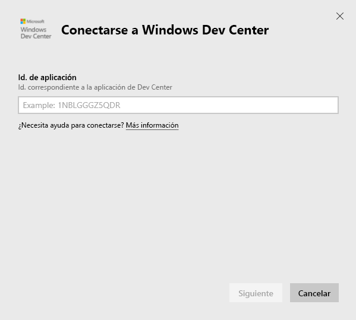
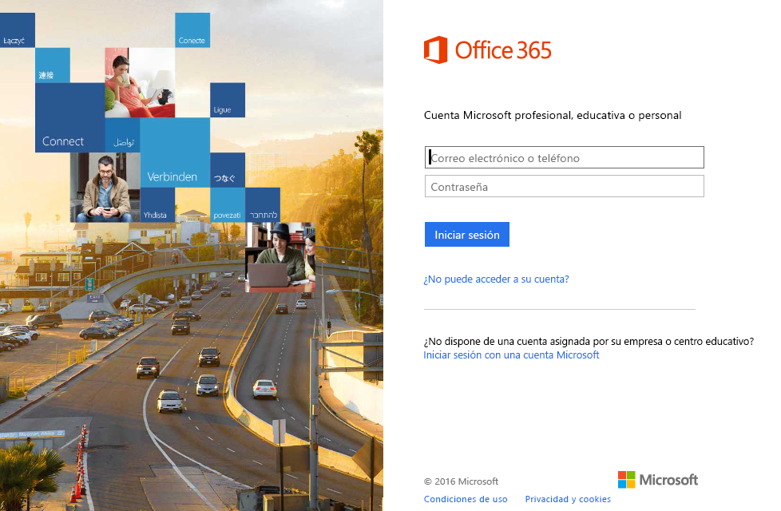
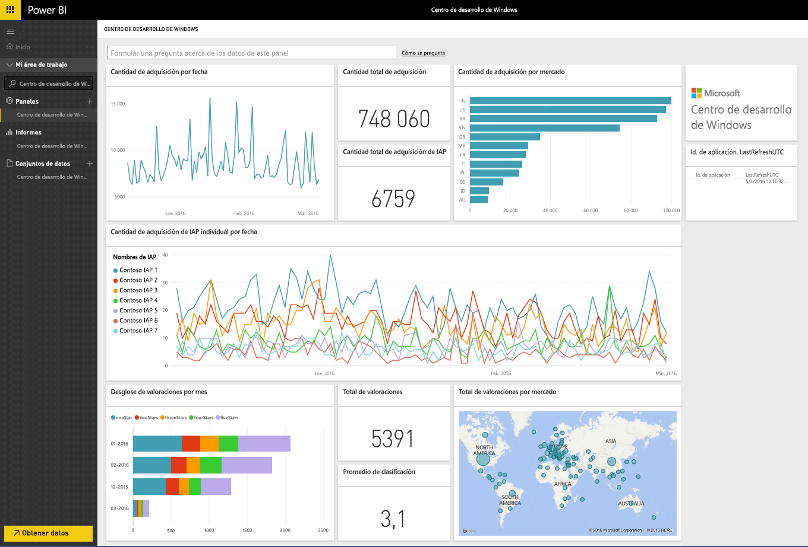
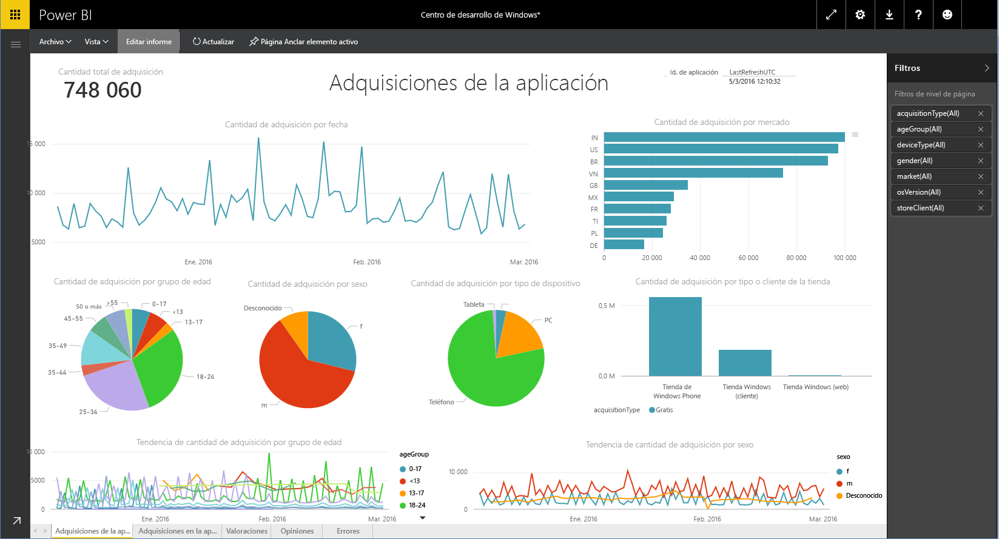

# Conexión a Windows Dev Center con Power BI
Explore y supervise los datos de análisis de aplicaciones del Centro de desarrollo de Windows en Power BI con el paquete de contenido para Power BI. Los datos se actualizarán automáticamente una vez al día.

Conéctese al [paquete de contenido del Centro de desarrollo de Windows ](https://app.powerbi.com/getdata/services/devcenter) para Power BI.

## Cómo conectarse
1. Seleccione **Obtener datos** en la parte inferior del panel de navegación izquierdo.
   
   
2. En el cuadro **Servicios** , seleccione **Obtener**.
   
   
3. Seleccione **Centro de desarrollo de Windows** \>  **Obtener**.
   
   
4. Escriba el identificador de una aplicación que posea y haga clic en Siguiente. Vea los detalles sobre [cómo encontrar esos parámetros](#FindingParams) a continuación.
   
   
5. En **Método de autenticación**, seleccione **oAuth2** \> **Iniciar sesión**. Cuando se le pida, escriba sus credenciales de Azure Active Directory asociadas a su cuenta del Centro de desarrollo de Windows (más detalles en [Requisitos del sistema](#Requirements)).
   
    
   
    
6. Tras la aprobación, el proceso de importación se iniciará automáticamente. Cuando haya finalizado, aparecerá un nuevo panel, informes y modelo en el panel de navegación. Seleccione el panel para ver los datos importados y elija un icono para ir a los informes subyacentes.
   
    
   
    

**¿Qué más?**

* Pruebe a [hacer una pregunta en el cuadro de preguntas y respuestas](power-bi-q-and-a.md), en la parte superior del panel.
* [Cambie los iconos](service-dashboard-edit-tile.md) en el panel.
* [Seleccione un icono](service-dashboard-tiles.md) para abrir el informe subyacente.
* Aunque el conjunto de datos se programará para actualizarse diariamente, puede cambiar la programación de actualización o actualizarlo a petición mediante **Actualizar ahora**.

## Qué se incluye
El paquete de contenido del Centro de desarrollo para Power BI incluye datos de análisis de su aplicación y así como de compras en la aplicación, clasificaciones, opiniones y mantenimiento de la aplicación. Los datos se limitan a los tres últimos meses. y es un intervalo móvil, por lo que las fechas incluidas se actualizarán a medida que se actualice el conjunto de datos.

## Requisitos del sistema
Este paquete de contenido requiere tener al menos una aplicación publicada en la Tienda Windows y una cuenta del Centro de desarrollo de Windows (más detalles [aquí](https://msdn.microsoft.com/windows/uwp/publish/manage-account-users)).

## Búsqueda de parámetros
Para encontrar el identificador de una aplicación, vaya a la página Identidad de la aplicación en Administración de aplicaciones.

El identificador de la aplicación está al final de la dirección URL de la Tienda Windows 10, https://www.microsoft.com/store/apps/ **{applicationId}**.

## Pasos siguientes
[Introducción a Power BI](service-get-started.md)

[Obtener datos en Power BI](service-get-data.md)

