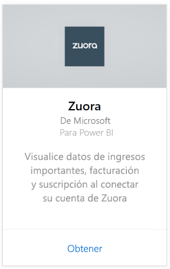
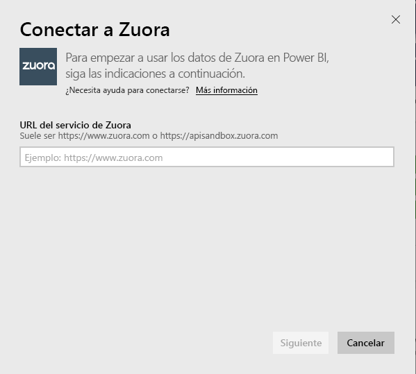
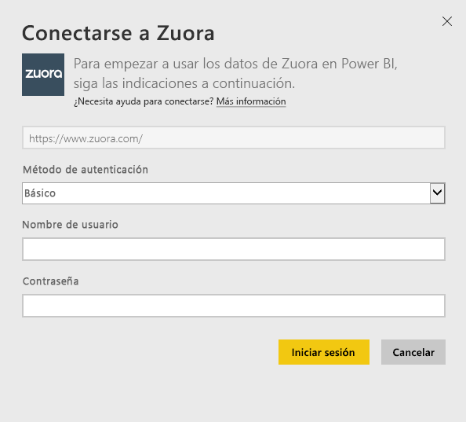

# Conexión a Zuora con Power BI
Zuora para Power BI permite visualizar datos importantes acerca de ingresos, facturación y suscripciones. Use el panel y los informes predeterminados para analizar las tendencias de uso, realizar un seguimiento de pagos y facturaciones, y supervisar los ingresos recurrentes, o personalícelos para satisfacer sus propias necesidades de panel e informes.

Conéctese a [Zuora](https://app.powerbi.com/getdata/services/Zuora) para Power BI.

## Cómo conectarse
1. Seleccione **Obtener datos** en la parte inferior del panel de navegación izquierdo.

   
2. En el cuadro **Servicios** , seleccione **Obtener**.

   
3. Seleccione **Zuora** \> **Obtener**.

   
4. Especifique la dirección URL de Zuora. La dirección URL normalmente es "<https://www.zuora.com>", pero encontrará más detalles sobre [cómo encontrar estos parámetros](#FindingParams) a continuación.

   
5. En **Método de autenticación**, seleccione **Básico** , proporcione el nombre de usuario y la contraseña (distingue mayúsculas de minúsculas), y haga clic en **Iniciar sesión**.

    
6. Tras la aprobación, el proceso de importación se iniciará automáticamente. Cuando haya finalizado, aparecerá un nuevo panel, informes y modelo en el panel de navegación. Seleccione el panel para ver los datos importados.

     

**¿Qué más?**

* Pruebe a [hacer una pregunta en el cuadro de preguntas y respuestas](consumer/end-user-q-and-a.md), en la parte superior del panel.
* [Cambie los iconos](service-dashboard-edit-tile.md) en el panel.
* [Seleccione un icono](consumer/end-user-tiles.md) para abrir el informe subyacente.
* Aunque el conjunto de datos se programará para actualizarse diariamente, puede cambiar la programación de actualización o intentar actualizar a petición mediante **Actualizar ahora**

## Qué se incluye
El paquete de contenido utiliza la API AQUA de Zuora para extraer las siguientes tablas:

| Tablas |  |  |
| --- | --- | --- |
| Account (Cuenta) |InvoiceItemAdjustment (AjusteArtículoFactura) |Refund (Reembolso) |
| AccountingCode (CódigoContable) |Payment (Pago) |RevenueSchedule (ProgramaIngresos) |
| AccountingPeriod (PeríodoContable) |PaymentMethod (MétodoPago) |RevenueScheduleItem (ArtículoProgramaIngresos) |
| BillTo (Facturar a) |Product (Producto) |Subscription (Suscripción) |
| DateDim (DimFecha) |ProductRatePlan (PlanTasaProducto) |TaxationItem (ArtículoImpuestos) |
| Invoice (Factura) |ProductRatePlanCharge (CargoPlanTasaProducto) |Usage (Uso) |
| InvoiceAdjustment (AjusteFactura) |RatePlan (PlanTasa) | |
| InvoiceItem (ArtículoFactura) |RatePlanCharge (CargoPlanTasa) | |

También incluye estas medidas calculadas:

| Medida | Descripción | Pseudocálculo |
| --- | --- | --- |
| Account: Payments (Cuenta: pagos) |Cantidades totales de pago en un período, basadas en la fecha efectiva de pago. |SUM (Payment.Amount)  WHERE Payment.EffectiveDate =< TimePeriod.EndDate AND    Payment.EffectiveDate >= TimePeriod.StartDate |
| Account: Reembolsos |Cantidades totales de reembolso en un período, basadas en la fecha de reembolso. La cantidad se notifica como un número negativo. |-1*SUM(Refund.Amount) WHERE Refund.RefundDate =< TimePeriod.EndDate AND    Refund.RefundDate >= TimePeriod.StartDate |
| Account: Net Payments (Cuenta: pagos netos) |Pagos y reembolsos de la cuenta en un período. |Account.Payments + Account.Refunds |
| Account: Active Accounts (Cuenta: cuentas activas) |El número de cuentas que estaban activas en un período. Las suscripciones deben haberse iniciado antes (o durante) la fecha de inicio del período. |COUNT (Account.AccountNumber) WHERE     Subscription.Status != "Expired" AND    Subscription.Status != "Draft" AND    Subscription.SubscriptionStartDate <= TimePeriod.StartDate AND    (Subscription.SubscriptionEndDate > TimePeriod.StartDate OR Subscription.SubscriptionEndDate = null) –evergreen subscription |
| Account: Average Recurring Revenue (Cuenta: ingresos recurrentes promedio) |MRR (ingresos recurrentes mensuales) brutos por cuenta activa en un período. |Gross MRR / Account.ActiveAccounts |
| Account: Cancelled Subscriptions (Cuenta: suscripciones canceladas) |El número de cuentas que cancelaron una suscripción en un período. |COUNT (Account.AccountNumber) WHERE Subscription.Status = "Cancelled" AND    Subscription.SubscriptionStartDate <= TimePeriod.StartDate AND    Subscription.CancelledDate >= TimePeriod.StartDate |
| Account: Payment Errors (Cuentas: errores de pago) |Valor total de errores de pago. |SUM (Payment.Amount) WHERE Payment.Status = "Error" |
| Revenue Schedule Item: Recognized Revenue (Elemento de programación de ingresos: ingresos reconocidos) |Ingresos totales reconocidos en un periodo contable. |SUM (RevenueScheduleItem.Amount) WHERE AccountingPeriod.StartDate = TimePeriod.StartDate |
| Suscripción: New Subscriptions (Suscripción: nuevas suscripciones) |Recuento de las nuevas suscripciones en un período. |COUNT (Subscription.ID) WHERE Subscription.Version = "1" AND    Subscription.CreatedDate <= TimePeriod.EndDate AND    Subscription.CreatedDate >= TimePeriod.StartDate |
| Invoice: Artículos de factura |Cantidades totales de cargos de artículos de la factura en un período. |SUM (InvoiceItem.ChargeAmount) WHERE     Invoice.Status = "Posted" AND    Invoice.InvoiceDate <= TimePeriod.EndDate AND    Invoice.InvoiceDate >= TimePeriod.StartDate |
| Invoice: Artículos con impuestos |Cantidades totales de impuestos de artículos con impuestos en un período. |SUM (TaxationItem.TaxAmount) WHERE Invoice.Status = "Posted" AND    Invoice.InvoiceDate <= TimePeriod.EndDate AND    Invoice.InvoiceDate >= TimePeriod.StartDate |
| Invoice: Ajustes de artículos de factura |Cantidades totales de ajustes de elemento de artículos de factura en un período. |SUM (InvoiceItemAdjustment.Amount)  WHERE     Invoice.Status = "Posted" AND    InvoiceItemAdjustment.AdjustmentDate <= TimePeriod.EndDate AND    InvoiceItemAdjustment.AdjustmentDate >= TimePeriod.StartDate |
| Invoice: Ajustes de factura |Cantidades totales de ajustes de factura en un período. |SUM (InvoiceAdjustment.Amount)  WHERE     Invoice.Status = "Posted" AND    InvoiceAdjustment.AdjustmentDate <= TimePeriod.EndDate AND    InvoiceAdjustment.AdjustmentDate >= TimePeriod.StartDate |
| Invoice: Facturaciones netas |Suma de los artículos de la factura, artículos con impuestos, ajustes de artículos de factura y ajustes de factura en un período. |Invoice.InvoiceItems + Invoice.TaxationItems + Invoice.InvoiceItemAdjustments + Invoice.InvoiceAdjustments |
| Invoice: Invoice Aging Balance (Factura: saldos de antigüedad de la factura) |Suma de saldos de facturas registradas. |SUM (Invoice.Balance)  WHERE     Invoice.Status = "Posted" |
| Invoice: Gross Billings (Factura: facturaciones brutas) |Suma de las cantidades de cargos de artículos de la factura para las facturas registradas en un período. |SUM (InvoiceItem.ChargeAmount)  WHERE     Invoice.Status = "Posted" AND    Invoice.InvoiceDate <= TimePeriod.EndDate AND    Invoice.InvoiceDate >= TimePeriod.StartDate |
| Invoice: Total Adjustments (Factura: ajustes totales) |Suma de los ajustes de las facturas procesadas y ajustes de artículos de las facturas asociadas a las facturas registradas. |SUM (InvoiceAdjustment.Amount)  WHERE     Invoice.Status = "Posted" AND    InvoiceAdjustment.Status = "Processed" + SUM (InvoiceItemAdjustment.Amount)  WHERE     Invoice.Status = "Posted" AND    invoiceItemAdjustment.Status = "Processed" |
| Rate Plan Charge: Gross MRR (Cargo de plan de tasa: MRR bruto) |Suma de ingresos recurrentes mensuales procedentes de suscripciones en un período. |SUM (RatePlanCharge.MRR)  WHERE     Subscription.Status != "Expired" AND    Subscription.Status != "Draft" AND    RatePlanCharge.EffectiveStartDate <= TimePeriod.StartDate AND        RatePlanCharge.EffectiveEndDate > TimePeriod.StartDate     OR    RatePlanCharge.EffectiveEndDate = null --evergreen subscription |

## Requisitos del sistema
Se requiere acceso a la API de Zuora.

## Búsqueda de parámetros
Proporcione la dirección URL con la que inicia sesión normalmente para acceder a los datos de Zuora. Las opciones válidas son:  

* https://www.zuora.com  
* La dirección URL correspondiente a la instancia de servicio  

## Solución de problemas
El paquete de contenido de Zuora extrae muchos aspectos diferentes de la cuenta de Zuora. Si no usa determinadas características, es posible que los iconos o informes correspondientes se muestren vacíos. Póngase en contacto con el soporte técnico de Power BI si experimenta problemas durante la carga.

## Pasos siguientes
[Introducción a Power BI](service-get-started.md)

[Obtener datos en Power BI](service-get-data.md)
