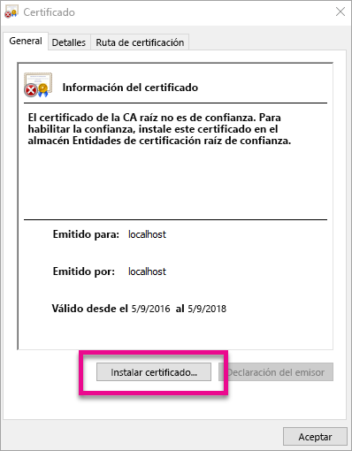
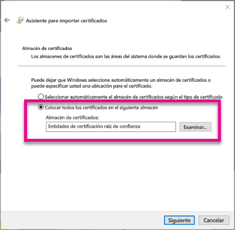
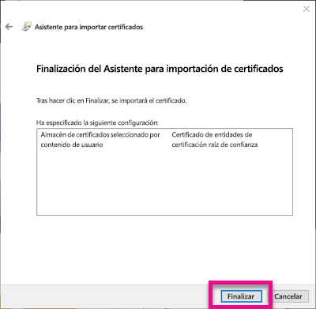
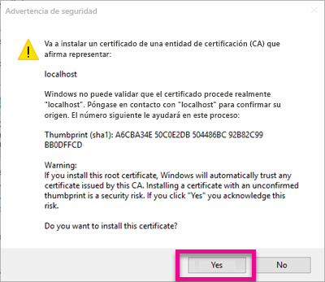
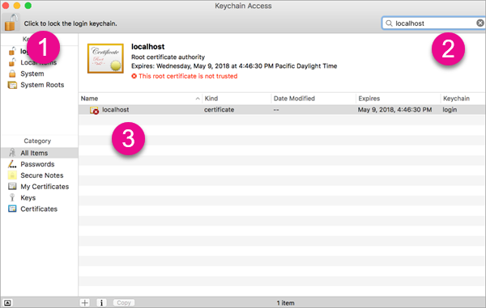
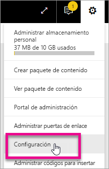
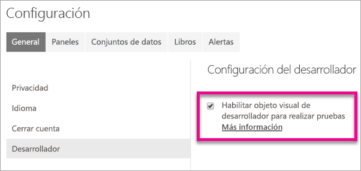

# <a name="use-developer-tools-to-create-custom-visuals"></a>Usar herramientas de desarrollo para crear objetos visuales personalizados
Los objetos visuales personalizados le permiten satisfacer las necesidades de los usuarios y adaptarse al diseño de su aplicación. Descubra cómo crear un objeto visual personalizado para Power BI con las herramientas de desarrollo.

> [!NOTE]
> Puede usar este documento para comenzar. Para obtener información detallada, consulte la información de referencia del [repositorio de Git Power BI Visuals](https://github.com/Microsoft/PowerBI-visuals) (Objetos visuales de Power BI).
> 
> 

## <a name="requirements"></a>Requisitos
* Se requiere NodeJS 4.0+ (se recomienda 5.0 o posterior) [Descargar NodeJS](https://nodejs.org)

## <a name="install-nodejs-and-the-power-bi-tools"></a>Instalar NodeJS y las herramientas de Power BI
Para crear un objeto visual personalizado, debe instalar NodeJS. Se necesita NodeJS para ejecutar las herramientas de línea de comandos.

1. Descargue e instale [NodeJS](https://nodejs.org). Se requiere la versión 4.0 o posterior, pero se recomienda tener la versión 5.0 o posterior.
2. Instale las herramientas de línea de comandos. Ejecute el siguiente comando desde un símbolo del sistema.
   
        npm install -g powerbi-visuals-tools
3. Ejecute el siguiente comando sin parámetros para confirmar que se han instalado las herramientas.
   
        pbiviz
   
    Debería ver el resultado de la ayuda.
   
    <pre><code>
         +syyso+/
    oms/+osyhdhyso/
    ym/       /+oshddhys+/
    ym/              /+oyhddhyo+/
    ym/                     /osyhdho
    ym/                           sm+
    ym/               yddy        om+
    ym/         shho /mmmm/       om+
     /    oys/ +mmmm /mmmm/       om+
    oso  ommmh +mmmm /mmmm/       om+
   ymmmy smmmh +mmmm /mmmm/       om+
   ymmmy smmmh +mmmm /mmmm/       om+
   ymmmy smmmh +mmmm /mmmm/       om+
   +dmd+ smmmh +mmmm /mmmm/       om+
         /hmdo +mmmm /mmmm/ /so+//ym/
               /dmmh /mmmm/ /osyhhy/
                 //   dmmd
                       ++
   
       PowerBI Custom Visual Tool
   
    Usage: pbiviz [options] [command]
   
    Commands:
   
    new [name]        Create a new visual
    info              Display info about the current visual
    start             Start the current visual
    package           Package the current visual into a pbiviz file
    update [version]  Updates the api definitions and schemas in the current visual. Changes the version if specified
    help [cmd]        display help for [cmd]
   
    Options:
   
    -h, --help      output usage information
    -V, --version   output the version number
    --install-cert  Install localhost certificate
    </code></pre>

<a name"ssl-setup"></a>

### <a name="server-certificate-setup"></a>Configuración del certificado de servidor
Para habilitar una vista previa dinámica del objeto visual, se necesita un servidor https de confianza. Antes de comenzar, debe instalar un certificado SSL que permitirá que se carguen los activos del objeto visual en el explorador web. 

> [!NOTE]
> Se trata de una configuración única de la estación de trabajo del desarrollador.
> 
> 

Para *agregar* un certificado, ejecute el siguiente comando.

    pbiviz --install-cert

**SO Windows**

1. Seleccione **Instalar certificado...**
   
    
2. Seleccione **Usuario actual** y después seleccione **Siguiente**.
   
    
3. Seleccione **Colocar todos los certificados en el siguiente almacén** y seleccione **Examinar...**.
4. Seleccione **Entidades de certificación raíz de confianza** y luego seleccione **Aceptar**. Seleccione **Siguiente**.
   
    
5. Seleccione **Finalizar**.
   
    
6. Seleccione **Sí** en el cuadro de diálogo de advertencia de seguridad.
   
    
7. Cierre los exploradores que tenga abiertos.

> [!NOTE]
> Si no se reconoce el certificado, deberá reiniciar el equipo.
> 
> 

**OSX**

1. Si el candado de la parte superior izquierda está bloqueado, selecciónelo para desbloquearlo. Busque *localhost* y haga doble clic en el certificado.
   
    
2. Seleccione **Confiar siempre** y cierre la ventana.
   
    
3. Escriba el nombre de usuario y contraseña. Seleccione **Actualizar configuración**.
   
    
4. Cierre los exploradores que tenga abiertos.

> [!NOTE]
> Si no se reconoce el certificado, deberá reiniciar el equipo.
> 
> 

## <a name="enable-live-preview-of-developer-visual"></a>Habilitar la vista previa dinámica del objeto visual de desarrollador
Para habilitar una vista previa dinámica de su objeto visual personalizado, siga estos pasos. Esto permite que el objeto visual se use en el servicio Power BI al editar informes.

1. Vaya a [app.powerbi.com](https://app.powerbi.com) e inicie sesión.
2. Seleccione el **icono de engranaje** y después seleccione **Configuración**.
   
    
3. Seleccione **Desarrollador** y luego seleccione **Habilitar objeto visual de desarrollador para realizar pruebas**.
   
    
4. Seleccione el **Objeto visual de desarrollador** en el panel **Visualización**.
   
    
   
   > [!NOTE]
   > Esto requiere que se ejecute `pbiviz start` desde la carpeta del objeto visual en el equipo de desarrollo. Para obtener más información sobre cómo crear el objeto visual, consulte [Crear un nuevo objeto visual](#create-a-new-visual) en este artículo.
   > 
   > 
5. Seleccione el objeto visual en el lienzo del informe. Puede enlazar datos de la misma forma que otros objetos visuales.

Ahora puede comenzar a desarrollar el objeto visual.

## <a name="create-a-new-visual"></a>Crear un nuevo objeto visual
Para crear un nuevo proyecto de objeto visual, ejecute el comando siguiente.

```
pbiviz new My Visual name
```

Puede reemplazar *My Visual Name* con el nombre que quiera darle al objeto visual. Se puede cambiar más adelante si modifica los campos `name` y `displayName` del archivo `pbiviz.json` generado.

Este comando creará una nueva carpeta en el directorio en el que se ha ejecutado el comando. Generará una plantilla de inicio básica para el objeto visual. Una vez completado el comando, puede abrir el directorio y usar su editor favorito para empezar a trabajar en el nuevo objeto visual.

## <a name="testing-your-visual-in-power-bi"></a>Probar el objeto visual en Power BI
Puede probar el objeto visual en el servicio Power BI en informes y paneles.

<a name="running-your-visual"></a>

### <a name="running-your-visual"></a>Ejecutar el objeto visual
Puede ejecutar el objeto visual de la siguiente forma.

1. Abra un símbolo del sistema.
2. Cambie el directorio para que sea la carpeta del objeto visual. Esta es la carpeta que contiene el archivo `pbiviz.json`.
3. Ejecute el siguiente comando.
   
    ```
    pbiviz start
    ```
   
    

Si se encuentra en una ubicación incorrecta, verá un error similar al siguiente.

```
    error  LOAD ERROR Error: pbiviz.json not found. You must be in the root of a visual project to run this command.
        at e (C:\Users\[user]\AppData\Roaming\npm\node_modules\powerbi-visuals-tools\lib\VisualPackage.js:67:35)
        at Function.loadVisualPackage (C:\Users\[user]\AppData\Roaming\npm\node_modules\powerbi-visuals-tools\lib\VisualPackage.js:62:16)
        at Object.<anonymous> (C:\Users\[user]\AppData\Roaming\npm\node_modules\powerbi-visuals-tools\bin\pbiviz-start.js:43:15)
        at Module._compile (module.js:556:32)
        at Object.Module._extensions..js (module.js:565:10)
        at Module.load (module.js:473:32)
        at tryModuleLoad (module.js:432:12)
        at Function.Module._load (module.js:424:3)
        at Module.runMain (module.js:590:10)
        at run (bootstrap_node.js:394:7)
```

### <a name="viewing-your-visual-in-power-bi"></a>Ver el objeto visual en Power BI
Para ver el objeto visual en un informe, vaya a ese informe y seleccione el objeto visual en el panel **Visualizaciones**.

> [!NOTE]
> Debe ejecutar el comando `pbiviz start` antes de hacerlo, como se describe en la sección [Ejecutar el objeto visual](#running-your-visual).
> 
> 


Verá la plantilla de inicio del objeto visual.


| Elemento de la barra de herramientas | Descripción |
| --- | --- |
| Actualizar objeto visual |Actualice el objeto visual de forma manual si la recarga automática está deshabilitada. |
| Activar recarga automática |Cuando está activada, el objeto visual se actualizará de forma automática cada vez que guarde el archivo. |
| Mostrar vista de datos |Muestra la vista de datos subyacente del objeto visual para la depuración |
| Obtener ayuda |Documentación en GitHub |
| Enviar comentarios |Háganos saber si hay alguna forma en la que podemos mejorar la experiencia. (Se necesita una cuenta de GitHub) |

## <a name="package-your-visual-for-use-in-power-bi-desktop-and-distribution"></a>Empaquetar el objeto visual para usar en Power BI Desktop y distribuirlo
Para poder cargar el objeto visual en [Power BI Desktop](https://powerbi.microsoft.com/desktop/) o compartirlo con la comunidad en la [galería de Power BI Visual](https://visuals.powerbi.com), debe generar un archivo `pbiviz`.

Puede empaquetar el objeto visual de la siguiente forma.

1. Abra un símbolo del sistema.
2. Cambie el directorio para que sea la carpeta del objeto visual. Esta es la carpeta que contiene el archivo `pbiviz.json`.
3. Ejecute el siguiente comando.
   
    ```
    pbiviz package
    ```

Este comando creará un `pbiviz` en el directorio `dist/` del proyecto del objeto visual. Si ya hay un archivo `pbiviz`, se sobrescribirá.

## <a name="updating-the-visuals-api-version"></a>Actualizar la versión de la API de los objetos visuales
Al crear un objeto visual mediante `pbiviz new`, se copia en el directorio del objeto visual una copia de las definiciones de tipo de API y los esquemas de JSON adecuados. Puede usar el comando `pbiviz update` para actualizar estos archivos si es necesario. Esto puede ser útil si lanzamos una corrección de una versión anterior de la API o si quiere actualizar a la última versión de la API.

### <a name="updating-your-existing-api-version"></a>Actualizar la versión existente de la API
Si se lanza una actualización de una API existente, puede obtener la última versión mediante el procedimiento siguiente.

```
#Update your version of pbiviz
npm install -g powerbi-visuals-tools

#Run update from the root of your visual project, where pbiviz.json is located
pbiviz update
```

Esto descargará las herramientas más recientes de npm, que incluyen los esquemas y definiciones de tipo actualizados. Mediante `pbiviz update`, sobrescribirá la propiedad `apiVersion` en el archivo *pbiviz.json* con la última versión.

### <a name="upgrading-to-a-different-api-version"></a>Actualizar a una versión diferente de la API
Puede actualizar a una versión diferente de la API si sigue los mismos pasos que se han mencionado anteriormente. Puede especificar explícitamente la versión de la API que quiere usar.

```
#Update your version of pbiviz
npm install -g powerbi-visuals-tools

#Run update from the root of your visual project, where pbiviz.json is located
pbiviz update 1.2.0
```

Esto actualizará el objeto visual a la versión 1.2.0 de la API. Puede reemplazar `1.2.0` con cualquier versión que quiera usar.

> [!WARNING]
> La versión predeterminada de la API que usan las herramientas siempre será la versión estable de la API. Las versiones posteriores a la versión predeterminada de la API son inestables y están sujetas a cambios. Pueden tener un comportamiento inesperado y comportarse de forma diferente en el servicio Power BI y Power BI Desktop. Para ver la versión actual de la API estable, consulte el [registro de cambios](https://github.com/Microsoft/PowerBI-visuals/blob/master/ChangeLog.md). Para obtener más información sobre las versiones preliminares, consulte el [mapa de ruta](https://github.com/Microsoft/PowerBI-visuals/blob/master/Roadmap/README.md).
> 
> 

## <a name="inside-the-visual-project"></a>Dentro del proyecto del objeto visual
El proyecto del objeto visual es la carpeta que se crea al ejecutar el comando `pbiviz new`. 

### <a name="file-structure"></a>Estructura de archivos
| Item (Elemento) | Descripción |
| --- | --- |
| assets/ |Se usa para almacenar los activos del objeto visual (icono, capturas de pantalla, etc.). |
| dist/ |Al ejecutar `pbiviz package`, se generará aquí el archivo pbiviz. |
| src/ |Código de TypeScript para el objeto visual. |
| style/ |Estilos de Less para el objeto visual. |
| .gitignore |Indica a Git que omita los archivos a los que no se les debe realizar el seguimiento en el repositorio. |
| capabilities.json |Se usa para definir las [capacidades](https://github.com/Microsoft/PowerBI-visuals/blob/master/Capabilities/Capabilities.md) del objeto visual. |
| package.json |Lo usa [npm](https://www.npmjs.com/) para administrar los módulos. |
| pbiviz.json |Archivo de configuración principal. |
| tsconfig.json |Configuración de compilador de TypeScript. Obtenga más información sobre [tsconfig.json](https://www.typescriptlang.org/docs/handbook/tsconfig-json.html). |

### <a name="pbivizjson"></a>pbiviz.json
Este es el archivo de configuración principal del objeto visual. Contiene metadatos, así como información sobre los archivos, necesarios para compilar el objeto visual.

```
{
    "visual": {
        "name": "myVisual", // internal visual name (should not contain spaces)
        "displayName": "My Visual!", // visual name displayed to user (used in gallery)
        "guid": "PBI_CV_xxxxxxx", // a unique id for this visual MUST BE UNIQUE
        "visualClassName": "Visual" // the entry class for your visual
        "version": "1.0.0", // visual version. Should be semantic version (increment if you update the visual)
        "description": "", // description used in gallery
        "supportUrl": "", // url to where users can get support for this visual
        "gitHubUrl": "" // url to the source in github (if applicable)
    },
    "apiVersion": "1.0.0", //API version this visual was created with
    "author": {
        "name": "", // your name
        "email": "" // your e-mail
    },
    "assets": {
        "icon": "assets/icon.png" // relative path to your icon file (20x20 png)
    },
    "style": "style/visual.less", // relative path to your less file
    "capabilities": "capabilities.json" // relative path to your capabilities definition 
}
```

### <a name="visual-source-typescript"></a>Origen del objeto visual (TypeScript)
El código del objeto visual debe escribirse en TypeScript, que es un superconjunto de JavaScript que admite características más avanzadas y acceso anticipado a la funcionalidad de ES6/ES7.

Todos los archivos de TypeScript deben almacenarse en el directorio `src/` y agregarse a la matriz `files` en `tsconfig.json`. Esto permite que el compilador de TypeScript los cargue y determine en qué orden.

Cuando se crea el objeto visual, todo el TypeScript se compilará en un único archivo de JavaScript. Esto le permite hacer referencia a los elementos exportados desde otros archivos sin necesidad de requerirlos manualmente mediante `require` siempre que ambos archivos se muestren en tsconfig.

Puede crear tantos archivos y clases como necesite para crear el objeto visual.

Obtenga más información sobre [TypeScript](http://www.typescriptlang.org/).

### <a name="visual-style-less"></a>Estilo de objeto visual (Less)
La aplicación de estilos de objeto visual se administra mediante hojas de estilos CSS. Para su comodidad, usamos el precompilador Less, que admite algunas características avanzadas (por ejemplo, el anidamiento, variables, mixins, condiciones, bucles, etc.). Si no quiere usar ninguna de estas características, puede escribir CSS plano en el archivo de Less.

Todos los archivos de Less deben estar almacenados en el directorio `style/`. Se cargará el archivo especificado en el campo `style` del archivo `pbiviz.json`. Los archivos adicionales se deben cargar mediante `@import`.

Obtenga más información sobre [Less](http://lesscss.org/).

## <a name="debugging"></a>Depuración
Para obtener sugerencias sobre cómo depurar el objeto visual personalizado, consulte la [guía de depuración](https://github.com/Microsoft/PowerBI-visuals/blob/master/tools/debugging.md).

## <a name="submit-your-visual-to-appsource"></a>Envío de un objeto visual a AppSource
Puede enumerar los objetos visuales para que los usen otras personas y enviarlos a AppSource. Para más información acerca de este proceso, consulte [Publicación de objetos visuales personalizados en la Tienda Office](developer/office-store.md).

## <a name="troubleshooting"></a>Solución de problemas
**No se ha encontrado el comando de pbiviz (o errores similares)**

Si ejecuta `pbiviz` en la terminal o línea de comandos, verá la pantalla de ayuda. De lo contrario, no está instalado correctamente. Asegúrese de que tiene instalada al menos la versión 4.0 de NodeJS.

Para obtener más información, consulte [Instalar NodeJS y las herramientas de Power BI](#install-nodejs-and-the-power-bi-tools)...

**No se puede encontrar el objeto visual de depuración en la pestaña Visualizaciones**

El objeto visual de depuración es similar a un icono de símbolo del sistema en la pestaña **Visualizaciones**.


Si no lo ve, asegúrese de que lo ha habilitado en la configuración de Power BI. 

> [!NOTE]
> Actualmente, el objeto visual de depuración solo está disponible en el servicio Power BI y no está en Power BI Desktop ni en la aplicación móvil. El objeto visual empaquetado seguirá funcionando en todas partes.
> 
> 

Para obtener más información, consulte [Habilitar la vista previa dinámica del objeto visual de desarrollador](#enable-live-preview-of-developer-visual)...

**No puede ponerse en contacto con el servidor del objeto visual**

Ejecute el servidor del objeto visual con el comando `pbiviz start` en la terminal o línea de comandos desde la raíz del proyecto del objeto visual. Si el servidor se está ejecutando, es probable que los certificados SSL no se hayan instalado correctamente.

Para obtener más información, consulte [Ejecutar el objeto visual](#running-your-visual) o [Configuración del certificado de servidor](#ssl-setup).

## <a name="next-steps"></a>Pasos siguientes
[Visualizaciones en Power BI](power-bi-report-visualizations.md)  
[Visualizaciones personalizadas en Power BI](power-bi-custom-visuals.md)  
[Publicación de objetos visuales personalizados en la Tienda Office](developer/office-store.md)  
[TypeScript](http://www.typescriptlang.org/)  
[Less CSS](http://lesscss.org/)  

¿Tiene más preguntas? [Pruebe a preguntar a la comunidad de Power BI](http://community.powerbi.com/)

