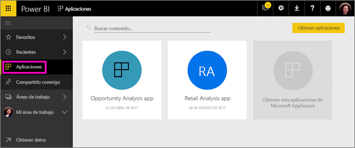
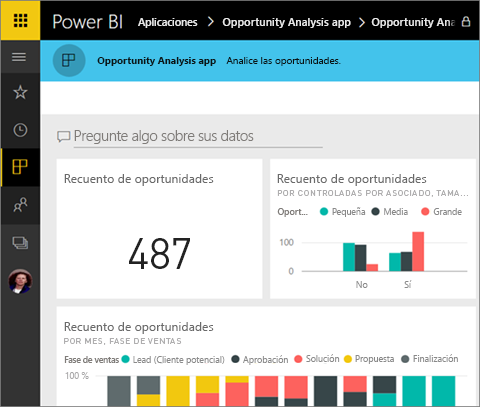
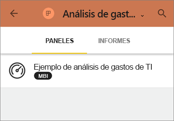
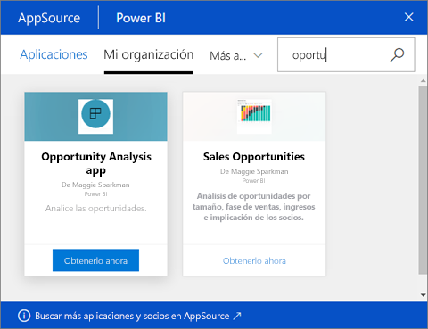
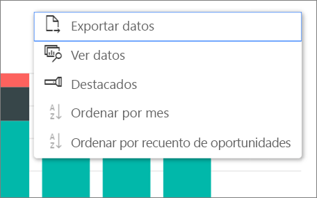

# Instalación y uso de aplicaciones con los paneles e informes de Power BI
En Power BI, las *aplicaciones* permiten reunir paneles e informes relacionados en un solo lugar. Los usuarios de la organización pueden crear y distribuir aplicaciones con información empresarial clave. Los [servicios externos](service-connect-to-services.md) que puede que ya esté usando, como Google Analytics y Microsoft Dynamics CRM, ofrecen también aplicaciones de Power BI. 

Es muy fácil buscar e instalar aplicaciones en el servicio Power BI ([https://powerbi.com](https://powerbi.com)) y en el dispositivo móvil. Después de instalar una aplicación, no tendrá que recordar los nombres de muchos paneles diferentes ya que se encontrarán todos juntos en una aplicación, en el explorador o en su dispositivo móvil.

En el caso de las aplicaciones, siempre que el autor de la aplicación publique actualizaciones, verá los cambios automáticamente. El autor controla la frecuencia de actualización de los datos, por lo que no tiene que preocuparse de mantenerlos actualizados. 

¿Planea crear una aplicación? Para obtener más información, vea [Crear áreas de trabajo con sus compañeros en Power BI](service-create-distribute-apps.md).

## Obtener una nueva aplicación
Puede obtener aplicaciones de varias maneras diferentes. El autor de la aplicación puede instalar la aplicación automáticamente en su cuenta de Power BI o puede enviar un vínculo directo a una aplicación, o puede buscarla en AppSource, donde verá todas las aplicaciones a las que puede acceder. En Power BI en el dispositivo móvil, solo podrá instalarla desde un vínculo directo y no desde AppSource. Si el autor de la aplicación la instala automáticamente, podrá verla en la lista de aplicaciones.

### Instalar una aplicación desde un vínculo directo
La manera más fácil de instalar una aplicación nueva por sí mismo es obtener un vínculo directo de su autor. Power BI crea un vínculo de instalación para que el autor se lo envíe.

**En el equipo** 

Al hacer clic en el vínculo del correo electrónico, el servicio Power BI ([https://powerbi.com](https://powerbi.com)) se abre en un explorador. Confirme que desea instalarla y se abrirá la página de inicio de la aplicación.

**En su dispositivo móvil de iOS o Android** 

Al hacer clic en el vínculo del correo electrónico en el dispositivo móvil, la aplicación se instala automáticamente y se abre su lista de contenido en la aplicación móvil. 

### Obtención de la aplicación desde Microsoft AppSource
También puede buscar e instalar todas las aplicaciones a las que tenga acceso desde Microsoft AppSource. 

1. Seleccione **Aplicaciones**  > **Obtener aplicaciones**. 
   
     
2. En AppSource, en **Mi organización**, puede buscar para limitar los resultados y encontrar la aplicación que está buscando.
   
     
3. Seleccione **Get it now** (Obtenerla ahora) para agregarla a la página Aplicaciones. 

## Interacción con los paneles e informes en la aplicación
Ahora podrá explorar los datos de los paneles e informes en la aplicación. Tiene acceso a todas las interacciones estándar de Power BI como el filtrado, el resaltado, la ordenación y la exploración en profundidad. También puede [exportar los datos a Excel ](power-bi-visualization-export-data.md) desde una tabla o desde otro objeto visual de un informe. Más información sobre la [interacción con informes de Power BI](service-reading-view-and-editing-view.md). 

## Pasos siguientes
* [Creación y publicación de aplicaciones en Power BI](service-create-distribute-apps.md)
* [Conectarse a los servicios con los paquetes de contenido de Power BI](service-connect-to-services.md)
* ¿Tiene alguna pregunta? [Pruebe a preguntar a la comunidad de Power BI](http://community.powerbi.com/)

