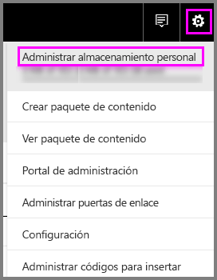
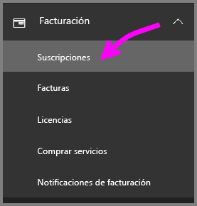
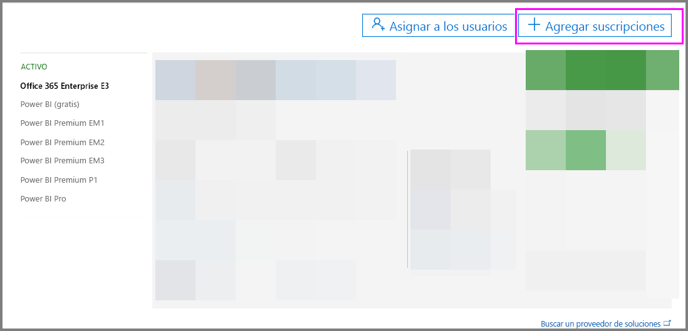
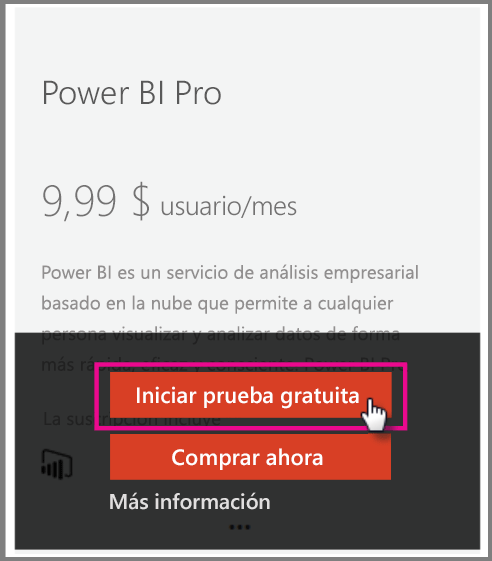

# Power BI Pro en su organización

Power BI Pro es una licencia de pago que habilita más características. Las licencias de Power BI Pro están dirigidas a equipos en los que se quiere compartir y colaborar con otros para tomar decisiones basadas en datos.  Cada miembro del equipo que crea o visualiza contenido compartido de Power BI necesita una licencia Pro, salvo que el contenido esté asociado a una capacidad dedicada que usa Power BI Premium.

Se necesita la licencia de Power BI Pro para estas características:

* **Analizar datos en Excel o Power BI Desktop**: use Excel o Power BI Desktop para ver e interactuar con un conjunto de datos publicados en Power BI. Para más información, vea [Analizar en Excel](service-analyze-in-excel.md).

* **Compartir paneles y colaborar con áreas de trabajo**: con las áreas de trabajo de Power BI es más fácil colaborar con compañeros en paneles, informes y conjuntos de datos. Para más información, vea [Colaboración en un área de trabajo de aplicación de Power BI](service-collaborate-power-bi-workspace.md).

* **Ver contenido compartido**: los usuarios Pro pueden ver los paneles y los informes que se comparten con ellos, interactuar con ellos y volver a compartirlos (si se permite), pero no pueden editar estos paneles o informes. Para saber más, vea [Comparta los informes y paneles de Power BI con compañeros y otros usuarios](service-share-dashboards.md).

* **Integrar contenido con Microsoft Teams**: puede agregar una pestaña de Power BI en un canal de Microsoft (MS) Teams. MS Teams detecta automáticamente todos los informes en el área de trabajo. Para más información, vea [Power BI teams up with Microsoft Teams](https://powerbi.microsoft.com/en-us/blog/power-bi-teams-up-with-microsoft-teams/) (Power BI se asocia con Microsoft Teams). 

## Evaluación gratuita de 60 días de Power BI Pro para usuarios individuales

Después de registrarse para obtener una cuenta gratuita, también tiene la opción de probar Power BI Pro gratis durante 60 días. Tendrá acceso a todas las características de Power BI Pro durante el tiempo de la prueba. Power BI Pro incluye todas las características de la versión gratuita de Power BI y características adicionales de uso compartido y colaboración. Para más información, consulte los [precios de Power BI](https://powerbi.microsoft.com/en-us/pricing/). Para probar una evaluación gratuita de 60 días de Power BI Pro, regístrese en Power BI y pruebe una de estas características de Power BI Pro.

* [Crear un área de trabajo](service-create-distribute-apps.md)
* [Compartir un panel](service-share-dashboards.md)

Cuando pruebe cualquiera de estas características, se le pedirá que inicie su prueba gratuita. Para usarla, también puede ir al icono de engranaje y seleccionar Administrar almacenamiento personal. Después, elija Probar Power BI Pro gratis a la derecha.

   
    
   

Después, puede seleccionar Iniciar evaluación.

   

> [!NOTE]
> Los usuarios que usen esta versión de evaluación del producto Power BI Pro no aparecen en el portal de administración de Office 365 como usuarios de  prueba de Power BI Pro (aparecen como usuarios gratuitos de Power BI). Aunque sí aparecerán como usuarios de Prueba de Power BI Pro en la página Administrar almacenamiento de Power BI.
>

> [!NOTE]
> Si es un administrador de TI y quiere comprar e implementar licencias de prueba de Power BI para varios usuarios de su organización sin que cada usuario tenga que aceptar los términos de la evaluación gratuita, puede registrarse para obtener una suscripción de prueba a Power BI Pro. Deberá ser un administrador de facturación o de Office 365 Global, o bien deberá crear un nuevo inquilino para registrarse y obtener una versión de prueba para administradores. Consulte [Adquisición de Power BI Pro](service-admin-purchasing-power-bi-pro.md) para más información.
>

Cuando esté dentro del servicio, compruebe que tiene una cuenta de prueba Pro. Para ello, vaya al icono de engranaje y seleccione Administrar almacenamiento personal.

   

## Suscripción de prueba en Office 365

Puede obtener Power BI Pro como una versión de prueba para su organización. Cuando tenga la suscripción, puede asignar licencias de Power BI Pro a los usuarios. Para más información sobre cómo asignar licencias, vea [Asignar licencias a usuarios en Office 365 para empresas](https://support.office.com/en-us/article/assign-licenses-to-users-in-office-365-for-business-997596b5-4173-4627-b915-36abac6786dc?ui=en-US&rs=en-US&ad=US).

> [!NOTE]
> Hay un límite de una prueba organizativa por inquilino. Esto significa que, si alguien ya ha aplicado la Prueba de Power BI Pro al inquilino, no puede volver a hacerlo. Si necesita ayuda con esto, puede ponerse en contacto con el [soporte de facturación de Office 365](https://support.office.microsoft.com/en-us/article/contact-support-for-business-products-admin-help-32a17ca7-6fa0-4870-8a8d-e25ba4ccfd4b?CorrelationId=552bbf37-214f-4202-80cb-b94240dcd671&ui=en-US&rs=en-US&ad=US).
>

Siga estos pasos para obtener una suscripción de prueba de Office 365:

1. Vaya al [Centro de administración de Office 365](https://portal.office.com/adminportal/home#/homepage).
2. En el panel de navegación izquierdo, seleccione Facturación y luego haga clic en Suscripciones.

   

3. Seleccione Agregar suscripciones a la derecha.

   

4. En Otros planes, mantenga el mouse sobre los puntos suspensivos (...) de Power BI Pro y seleccione Iniciar prueba gratuita.

    

5. Seleccione Probar ahora en la pantalla de confirmación del pedido.
6. Seleccione Continuar en el recibo del pedido.

## Adquisición de Power BI Pro

Puede comprar Power BI Pro a través de Microsoft Office 365 o a través de un socio certificado de Microsoft. Para más información sobre cómo comprar Power BI Pro, vea [Adquisición de Power BI Pro](service-admin-purchasing-power-bi-pro.md).

## Pasos siguientes
[Registro de autoservicio para Power BI](service-admin-signing-up-for-power-bi-with-a-new-office-365-trial.md)
 
[Power BI (gratis) en su organización](service-admin-service-free-in-your-organization.md)
 
[Adquisición de Power BI Pro](service-admin-purchasing-power-bi-pro.md)
 
[Extended Pro Trial activation](service-extended-pro-trial.md) (Activación de la extensión del período de prueba de Power BI Pro)
 
[Asignación de licencias de Power BI Pro](service-assigning-power-bi-pro-licenses.md)
 
[¿Qué es Power BI Premium?](service-admin-premium-manage.md)
 
[Adquisición de Power BI Premium](service-admin-premium-purchase.md)
 
[Notas del producto de Power BI Premium](https://aka.ms/pbipremiumwhitepaper)

¿Tiene más preguntas? [Pruebe a preguntar a la comunidad de Power BI](https://community.powerbi.com/)