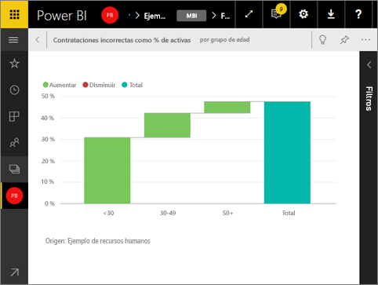

# Visualizar un icono de panel en el modo de pantalla completa
Para que los iconos se puedan mostrar en modo de pantalla completa, antes deben estar en [modo enfocado](service-focus-mode.md).

## ¿Qué es el modo de pantalla completa?
Muestre los [paneles, los informes](service-fullscreen-mode.md) y los iconos sin la distracción de los menús y los botones de navegación.  Disfrute de una vista completa pura de su empresa con un solo vistazo, todo el tiempo. Esto a veces se conoce como modo de televisión.

Algunos usos del modo de pantalla completa son:

* presentar su icono en una reunión o conferencia
* mostrar el icono en una oficina en una pantalla de gran tamaño dedicada o un proyector.
* examinar su icono en una pantalla pequeña
* revisar el icono en modo bloqueado (puede tocar la pantalla o pasar el mouse por encima del icono sin abrir el informe subyacente)

## Para activar (y desactivar) el modo de pantalla completa
1. [Salir del icono y mostrarlo en el modo Enfoque](service-focus-mode.md).
   
    
   
    El icono rellena el lienzo para que pueda verlo con mayor detalle. En el modo Enfoque de un icono de panel, puede ver y modificar los filtros que se aplicaron cuando se creó este objeto visual.
   
    
2. En la barra de menús superior seleccione este icono  para mostrar el icono en modo de pantalla completa.
3. En el modo pantalla completa el icono llena toda la pantalla, desaparece la distracción de menús y botones de navegación.  En todo momento se disfruta de una vista completa sin adulterar del icono con un solo vistazo. Esto a veces se conoce como modo de televisión.
   
   
4. Cuando se mueve el mouse, aparece un menú. El menú permanecerá en la esquina inferior derecha hasta que salga del modo de pantalla completa. Si desaparece, basta con mover el cursor o puntear en la pantalla.
   
    
   
   * Use el botón **Atrás** para navegar a la página anterior del explorador. Si la página anterior era una página del servicio Power BI, se mostrará en el modo de pantalla completa.  El modo de pantalla completa se mantendrá hasta que la cierre.
   * Para imprimir un panel desde el modo de pantalla completa, seleccione el icono de impresión.
     
   * Para salir del modo de pantalla completa, haga clic en el icono **Cerrar pantalla completa** .

## Pasos siguientes
[Paneles en Power BI](service-dashboards.md)

[Modo de pantalla completa para paneles e informes](service-fullscreen-mode.md)

[Modo enfocado en Power BI](service-focus-mode.md)

¿Tiene más preguntas? [Pruebe la comunidad de Power BI](http://community.powerbi.com/)

