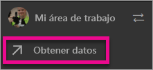
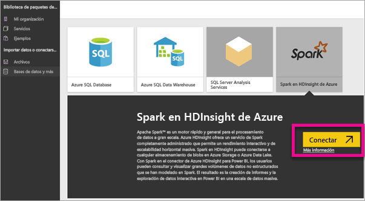
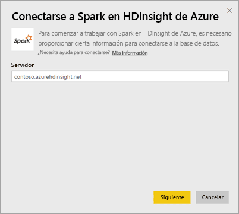
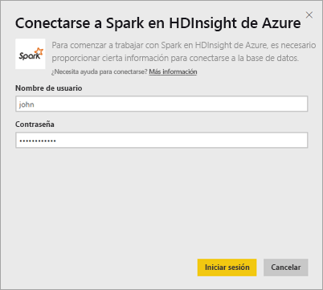

# Spark en HDInsight con DirectQuery

Spark en HDInsight de Azure con DirectQuery permite crear informes dinámicos basados en los datos y las métricas que ya existen en su grupo de Spark. Con DirectQuery, las consultas se envían al grupo de Spark en HDInsight de Azure a medida que explora los datos en la vista del informe. Esta experiencia está recomendada para los usuarios que están familiarizados con las entidades a las que se conectan.

> [!WARNING]
> La actualización automática del icono se ha deshabilitado para los iconos del panel que tienen como base conjuntos de datos basados en Spark. Puede seleccionar **Actualizar iconos del panel** para actualizar manualmente. Los informes no se ven afectados y deberían permanecer actualizados. 

Puede usar los siguientes pasos para conectarse a su origen de datos de Spark en Azure HDInsight con DirectQuery en el servicio Power BI.

> [!Important]
> Hemos mejorado la conectividad con Spark.  Use Power BI Desktop para disfrutar de la mejor experiencia de conexión al origen de datos de Spark.  Una vez creados el modelo y el informe, puede publicarlos en el servicio Power BI.  Ahora, el conector directo de Spark en el servicio Power BI está en desuso.

1. Seleccione **Obtener datos** en la parte inferior del panel de navegación izquierdo.

     
2. Seleccione **Bases de datos y más**.

     
3. Seleccione el conector **Spark en HDInsight** y elija **Conectar**.

     
4. Escriba el nombre del **servidor** al que desea conectarse, así como su **nombre de usuario** y **contraseña**. El servidor siempre tiene el formato \<nombreDeClúster\>.azurehdinsight.net. Vea a continuación más información sobre cómo encontrar estos valores.

     

     
5. Una vez conectado, verá un nuevo conjunto de datos con el nombre "SparkDataset". También se puede acceder al conjunto de datos mediante el icono de marcador de posición que se crea.

     
6. Explore el conjunto de datos para ver con detalle todas las tablas y columnas de la base de datos. Si selecciona una columna enviará una consulta al origen y se creará dinámicamente el objeto visual. Estos objetos visuales pueden guardarse en un informe nuevo y anclarse de nuevo al panel.

## Buscar los parámetros de Spark en HDInsight

El servidor siempre tiene el formato \<nombreDeClúster\>.azurehdinsight.net y puede encontrarse en Azure Portal.

El nombre de usuario y la contraseña también se encuentran en Azure Portal.

## Limitaciones

Estas restricciones y notas pueden cambiar mientras seguimos mejorando las experiencias. Encontrará documentación adicional en [Uso de herramientas de BI con Apache Spark en HDInsight de Azure](/azure/hdinsight/spark/apache-spark-use-bi-tools/).

* El servicio Power BI solo admite una configuración de Spark 2.0 y HDInsight 3.5.
* Cada acción, como seleccionar una columna o agregar un filtro, enviará una consulta a la base de datos. Antes de seleccionar campos muy grandes, considere la posibilidad de elegir un tipo de objeto visual adecuado.
* Preguntas y respuestas no está disponible para conjuntos de datos de DirectQuery.
* Los cambios de esquema no se capturan automáticamente.
* Power BI admite 16 000 columnas **en todas las tablas** dentro de un conjunto de datos. Power BI también incluye una columna interna de número de fila para cada tabla. Esto significa que, si tiene 100 tablas en el conjunto de datos, el número de columnas disponibles sería 15 900. Según la cantidad de datos con la que esté trabajando desde el origen de datos de Spark, es posible que encuentre esta limitación.

## Solución de problemas

Si tiene problemas para ejecutar consultas en el grupo, compruebe que la aplicación se sigue ejecutando y reinicie si es necesario.

También pueden asignar recursos adicionales en Azure Portal en **Configuración** > **Escalar clúster**:

## Pasos siguientes

[Introducción: creación de clústeres Apache Spark en HDInsight para Linux y ejecución de consultas interactivas mediante Spark SQL](/azure/hdinsight/spark/apache-spark-jupyter-spark-sql/)  
[¿Qué es Power BI?](power-bi-overview.md)  
[Obtener datos para Power BI](service-get-data.md)
[Uso de Kerberos en la puerta de enlace local para el SSO](service-gateway-sso-kerberos.md)

¿Tiene más preguntas? [Pruebe la comunidad de Power BI](http://community.powerbi.com/)