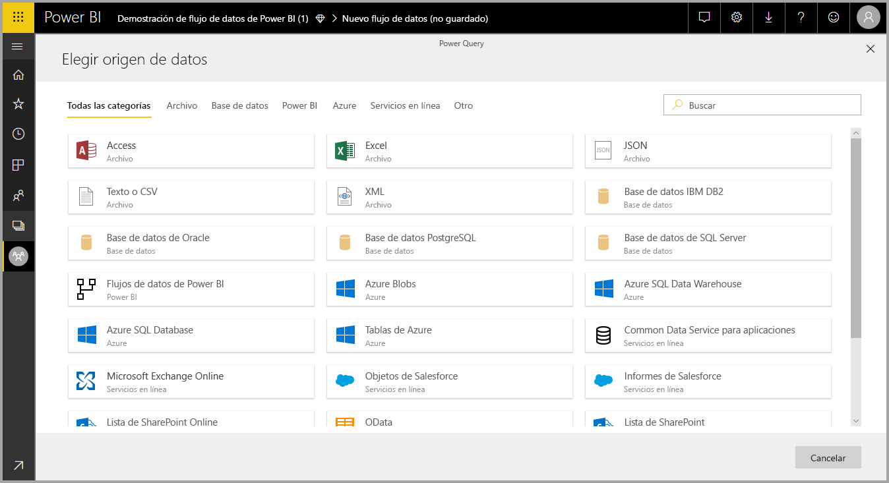
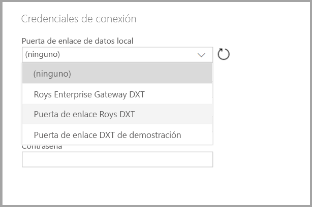

# Uso de flujos de datos con orígenes de datos locales

Con **flujos de datos**, puede crear una colección de datos de varios orígenes, limpiar los datos, transformarlos y cargarlos en el almacenamiento de Power BI. Al crear el flujo de datos, puede que desee usar orígenes de datos locales. En este artículo se explican los requisitos asociados con la creación de flujos de datos y cómo debe configurarse **Enterprise Gateway** para habilitar dichas conexiones.

## Configuración de Enterprise Gateway para usarlo con flujos de datos

Para crear un flujo de datos mediante una puerta de enlace, el usuario debe ser el administrador de Enterprise Gateway, o el administrador debe haber compartido el origen de datos que piensa usar con el usuario. 

> [!NOTE]
> Los flujos de datos solo se admiten con Enterprise Gateway.

## Uso de un origen de datos local en un flujo de datos

Al crear un flujo de datos, seleccione un origen de datos local en la lista de orígenes de datos, como se muestra en la siguiente imagen.

Una vez realizada la selección, se le pedirá que proporcione los detalles de conexión de Enterprise Gateway que se usarán para tener acceso a los datos locales. Debe seleccionar la puerta de enlace y proporcionar las credenciales de la puerta de enlace seleccionada.

## Supervisión de la puerta de enlace

Puede supervisar Enterprise Gateway para un flujo de datos de la misma forma en que supervisa las puertas de enlace de un conjunto de datos.

En la pantalla de configuración del flujo de datos de Power BI, puede supervisar el estado de la puerta de enlace de un flujo de datos y asignar una puerta de enlace al flujo de datos, como se muestra en la imagen siguiente.

## Cambio de una puerta de enlace

Puede cambiar la instancia de Enterprise Gateway utilizada para un flujo de datos determinado de dos formas:

1. **Desde la herramienta de creación**: puede cambiar la puerta de enlace asignada a todas las consultas mediante la herramienta de creación de flujo de datos.

    > [!NOTE]
    > El flujo de datos intentará encontrar o crear los orígenes de datos necesarios mediante la nueva puerta de enlace. Si no puede hacerlo, podrá cambiar la puerta de enlace hasta que todos los flujos de datos necesarios estén disponibles desde la puerta de enlace seleccionada.

2. **Desde la pantalla de configuración**: puede cambiar la puerta de enlace asignada con el uso de la pantalla de configuración para el flujo de datos en el servicio Power BI.

Para obtener más información sobre Enterprise Gateway, vea [Puerta de enlace de datos local](../connect-data/service-gateway-onprem.md).

## Consideraciones y limitaciones

Hay algunas limitaciones conocidas para el uso de Enterprise Gateway y de los flujos de datos:

* Cada flujo de datos puede usar solo una puerta de enlace. Por lo tanto, todas las consultas se deberían configurar utilizando la misma puerta de enlace.
* Cambiar la puerta de enlace repercute en todo el flujo de datos.
* Si se necesitan varias puertas de enlace, el procedimiento recomendado es crear varios flujos de datos (uno para cada puerta de enlace) y usar las funcionalidades de referencia a procesos o entidades para unificar los datos.
* Los flujos de datos solo se admiten con Enterprise Gateway. Las puertas de enlace personales no estarán disponibles para seleccionarlas en las listas desplegables ni en las pantallas de configuración.

## Pasos siguientes

En este artículo se proporciona información sobre el uso de los orígenes de datos locales para los flujos de datos y sobre cómo usar y configurar las puertas de enlace para acceder a dichos datos. Los siguientes artículos también pueden resultarle útiles.

* [Preparación de datos de autoservicio con flujos de datos](service-dataflows-overview.md)
* [Creación y uso de flujos de datos en Power BI](service-dataflows-create-use.md)
* [Uso de entidades calculadas en Power BI Premium](service-dataflows-computed-entities-premium.md)
* [Recursos para desarrolladores sobre flujos de datos de Power BI](service-dataflows-developer-resources.md)

Para obtener más información sobre Power Query y la actualización programada, puede leer estos artículos:
* [Información general sobre consultas en Power BI Desktop](desktop-query-overview.md)
* [Configuración de la actualización programada](../connect-data/refresh-scheduled-refresh.md)

Para más información sobre Common Data Service, puede leer su artículo de introducción:
* [Introducción a Common Data Service](https://docs.microsoft.com/powerapps/common-data-model/overview)
