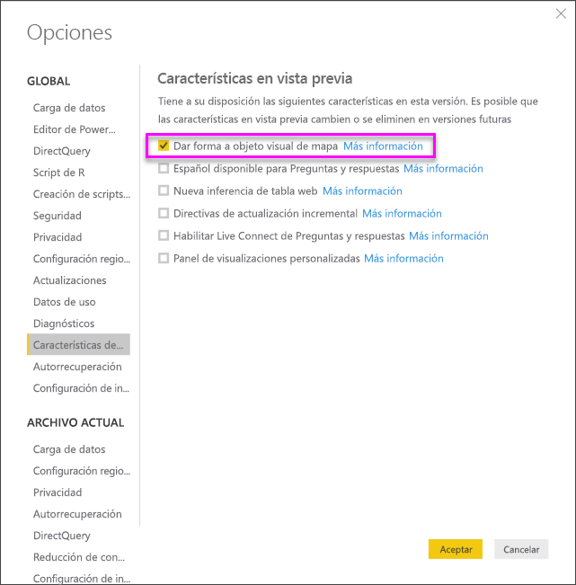
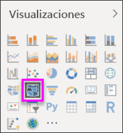
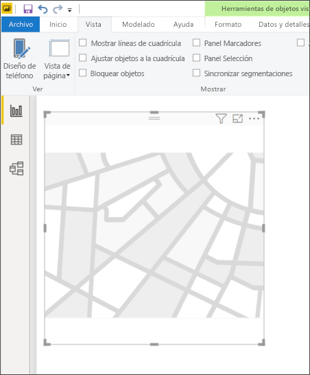
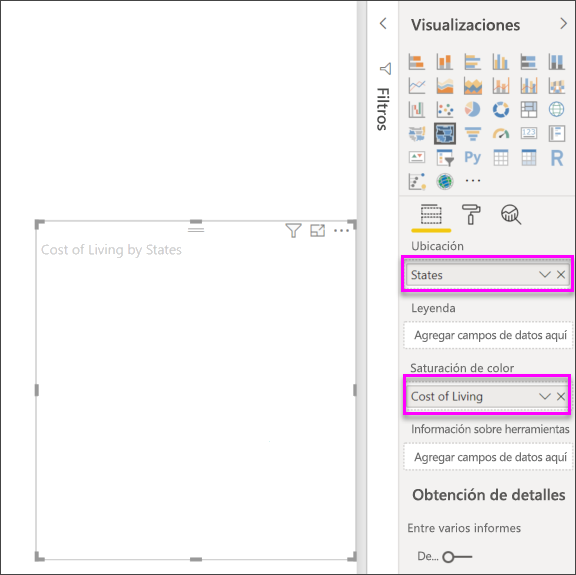
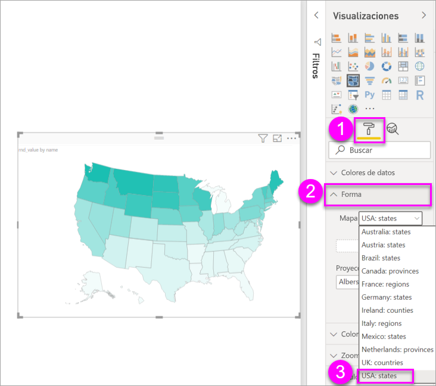
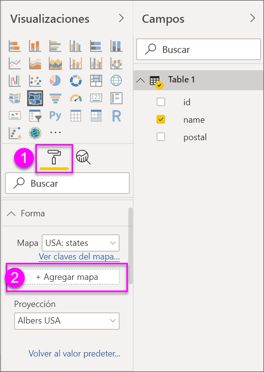
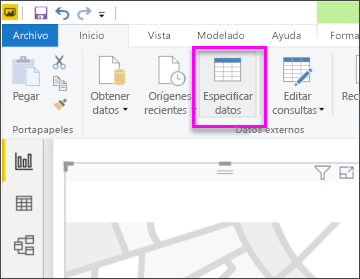

# Crear visualizaciones de mapa de formas en Power BI Desktop (versión preliminar)

[!INCLUDE [power-bi-visuals-desktop-banner](../includes/power-bi-visuals-desktop-banner.md)]

Cree un objeto visual de **Mapa de formas** para comparar las regiones de un mapa mediante colores. A diferencia del objeto visual **Mapa**, **Mapa de formas** no puede mostrar las ubicaciones geográficas precisas de los puntos de datos en un mapa. En su lugar, su propósito principal es mostrar comparaciones relativas de las regiones de un mapa mediante colores diferentes.

Los objetos visuales **Mapa de formas** se basan en los mapas TopoJSON, que tienen la capacidad atractiva de usar mapas personalizados que puede crear. Algunos ejemplos de mapas personalizados: organizaciones geográficas y de sala, planos de planta y otros. La capacidad de usar mapas personalizados no está disponible en esta versión preliminar de **Mapa de formas**.

## Crear mapas de formas
Puede probar el control **Mapa de formas** con los mapas que se proporcionan en esta versión preliminar o puede usar su propio mapa personalizado siempre que cumpla los requisitos descritos en la sección siguiente denominada **Usar mapas personalizados**.

El objeto visual **Mapa de formas** está en versión preliminar y debe habilitarse en Power BI Desktop. Para habilitar el **Mapa de formas**, seleccione **Archivo > Opciones y configuración > Opciones > Características de versión preliminar** y, después, active la casilla **Dar forma a objeto visual de mapa**. Deberá reiniciar Power BI Desktop después de realizar la selección.

Una vez esté habilitado el **Mapa de formas**, seleccione el icono **Mapa de formas** del panel **Visualizaciones**.

Power BI Desktop crea un lienzo de diseño del objeto visual **Mapa de formas** vacío.

Siga los siguientes pasos para crear un **mapa de formas**:

1. En el panel **Campos**, arrastre un campo de datos que contenga los nombres de región (o abreviaturas) al cubo **Ubicación** y un campo de medida de datos al cubo **Saturación de color** (aún no verá un mapa).

   > [!NOTE]
   > Consulte la sección **Obtener datos del mapa** a continuación para obtener información sobre cómo obtener rápidamente datos de mapa para probar **Mapa de formas**.
   > 
   > 

   
2. En el panel de configuración **Formato**, expanda **Forma** y seleccione de la lista desplegable de **Mapas estándares** para mostrar los datos. En este momento, la representación aparece como se muestra en la imagen siguiente.

   

   > [!NOTE]
   > En la sección **Claves de región** al final de este artículo hay una colección de tablas que tienen claves de regiones de mapa que puede usar para probar el objeto visual **Mapa de formas**.
   > 
   > 
3. A continuación, puede modificar el mapa mediante las opciones de formato, como **Color predeterminado**, **Zoom** y muchas más. Y también puede agregar una columna de datos de categoría al depósito **Leyenda** y clasificar las regiones del mapa según categorías.

## Usar mapas personalizados
Puede usar mapas personalizados con **Mapa de formas** siempre que tengan el formato **TopoJSON**. Si el mapa tiene otro formato, puede usar herramientas en línea, como [**Conformador de mapa**](https://mapshaper.org/), para convertir los *archivos de forma* o los mapas *GeoJSON* al formato **TopoJSON**.

Para usar el archivo de mapa **TopoJSON**, agregue un objeto visual de ShapeMap al informe y algunos datos a los cubos *Ubicación* y *Saturación de color*. Después, en el panel **Visualizaciones**, con la sección **Formato** seleccionada (que se muestra como (1) en la imagen siguiente), expanda la sección **Forma** y seleccione **+ Agregar mapa**.

## Ejemplo de mapa personalizado
*Offices of the United States Attorneys* publica un informe fiscal anual con datos sobre litigios y la cantidad de procesos judiciales.  Todos sus informes se encuentran en este vínculo:

https://www.justice.gov/usao/resources/annual-statistical-reports

Como los estados se pueden dividir en varios distritos, es necesario usar un mapa de formas personalizado.  Si importamos el mapa **TopoJSON** de los distritos judiciales de Estados Unidos en **Power BI Desktop**, conseguimos visualizar los datos anuales de los abogados por distrito fiscal.  En la imagen de abajo se muestra un ejemplo de este mapa.

Puede hacer otras cosas interesantes con los mapas de estados individuales y mostrar más detalles en función de los distritos que contiene. 

Si quiere experimentar con este conjunto de datos y esta visualización, en este vínculo puede descargar el archivo PBIX original que se ha usado para generar este informe.

* [Demo de archivo .PBIX de mapa de formas personalizado](https://download.microsoft.com/download/1/2/8/128943FB-9231-42BD-8A5D-5E2362C9D589/DistrictAttorneyFiscalReport.pbix)

## Obtener datos de mapa
Para obtener rápidamente datos en un modelo para que pueda probar **Mapa de formas**, puede copiar una de las tablas al final de este artículo y luego seleccionar **Especificar datos** en la cinta **Inicio**.

Si los datos tienen varias columnas, deberá usar un editor como Excel para pegar los datos y después copiar cada columna de datos por separado. Después, puede pegar los datos en Power BI Desktop. La fila superior se identifica automáticamente como encabezado.

Puede especificar una nueva columna al escribir un nuevo nombre de columna (en la columna en blanco a la derecha) y luego agregar valores en cada celda, igual que puede hacer en Excel. Cuando termine, seleccione **Cargar** y la tabla se agrega al modelo de datos para Power BI Desktop.

> [!NOTE]
> Si trabaja con países o regiones, use la abreviatura de tres letras para asegurarse de que la geocodificación funciona correctamente durante la visualización de los mapas. *No* use las abreviaturas de dos letras, dado que podría haber muchos países o muchas regiones que no se reconociesen correctamente.
> 
> Si solo dispone de abreviaturas de dos letras, consulte [esta entrada de blog](https://blog.ailon.org/how-to-display-2-letter-country-data-on-a-power-bi-map-85fc738497d6#.yudauacxp) donde se exponen los pasos para asociar las abreviaturas de dos letras de los países o regiones con abreviaturas de tres letras.
> 
> 

## Comportamiento y requisitos de la versión preliminar
Hay algunas consideraciones y requisitos para esta versión preliminar de **Mapa de formas**:

* El objeto visual **Mapa de formas** está en versión preliminar y debe habilitarse en Power BI Desktop. Para habilitar el **Mapa de formas**, seleccione **Archivo > Opciones y configuración > Opciones > Características de versión preliminar** y, después, active la casilla **Dar forma a objeto visual de mapa**.
* Actualmente, también debe tener el cubo **Saturación de color** establecido para que la clasificación **Leyenda** funcione correctamente.
* La versión final de **Mapa de formas** tendrá una interfaz de usuario que mostrará las claves del mapa actualmente seleccionado (no hay fecha establecida para la versión final y **Mapa de formas** todavía está en la versión preliminar). En esta versión preliminar, puede hacer referencia a las claves de región de mapa en las tablas que se encuentran en la sección **Claves de región** siguiente de este artículo.
* El objeto visual **Mapa de formas** trazará un máximo de 1500 puntos de datos.

## Claves de región

Use las siguientes **claves de región** en esta versión preliminar para probar **Mapa de formas**.

### Australia: estados

| ID. | abrev. | iso | nombre | código postal |
| --- | --- | --- | --- | --- |
| au-wa |WA |AU-WA |Australia Occidental |WA |
| au-vic |Vic |AU-VIC |Victoria |VIC |
| au-tas |Tas |AU-TAS |Tasmania |TAS |
| au-sa |SA |AU-SA |Australia Meridional |SA |
| au-qld |Qld |AU-QLD |Queensland |QLD |
| au-nt |NT |AU-NT |Territorio del Norte |NT |
| au-nsw |NSW |AU-NSW |Nueva Gales del Sur |NSW |
| au-act |ACT |AU-ACT |Territorio de la Capital Australiana |ACT |

### Austria: estados

| ID. | iso | nombre | nombre (español) | código postal |
| --- | --- | --- | --- | --- |
| at-wi |AT-9 |Wien |Viena |WI |
| at-vo |AT-8 |Vorarlberg |Vorarlberg |VO |
| at-tr |AT-7 |Tirol |Tirol |TR |
| at-st |AT-6 |Steiermark |Estiria |ST |
| at-sz |AT-5 |Salzburg |Salzburg |SZ |
| at-oo |AT-4 |Oberösterreich |Alta Austria |OO |
| at-no |AT-3 |Niederösterreich |Baja Austria |NO |
| at-ka |AT-2 |Kärnten |Carintia |KA |
| at-bu |AT-1 |Burgenland |Burgenland |BU |

### Brasil: estados

| ID. |
| --- |
| Tocantins |
| Pernambuco |
| Goias |
| Sergipe |
| Sao Paulo |
| Santa Catarina |
| Roraima |
| Rondonia |
| Rio Grande do Sul |
| Rio Grande do Norte |
| Rio de Janeiro |
| Piaui |
| Parana |
| Paraiba |
| Para |
| Minas Gerais |
| Mato Grosso |
| Maranhao |
| Mato Grosso do Sul |
| Distrito Federal |
| Ceara |
| Espirito Santo |
| Bahia |
| Amazonas |
| Amapa |
| Alagoas |
| Acre |
| Litigated Zone 1 |
| Litigated Zone 2 |
| Litigated Zone 3 |
| Litigated Zone 4 |

### Canadá: provincias

| ID. | iso | nombre | código postal |
| --- | --- | --- | --- |
| ca-nu |CA-NU |Nunavut |NU |
| ca-nt |CA-NT |Territorios Noroccidentales |NT |
| ca-yt |CA-YT |Yukón |YT |
| ca-sk |CA-SK |Saskatchewan |SK |
| ca-qc |CA-QC |Quebec |QC |
| ca-pe |CA-PE |Isla del Príncipe Eduardo |PE |
| ca-on |CA-ON |Ontario |ACTIVADO |
| ca-ns |CA-NS |Nueva Escocia |NG |
| ca-nl |CA-NL |Terranova y Labrador |NL |
| ca-nb |CA-NB |Nuevo Brunswick |NB |
| ca-mb |CA-MB |Manitoba |MB |
| ca-bc |CA-BC |Columbia Británica |BC |
| ca-ab |CA-AB |Alberta |AB |

### Francia: regiones

| ID. | nombre | nombre (español) |
| --- | --- | --- |
| Auvernia-Ródano-Alpes |  |  |
| Borgoña-Franco Condado |  |  |
| Bretagne |Bretagne |Bretaña |
| Centre-Val de Loire |Centre-Val de Loire |Centre-Val de Loire |
| Corse |Corse |Córcega |
| Gran Este |  |  |
| Guadalupe | |   |
| Alta Francia |  |  |
| Isla de Francia |Île-de-France |Isla de Francia |
| Reunión |  |  |
| Mayotte  |  |  |
| Normandía |Normandía |  |
| Nueva Aquitania |  |  |
| Occitania  |  |  |
| Pays de la Loire |Pays de la Loire |Pays de la Loire |
| Provence-Alpes-Cote d'Azur |Provence-Alpes-Côte d'Azur |Provence-Alpes-Cote d'Azur |
|  |  |  |

### Alemania: estados

| ID. | iso | nombre | nombre (español) | código postal |
| --- | --- | --- | --- | --- |
| de-be |DE-BE |Berlín |Berlín |BE |
| de-th |DE-TH |Thüringen |Turingia |TH |
| de-st |DE-ST |Sachsen-Anhalt |Sajonia-Anhalt |ST |
| de-sn |DE-SN |Sachsen |Sajonia |SN |
| de-mv |DE-MV |Mecklemburgo-Pomerania Occidental |Mecklemburgo-Pomerania Occidental |MV |
| de-bb |DE-BB |Brandenburg |Brandenburg |BB |
| de-sh |DE-SH |Schleswig-Holstein |Schleswig-Holstein |SH |
| de-sl |DE-SL |Saarland |Saarland |SL |
| de-rp |DE-RP |Rheinland-Pfalz |Renania-Palatinado |RP |
| de-nw |DE-NW |Nordrhein-Westfalen |Renania del Norte-Westfalia |NW |
| de-ni |DE-NI |Niedersachsen |Baja Sajonia |NI |
| de-he |DE-HE |Hessen |Hesse |HE |
| de-hh |DE-HH |Hamburg |Hamburg |HH |
| de-hb |DE-HB |Bremen |Bremen |HB |
| de-by |DE-BY |Bayern |Baviera |POR |
| de-bw |DE-BW |Baden-Württemberg |Baden-Wurttemberg |BW |

### Irlanda: condados

| ID. |
| --- |
| Wicklow |
| Wexford |
| Westmeath |
| Waterford |
| Sligo |
| Tipperary |
| Roscommon |
| Offaly |
| Monaghan |
| Meath |
| Mayo |
| Louth |
| Longford |
| Limerick |
| Leitrim |
| Laoighis |
| Kilkenny |
| Kildare |
| Kerry |
| Galway |
| Dublin |
| Donegal |
| Cork |
| Clare |
| Cavan |
| Carlow |

### Italia: regiones

| ID. | iso | nombre | nombre (español) | código postal |
| --- | --- | --- | --- | --- |
| it-vn |IT-34 |Veneto |Veneto |VN |
| it-vd |IT-23 |Valle d'Aosta |Valle de Aosta |VD |
| it-um |IT-55 |Umbría |Umbría |UM |
| it-tt |IT-32 |Trentino-Alto Adige |Trentino-Alto Adigio |TT |
| it-tc |IT-52 |Toscana |Toscana |TC |
| it-sc |IT-82 |Sicilia |Sicilia |SC |
| it-sd |IT-88 |Sardegna |Cerdeña |SD |
| it-pm |IT-21 |Piemonte |Piamonte |14:49:57 |
| it-ml |IT-67 |Molise |Molise |ML |
| it-mh |IT-57 |Marcas |Marcas |MH |
| it-lm |IT-25 |Lombardia |Lombardía |LM |
| it-lg |IT-42 |Liguria |Liguria |LG |
| it-lz |IT-62 |Lazio |Lazio |LZ |
| it-fv |IT-36 |Friuli-Venezia Giulia |Friuli-Venezia Giulia |FV |
| it-er |IT-45 |Emilia-Romaña |Emilia-Romaña |ER |
| it-cm |IT-72 |Campania |Campania |CM |
| it-lb |IT-78 |Calabria |Calabria |LB |
| it-bc |IT-77 |Basilicata |Basilicata |BC |
| it-pu |IT-75 |Apulia |Apulia |PU |
| it-ab |IT-65 |Abruzos |Abruzos |AB |

### México: estados

| ID. | abreviatura | iso | nombre | nombre (español) | código postal |
| --- | --- | --- | --- | --- | --- |
| mx-zac |Zac. |MX-ZAC |Zacatecas |Zacatecas |ZA |
| mx-yuc |Yuc. |MX-YUC |Yucatán |Yucatán |YU |
| mx-ver |Ver. |MX-VER |Veracruz |Veracruz |VE |
| mx-tla |Tlax. |MX-TLA |Tlaxcala |Tlaxcala |TL |
| mx-tam |Tamps. |MX-TAM |Tamaulipas |Tamaulipas |TM |
| mx-tab |Tab. |MX-TAB |Tabasco |Tabasco |TB |
| mx-son |Son. |MX-SON |Sonora |Sonora |SO |
| mx-sin |Sin. |MX-SIN |Sinaloa |Sinaloa |SI |
| mx-slp |S.L.P. |MX-SLP |San Luis Potosí |San Luis Potosí |SL |
| mx-roo |Q.R. |MX-ROO |Quintana Roo |Quintana Roo |QR |
| mx-que |Qro. |MX-QUE |Querétaro |Querétaro |QE |
| mx-pue |Pue. |MX-PUE |Puebla |Puebla |PU |
| mx-oax |Oax. |MX-OAX |Oaxaca |Oaxaca |OA |
| mx-nle |N.L. |MX-NLE |Nuevo León |Nuevo León |NL |
| mx-nay |Nay. |MX-NAY |Nayarit |Nayarit |NA |
| mx-mor |Mor. |MX-MOR |Morelos |Morelos |MR |
| mx-mic |Mich. |MX-MIC |Michoacán |Michoacán |MC |
| mx-mex |Méx. |MX-MEX |Estado de México |Estado de México |MX |
| mx-jal |Jal. |MX-JAL |Jalisco |Jalisco |JA |
| mx-hid |Hgo. |MX-HID |Hidalgo |Hidalgo |HI |
| mx-gro |Gro. |MX-GRO |Guerrero |Guerrero |GR |
| mx-gua |Gto. |MX-GUA |Guanajuato |Guanajuato |GT |
| mx-dur |Dgo. |MX-DUR |Durango |Durango |DU |
| mx-dif |CDMX. |MX-DIF |Ciudad de México |Ciudad de México |DF |
| mx-col |Col. |MX-COL |Colima |Colima |CL |
| mx-coa |Coah. |MX-COA |Coahuila |Coahuila |CA |
| mx-chh |Chih. |MX-CHH |Chihuahua |Chihuahua |CH |
| mx-chp |Chis. |MX-CHP |Chiapas |Chiapas |CP |
| mx-cam |Camp. |MX-CAM |Campeche |Campeche |CM |
| mx-bcs |B.C.S. |MX-BCS |Baja California Sur |Baja California Sur |BS |
| mx-bcn |B.C. |MX-BCN |Baja California |Baja California |BN |
| mx-agu |Ags. |MX-AGU |Aguascalientes |Aguascalientes |AG |

### Países Bajos: provincias

| ID. | iso | nombre | nombre (español) |
| --- | --- | --- | --- |
| nl-zh |NL-ZH |Zuid-Holland |Holanda Meridional |
| nl-ze |NL-ZE |Zeeland |Zeeland |
| nl-ut |NL-UT |Utrecht |Utrecht |
| nl-ov |NL-OV |Overijssel |Overijssel |
| nl-nh |NL-NH |Noord-Holland |Holanda Septentrional |
| nl-nb |NL-NB |Noord-Brabant |Brabante Septentrional |
| nl-li |NL-LI |Limburg |Limburg |
| nl-gr |NL-GR |Groninga |Groninga |
| nl-ge |NL-GE |Güeldres |Güeldres |
| nl-fr |NL-FR |Fryslân |Frisia |
| nl-fl |NL-FL |Flevoland |Flevoland |
| nl-dr |NL-DR |Drente |Drente |

### Reino Unido: países

| ID. | iso | nombre |
| --- | --- | --- |
| gb-wls |GB-WLS |Gales |
| gb-sct |GB-SCT |Escocia |
| gb-nir |GB-NIR |Irlanda del Norte |
| gb-eng |GB-ENG |Inglaterra |

### Estados Unidos: estados

| ID. | nombre | código postal |
| --- | --- | --- |
| us-mi |Michigan |MI |
| us-ak |Alaska |AK |
| us-hi |Hawai |HI |
| us-fl |Florida |FL |
| us-la |Luisiana |LA |
| us-ar |Arkansas |AR |
| us-sc |Carolina del sur |SC |
| us-ga |Georgia |GA |
| us-ms |Misisipi |MS |
| us-al |Alabama |AL |
| us-nm |Nuevo México |NM |
| us-tx |Texas |TX |
| us-tn |Tennessee |TN |
| us-nc |Carolina del norte |NC |
| us-ok |Oklahoma |ACEPTAR |
| us-az |Arizona |AZ |
| us-mo |Misuri |MO |
| us-va |Virginia |VA |
| us-ks |Kansas |KS |
| us-ky |Kentucky |KY |
| us-co |Colorado |CO |
| us-md |Maryland |MD |
| us-wv |Virginia Occidental |WV |
| us-de |Delaware |DE |
| us-dc |Distrito de Columbia |DC |
| us-il |Illinois |IL |
| us-oh |Ohio |OH |
| us-ca |California |CA |
| us-ut |Utah |UT |
| us-nv |Nevada |NV |
| us-in |Indiana |IN |
| us-nj |Nueva Jersey |NJ |
| us-ri |Rhode Island |RI |
| us-ct |Connecticut |CT |
| us-pa |Pensilvania |PA |
| us-ny |Nueva York |NY |
| us-ne |Nebraska |NE |
| us-ma |Massachusetts |MA |
| us-ia |Iowa |IA |
| us-nh |Nueva Hampshire |NH |
| us-or |Oregón |O |
| us-mn |Minnesota |MN |
| us-vt |Vermont |VT |
| us-id |Idaho |ID. |
| us-wi |Wisconsin |WI |
| us-wy |Wyoming |WY |
| us-sd |Dakota del sur |SD |
| us-nd |North Dakota |ND |
| us-me |Maine |ME |
| us-mt |Montana |MT |
| us-wa |Washington |WA |

## Pasos siguientes

* [Objeto visual Matriz en Power BI Desktop](desktop-matrix-visual.md)

* [Tipos de visualización en Power BI](power-bi-visualization-types-for-reports-and-q-and-a.md)
