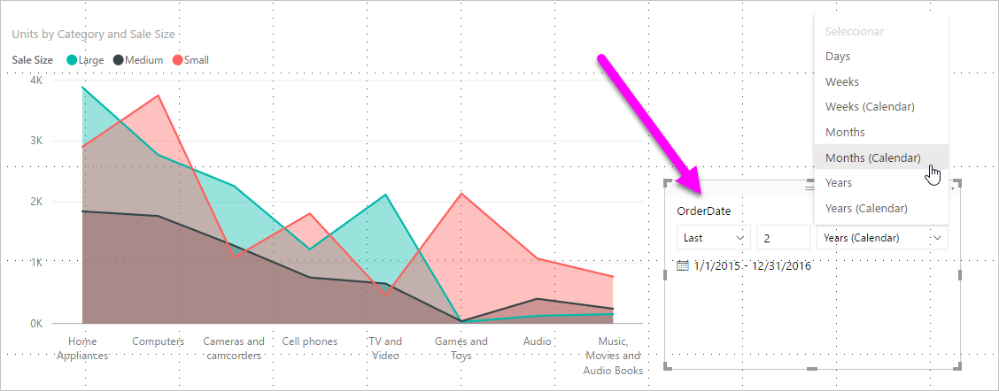
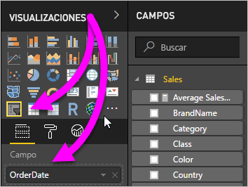
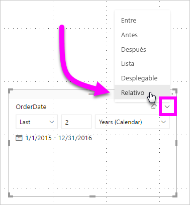
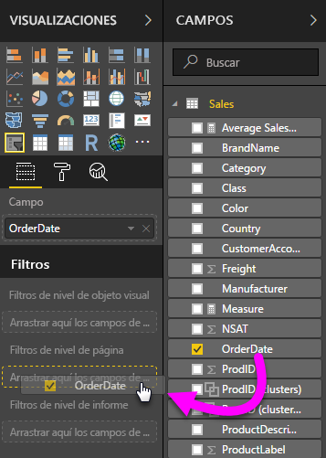
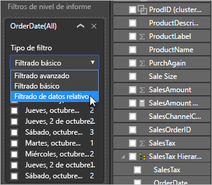

# Uso de un filtro o una segmentación de fecha relativa en Power BI Desktop

Con la **segmentación de fecha relativa** o el **filtro de fechas relativas**, puede aplicar filtros basados en el tiempo a cualquier columna de fecha del modelo de datos. Por ejemplo, puede usar la **segmentación de fecha relativa** para mostrar solo los datos de las ventas realizadas en los últimos 30 días (o mes, meses naturales, etc.). Al actualizar los datos, el período de tiempo relativo aplica automáticamente la restricción de fecha relativa correspondiente.

## Uso de la segmentación de intervalo de fecha relativa

Puede usar la segmentación de fecha relativa igual que cualquier otra segmentación. Cree un objeto visual de **segmentación** para el informe y luego seleccione un valor de fecha para el valor **Campo**. En la siguiente imagen, se ha seleccionado el campo *OrderDate*.

Seleccione la segmentación en el lienzo y después el acento circunflejo situado en la esquina superior derecha del objeto visual de segmentación. Si el objeto visual tiene datos de fecha, en el menú se mostrará la opción **Relativa**.

Para la segmentación de fecha relativa, seleccione *Relativa*.

Después, puede seleccionar la configuración.

En la primera configuración de la *segmentación de fecha relativa*, tiene las siguientes opciones:

* Último

* Siguiente

* Este

La segunda opción de configuración (central) en la *segmentación de fecha relativa* le permite escribir un número para definir el intervalo de fechas relativas.

La tercera opción de configuración le permite elegir la medida de la fecha. Tiene las opciones siguientes:

* Días

* Semanas

* Semanas (calendario)

* Meses

* Meses (calendario)

* Años

* Años (calendario)

Si selecciona **Meses** en esa lista y escribe *2* en el cuadro central, ocurrirá lo siguiente:

* si hoy es 20 de julio

* los datos incluidos en los objetos visuales restringidos por la segmentación mostrarán datos de los dos meses anteriores

* a partir del 21 de mayo y hasta el 20 de julio (la fecha de hoy)

En cambio, si ha seleccionado *Meses (calendario)* , los objetos visuales restringidos mostrarían los datos desde el 1 de mayo hasta el 30 de junio (los dos últimos meses naturales completos).

## Uso de un filtro de intervalo de fecha relativa

También puede crear un filtro de intervalo de fecha relativa para la página del informe o el informe completo. Para ello, arrastre un campo de datos a las áreas **Filtros de nivel de página** o **Filtros de nivel de informe**, en el panel **Campo**:

Una vez allí, puede cambiar el intervalo de fechas relativas. Es similar a la forma en que puede personalizar la **segmentación de fecha relativa**. Seleccione **Filtrado de fecha relativa** en la lista desplegable **Tipo de filtro**.

Después de seleccionar **Filtrado de fecha relativa**, verá tres secciones que puede cambiar, incluido un cuadro numérico en el medio, igual que la segmentación.

## Limitaciones y consideraciones

Las siguientes limitaciones y consideraciones se aplican actualmente al filtro y la **segmentación de fecha relativa**.

* Los modelos de datos de **Power BI** no incluyen información de zona horaria. Los modelos pueden almacenar horas, pero no hay ninguna indicación de la zona horaria en la que se encuentran.

* La segmentación y el filtro se basan siempre en la hora UTC. Si configura un filtro en un informe y se lo envía a un compañero de trabajo que está en otra zona horaria, ambos verán los mismos datos. A menos que esté en la zona horaria UTC, su compañero y usted deben tener en cuenta el desfase horario que experimentarán.

* Puede convertir los datos capturados en una zona horaria local a UTC mediante el **Editor de consultas**.

## Pasos siguientes

Obtenga información sobre cómo [usar la agrupación y la discretización en Power BI Desktop](../desktop-grouping-and-binning.md).
