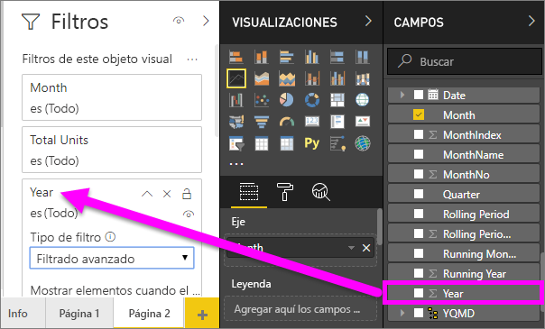

# Gráficos de líneas en Power BI
Un gráfico de líneas es una serie de puntos de datos que se representan mediante puntos y conectados por líneas rectas. Un gráfico de líneas puede tener una o varias líneas. Los gráficos de líneas tienen una X y un eje Y. 

## Crear un gráfico de líneas
Estas instrucciones use las ventas y la aplicación de ejemplo de Marketing para crear un gráfico de líneas que muestra las ventas de este año por categoría. Para poder continuar, obtenga la aplicación de ejemplo de appsource.com.

1. Empiece en una página de informe en blanco. Si está utilizando el servicio Power BI, asegúrese de que abre el informe en [Vista de edición](../service-interact-with-a-report-in-editing-view.md).

2. En el panel campos, seleccione **SalesFact** \> **Total de unidades**y seleccione **fecha** > **mes**.  Power BI crea un gráfico de columnas en el lienzo del informe.

    

4. Convertir en un gráfico de líneas seleccionando la plantilla de gráfico de líneas en el panel visualizaciones. 

    
   

4. Filtrar el gráfico de líneas para mostrar los datos durante los años 2012-2014. Si el panel de filtros está contraído, expándalo. En el panel campos, seleccione **fecha** \> **año** y arrástrelo hasta el panel filtros. Colóquelo bajo el encabezado **los filtros de este objeto visual**. 
     
    

    Cambio **filtros avanzados** a **filtros básicos** y seleccione **2012**, **2013** y **2014**.

    

6. Si lo desea, [ajuste el tamaño y el color del texto del gráfico](power-bi-visualization-customize-title-background-and-legend.md). 

    

## Agregar líneas adicionales al gráfico
Los gráficos de líneas pueden tener muchas líneas diferentes. Y, en algunos casos, los valores de las líneas pueden ser tan divergentes que no muestran bien juntos. Echemos un vistazo a agregar líneas adicionales a nuestro actual del gráfico y, a continuación, obtenga información sobre cómo dar formato a nuestro gráfico cuando los valores representados por las líneas son muy diferentes. 

### Agregar líneas adicionales
En lugar de en unidades totales para todas las regiones como una sola línea en el gráfico, vamos a dividir total de unidades por región. Agregar líneas adicionales, arrastre **geográfica** > **región** para el área de leyenda.

   

### Use los dos ejes Y
¿Qué ocurre si desea examinar las ventas totales y total de unidades en el mismo gráfico? Cifras de ventas son mucho mayores que los números de unidad, lo puede usar el gráfico de líneas. De hecho, la línea roja para total de unidades parece ser cero.

   

Para mostrar valores muy divergentes en un gráfico, use un gráfico combinado. Puede aprender todo sobre los gráficos combinados leyendo [gráficos combinados en Power BI](power-bi-visualization-combo-chart.md). En el siguiente ejemplo, podemos mostrar ventas y el totales de unidades entre sí en un gráfico mediante la adición de un segundo eje Y. 

   

## Consideraciones y solución de problemas
* Un gráfico de líneas no puede tener dos ejes Y.  Deberá usar un gráfico combinado en su lugar.
* En los ejemplos anteriores, los gráficos con un formato para aumentar el tamaño de fuente, cambiar el color de fuente, agregar los títulos de eje, el título del gráfico y la leyenda del centro, iniciar ambos ejes en cero y mucho más. El panel de formato (icono de rodillo de pintura) tiene un conjunto de opciones para hacer que el aspecto de los gráficos como desee a aparentemente interminable. Es la mejor forma de aprender abrir el panel formato y explorar.

## Pasos siguientes

[Tipos de visualización en Power BI](power-bi-visualization-types-for-reports-and-q-and-a.md)

