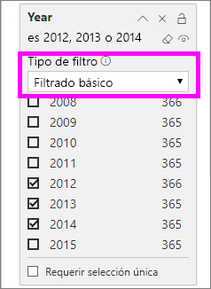
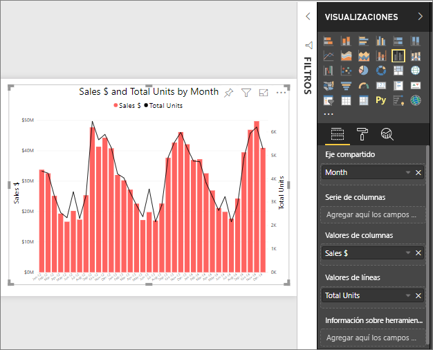
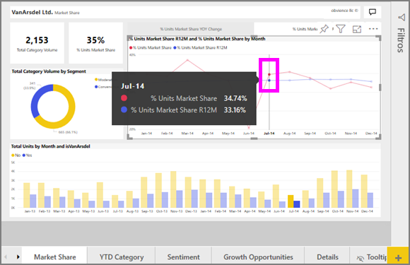

# Gráficos de líneas en Power BI
Un gráfico de líneas es una serie de puntos de datos representados por puntos y conectados por líneas rectas. Un gráfico de líneas puede tener una o varias líneas. Los gráficos de líneas tienen una eje X y un eje Y. 

## Creación de un gráfico de líneas
Estas instrucciones utilizan la aplicación Ejemplo de marketing y ventas para crear un gráfico de líneas que muestra las ventas de este año por categoría. Para poder continuar, obtenga la aplicación de ejemplo de appsource.com.

1. Empiece en una página de informe en blanco. Si está utilizando el servicio Power BI, asegúrese de que abre el informe en [Vista de edición](../service-interact-with-a-report-in-editing-view.md).

2. En el panel Campos, seleccione **SalesFact** \> **Total de unidades** y seleccione **Fecha** > **Mes**.  Power BI crea un gráfico de columnas en el lienzo del informe.

    

4. Para convertirlo en un gráfico de líneas, seleccione la plantilla Gráfico de líneas en el panel Visualizaciones. 

    
   

4. Filtre el gráfico de líneas para mostrar los datos durante los años 2012 a 2014. Si el panel Filtros está contraído, expándalo. En el panel Campos, seleccione **Fecha** \> **Año** y arrástrelo hasta el panel Filtros. Colóquelo bajo el encabezado **Filtros de este objeto visual**. 
     
    

    Cambie **Filtros avanzados** a **Filtros básicos** y seleccione **2012**, **2013** y **2014**.

    

6. Si lo desea, [ajuste el tamaño y el color del texto del gráfico](power-bi-visualization-customize-title-background-and-legend.md). 

    

## Adición de líneas adicionales al gráfico
Los gráficos de líneas pueden tener muchas líneas diferentes. Y, en algunos casos, los valores en las líneas pueden ser tan divergentes que no se muestran bien juntos. Veamos cómo agregar líneas adicionales a nuestro gráfico actual y después aprender a dar formato a nuestro gráfico cuando los valores representados por las líneas son muy diferentes. 

### Adición de líneas adicionales
En lugar de mirar las unidades totales para todas las regiones como una sola línea en la tabla, dividamos las unidades totales por región. Agregue líneas adicionales, arrastre **Zona geográfica** > **Región** al área Leyenda.

   

### Uso de dos ejes Y
¿Qué pasa si quiere ver el total de ventas y el total de unidades en el mismo gráfico? Las cifras de ventas son mucho más altas que los números de unidad, lo que hace que no se pueda utilizar el gráfico de líneas. De hecho, la línea roja para las unidades totales parece ser cero.

   

Para mostrar valores muy divergentes en un gráfico, utilice un gráfico combinado. Para aprender todo sobre los gráficos combinados, consulte [Gráficos combinados en Power BI](power-bi-visualization-combo-chart.md). En nuestro ejemplo siguiente, podemos mostrar las ventas y las unidades totales juntas en un gráfico mediante la adición de un segundo eje Y. 

   

## Resaltado y filtrado cruzado
Para más información acerca de cómo usar el panel Filtros, consulte [Agregar un filtro a un informe](../power-bi-report-add-filter.md).

Al seleccionar un punto de datos en un gráfico de líneas, se realiza un resaltado y un filtrado cruzados de las demás visualizaciones en la página del informe y viceversa. Para poder continuar, abra la pestaña **Cuota de mercado**.  

En un gráfico de líneas, un solo punto de datos es la intersección de un punto en los ejes X e Y. Al seleccionar un punto de datos, Power BI agrega marcadores que indican qué punto (para una sola línea) o puntos (si hay dos o más líneas) son el origen para el resaltado y el filtrado cruzados de los otros objetos visuales en la página del informe. Si el objeto visual es muy denso, Power BI seleccionará el punto más cercano a donde hace clic en el objeto visual.

En este ejemplo, hemos seleccionado un punto de datos que abarca: Julio de 2014, % unidades de cuota de mercado R12 de 33,16 y % unidades de cuota de mercado de 34,74.

Tenga en cuenta cómo el gráfico de columnas tiene un resaltado cruzado y el medidor tiene un filtro cruzado.

Para administrar cómo se realiza un resaltado y un filtrado cruzados de los gráficos, consulte [Interacciones de visualización en un informe de Power BI](../service-reports-visual-interactions.md).

## Consideraciones y solución de problemas
* Un gráfico de líneas no puede tener dos ejes Y.  Deberá usar un gráfico combinado en su lugar.
* En los ejemplos anteriores, se aplicó formato a los gráficos para aumentar el tamaño de la fuente, cambiar el color de la fuente, agregar títulos de ejes, centrar el título y la leyenda del gráfico, iniciar ambos ejes en cero, y mucho más. El panel Formato (icono de rodillo de pintura) tiene un conjunto aparentemente interminable de opciones para que sus gráficos se vean de la manera que desea. La mejor forma de aprender es abrir el panel Formato y explorar.

## Pasos siguientes

[Tipos de visualización en Power BI](power-bi-visualization-types-for-reports-and-q-and-a.md)

