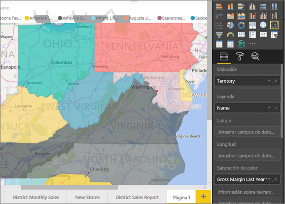
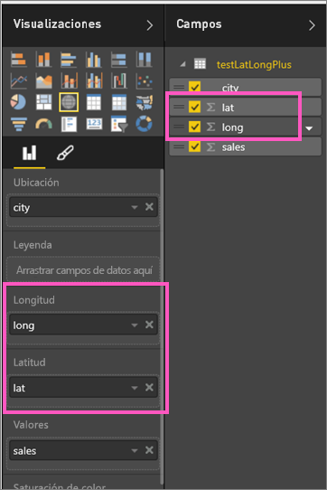

# Sugerencias y trucos para las visualizaciones de mapa de Power BI
Power BI se integra con Bing Maps para proporcionar las coordenadas de mapas predeterminadas (es decir, un proceso denominado geocodificación) para que se puedan crear mapas. Juntos, utilizan algoritmos para identificar la ubicación correcta pero, a veces, resulta un cálculo aproximado. Si Power BI intenta sin éxito crear por sí mismo la visualización del mapa, se muestra la ayuda de Bing Maps. 

Puede que usted o su administrador tengan que actualizar el firewall para permitir el acceso a las direcciones URL que utiliza Bing para geocodificación.  Estas direcciones URL son:
* https://dev.virtualearth.net/REST/V1/Locations
* https://platform.bing.com/geo/spatial/v1/public/Geodata
* https://www.bing.com/api/maps/mapcontrol

Para aumentar la probabilidad de realizar la geocodificación de manera correcta, use las sugerencias siguientes. El primer conjunto de sugerencias es para que las use si tiene acceso al conjunto de datos. El segundo conjunto de sugerencias es lo que puede hacer en Power BI si no tiene acceso al conjunto de datos. 

## ¿Qué se envía a Bing Maps?
El servicio Power BI y Power BI Desktop envían a Bing los datos de replicación geográfica necesarios para crear la visualización del mapa. Esto puede incluir los datos de los cubos **Ubicación**, **Latitud** y **Longitud** y los campos geográficos de cualquiera de los cubos de filtro **Nivel de informe**, **Nivel de página**, o **Nivel visual**. Lo que se envía exactamente varía según el tipo de mapa. Para más información, consulte [Privacidad de Bing Maps](https://go.microsoft.com/fwlink/?LinkID=248686).

* En el caso de los mapas (mapas de burbujas, dispersión y trazado de puntos), si se proporcionan latitud y longitud, no se envían datos a Bing. En caso contrario, se envían a Bing todos los datos de los cubos de **Ubicación** (y filtro).     

* Los mapas coropléticos requieren un campo en el cubo **Ubicación**, incluso si se proporcionan la latitud y la longitud. Todos los datos que estén en los cubos de **Ubicación**, **Latitud** o **Longitud** se envían a Bing.
  
    En el ejemplo siguiente, el campo **Proveedor** se utiliza para la geocodificación, por lo que todos los datos del proveedor se envían a Bing. Los datos de los cubos **Tamaño** y **Saturación de color** no se envían a Bing.
  
    
  
    En este segundo ejemplo siguiente, el campo **Territorio** se utiliza para la geocodificación, por lo que todos los datos del territorio se envían a Bing. Los datos de los cubos **Leyenda**y **Saturación de color** no se envían a Bing.
  
    

## En el conjunto de datos: sugerencias para mejorar el conjunto de datos subyacente
Si tiene acceso al conjunto de datos que se usa para crear la visualización de mapa, puede hacer algunas cosas para aumentar la probabilidad de realizar la codificación geográfica de manera correcta.

**1. Clasifique los campos geográficos en Power BI Desktop**

En Power BI Desktop, puede asegurarse de que los campos estén correctamente geocodificados estableciendo la *Categoría de datos* en los campos de datos. En la vista de datos, seleccione la columna que desee. En la cinta de opciones, seleccione la pestaña **Modelado** y, después, en **Categoría de datos**, seleccione **Dirección**, **Ciudad**, **Continente**, **País o región**, **País**, **Código postal**, **Estado** o **Provincia**. Estas categorías de datos ayudan a Bing a codificar correctamente los datos. Para más información, consulte [Categorización de datos en Power BI Desktop](../desktop-data-categorization.md). Si se conecta mediante Live Connect a SQL Server Analysis Services, debe establecer la categorización de datos fuera de Power BI mediante [SQL Server Data Tools (SSDT)](https://docs.microsoft.com/sql/ssdt/download-sql-server-data-tools-ssdt).

**2. Use más de una columna de ubicación.**     
 A veces, incluso establecer las categorías de datos para la representación en mapas no basta para que Bing adivine correctamente su intención. Algunas designaciones son ambiguas porque la ubicación existe en varios países o regiones. Por ejemplo, hay un ***Southampton*** en Inglaterra, Pensilvania y Nueva York.

Power BI usa el [servicio de plantillas de dirección URL no estructurado](https://msdn.microsoft.com/library/ff701714.aspx) de Bing para obtener las coordenadas de latitud y longitud en función de un conjunto de valores de dirección para cualquier país. Si los datos no contienen suficientes datos de ubicación, agregue estas columnas y clasifíquelas adecuadamente.

 Por ejemplo, si solo tiene una columna de ciudad, Bing tardará bastante tiempo en realizar la codificación geográfica. Agregue columnas geográficas adicionales para hacer que la ubicación no sea ambigua.  A veces, solo se necesita agregar una columna de ubicación más al conjunto de datos: en este caso estado o provincia. Y no olvide clasificarla correctamente; consulte el punto nº1 anterior.

Asegúrese de que cada campo solo tiene una categoría de ubicación única. Por ejemplo, el campo de ubicación de ciudad debe ser **Southampton**, no **Southampton, Nueva York**.  Y los campos de ubicación de dirección deben ser **1 Microsoft Way** y no **1 Microsoft Way, Redmond, WA**.

**3. Use latitudes y longitudes específicas**

Agregue valores de latitud y longitud al conjunto de datos. Esto elimina cualquier ambigüedad y devuelve resultados más rápidamente. Los campos de latitud y longitud deben estar en formato de *Número Decimal*, que puede establecer en el modelo de datos.

<iframe width="560" height="315" src="https://www.youtube.com/embed/ajTPGNpthcg" frameborder="0" allowfullscreen></iframe>

**4. Use la categoría de lugar para las columnas con información de ubicación completa**

Aunque recomendamos usar jerarquías geográficas en los mapas, si debe usar una sola columna de ubicación con información geográfica completa, puede especificar la categorización de los datos como **Lugar**. Por ejemplo, si los datos de la columna son direcciones completas, como 1 Microsoft Way, Redmond Washington 98052, esta categoría de datos generalizada funcionará mejor con Bing. 

## En Power BI: sugerencias para obtener mejores resultados al usar visualizaciones de mapas
**1. Use campos de latitud y longitud (si existen)**

En Power BI, si el conjunto de datos tiene campos de longitud y latitud, conviene que los use.  Power BI tiene cubos especiales que ayudan a que los datos del mapa no sean ambiguos. Simplemente arrastre el campo que contiene los datos de latitud al área **Visualizaciones > Latitud**.  Y haga lo mismo para los datos de longitud. Al hacerlo, debe rellenar también el campo *Ubicación* al crear las visualizaciones. De lo contrario, los datos se agregan de forma predeterminada, por ejemplo, la latitud y longitud podría combinarse en el nivel de estado no en el nivel de ciudad.

 

## Uso de jerarquías geográficas para explorar en profundidad distintos "niveles" de ubicación
Cuando el conjunto de datos ya tenga diferentes niveles de datos de ubicación, usted y sus compañeros podrán utilizar Power BI para crear *jerarquías geográficas*. Para ello, arrastre más de un campo al cubo **Ubicación**. Si se utilizan conjuntamente de este modo, los campos se convierten en una jerarquía geográfica. En el ejemplo siguiente, hemos agregado campos geográficos para: país/región, estado y ciudad. En Power BI usted y sus compañeros pueden explorar en profundidad y rastrear agrupando datos utilizando esta jerarquía geográfica.

  

   

Al explorar en profundidad las jerarquías geográficas, es importante saber cómo funciona cada botón de exploración y qué se envía a Bing Maps. 

* El botón de obtención de detalles de la derecha, denominado Modo detallado  , permite seleccionar una ubicación del mapa y explorarla en profundidad nivel a nivel. Por ejemplo, si activa la exploración en profundidad y hace clic en Estados Unidos, bajará al siguiente nivel de la jerarquía: estados de Estados Unidos. Para la codificación geográfica, Power BI envía los datos de país y estado a Bing Maps solo para Estados Unidos.  
* A la izquierda hay 2 otras opciones de exploración en profundidad. La primera opción,  , explora en profundidad hasta el siguiente nivel de la jerarquía en todas las ubicaciones a la vez. Por ejemplo, si está consultando países y usa esta opción para pasar al siguiente nivel, estados, Power BI muestra los datos de estado para todos los países. Para la codificación geográfica, Power BI envía los datos de estado de Bing Maps (ningún dato de país) para todas las ubicaciones. Esta opción es útil si cada nivel de la jerarquía no está relacionado con el nivel superior. 
* La segunda opción,  es similar a la exploración en profundidad, excepto que no es necesario hacer clic en el mapa.  Se expande hasta el siguiente nivel de la jerarquía y recuerda el contexto del nivel actual. Por ejemplo, si está consultando países y selecciona este icono, bajará en la jerarquía al siguiente nivel, estados. Para la codificación geográfica, Power BI envía datos de cada estado y su país correspondiente para ayudar a Bing Maps a codificar geográficamente con más precisión. En la mayoría de los mapas, usará esta opción o la opción Explorar en profundidad, en el extremo derecho, para enviar a Bing toda la información posible para obtener información precisa sobre la ubicación. 

## Pasos siguientes
[Exploración en profundidad en una visualización de Power BI](../consumer/end-user-drill.md)

[Visualizaciones de Power BI](power-bi-report-visualizations.md)

¿Tiene más preguntas? [Pruebe la comunidad de Power BI](https://community.powerbi.com/)

