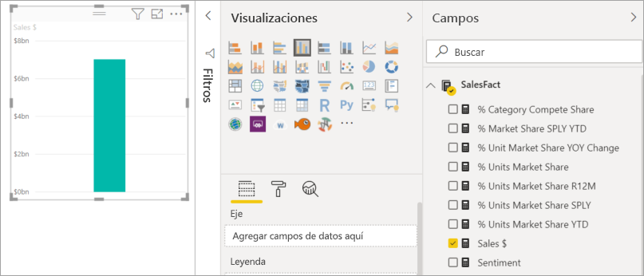
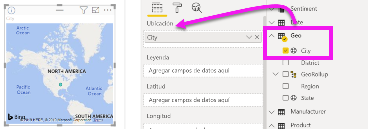
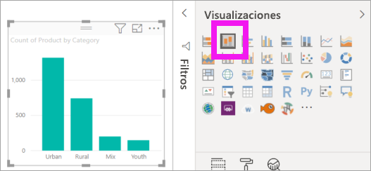
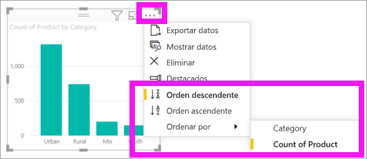

# Adición de objetos visuales a un informe de Power BI (parte 1)

[!INCLUDE [power-bi-visuals-desktop-banner](../includes/power-bi-visuals-desktop-banner.md)]

En este artículo, se ofrece una introducción rápida a la creación de una visualización en un informe. Se aplica al servicio Power BI y a Power BI Desktop. Para obtener contenido más avanzado, [vea la parte 2](power-bi-report-add-visualizations-ii.md) de esta serie. Vea cómo Amanda demuestra algunas maneras de crear, editar y dar formato a objetos visuales en el lienzo del informe. A continuación, inténtelo usted usando el [ejemplo de marketing y ventas](../sample-datasets.md) para crear su propio informe.

<iframe width="560" height="315" src="https://www.youtube.com/embed/IkJda4O7oGs" frameborder="0" allowfullscreen></iframe>

## Requisitos previos

En este tutorial se usa el [archivo Sales & marketing PBIX](https://download.microsoft.com/download/9/7/6/9767913A-29DB-40CF-8944-9AC2BC940C53/Sales%20and%20Marketing%20Sample%20PBIX.pbix).

1. En la sección superior izquierda de la barra de menús de Power BI Desktop, seleccione **Archivo** > **Abrir**.
   
2. Busque su copia del **archivo .PBIX del ejemplo de ventas y marketing**.

1. Abra el **archivo PBIX de Ventas y marketing** en la vista de informe .

1. Seleccionar  para agregar una nueva página.

## Agregar visualizaciones al informe

1. Cree una visualización seleccionando un campo en el panel **Campos** .

    Comience con un campo numérico como **Sales** (Ventas) > **TotalSales** (Ventas totales). Power BI crea un gráfico de columnas con una sola columna.

    

    O bien, comience con un campo de categoría, como **Nombre** o **Producto**. Power BI crea una tabla y agrega ese campo también a **Valores**.

    

    O bien, comience con un campo de geografía, como **Geografía** > **Ciudad**. Power BI y mapas de Bing crean una visualización de mapa.

    

## Cambio del tipo de visualización

 Cree una visualización y, a continuación, cambie su tipo. 
 
 1. Seleccione **Producto** > **Categoría** y después **Producto** > **Recuento de productos** para agregarlos al área **Valores**.

    

1. Cambie la visualización a un gráfico de columnas mediante la selección del icono **Gráfico de columnas apiladas**.

   

1. Para cambiar la forma en que se ordena el objeto visual, seleccione **Más opciones** (...).  Use las opciones de ordenación para cambiar la dirección de la ordenación (ascendente o descendente) y cambiar la columna que se usa para ordenar (**Ordenar por**).

   
  
## Pasos siguientes

 Continúe con:

* [Parte 2: Incorporación de visualizaciones a un informe de Power BI](power-bi-report-add-visualizations-ii.md)

* [Interactuar con las visualizaciones](../consumer/end-user-reading-view.md) en el informe.

