# Creación de mapas de ArcGIS en Power BI Desktop

[!INCLUDE [power-bi-visuals-desktop-banner](../includes/power-bi-visuals-desktop-banner.md)]

Este tutorial se ha escrito desde el punto de vista de alguien que crea un mapa de ArcGIS para Power BI. Si un *diseñador* comparte un mapa de ArcGIS para Power BI con un compañero, este podrá ver el mapa e interactuar con él, pero no guardar los cambios. Para más información acerca de cómo ver un mapa de ArcGIS, consulte [Interacción con mapas de ArcGIS en Power BI](power-bi-visualizations-arcgis.md).

Con la combinación de ArcGIS Maps y Power BI, los mapas no se limitan a ser una representación de puntos, sino que alcanzan un nivel completamente nuevo. Elija entre mapas base, tipos de ubicación, temas, estilos de símbolos y capas de referencia para crear magníficas visualizaciones informativas de mapas. La combinación de capas de datos relevantes en un mapa con el análisis espacial transmite una comprensión más profunda de los datos en la visualización.

 Aunque no puede crear un mapa de ArcGIS Maps for Power BI en dispositivos móviles, puede verlos e interactuar con ellos. Consulte [Interactuación con mapas de ArcGIS](power-bi-visualizations-arcgis.md).

> [!NOTE]
> ArcGIS Maps for Power BI no está disponible actualmente para Power BI Report Server.

> [!TIP]
> GIS son las siglas en inglés para sistemas de información geográfica.

En el ejemplo siguiente, se usa un lienzo de color gris oscuro para mostrar las ventas regionales como mapa térmico contra una capa demográfica de la mediana de renta disponible en 2016. Como verá más adelante, ArcGIS Maps for Power BI ofrece una funcionalidad de creación de mapas mejorada prácticamente ilimitada, datos demográficos y visualizaciones de mapas aún más atractivas, para que pueda contar mejor su historia.

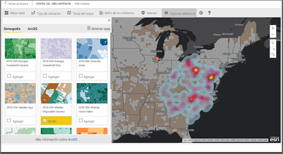

> [!TIP]
> Visite la [página de Esri acerca de ArcGIS Maps for Power BI](https://www.esri.com/powerbi) para ver muchos ejemplos y leer testimonios. Y, después, consulte la [página de introducción a ArcGIS Maps para Power BI](https://doc.arcgis.com/en/maps-for-powerbi/get-started/about-maps-for-power-bi.htm) de Esri.

## Consentimiento del usuario
Esri es quien proporciona ArcGIS Maps for Power BI (https://www.esri.com). Su uso de ArcGIS Maps para Power BI está sujeto a los términos y a la directiva de privacidad de Esri. Los usuarios de Power BI que quieran usar objetos visuales de ArcGIS Maps para Power BI tienen que aceptar el cuadro de diálogo de consentimiento.

**Recursos**

[Términos](https://go.microsoft.com/fwlink/?LinkID=826322)

[Directiva de privacidad](https://go.microsoft.com/fwlink/?LinkID=826323)

[Página del producto ArcGIS Maps para Power BI](https://www.esri.com/powerbi)

## Requisitos previos

En este tutorial se usa Power BI Desktop y el archivo .PBIX del [ejemplo de análisis de minoristas](https://download.microsoft.com/download/9/6/D/96DDC2FF-2568-491D-AAFA-AFDD6F763AE3/Retail%20Analysis%20Sample%20PBIX.pbix). También se pueden crear mapas de ArcGIS para Power BI mediante el servicio Power BI. 

1. En la sección superior izquierda de la barra de menús, seleccione **Archivo** \> **Abrir**.
   
2. Busque el **archivo PBIX del Ejemplo de análisis de minoristas** guardado en la máquina local.

1. Abra **Ejemplo de análisis de minoristas**  en la vista de informe .

1. Seleccionar  para agregar una nueva página.

   
## Creación de una visualización de mapas de ArcGIS Maps for Power BI

Fíjese en la forma en que Will crea distintas visualizaciones y, después, siga los pasos que se indican a continuación para probar a hacerlo por su cuenta con el [archivo .PBIX del ejemplo de análisis de minoristas](../sample-datasets.md).
    

   > [!NOTE]
   > En este vídeo se usa una versión anterior de Power BI Desktop.
   > 

> [!VIDEO https://www.youtube.com/embed/EKVvOZmxg9s]

1. Seleccione el icono de ArcGIS Maps for Power BI en el panel Visualizaciones.
   
        

2. Power BI agrega una plantilla vacía al lienzo del informe. En este tutorial, usaremos la versión gratuita.
   
   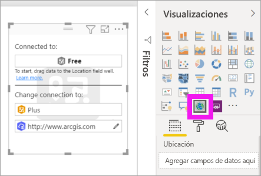

3. En el panel **Campos**, arrastre un campo de datos a los depósitos **Location** (Ubicación) o **Latitude** (Latitud) y/o **Longitude** (Longitud). En este ejemplo, vamos a usar **Store > City** (Tienda > Ciudad).
   
   > [!NOTE]
   > ArcGIS para Power BI detectará de forma automática si los campos que ha seleccionado se ven mejor como una forma o un punto en un mapa. Puede ajustar el valor predeterminado en la configuración (véalo a continuación).
   > 
   > 
   
    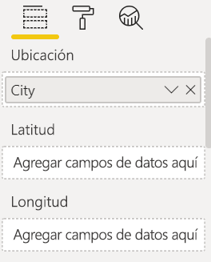

4. En el panel **Campos**, arrastre una medida al depósito **Tamaño** para ajustar cómo se muestran los datos. En este ejemplo, vamos a usar **Sales > Last Year Sales** (Ventas > Ventas del último año).
   
    

Ha creado su primer mapa de ArcGIS Maps for Power BI. Ahora, vamos a refinar y dar formato a nuestro mapa mediante mapas base, tipos de ubicación, temas, etc.

## Configuración y formato ArcGIS Maps for Power BI
Para acceder a las características de formato de **ArcGIS Maps para Power BI**:

1. Para acceder a más características, seleccione **Más opciones** (...) en la esquina superior derecha de la visualización y elija **Editar**.
   
   
   
   La visualización se expande y las características disponibles se muestran en la parte superior. Al seleccionar cada característica, se abre un panel de tareas que proporciona opciones detalladas. 
   
   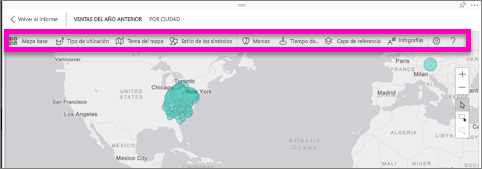
   

> [!TIP]
> **Esri** ofrece [documentación exhaustiva](https://go.microsoft.com/fwlink/?LinkID=828772) sobre el conjunto de características de **ArcGIS Maps para Power BI**.

### Mapas base
Se proporcionan cuatro mapas base: Dark Gray Canvas, Light Gray Canvas, OpenStreetMap y Streets.  *Calles* es el mapa base estándar de ArcGIS.

Para aplicar un mapa base, selecciónelo en el panel de tareas.

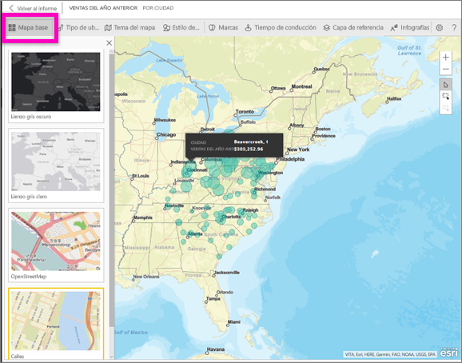

### Tipo de ubicación
ArcGIS Maps for Power BI detecta de forma automática la mejor manera de mostrar datos en el mapa. Selecciona entre puntos y fronteras. Las opciones del tipo de ubicación le permiten ajustar estas selecciones.

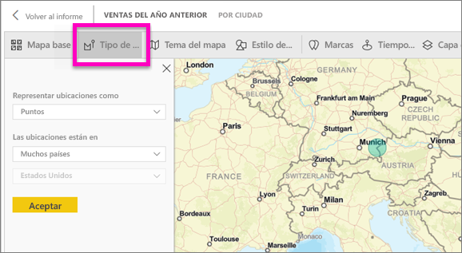

**Boundaries** solo funcionará si los datos contienen valores geográficos estándar. ArcGIS Maps for Power BI determina automáticamente la forma que se va a mostrar en el mapa. Los valores geográficos estándar incluyen, entre otros, países, provincias y códigos postales. En cambio, al igual que sucede con la geocodificación, es posible que Power BI no detecte que un campo debe ser un límite de manera predeterminada, o bien puede que no encuentre ningún límite para los datos.  

### Tema del mapa
Se proporcionan cuatro temas de mapa. Power BI selecciona automáticamente los temas **Solo ubicación** o **Tamaño**, en función de los campos que se hayan agregado a los cubos **Ubicación** y **Tamaño**. En nuestro mapa, el tema predeterminado es **Tamaño**, ya que hemos agregado campos a ambos cubos. Pruebe los restantes temas y vuelva a **Tamaño** antes de pasar al siguiente paso.  

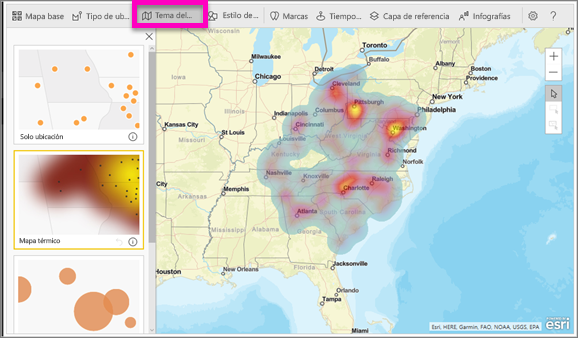

<table>
<tr><th>Tema</th><th>Descripción</th>
<tr>
<td>Solo ubicación</td>
<td>Traza puntos de datos o límites coropléticos en el mapa en función del campo que se haya agregado en Ubicación.</td>
</tr>
<tr>
<td>Mapa térmico</td>
<td>Representa la intensidad de los datos en el mapa. Las áreas de mayor actividad o valor se representan con colores más intensos y brillantes. </td>
</tr>
<tr>
<td>Tamaño</td>
<td>Traza los puntos de datos en el mapa en función del campo que se haya agregado en Tamaño.</td>
</tr>
<tr>
<td>Agrupación en clústeres</td>
<td>Los puntos dentro del radio del clúster especificado se agrupan en un único símbolo que representa el número de puntos de esa área del mapa. </td>
</tr>
</table>

### Estilo de los símbolos
Los estilos de símbolo permiten ajustar cómo se presentan los datos en el mapa. Los estilos de símbolo son contextuales y dependen del tipo de ubicación y del tema del mapa. En el ejemplo siguiente se muestra que en Tema de mapa se ha elegido **Tamaño** y también se muestran varios ajustes del estilo del símbolo, como su transparencia, estilo y tamaño. 

### Marcas
Llame la atención sobre puntos en el mapa mediante las marcas.  

1. Seleccione la pestaña **Pins** (Marcas).
2. Escriba palabras clave (como direcciones, lugares y puntos de interés) en el cuadro de búsqueda y seleccione en la lista desplegable. Aparece un símbolo en el mapa, que se amplía automáticamente a la ubicación. Los resultados de la búsqueda se guardan como tarjetas de ubicación en el panel Pins (Marcas). Puede guardar hasta 10 tarjetas de ubicación.
   
   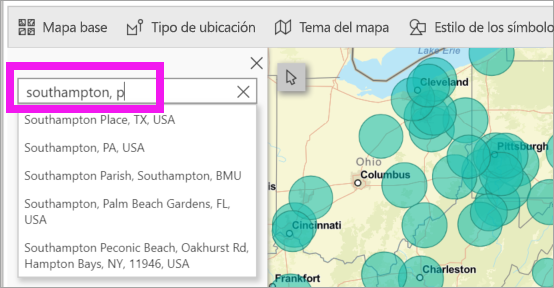
3. Power BI agrega en esa ubicación una marca, cuyo color puede cambiar.
   
   
4. Agregue y elimine marcas.
   
   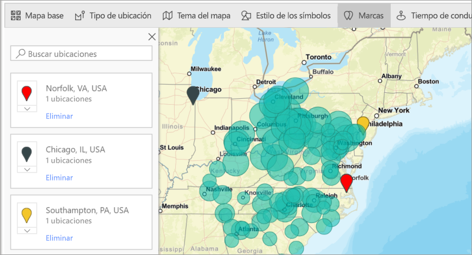

### Tiempo de conducción
El panel Drive time (Tiempo de conducción) le permite seleccionar una ubicación y determinar luego qué otras características del mapa están dentro de un radio o tiempo de conducción específico. En el ejemplo siguiente se muestra un radio de 50 millas alrededor de Washington D.C.  Siga los pasos que se indican a continuación para crear su propia capa de tiempo de conducción. 
    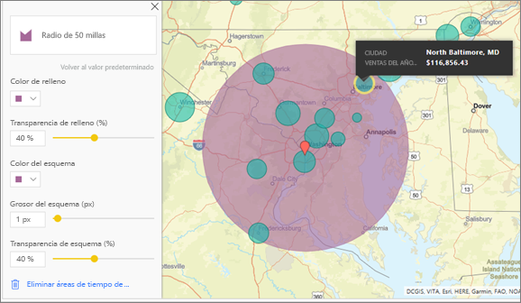

1. Seleccione la herramienta de selección única y elija una chincheta o una burbuja. En este ejemplo, hemos seleccionado una chincheta para el aeropuerto de Charlotte Douglas

   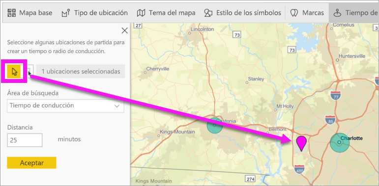
   
   > [!TIP]
   > Es más fácil seleccionar una ubicación si se acerca el mapa. Para ello, utilice el icono + o el desplazamiento del mouse.
   > 
   > 
2. Supongamos que va a volar al aeropuerto Charlotte Douglas y va a estar en Charlotte unos días, y desea averiguar cuáles de sus cadenas de tiendas se encuentran dentro de una distancia razonable para ir conduciendo a ellas. Cambie Área de búsqueda a **Tiempo de conducción** y Distancia a **25** minutos. Seleccione Aceptar.    
   
    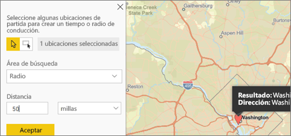

    

3. Hay dos tiendas a menos de 25 minutos de conducción. El radio se muestra en color púrpura. Seleccione cualquier ubicación para mostrar sus detalles. También puede dar formato al radio cambiando el color y el contorno.
   
    

### Capa de referencia
#### Capa de referencia: datos demográficos
ArcGIS Maps para Power BI proporciona una selección de capas demográficas que ayudan a contextualizar los datos de Power BI.

1. Seleccione la pestaña **Capa de referencia** y elija **Datos demográficos**.
2. Cada capa que aparece tiene una casilla. Agregue una marca de verificación para agregar esa capa al mapa.  En este ejemplo, hemos agregado Average Household Income. 
   
    
3. Asimismo, todas las capas son interactivas. Mantenga el mouse sobre una burbuja para ver los detalles. Haga clic en un área sombreada para ver los detalles en forma de gráficos. Aquí hemos seleccionado el código postal 28227 y hay dos gráficos que podemos ver.
   
    

#### Capa de referencia: ArcGIS
ArcGIS Online proporciona a las organizaciones la capacidad de publicar mapas web públicos. Además, Esri proporciona un conjunto elaborado de mapas web a través de Living Atlas. En la pestaña de ArcGIS, puede buscar todos los mapas web públicos o de Living Atlas y agregarlos al mapa como capas de referencia.

1. Seleccione la pestaña **Capa de referencia** y elija **ArcGIS**.
2. Escriba los términos de búsqueda y después seleccione una capa de mapa. En este ejemplo, hemos elegido USA Congressional Districts.
   
    
3. Para ver los detalles, seleccione un área sombreada para abrir *Select from reference layer* (Seleccionar a partir de la capa de referencia): use la herramienta de selección de capas de referencia para seleccionar límites u objetos en la capa de referencia.

 

## Seleccionar puntos de datos
ArcGIS Maps for Power BI permite que cinco modos de selección le ayuden a seleccionar los datos con precisión y rapidez.

Para cambiar el modo de selección, mantenga el cursor sobre el icono de la herramienta de selección única que se muestra en la imagen siguiente. Así se expandirá la barra oculta para mostrar herramientas adicionales:

Cada herramienta tiene un rol único que permite seleccionar los datos: 

 Seleccione puntos de datos individuales.

 Dibuja un rectángulo en el mapa y selecciona los puntos de datos contenidos.

 Permite usar los límites o polígonos en las capas de referencia para seleccionar puntos de datos contenidos.

 Permite seleccionar datos mediante una capa de búfer.

 Permite seleccionar puntos de datos similares entre sí.

> [!NOTE]
> Se puede seleccionar un máximo de 250 puntos de datos a la vez.
> 
> 

 

## Obtener ayuda
**Esri** ofrece [documentación exhaustiva](https://go.microsoft.com/fwlink/?LinkID=828772) sobre el conjunto de características de **ArcGIS Maps para Power BI**.

Puede formular preguntas, buscar la información más reciente, notificar problemas y encontrar respuestas en el [hilo de la comunidad de Power BI relacionado con **ArcGIS Maps para Power BI**](https://go.microsoft.com/fwlink/?LinkID=828771).

Si tiene alguna sugerencia para una mejora, envíela a la [lista de ideas de Power BI](https://ideas.powerbi.com).

 

## Administrar el uso de ArcGIS Maps para Power BI en la organización
Power BI proporciona a los diseñadores, administradores de inquilinos y administradores de TI la capacidad de administrar el uso de ArcGIS Maps for Power BI. A continuación, encontrará los pasos que puede dar cada rol. 

### Opciones del diseñador
En Power BI Desktop, los diseñadores pueden deshabilitar ArcGIS Maps for Power BI en la pestaña de seguridad. Seleccione **Archivo** > **Opciones y configuración** y, después, seleccione **Opciones** > **Seguridad**. Si se deshabilita, ArcGIS Maps no cargará de manera predeterminada.

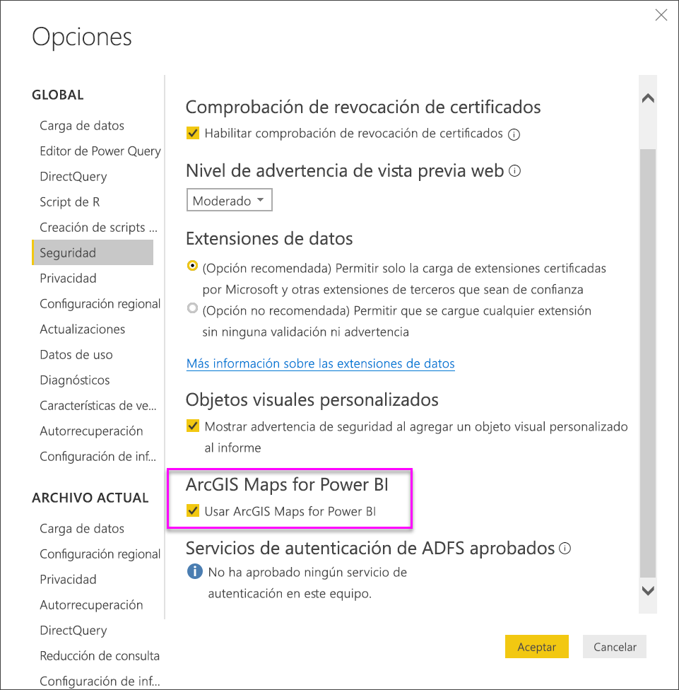

### Opciones de administrador de inquilinos
En PowerBI.com, los administradores de inquilinos pueden desactivar ArcGIS Maps for Power BI para todos los usuarios. Seleccione **Configuración** > **Portal de administración** > **Configuración de inquilinos**. Cuando se deshabilite, Power BI dejará de mostrar el icono de ArcGIS Maps for Power BI en el panel de visualizaciones.

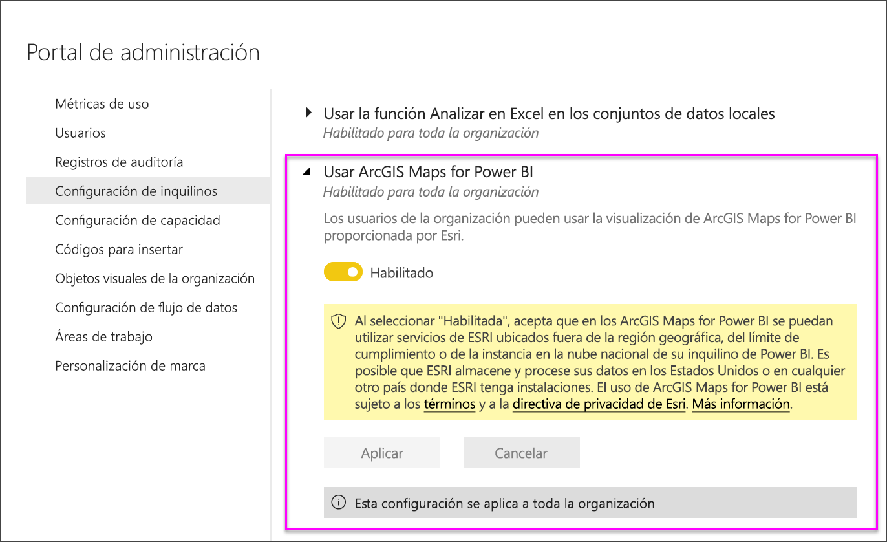

### Opciones del administrador de TI
Power BI Desktop admite el uso de la **Directiva de grupo** para deshabilitar ArcGIS Maps for Power BI en los equipos implementados de una organización.

<table>
<tr><th>Atributo</th><th>Valor</th>
</tr>
<tr>
<td>key</td>
<td>Software\Policies\Microsoft\Power BI Desktop&lt;/td&gt;
</tr>
<tr>
<td>valueName</td>
<td>EnableArcGISMaps</td>
</tr>
</table>

Un valor de 1 (decimal) habilita ArcGIS Maps para Power BI.

Un valor de 0 (decimal) deshabilita ArcGIS Maps para Power BI.

## Consideraciones y limitaciones
ArcGIS Maps para Power BI está disponible en los siguientes servicios y aplicaciones:

<table>
<tr><th>Servicio/aplicación</th><th>Disponibilidad</th></tr>
<tr>
<td>Power BI Desktop</td>
<td>Sí</td>
</tr>
<tr>
<td>Servicio Power BI (app.powerbi.com)</td>
<td>Sí</td>
</tr>
<tr>
<td>Aplicaciones móviles de Power BI</td>
<td>Sí</td>
</tr>
<tr>
<td>Publicar en Web de Power BI</td>
<td>No</td>
</tr>
<tr>
<td>Power BI Embedded</td>
<td>No</td>
</tr>
<tr>
<td>Inserción del servicio Power BI (PowerBI.com)</td>
<td>No</td>
</tr>
</table>

En los servicios o aplicaciones donde ArcGIS Maps para Power BI no está disponible, la visualización mostrará un objeto visual vacío con el logotipo de Power BI.

En la geocodificación de direcciones postales, solo se geocodifican las primeras 1500 direcciones. La geocodificación de nombres de lugares o países no está sujeta al límite de 1500 direcciones.

 

**¿Cómo funciona ArcGIS Maps for Power BI?**
Esri es quien proporciona ArcGIS Maps for Power BI (https://www.esri.com). Su uso de ArcGIS Maps for Power BI está sujeto a los [términos](https://go.microsoft.com/fwlink/?LinkID=8263222) y a la [directiva de privacidad](https://go.microsoft.com/fwlink/?LinkID=826323) de Esri. Los usuarios de Power BI que quieran usar objetos visuales de ArcGIS Maps for Power BI tienen que aceptar el cuadro de diálogo de consentimiento (vea Consentimiento del usuario para más detalles).  El uso de ArcGIS Maps for Power BI de Esri está sujeto a los términos y a la directiva de privacidad de Esri, a los que puede acceder desde el vínculo del cuadro de diálogo de consentimiento. Cada usuario debe dar su consentimiento antes de usar ArcGIS Maps for Power BI por primera vez. Una vez que el usuario acepta el consentimiento, los datos enlazados al objeto visual se envían a los servicios de Esri al menos para su geocodificación, lo que implica transformar la información de ubicación en información de latitud y longitud que se pueda representar en un mapa. Debe tener en cuenta que los datos enlazados a la visualización de datos pueden enviarse a los servicios de Esri. Esri proporciona servicios como mapas base, análisis espacial, geocodificación, etc. El objeto visual de ArcGIS Maps for Power BI interactúa con estos servicios mediante una conexión SSL protegida por un certificado proporcionado y mantenido por Esri. Puede obtener más información sobre ArcGIS Maps for Power BI en la [Página del producto ArcGIS Maps for Power BI](https://www.esri.com/powerbi) de Esri.

Cuando un usuario realiza una suscripción a Plus ofrecida por Esri mediante ArcGIS Maps for Power BI, está entablando una relación directa con Esri. Power BI no envía información personal sobre el usuario a Esri. El usuario inicia sesión en una aplicación AAD proporcionada por Esri, y confía en ella, mediante su propia identidad AAD. Al hacerlo, el usuario comparte su información personal directamente con Esri. Una vez que el usuario agrega contenido Plus a un objeto visual de ArcGIS Maps for Power BI, otros usuarios de Power BI también necesitan una suscripción Plus de Esri para ver o editar ese contenido. 

Para realizar preguntas técnicas detalladas sobre el funcionamiento de ArcGIS Maps for Power BI de Esri, póngase en contacto con Esri a través de su sitio de soporte técnico.

**¿Qué datos se envían a Esri?**
Puede leer sobre qué datos se transfieren a Esri en su [sitio de documentación](https://doc.arcgis.com/en/maps-for-powerbi/get-started/data-transfer.htm).

**¿Hay algún cargo por usar ArcGIS Maps para Power BI?**

ArcGIS Map for Power BI lo proporciona **Esri** sin costo adicional. Debe dar su consentimiento al contrato de usuario.  

**Recibo un mensaje de error en Power BI Desktop sobre el hecho de que la caché está llena**

Se trata de un error que están solucionando.  Mientras tanto, para borrar la memoria caché, intente eliminar archivos en esta ubicación: C:\Users\\AppData\Local\Microsoft\Power BI Desktop\CEF y, luego, reinicie Power BI.

**¿ArcGIS Maps para Power BI admite archivos de forma de Esri?**

ArcGIS Maps para Power BI detecta de forma automática los límites estándar, como países o regiones, estados o provincias y códigos postales. Si necesita proporcionar sus propias formas, puede hacerlo mediante [Mapas de formas en Power BI Desktop](desktop-shape-map.md).

**¿Puedo ver mi mapas de ArcGIS sin conexión?**

No, Power BI necesita conectividad de red para mostrar los mapas.

**¿Puedo conectarme a mi cuenta de ArcGIS Online desde Power BI?**

Aún no. [Vote por esta idea](https://ideas.powerbi.com/forums/265200-power-bi-ideas/suggestions/9154765-arcgis-geodatabases) y le enviaremos un correo electrónico cuando comencemos a trabajar en esta característica.  

## Pasos siguientes
[Interactuación con un mapa de ArcGIS compartido con usted](power-bi-visualizations-arcgis.md)

[Entrada de blog con el anuncio de la disponibilidad de ArcGIS Maps para Power BI](https://powerbi.microsoft.com/blog/announcing-arcgis-maps-for-power-bi-by-esri-preview/)

¿Tiene más preguntas? [Pruebe a preguntar a la comunidad de Power BI](https://community.powerbi.com/)

