# <a name="best-design-practices-for-reports-and-visuals"></a>Prácticas recomendadas de diseño para informes y elementos visuales

En este artículo se describen los procedimientos recomendados para diseñar informes en Power BI. Se analizan los principios de diseño que se pueden aplicar tanto a los informes como a las páginas, y los objetos visuales individuales que componen dichos informes. Muchos de estos procedimientos recomendados también se pueden aplicar al diseño de paneles.

> [!NOTE]
> Las recomendaciones que encontrará en este artículo son directrices que puede aplicar en situaciones lógicas. Por cada principio que describiremos más abajo, se mostrarán normalmente motivos válidos para “saltarse la regla”.

Esperamos que considere este artículo como un punto de partida, que aplique lo que aprenda a sus propios informes y visualizaciones, y que siga la conversación en la [Comunidad de Microsoft Power BI](http://community.powerbi.com/). El uso de diseños y visualizaciones de informes de BI es ahora mismo un tema de actualidad. Existen muchos pensadores, autores de blogs y sitios web que examinan con amplitud y profundidad el diseño de informes de BI. Al final del artículo, mencionamos algunos.

> *Estamos saturados de información, no porque haya demasiada, sino porque no sabemos cómo domarla.*
-- Stephen Few

## <a name="a-look-at-the-landscape-and-terminology"></a>Análisis del panorama y la terminología

En Power BI, un informe puede tener una o varias páginas. Todas las páginas juntas se conocen colectivamente como informe. Los elementos básicos del informe son los objetos visuales (también conocidas como visualizaciones), las imágenes independientes y los cuadros de texto. Desde los puntos de datos individuales a los elementos del informe y la página del informe en sí, hay un gran número de opciones de formato.

Empezaremos con la fase de planeación del informe, seguiremos con los principios del diseño básico de informes, después explicaremos los principios del diseño de objetos visuales y, por último, explicaremos los procedimientos recomendados para cada tipo de objeto visual.

Para obtener directrices e instrucciones detalladas sobre cómo crear y usar informes de Power BI, vea [Aprender a usar Power BI](https://powerbi.microsoft.com/learning/).

## <a name="before-you-build-your-first-visualization-focus-on-requirements"></a>Antes de crear su primera visualización, céntrese en los requisitos.

La creación de un informe empieza antes de crear su primer objeto visual. Un buen informe necesita planeamiento. Analice los datos con los que trabajará y anote los requisitos del informe. Hágase estas preguntas:

* ¿Cuál es la necesidad del negocio?

* ¿Cómo van a usar estos datos los lectores?

* ¿Quién va a usar estos datos?

* ¿Qué decisiones quiere tomar el lector en función de este informe?

La respuesta a esas preguntas dará la forma a su diseño. Cada informe cuenta una historia. Asegúrese de que la historia coincida con la necesidad empresarial. Puede que sienta la necesidad de agregar objetos visuales que muestren conclusiones dramáticas, pero, si esa información no coincide con la necesidad empresarial, el informe no será útil. Es más, podría distraer a los usuarios con esos objetos visuales. Además, es posible que no pueda recopilar la información para tomar esa decisión a partir de estos datos. ¿Puede usar este informe para medir lo que necesita medir?

Los informes se pueden usar para supervisar, descubrir, realizar seguimientos, predecir, medir, administrar, probar y mucho más. Por ejemplo, la necesidad empresarial es un informe de ventas que mide el rendimiento. Podría diseñar un informe que examinara las ventas actuales, las comparara con las ventas anteriores, con los competidores, y que incluyera algunos indicadores KPI que desencadenen alertas. Quizá los lectores pueden explorar en profundidad los resultados de ventas para ver las tiendas que se han cerrado o identificar problemas de la cadena de suministro que pueden afectar a las ventas. También se podría explorar en profundidad para ver las ventas por tienda, región, producto, temporada, etc.

Conozca a los clientes del informe. Diseñe un informe que emplee terminología conocida y que proporcione datos con un nivel de detalle y una complejidad comparables al nivel de conocimientos de los clientes. ¿Tiene más de un tipo de cliente? Un tamaño no siempre sirve para todos. Diseñe distintas páginas de informe basadas en la experiencia. No olvide etiquetar cada página claramente para que los clientes puedan reconocerla. Otra opción es usar segmentaciones para que los clientes puedan adoptar la página a sus necesidades. Implique al cliente en la fase de planeamiento y evite el error de crear lo que piensa que pudieran necesitar. Si comete un error, prepárese para comenzar de nuevo y repetir el proceso.

Después de identificar la necesidad empresarial, los clientes y las métricas que quiere incluir, el paso siguiente es seleccionar los objetos visuales adecuados para contar la historia. Vea cómo presentar esos objetos visuales de la manera más eficaz posible. Comencemos con algunos principios básicos del diseño de informes.

## <a name="principles-of-report-design"></a>Principios del diseño de informes

Una página de informe tiene espacio limitado, y una de las principales dificultades es incluir todos los elementos que tenía pensado en ese espacio (y, a la vez, que la información se siga comprendiendo fácilmente). Además, no reste importancia al valor de un informe visualmente atractivo. La clave es encontrar el equilibrio entre un informe que resulte atractivo y que sea útil.

Veamos el diseño, la claridad y la estética.

### <a name="layout-of-the-report-canvas"></a>Diseño del lienzo del informe

El lienzo del informe tiene una cantidad de espacio limitada. Si no puede incluir todos los elementos en una misma página del informe, divida el informe en varias páginas. Puede adaptar una página de informe a una audiencia concreta (por ejemplo, Recursos Humanos, TI, Ventas, SLT). Si lo desea, puede adaptarla a una cuestión empresarial concreta:

* "¿Cómo afectan los defectos a nuestro tiempo de inactividad?"

* "¿Qué efecto tiene nuestra campaña de marketing en las opiniones?"

Puede ser mejor enfocarla como una historia progresiva. Por ejemplo, la primera página con información general o que capte la atención, la segunda página que continúe la historia de datos, la tercera página que explore con mayor profundidad la historia, etc. Si todo el informe cabe en una misma página, entonces perfecto. En caso contrario, cree varias páginas del informe en las que el contenido se divida de forma lógica. No se olvide de asignar nombres útiles y significativos a las páginas.

Imagine que está preparando una galería de arte. No pondría 50 obras de arte en una sala pequeña, la llenaría con sillas y pintaría cada pared de un color distinto. Como conservador, elegiría solo las piezas que tienen un tema común. Las dispondría por la sala con multitud de espacio para que los visitantes puedan moverse y pensar. Incluso podría colocar tarjetas informativas que describan lo que ven. Ese es el motivo de que la mayoría de las galerías modernas tengan paredes blancas.

Para este artículo, empezaremos con un ejemplo de informe que necesita una gran cantidad de trabajo. A medida que apliquemos los procedimientos recomendados y los principios de diseño, el informe irá mejorando.


**Ilustración 1: Esta página de informe es poco atractiva y necesita mucho trabajo**

El ejemplo anterior tiene un gran número de problemas de diseño relacionados con el espacio y que explicaremos más adelante:

* Alineación, orden y uso de proximidad

* Uso inadecuado del espacio y la ordenación

* Desorganización

### <a name="alignment-order-and-proximity"></a>Alineación, orden y proximidad

El diseño de los elementos del informe afecta a la comprensión del lector y lo guía por la página del informe. La forma en que coloque los elementos cuenta una historia. La historia podría ser "empiece aquí y, después, mire aquí" o "estos tres elementos están relacionados entre sí".

* En la mayoría de las culturas, la gente lee de izquierda a derecha y de arriba abajo. Coloque el elemento más importante en la esquina superior izquierda del informe. Organice el resto de los objetos visuales de forma que permita una navegación lógica y la comprensión de la información.

* Coloque los elementos que hagan que el lector elija una opción a la izquierda de las visualizaciones e indique la opción que afectará (por ejemplo, segmentaciones).

* Coloque los elementos relacionados con la posición cercanos entre sí. La proximidad tiene que ver con la relación de los elementos.

* Otra forma de transmitir relaciones es agregar un borde o un fondo de color alrededor de los elementos relacionados. Por el contrario, agregue una línea divisoria para distinguir entre las diferentes secciones de un informe.

* Use espacios en blanco para dividir de forma visual las secciones de la página del informe.

* Rellene la página del informe. Si tiene una gran cantidad de espacio en blanco, aumente el tamaño de las visualizaciones o reduzca el tamaño del lienzo.

* Decida de forma intencional el tamaño que tendrán los elementos del informe. No deje que la disponibilidad de espacio dicte el tamaño de una visualización.

* Haga que los elementos importantes tengan un tamaño más grande que el resto, o bien agregue un objeto visual, como una flecha, para llamar la atención.

* Alinee los elementos en la página del informe, ya sea simétricamente o (de forma intencionada) asimétricamente.

Analicemos cada alineación detenidamente.

#### <a name="alignment"></a>Alineación

Alineación no significa que los distintos componentes deban tener el mismo tamaño. Tampoco significa que se deba tener el mismo número de componentes en cada fila del informe. Solo significa que cada página tiene una estructura que ayuda a la navegación y a la legibilidad.

Podemos ver en nuestro informe actualizado que se han alineado los componentes del informe en los bordes izquierdo y derecho. Además, cada fila del informe se alinea horizontal y verticalmente. Las segmentaciones se encuentran en la parte izquierda de los objetos visuales a los que afectan.


**Ilustración 2: Mejoró el aspecto del informe de ejemplo con los cambios en el diseño**

En Power BI se incluyen herramientas para ayudarle a alinear los objetos visuales. En Power BI Desktop, con varios objetos visuales seleccionados, puede usar las opciones **Alinear** y **Distribuir** de la pestaña **Visual Tools** para hacer coincidir la posición de dichos objetos.


**Ilustración 3a: Alinear los objetos visuales en Power BI Desktop**


**Ilustración 3b: Alinear Visual Tools en el servicio Power BI**

En el servicio Power BI y en Power BI Desktop, también tiene un control preciso sobre el tamaño y la posición de los objetos visuales. Puede encontrar este control en la pestaña **General** del panel **Formato** de todos los objetos visuales:

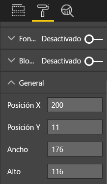

**Ilustración 4: Establecer la posición exacta del objeto visual**

En nuestra página de informe de ejemplo (ilustración 2), Power BI alinea las dos tarjetas y el borde largo en la **posición X** en 200.

#### <a name="fit-to-the-space"></a>Ajustar al espacio

Use el espacio disponible de la mejor forma posible. Si sabe cómo las personas verán y mostrarán el informe, diséñelo teniendo estos aspectos en cuenta. Reduzca los espacios en blanco para llenar el lienzo. Haga todo lo posible por eliminar la necesidad de usar barras de desplazamiento en los objetos visuales individuales. Rellene el espacio sin que los objetos visuales parezcan amontonados.

##### <a name="adjust-the-page-size"></a>Ajustar el tamaño de página

Al reducir el tamaño de página, los elementos individuales serán más grandes en relación con el tamaño general de la página. Borre la selección de los objetos visuales de la página y use la pestaña **Tamaño de página** del panel **Formato**.

Esta es una página de informe con un tamaño de página **4:3** y, después, con **16:9**. Como puede ver, el diseño es más adecuado para 16:9, así que mucho mejor. Incluso hay espacio suficiente para quitar la barra de desplazamiento del segundo objeto visual.

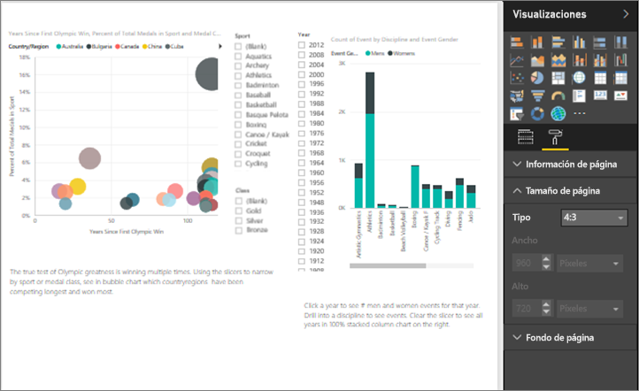

**Ilustración 5a: El informe con el tamaño de página 4:3**


**Ilustración 5b: El informe con el tamaño de página 16:9**

¿Las personas van a ver el informe con una relación de aspecto de 4:3, 16:9 u otra? ¿En pantallas pequeñas o enormes? ¿Verán el informe en todos los tamaños y relaciones de pantalla posibles? Tenga en cuenta este aspecto en el diseño.

Nuestra página del informe de ejemplo parece algo desorganizada. Sin objetos visuales seleccionados:

1. Seleccione  para abrir el panel **Formato**.

1. Expanda **Tamaño de página**.

1. En **Tipo**, seleccione **Personalizado**.

1. Cambie **Alto** a **900**.

    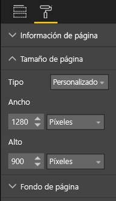

**Ilustración 6: Aumentar el alto de página**

#### <a name="reduce-clutter"></a>Reducir la desorganización

Una página de informe desorganizada será difícil de comprender a simple vista y puede resultar tan abrumadora que los lectores ni siquiera intentarán comprenderla. Elimine todos los elementos del informe que no sean necesarios. No agregue características que no ayuden a comprender la información o navegar. La página del informe debe transmitir la información con la mayor claridad, rapidez y coherencia posibles.

Edward Tufte lo llama “proporción de datos a tinta” en su libro *The Visual Display of Quantitative Information*. Para resumir, quite todo lo que no sea esencial.

Al quitar los elementos innecesarios, aumenta el espacio en blanco en la página del informe. Le proporcionará más espacio para aplicar los procedimientos recomendados que aprendimos en la sección [Alineación, orden y proximidad](#alignment-order-and-proximity).

Ahora nuestro ejemplo tiene un mejor aspecto. Hemos quitado los elementos innecesarios y hemos agregado formas para agrupar los elementos. La imagen de fondo ya no está, la forma de flecha innecesaria y el cuadro de texto han desaparecido, hemos movido un objeto visual a otra página del informe, etc. También hemos alargado el tamaño de página para aumentar el espacio en blanco.


**Ilustración 7: El informe de ejemplo poco atractivo ya está organizado**

### <a name="tell-a-story-at-a-glance"></a>Contar una historia a simple vista

La prueba general puede ser que cualquiera sin conocimientos previos comprenda rápidamente el informe sin ninguna explicación. De un vistazo, los lectores pueden ver de qué trata la página y qué transmite cada gráfico o tabla.

Cuando los lectores miren el informe, sus ojos deben centrarse en el elemento en el que quiere que se fijen primero. Sus ojos continuarán de izquierda a derecha y de arriba a abajo. Para cambiar este comportamiento, agregue indicaciones visuales, como etiquetas de cuadro de texto, formas, bordes, tamaño y color.

#### <a name="text-boxes"></a>Cuadros de texto

A veces, los títulos de las visualizaciones no son suficientes para contar la historia. Agregue cuadros de texto para comunicarse con los usuarios que vean los informes. Use cuadros de texto para describir la página del informe, una agrupación de objetos visuales o un solo objeto visual. Estos cuadros pueden explicar los resultados o definir mejor un objeto visual, los componentes del objeto visual o las relaciones entre objetos visuales. Los cuadros de texto se pueden usar para llamar la atención basándose en diferentes criterios indicados en el cuadro de texto.

En el servicio Power BI, en la barra de menús superior, seleccione **Cuadro de texto**. (En Power BI Desktop, seleccione **Cuadro de texto** en el área **Insertar** de la cinta de opciones).


**Ilustración 8: Agregar un cuadro de texto al servicio Power BI**

Escriba texto en el cuadro vacío. Luego, use los controles para establecer la fuente, el tamaño, la alineación y mucho más. Use los controladores para cambiar el tamaño del cuadro.


**Ilustración 9: Dé formato al cuadro de texto**

Pero no abuse. Demasiado texto en un informe le resta atención a los objetos visuales. Si cree que la página del informe necesita una cantidad excesiva de texto para que pueda comprenderse, lo mejor es que vuelva a empezar. ¿Puede usar un objeto visual distinto que cuente mejor la historia por sí solo? ¿Puede mejorar los títulos nativos del objeto visual para que se comprendan mejor?

#### <a name="text"></a>Texto

Cree un manual de estilo de texto y aplíquelo en todas las páginas del informe. Elija solo unas cuantas fuentes, tamaños de texto y colores. Aplique esta guía de estilo a los elementos textuales. También aplíquela a las fuentes elegidas dentro de las visualizaciones. Consulte la sección [Títulos y etiquetas que forman parte de las visualizaciones](#titles-and-labels-that-are-part-of-the-visualizations). Defina reglas para el uso de negrita, cursiva, mayor tamaño de fuente, colores específicos y más. Intente evitar usar todo en mayúscula o subrayado.

#### <a name="shapes"></a>Formas

Las formas también pueden ayudar a la navegación y la comprensión. Use formas para agrupar información relacionada y resaltar datos importantes, y use flechas para dirigir la vista. Las formas ayudan a los lectores a comprender dónde empieza el informe y cómo interpretarlo. En términos de diseño, esto suele denominarse *contraste*.

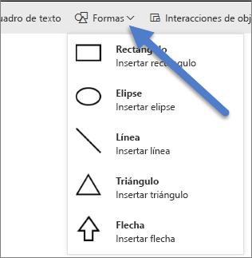

**Ilustración 10a: Formas en el servicio Power BI**

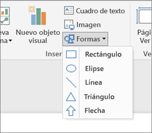

**Ilustración 10b: Formas en Power BI Desktop**

¿Cuál es la apariencia ahora de nuestra página de ejemplo? En la ilustración 11 se muestra una página más organizada y limpia, con un uso coherente de tamaño de texto, fuentes y colores. El título de página, en la esquina superior izquierda, indica sobre qué trata la página.


**Ilustración 11: Nuestro informe de ejemplo después de aplicar las directrices de texto y de agregar el título**

En el ejemplo, se ha agregado un título de página de informe en la esquina superior izquierda; el primer lugar donde miran los lectores. El tamaño de fuente es 28 puntos y la fuente es Segoe Bold, para hacerla destacar del resto de la página. Nuestra guía de estilo del texto exige que no haya fondos, títulos en negro, leyendas y etiquetas. Aplicamos este criterio a todos los objetos visuales de la página, siempre que sea posible (los ejes del gráfico combinado y las etiquetas no son editables). Además, estos elementos se configuraron en las especificaciones de la guía de estilo:

* Tarjetas: **Etiqueta de categoría** establecida en **Desactivado**, **Título** establecido en **Activado**, 12 puntos, en negro y centrado.

* Títulos de objetos visuales: Si los ha **Activado**, establézcalos en 12 puntos y alineados a la izquierda.

* Segmentaciones: **Encabezado** establecido en **Desactivado**, **Título** establecido en **Activado**. Deje **Elementos** > **Texto** en gris y 10 puntos.

* Gráficos de columnas y de dispersión: fuente negra para los ejes X e Y, y para los títulos de los ejes X e Y (si se usan).

#### <a name="color"></a>Color

Use los colores para transmitir coherencia. Trataremos el color con más detalle más adelante, en [Principios del diseño de objetos visuales](#principles-of-visual-design). Aquí, vamos a hablar sobre la selección del color de forma intencional. Se trata de que el color no impida a los lectores comprender rápidamente el informe. Demasiados colores brillantes afectan a los sentidos. Esta sección trata más bien de lo que no tiene que hacerse con los colores.

#### <a name="backgrounds"></a>Fondos

Al configurar los fondos para las páginas del informe, seleccione colores que no hagan que el informe quede demasiado sombreado, que no combinen bien con otros colores de la página o que, en general, dañen a los ojos. Tenga en cuenta que algunos colores tienen un significado propio. Por ejemplo, en Estados Unidos, usar el color rojo en un informe suele interpretarse como "malo".

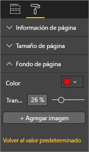

**Ilustración 12: Establecer el fondo del informe**

No está creando una obra de arte, sino un informe funcional. Seleccione un color que mejore la legibilidad y que haga destacar los elementos del informe. En un estudio sobre el uso de colores y visualizaciones en páginas web, se halló que un mayor contraste entre los colores aumenta la velocidad de comprensión. En dos notas del producto se explora este tema:

* [The effect of text and background color on visual search of Web pages](https://www.sciencedirect.com/science/article/pii/S0141938202000410) (El efecto de color de fondo y texto en la búsqueda de objetos visuales de páginas web)

* [Determining Users’ Perception of Web Page Visual Complexity and Aesthetic Characteristics](https://www.researchgate.net/publication/301362579_Determining_Users'_Perception_of_Web_Page_Visual_Complexity_and_Aesthetic_Characteristics) (Determinación de la percepción de los usuarios de la complejidad y las características estéticas de objetos visuales de página web)

Hemos aplicado algunos procedimientos recomendados para los colores a nuestro informe de ejemplo (ilustraciones 20 y 21). El cambio que más se aprecia ha sido cambiar el color del fondo a negro. El amarillo era demasiado brillante y dañaba a los ojos. Además, en el gráfico **Nombres de atletas por año y clase**, la parte amarilla de las barras desaparecía en el fondo amarillo. Al usar un fondo negro (o blanco), se consigue un contraste máximo y hace que los objetos visuales sean del foco de atención.

Estos son los pasos adicionales que realizamos para mejorar el informe de ejemplo:

#### <a name="page-title"></a>Título de página

Al cambiar el fondo a negro, el título ha desaparecido porque el campo del cuadro de texto solo permite usar una fuente negra. Para solucionar este problema, agregamos en su lugar un título de cuadro de texto:

1. Con el cuadro de texto seleccionado, borre el texto.

1. En la pestaña **Visualizaciones**, seleccione **Título** y haga clic en **Activado**.

1. Seleccione la flecha para expandir las opciones de **Título**.

1. Escriba **Juegos Olímpicos de verano** en el campo **Texto del título**.

1. En **Color de fuente**, seleccione blanco.

    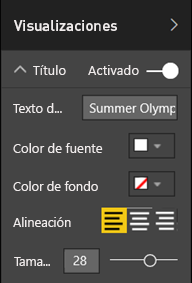

    **Ilustración 13: Agregar un título de página**

#### <a name="cards"></a>Tarjetas

Para los objetos visuales de tarjeta:

1. Seleccione  para abrir el panel **Formato**.

1. Establezca **Fondo** en **Activado**.

1. Seleccione el color blanco con un valor de **Transparencia** de **0 %** .

    

1. Luego, establezca **Título** en **Activado**.

1. En **Color de fuente**, seleccione blanco y en **Color de fondo**, selecciona negro.

    

#### <a name="slicers"></a>Segmentaciones

Hasta este momento las dos segmentaciones tenían un formato diferente. Ese diseño no tiene sentido. Para ambas segmentaciones: 

1. Cambie el color del fondo a aguamarina.

    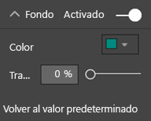

    **Ilustración 14: Cambiar el color de fondo de la segmentación**

    El color aguamarina es una buena opción, ya que forma parte de la paleta de colores de la página (puede verlo en el mapa coroplético, el gráfico de rectángulos y el gráfico de columnas).

1. Agregue un borde blanco fino.

    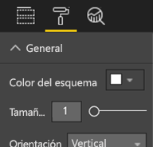

    **Ilustración 15: Agregar un borde a la segmentación**

1. La fuente gris es difícil de ver con el color aguamarina de fondo, así que cambie el color de los **Elementos** a blanco.

    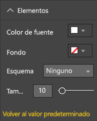

    **Ilustración 16: Cambiar el color de fuente de la segmentación**

1. Por último, en **Título**, cambie **Color de fuente** a blanco y agregue negro a **Color de fondo**.

    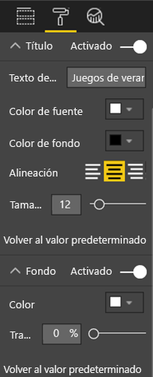

    **Ilustración 17: Formato del título de la segmentación**

#### <a name="rectangle-shape"></a>Forma rectangular

El rectángulo también ha desaparecido en el fondo negro. Para corregir este problema:

1. Seleccione la forma.

1. En el panel **Formato de forma**, deslice **Fondo** a **Activado**.

    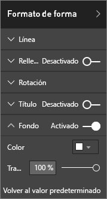

    **Ilustración 18: Cambiar el formato de la forma**

#### <a name="column-charts-bubble-chart-filled-map-and-treemap"></a>Gráficos de columnas, gráfico de burbujas, mapa coroplético y gráfico de rectángulos

Agregue un fondo blanco al resto de los objetos visuales de la página del informe. En el panel **Formato**:

1. Expanda la opción **Fondo**.

1. Establezca **Color** en blanco.

1. Establezca **Transparencia** en 0.

    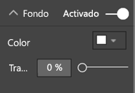

    **Ilustración 19: Agregar un fondo blanco al resto de las visualizaciones**

Este es el aspecto de los informes una vez que se ha cambiado su formato:


**Ilustración 20: Informe de ejemplo después de aplicar los procedimientos recomendados de color (fondo negro)**


**Ilustración 21: Informe de ejemplo después de aplicar los procedimientos recomendados de color (fondo blanco)**

### <a name="aesthetics"></a>Estética

Hemos hablado mucho de lo que consideraríamos cambios estéticos, como se ha explicado anteriormente: alineación, color, opciones de fuente y organización. Existen algunos otros procedimientos recomendados para el diseño de informes que vale la pena analizar. Tienen que ver con la apariencia general del informe.

Recuerde que la función del informe es satisfacer una necesidad empresarial, no resultar atractivo. Aunque siempre se necesita una parte de atractivo, especialmente para las primeras impresiones. Según Tony Bodoh, consultor de Nashville, "La emoción se activa medio segundo antes que la lógica". Los lectores reaccionarán primero a la página del informe en un plano emocional. Luego, tardarán algo más en analizarla en profundidad. Si la página parece desorganizada, confusa o poco profesional, es posible que el lector nunca llegue descubrir su cautivadora historia.

El autor de blog y analista del sector de TechTarget, Wayne Eckerson, ofrece una excelente analogía. Diseñar un informe es como decorar una habitación. Con el tiempo, compras un jarrón, un sofá, una mesa auxiliar y un cuadro. Por separado, todos los elementos parecen atractivos. Pero, aunque cada selección individual tenga sentido, en conjunto los objetos no combinan o compiten por la atención.

Concéntrese en estos aspectos:

* Cree un tema o una apariencia comunes para el informe y aplíquelos a todas las páginas.

* Use imágenes independientes y otros gráficos para apoyar la historia real, no para generar distracciones.

* Aplique todos los procedimientos recomendados que hemos explicado hasta este momento en el artículo.

## <a name="principles-of-visual-design"></a>Principios del diseño de objetos visuales

Hemos analizado los principios del diseño de informes y cómo organizar los elementos del informe para que se pueda entender fácil y rápidamente. Ahora, analizaremos los principios de diseño de los objetos visuales en sí. En la sección siguiente profundizaremos en los objetos visuales individuales y explicaremos los procedimientos recomendados para algunos de los tipos más usados.

De momento, dejaremos a un lado nuestra página del informe de ejemplo y veremos otros ejemplos. Después de analizar los principios del diseño de objetos visuales, volveremos a nuestra página del informe de ejemplo y aplicaremos lo que hemos aprendido. Le proporcionaremos instrucciones detalladas.

### <a name="planning--choose-the-right-visual"></a>Planeamiento: Seleccionar el objeto visual adecuado

Al igual que es importante planear el informe antes de empezar a crearlo, también es necesario planear cada objeto visual. Pregúntese, "¿qué historia quiero contar con este objeto visual?" y, luego, averigüe qué tipo de objeto visual la cuenta mejor. Puede mostrar el progreso en un ciclo de ventas como un gráfico de barras, pero ¿no se contaría mejor con un gráfico en cascada o un gráfico de embudo? Para obtener ayuda con este proceso, lea la última sección de este artículo, [Tipos de objetos visuales y procedimientos recomendados](#visual-types-and-best-practices). En ella se describen los procedimientos recomendados para algunos de los tipos más comunes de objetos visuales. No se sorprenda si el primer tipo de objeto visual que selecciona no termina siendo su mejor opción. Pruebe con más de un tipo de objeto visual para ver cuál transmite mejor la información.

Comprenda la diferencia entre datos categóricos y cuantitativos, y conozca qué tipos de objetos visuales funcionan mejor en cada caso. Los datos cuantitativos suelen denominarse medidas y, en general, son numéricos. Los datos categóricos suelen denominarse dimensiones y se pueden clasificar. Esto se explica con detalle en la sección [Seleccionar la medida adecuada](#choose-the-right-measure).

Evite la tentación de usar tipos de objetos visuales más modernos o complejos solo para conseguir que el informe llame más la atención. Lo ideal es usar la opción más sencilla para transmitir su historia. Los gráficos de barras horizontales y los gráficos de líneas pueden transmitir información rápidamente. Nos resultan familiares, son cómodos y la mayoría de los lectores pueden interpretarlos fácilmente. Otra de las ventajas es que la mayoría de la audiencia lee de izquierda a derecha y de arriba abajo y, por lo tanto, estos dos tipos de gráficos se pueden analizar y comprender rápidamente.

¿Es necesario desplazarse por el objeto visual para contar la historia? Si es posible, evite los desplazamientos. Intente aplicar filtros y hacer uso de jerarquías y exploraciones en profundidad. Si esos elementos no eliminan la barra de desplazamiento, considere la posibilidad de elegir un tipo de objeto visual diferente. Si no se puede eliminar el desplazamiento, los lectores tolerarán mejor el desplazamiento horizontal que el vertical.

Incluso si elige el mejor objeto visual de todos para la historia, es posible que aún necesite ayuda para contarla. Para ello, necesitará etiquetas, títulos, menús, colores y tamaños. Explicaremos estos elementos de diseño más adelante en la sección [Elementos de diseño](#design-elements).

### <a name="choose-the-right-measure"></a>Seleccionar la medida adecuada

¿Es atractiva la historia que cuenta el objeto visual? ¿Es importante? No cree objetos visuales sin un motivo aparente. Puede que piense que los datos contarán una historia interesante, pero no lo hacen. No tenga miedo de volver a empezar y buscar una historia más interesante. Quizás la historia esté ahí pero deba medirla de forma diferente.

Por ejemplo, imagine que mide el éxito de sus gerentes de ventas. ¿Qué medida usaría para hacerlo? ¿Lo mediría mejor analizando el total de ventas o el total de ganancias, el crecimiento comparado con el año anterior y el rendimiento según un objetivo? Puede que la comercial Sally tenga las mayores ganancias. Si mostrara el total de ganancias por comercial en un gráfico de barras, en comparación con el resto de los comerciales, parecería una estrella de rock. Si Sally tiene un elevado costo de ventas (gastos de viaje, gastos de envío, costos de fabricación, etc.), con solo ver las ventas no se contará la mejor historia.

#### <a name="reflect-reality-dont-distort-reality"></a>Reflejar la realidad, no distorsionarla

Se puede crear un objeto visual que distorsione la verdad. Hay un sitio web donde los entusiastas de los datos comparten lo que ellos consideran objetos visuales malos. El tema más común en los comentarios es la decepción en la compañía que creó y distribuyó el objeto visual. Un objeto visual malo transmite el mensaje de que la empresa no es de confianza.

Por ello, cree objetos visuales que no distorsionen de forma intencionada la realidad y que no estén manipulados para contar la historia que quiere que cuenten. Este es un ejemplo:


**Ilustración 22: Gráfico de realidad distorsionada**

En este ejemplo, parece como si hubiera una gran diferencia entre las cuatro compañías y que CorpB tenga mucho más éxito que las otras tres. Si lo observa más detenidamente, verá que el eje X no empieza en cero y que las diferencias entre las compañías es probable que estén dentro del margen de error. Estos son los mismos datos con un eje X que no empieza en cero.


**Ilustración 23: Gráfico realista**

Los lectores esperan y, con frecuencia, suponen que el eje X empieza en cero. Si decide que no comience en cero, puede hacerlo de manera que no distorsione los resultados. Considere la posibilidad de agregar una indicación visual o un cuadro de texto para señalar la desviación de la norma.

### <a name="design-elements"></a>Elementos de diseño

Después de seleccionar un tipo y de medir y crear el objeto visual, es el momento de ajustar la visualización para obtener la máxima efectividad. En esta sección se describe lo siguiente:

* Diseño, espacio y tamaño

* Elementos de texto: etiquetas, anotaciones, menús, títulos

* Ordenación

* Interacciones de objetos visuales

* Color

#### <a name="tweaking-visuals-for-best-use-of-space"></a>Optimizar los objetos visuales para el mejor uso del espacio

Si intenta ajustar varios gráficos en un informe, al maximizar la proporción de los datos y la tinta, conseguirá destacar la historia de los datos. Como se mencionó anteriormente, Edward Tufte acuñó la frase "proporción de los datos y la tinta". El objetivo es quitar tantas marcas de un gráfico como sea posible sin que afecte a la capacidad de un lector para interpretar los datos.

En el primer conjunto de gráficos siguientes, hay etiquetas de eje redundantes: **Enero de 2014**, **Abril de 2014**, etc. En los títulos, se repite **por fecha**. Los títulos de cada gráfico también necesitan un espacio horizontal dedicado a lo largo de cada gráfico. Al quitar los títulos de los gráficos y activar las etiquetas de ejes individuales, se quita algo de tinta y tendremos un mejor uso del espacio en general. Podemos quitar las etiquetas de los ejes de los dos gráficos superiores para reducir aún más la cantidad de tinta y usar más espacio para los datos.

Si hay períodos de tiempo específicos sobre los que quiera llamar la atención, puede dibujar líneas y rectángulos detrás de todos los gráficos. De esta forma, dirigirá la mirada del lector arriba y abajo para ayudar a establecer comparaciones.


**Ilustración 24: Antes**


**Ilustración 25: Después**

**Para activar y desactivar los títulos de ejes**

1. Seleccione un objeto visual para activarlo.

1. Seleccione  para abrir el panel **Formato**.

1. Expanda las opciones de **Eje X** o **Eje Y**.

1. Arrastre el control deslizante de **Título** para activarlo o desactivarlo.

    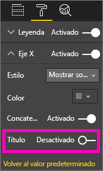

    **Ilustración 26: Activar y desactivar los títulos de ejes**

##### <a name="to-turn-axis-labels-on-and-off"></a>Para activar o desactivar las etiquetas de ejes

1. Seleccione un objeto visual para activarlo.

1. Seleccione  para abrir el panel **Formato**.

1. Junto al **eje X** y el **eje Y** verá que hay controles deslizantes.

1. Arrastre el control deslizante para activar o desactivar las etiquetas de los ejes.

    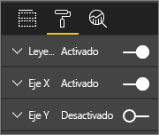

    **Ilustración 27: Activar y desactivar las etiquetas de ejes**

    > [!TIP]
    > Un escenario donde podría desactivar las etiquetas del eje Y sería si tuviera activadas las **Etiquetas de datos**.

##### <a name="to-remove-visual-titles"></a>Para quitar títulos de objetos visuales

1. Seleccione un objeto visual para activarlo.

1. Seleccione  para abrir el panel **Formato**.

1. Establezca el control deslizante de **Título** en **Desactivado**.

    

    **Ilustración 28: Quitar títulos de objetos visuales**

Tenga en cuenta cómo los lectores verán el informe. Asegúrese de que los objetos visuales y el texto sean lo suficientemente grandes y oscuros como para que la gente pueda leerlos. Si tiene un objeto visual proporcionalmente más grande en la página, los lectores pueden suponer que es el más importante. Deje espacio suficiente entre los objetos visuales para que el informe no parezca desorganizado y confuso. Alinee los objetos visuales para ayudar a dirigir la vista de los lectores.

##### <a name="to-resize-a-visual"></a>Para cambiar el tamaño de un objeto visual

1. Seleccione un objeto visual para activarlo.

1. Arrastre uno de los controladores para ajustar el tamaño.

    

    **Ilustración 29: Cambio del tamaño de un objeto visual**

##### <a name="to-move-a-visual"></a>Para mover un objeto visual

1. Seleccione un objeto visual para activarlo.

1. Seleccione y mantenga presionada la barra de redimensionamiento de la mitad superior del objeto visual.

1. Arrastre el objeto visual a su nueva ubicación.

    

    **Ilustración 30: Mover un objeto visual**

#### <a name="titles-and-labels-that-are-part-of-the-visualizations"></a>Títulos y etiquetas que forman parte de las visualizaciones

Asegúrese de que los títulos y las etiquetas sean fáciles de leer y se expliquen por sí solos. El texto de los títulos y de las etiquetas debe tener un tamaño óptimo con colores que destaquen. Recuerde nuestra guía de estilo (consulte [Texto](#text) anteriormente en el artículo). Limite el número de colores y tamaños (demasiados tamaños de fuente y colores distintos harán que la página parezca llena y confusa). Considere usar el mismo color y tamaño de fuente para el título de todos los objetos visuales de una página del informe. También, elija la misma alineación para todos los títulos de una misma página.

**El panel de formato**

Para cada uno de los cambios de formato que se enumeran a continuación, seleccione el icono de rodillo de pintura  para abrir el panel **Formato**.


**Ilustración 31: Abrir el panel Formato**

Después, seleccione el elemento visual para ajustarlo y asegúrese de que esté **Activado**. Estos son ejemplos de elementos visuales: **Eje x**, **Eje y**, **Título**, **Etiquetas de datos** y **Leyenda**. En el ejemplo siguiente se muestra el elemento **Título**.

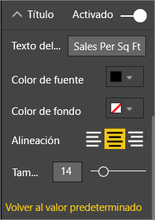

**Ilustración 32: Dar formato al título de un objeto visual**

##### <a name="set-the-text-size"></a>Establecer el tamaño del texto

Se puede ajustar el tamaño del texto de los títulos y las etiquetas de datos, pero no de los ejes X o Y ni de las leyendas. Para las etiquetas de datos en concreto, juegue con las **Unidades de presentación** y el número de **Posiciones decimales**. Al final, encontrará el nivel óptimo de detalle para mostrar la información en el informe.

##### <a name="set-the-text-alignment"></a>Establecer la alineación del texto

Puede elegir alinear el título a la izquierda, a la derecha o en el centro. Seleccione una y aplique la misma configuración a todos los objetos visuales de la página.

##### <a name="set-the-text-position"></a>Establecer la posición del texto

Puede ajustar la posición del texto para algunos ejes Y, así como para la leyenda. Sea lo que sea que elija, siga el mismo procedimiento para el resto de los ejes Y, así como para el resto de las leyendas de la página.

##### <a name="set-the-title-and-label-length"></a>Establecer la longitud de títulos y etiquetas

Ajuste la longitud de los títulos, los títulos de los ejes, las etiquetas de datos y las leyendas. Si decide mostrar alguno de estos elementos, al ajustar la longitud (así como el tamaño del texto), se asegurará de que Power BI no trunque los valores:

* Para **Título** y **Leyenda**, el valor es **Texto del título**. Escriba el título real que aparecerá en el objeto visual.

* Para **Eje X** y **Eje Y**, la opción es **Estilo** y se selecciona en una lista desplegable.

* Para **Etiquetas de datos**, las opciones son **Mostrar** y **Decimal**. Use la lista desplegable **Mostrar** para seleccionar las unidades de medida: **millones**, **miles**, **ninguna**, **automático**, etc. Use el campo **Decimal** para indicar a Power BI el número de posiciones decimales que quiere mostrar.

##### <a name="set-the-text-color"></a>Establecer el color del texto

Puede ajustar el color del texto de títulos, ejes y etiquetas de datos.

#### <a name="titles-and-labels-that-arent-part-of-the-visualizations"></a>Títulos y etiquetas que no forman parte de las visualizaciones

Anteriormente en este artículo explicamos cómo agregar cuadros de texto a las páginas de informes. A veces, los títulos de las visualizaciones no son suficientes para contar la historia. Agregue cuadros de texto para mostrar información adicional a los lectores de los informes.

Para evitar que la página del informe esté demasiado llena y resulte muy confusa, sea coherente en el uso de las fuentes, tamaños, colores y alineación de los cuadros de texto. Para realizar cambios en el texto de un cuadro de texto, seleccione el cuadro de texto para mostrar el menú de formato.


**Ilustración 33: Dar formato a la fuente usada en un cuadro de texto**

#### <a name="sorting"></a>Ordenación

Una oportunidad muy fácil para proporcionar conclusiones más rápidas es establecer la ordenación de los objetos visuales. Por ejemplo, al ordenar los gráficos de barras en orden ascendente o descendente según el valor de las barras, puede mostrar rápidamente información incremental importante sin usar más espacio del lienzo.

Para ordenar un gráfico:

1. Seleccione los puntos suspensivos de la esquina superior derecha del gráfico.

1. Seleccione **Ordenar**.

1. Elija el campo por el que quiere ordenar y la dirección.

Para obtener más información, consulte [Cambio del modo de ordenar un objeto visual](../consumer/end-user-change-sort.md).

#### <a name="chart-interaction-and-interplay"></a>Interacción y relaciones de gráficos

Una de las características más atractivas de Power BI es la capacidad para editar la forma en que los gráficos interactúan entre sí. De forma predeterminada, los gráficos se resaltan entre sí: al seleccionar un punto de datos, los datos relacionados de otros gráficos se iluminan y los datos no relacionados se atenúan. Puede invalidar este comportamiento para usar cualquier gráfico como un filtro auténtico. Ahorrará espacio en la página. En el servicio Power BI, seleccione **Interacciones de objetos visuales** en la barra de menús para realizar el cambio.

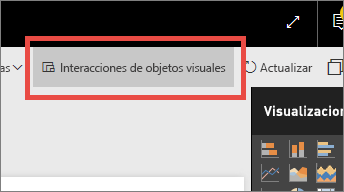

**Ilustración 34: Interacciones de objetos visuales**

Después, para cada objeto visual de la página, decida si quiere que el objeto visual seleccionado filtre, resalte o no haga ninguna acción. No se pueden resaltar todos los objetos visuales. Para los objetos visuales que no se pueden resaltar, el control de resaltado no estará disponible. Para obtener más información, consulte [Interacciones de objetos visuales en Power BI](../consumer/end-user-interactions.md).

> [!TIP]
> Para los lectores que empiecen a usar Power BI, la capacidad para seleccionar e interactuar con los informes puede que no sea obvia en un primer momento. Agregue cuadros de texto para ayudarlos a comprender dónde pueden seleccionar clic para ver más información.

#### <a name="the-use-of-color-in-visuals"></a>Uso de colores en objetos visuales

Anteriormente en este artículo, explicamos la importancia de tener un plan para usar los colores en un informe. En esta sección se repetirá parte de la información, pero principalmente se explicará cómo usar el color en objetos visuales individuales. Se aplican los mismos principios: use el color para vincular el informe, agregar énfasis a datos importantes y mejorar la comprensión del lector del objeto visual. Usar demasiados colores distintos puede resultar confuso. Hace que sea difícil para el lector saber dónde mirar. No sacrifique la comprensión por el atractivo. Agregue colores solo si mejoran la comprensión.

> [!TIP]
> Conozca a su público y las reglas de colores correspondientes. Por ejemplo, en Estados Unidos, el verde suele significar "bueno" y, el rojo, "malo".

En las secciones siguientes se tratan estos temas:

* Color de los datos

* Color de las etiquetas de datos

* Color de valores categóricos

* Color de valores numéricos

##### <a name="use-colors-to-highlight-interesting-data"></a>Usar los colores para resaltar datos interesantes

La forma más sencilla de usar colores es cambiar uno o más colores de un punto de datos para llamar la atención sobre él. En este ejemplo, el color cambia cuando los Juegos Olímpicos pasaron de un ciclo de 4 años a un ciclo de 2 años alternando los juegos de verano y de invierno.


**Ilustración 35: Usar colores para contar una historia**

Puede cambiar los colores de los puntos de datos en la pestaña **Colores de datos** del panel **Formato**. Para personalizar cada punto de datos de forma individual, asegúrese de que la opción **Mostrar todo** esté establecida en **Activado**.

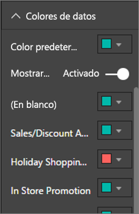

**Ilustración 36: Establecer los colores de un punto de datos**

> [!NOTE]
> Power BI aplica un tema predeterminado a los objetos visuales de un informe. Los diseñadores eligieron los colores del tema para proporcionar variedad y contraste. Para elegir otro color que no esté en la paleta de temas predeterminados, seleccione **Color personalizado**.
>
> 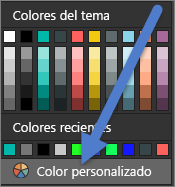
>
> **Ilustración 37: Seleccionar un color personalizado**

En Power BI Desktop, incluso puede resaltar **Valores atípicos** o la sección de una línea mediante una segunda serie:


**Ilustración 38: Usar Power BI Desktop para representar valores atípicos**

Aquí, los valores de la serie **Valores atípicos** solo existen cuando la temperatura media de agosto desciende por debajo de 60 °F. Para hacer esto, se crea una columna calculada de DAX con esta fórmula:

```
Outliers = if(Editions[Temp]<60, Editions[Temp], BLANK())
```

En nuestro ejemplo, existían tres valores atípicos: **1952**, **1956** y **2000**.

##### <a name="colors-for-labels-and-titles"></a>Colores para etiquetas y títulos

A medida que explore todas las opciones de formato disponibles, encontrará diferentes lugares donde puede agregar color a títulos y leyendas. Por ejemplo, puede cambiar el color de las etiquetas de datos y de los títulos de los ejes. Aunque tenga cuidado. Como norma general, use un solo color para todos los títulos de objetos visuales. Igual que con las otras directrices de este artículo, siempre hay situaciones y motivos para saltarse las reglas. Si decide hacerlo, hágalo por una buena razón.

##### <a name="colors-for-categorical-values"></a>Colores para valores categóricos

Los gráficos con una serie suelen tener un valor categórico en la leyenda. Por ejemplo, cada color de la leyenda siguiente representa una categoría distinta de países o regiones.


**Ilustración 39: Colores predeterminados aplicados**

Los diseñadores eligieron los colores predeterminados que usa Power BI para ofrecer una buena separación de colores entre valores de categorías para que se puedan distinguir fácilmente. A veces, los usuarios cambian estos colores para que coincidan con la combinación de colores corporativa, pero esto puede causar problemas.


**Ilustración 40: Color aplicado como matices de un único color**

Al usar un mismo matiz y variar la intensidad del color, este objeto visual ha introducido una falsa sensación de orden entre las categorías. Da a entender que las burbujas más oscuras son más altas o bajas en una escala determinada que los matices más claros. Aparte del orden alfabético, no suele haber un orden específico en este tipo de valor categórico.

Para cambiar los colores predeterminados, seleccione  para abrir el panel **Formato** y seleccione **Colores de datos**.

##### <a name="colors-for-numerical-values"></a>Colores para valores numéricos

Para los campos que tienen un orden y un valor numérico específicos, también puede asignar colores a los puntos de datos por el valor. Colorear los puntos de datos por valor puede ser útil para mostrar la propagación de valores entre los datos y también para permitir que Power BI muestre dos variables en un único gráfico. En el siguiente gráfico se indica claramente que, aunque China tiene el mayor número de medallas, Japón y Tailandia han participado en más Juegos Olímpicos.


**Ilustración 41: Puntos de datos de color por valor**

Para crear este gráfico:

1. Seleccione un objeto visual para activarlo.

1. Seleccione  para abrir el panel **Formato**.

1. Seleccione **Colores de datos** > opción > **Formato condicional**:

    

    **Ilustración 42: Seleccionar formato condicional**

1. Ajuste esos colores en el cuadro de diálogo **Color predeterminado - *Colores de datos*** .

    

    **Ilustración 43: Ajustar los colores usados para la saturación**

El color también se puede usar para enfatizar una desviación en torno a un valor central. Por ejemplo, se pueden colorear los valores positivos en verde y los valores negativos en rojo. Tenga en cuenta las diferencias culturales al asignar colores a valores positivos o negativos. No todas las referencias culturales usan rojo para malo y verde para bueno.


**Ilustración 44: Color para enfatizar la desviación en torno a un valor central**

### <a name="principles-of-visual-design--applied-to-example-report-page"></a>Principios del diseño de objetos visuales: aplicado en una página del informe de ejemplo

Ahora, veamos los principios visuales que explicamos anteriormente y vamos a aplicarlos en nuestro informe de ejemplo.


**Ilustración 45: Nuestro informe de ejemplo (antes)**


**Ilustración 46: Nuestro informe de ejemplo (después)**

#### <a name="what-did-we-do"></a>¿Qué hemos hecho?

| Artículo | Descripción |
| ---- | ----------- |
| Segmentación | Hemos quitado los espacios en blanco de las segmentaciones agregando un filtro de nivel de página y seleccionando solo **oro**, **plata** y **bronce**. <br> Hemos **desactivado** los **Controles de selección** para **Selección única** y **Seleccionar todo**. |
| Burbuja | Hay tantos elementos en la leyenda que se desplazan fuera de la pantalla. Hemos quitado la leyenda y hemos activado las **Etiquetas de categoría** en su lugar. Los clientes pueden mantener el mouse sobre las burbujas para ver los detalles.<br> Hemos abreviado el título y hemos quitado "por país o región", ya que parece evidente. <br> Hemos **activado** las etiquetas de los dos ejes para que el gráfico se entienda mejor. |
| Mapa coroplético | Hemos cambiado los **Colores de datos** para que destaquen más. <br> Hemos activado la opción **Divergente** y hemos establecido el **Mínimo** en rosa y el **Máximo** en rojo.
| Gráfico de rectángulos | Hemos quitado el filtro que se establecía solo para Estados Unidos. <br> Hemos establecido las **Etiquetas de datos** en una posición decimal. <br> El objeto visual usaba el campo **Clase**, que no es útil, ya que casi siempre será un 33% para las 3 medallas: Oro, plata y bronce. <br> Hemos seleccionado un campo distinto más interesante: **Sexo**. Hemos cambiado Natación al color azul y Atletismo a gris por cuestiones de diseño.
| Gráfico de barras superior | Hemos acortado el título, hemos quitado las etiquetas de datos y hemos desactivado el título de la leyenda. <br> Hemos cambiado el orden de las palabras del título para que coincidan con el gráfico siguiente.
| Gráfico de barras inferior | Está en orden ascendente por años, para que coincida con el gráfico anterior. <br> Se han cambiado los colores para que coincidan con la clase. <br> Se ha cambiado el título. <br> Se ha desactivado la leyenda para tener más espacio para los datos. <br> Activar las etiquetas de datos No se mostrarán en el informe porque el objeto visual es demasiado pequeño para que las etiquetas sean fáciles de leer. Se mostrarán cuando el lector abra el objeto visual en modo **Foco**. Obtenga información sobre el [modo Foco](../consumer/end-user-focus.md). <br> Se ha agregado el **número de eventos (distinto)** a **Información sobre herramientas**. Ahora, cuando mantiene el mouse sobre una columna apilada, la información sobre herramientas también indica en cuántos eventos compitieron las personas ese año. |
| Interacciones de objetos visuales | Se han desactivado las interacciones para las dos tarjetas, ya que queremos que siempre se muestre el total de juegos y deportes. |

## <a name="visual-types-and-best-practices"></a>Tipos de objetos visuales y procedimientos recomendados

Power BI proporciona de forma nativa muchos tipos de objetos visuales. Se ha agregado la lista de objetos visuales personalizados disponibles en Microsoft y en la comunidad de Power BI, aunque las opciones totales de objetos visuales son demasiado extensas para explicarlas aquí. Veamos algunos de los tipos de objetos visuales nativos más usados.

### <a name="line-charts"></a>Gráficos de líneas


Los gráficos de líneas son una forma eficaz de analizar datos en un período de tiempo. Ver los datos en tablas no tiene realmente ninguna ventaja en relación con la velocidad con que los ojos identifican picos, valles, ciclos y patrones. En el ejemplo siguiente se muestran las tendencias en el número de medallas otorgadas y el número de atletas que ganaron esas medallas.


**Ilustración 47: Gráficos de líneas**

#### <a name="best-practices"></a>Procedimientos recomendados

* Cuando los usuarios vean los gráficos de líneas, lo primero que verán es la forma de la curva. Así que necesita tener un eje X que dé significado a la curva, como categorías de tiempo o distribución. Si usa campos de categoría como producto o geografía en el eje X, el gráfico de líneas no será interesante, ya que la forma de la curva no proporcionará ninguna información significativa.

* Si decide colocar varios gráficos encima o debajo de otros, como se muestra aquí, para facilitar la comparación de varias series, alinéelos con el eje X. Use filtros para asegurarse de que Power BI muestre el mismo intervalo de valores. Si examina los intervalos de fechas, asegúrese de que coincidan. Por ejemplo, de 1896 a 2012 en los dos gráficos.

* Use el espacio siempre que sea posible. Si tiene sentido para sus datos, establezca los puntos de **Inicio** y **Finalización** del eje Y para eliminar los espacios en blanco en la parte superior e inferior del gráfico. También ayuda al objeto visual a centrarse en los puntos de datos reales. Para establecer los puntos de **Inicio** y **Finalización**:

  1. Seleccione un objeto visual para activarlo.

  1. Seleccione  para abrir el panel **Formato**.
  
  1. Expanda el área **Eje Y** y establezca los puntos de **Inicio** y **Finalización**.
  
      
  
      **Ilustración 48: Establecer los puntos de inicio y finalización**

* Otro motivo para establecer de forma explícita los puntos de **Inicio** y **Finalización** es si quiere comparar dos o más gráficos en la misma página con el mismo campo del eje Y. Por ejemplo, al ver números de eventos acumulativos, si Reino Unido tiene un intervalo de 1 a 70 y Australia tiene un intervalo de 1 a 12, en los dos gráficos de líneas se mostrarán ejes Y muy distintos (ilustración 49). Esto dificulta la comparación a simple vista. En su lugar, configure los gráficos para usar el mismo intervalo del eje Y (ilustración 50).
  
  
  
  **Ilustración 49: Gráficos de líneas con diferentes ejes Y**
  
  
  
  **Figura 50: Gráficos de líneas con ejes Y coincidentes**

Para obtener más información, consulte:

* [Personalización de las propiedades de los ejes X e Y](power-bi-visualization-customize-x-axis-and-y-axis.md)

* [Line Graphs and Irregular Intervals: An Incompatible Partnership](http://www.perceptualedge.com/articles/visual_business_intelligence/line_graphs_and_irregular_intervals.pdf) (Gráficos de líneas e intervalos irregulares: una asociación incompatible)

* [Visualización de datos 101: Gráficos de líneas](http://www.columnfivemedia.com/data-visualization-101-line-charts)

### <a name="bar-and-column-charts"></a>Gráficos de barras y columnas


Si los gráficos de líneas son la norma para analizar datos en un período de tiempo, los gráficos de barras son la norma para analizar un valor específico en diferentes categorías. Si ordena las barras según el número, verá al instante los principales valores y su distribución. Los gráficos de barras horizontales son adecuados para las etiquetas más largas.


**Ilustración 51: Gráfico de barras horizontales**

#### <a name="best-practices"></a>Procedimientos recomendados

* Muestre etiquetas de datos para los valores. Esto permite identificar fácilmente valores específicos. Para mostrar las etiquetas de datos: 

  1. Seleccione un objeto visual para activarlo.

  1. Seleccione  para abrir el panel **Formato**.
  
  1. Establezca **Etiquetas de datos** en **Activado**.

      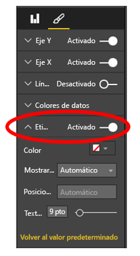

      **Ilustración 52: Activar las etiquetas de datos**

* El gráfico de barras anterior es útil para comparar una medida con otras en un momento específico. Aunque en el gráfico de líneas se mostraba la tendencia en un período de tiempo, en el gráfico de barras se muestra la tendencia de una única categoría en un momento específico. A simple vista, en el gráfico de barras se muestra que España tiene una de las peores tasas de desempleo del mundo, con un 24,70 %.

* Cuando todo un gráfico de columnas o barras no se puede colocar en el espacio asignado, Power BI agrega barras de desplazamiento. Cuando sea posible y, si tiene sentido, estructure el objeto visual y el informe para mostrar todo el gráfico; de esta forma, el lector obtendrá información general sobre toda la distribución. Pero esto no es posible en nuestro ejemplo debido al número elevado de países en todo el mundo.

  Una forma de limitar los valores incluidos es usar un filtro. Por ejemplo, agregue un filtro de **nivel de objeto visual** que muestre el país solo si la tasa de desempleo es superior al 20 %.

* Puede explorar en profundidad (y rastrear agrupando datos) en barras y gráficos de columnas. Esta es una excelente manera de comprimir más información en un objeto visual sin ocupar más espacio. El ejemplo siguiente tiene una jerarquía de Regiones > Países. Al hacer doble clic en una barra de región, se exploran en profundidad los países que componen esa región. Para obtener más información sobre el modo detallado, consulte [Modo detallado en una visualización de Power BI](../consumer/end-user-drill.md).
  
  
  
  **Ilustración 53: Explorar en profundidad**

Para obtener más información sobre los gráficos de columnas y barras:

* [Visualización de datos 101: Iniciación a los gráficos de barras](http://blog.newscred.com/article/data-visualization-101-bar-charts)

* [Catálogo de visualización de datos: gráfico de barras](http://www.datavizcatalogue.com/methods/bar_chart.html#.VYV-hY3bLJw)

* [Catálogo de visualización de datos: gráfico de barras de conjunto múltiple](http://www.datavizcatalogue.com/methods/multiset_barchart.html#.VYV_gI3bLJw)

### <a name="stacked-bar-and-column-charts"></a>Gráficos apilados de barras y columnas


Para agregar otra dimensión a sus gráficos de columnas y barras, puede apilar diferentes categorías en la barra o columna. En el gráfico se muestra información sobre una tendencia general (según el alto y la longitud), pero también se muestra la influencia de las categorías en esa tendencia. En el gráfico siguiente se muestra el crecimiento general de los ingresos del principal equipo de fútbol por encima de 6000 millones en 2014.


**Ilustración 54: Gráfico de columnas apiladas**

En este gráfico de columnas apiladas se muestra que el **Total de ingresos** crece en un período de tiempo y que las categorías **Comercial** y **Difusión** aumentan de forma progresiva en un período de tiempo, lo que contribuye al aumento de los ingresos generales. Sin embargo, este gráfico no permite comparar fácilmente el impacto que tienen las tres categorías entre sí. Por ejemplo, ¿cómo se compara el crecimiento de Comercial con el crecimiento de Difusión o de Día del partido? Una mejor opción para estos datos, o un objeto visual complementario para estos datos, sería un gráfico de líneas.

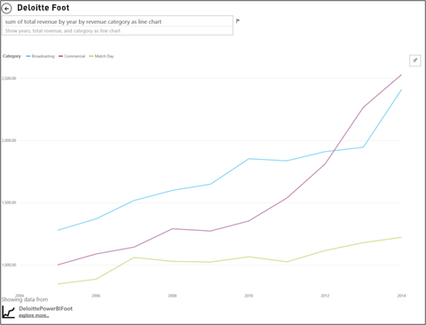

**Ilustración 55: Convertir a un gráfico de líneas**

En este gráfico de líneas se ve con mayor facilidad cómo han crecido la mayoría de los ingresos comerciales, seguidos de las difusiones y del día del partido.

#### <a name="best-practices"></a>Procedimientos recomendados

* Al igual que con los gráficos de columnas y barras, se pueden mostrar en horizontal o en vertical. Se recomienda mostrarlas en horizontal si tiene etiquetas largas y en vertical si tiene datos de series temporales.

* Evite usar gráficos de columnas o barras apiladas si quiere mostrar tendencias y otros patrones de cambio en un período de tiempo. Otros gráficos, como los gráficos de líneas, son más adecuados.

* También puede tener la distribución basándose en el volumen total o como un porcentaje del total.

* Como Few indicó:

    > *...es difícil comparar los segmentos de una barra apilada. Si los segmentos se han organizado en paralelo y todos han crecido hacia arriba desde la misma línea de base, será fácil comparar sus altos; pero, cuando se apilan uno encima de otro, la comparación resulta difícil. Además, aunque es bastante sencillo ver cómo han cambiado los ingresos de mes a mes, resulta difícil ver cómo han cambiado en las otras categorías*.

* Los gráficos apilados al 100 % son una buena opción cuando se usan porcentajes que suman hasta 100. En el ejemplo siguiente, vemos la distribución de categorías por equipos. Los porcentajes son relativos y nos permiten ver los patrones de un vistazo. Los ingresos de Everton proceden principalmente de la Difusión (más del 70 %), mientras que PSG solo obtiene un 20 % de sus ingresos de la Difusión. La opción de una visualización horizontal permite ajustar fácilmente las etiquetas de los equipos y ver el impacto según el tipo de ingresos.

  

  **Ilustración 56: Gráfico apilado horizontal**

Para obtener más información sobre los gráficos apilados:

* [Catálogo de visualización de datos: gráfico de barras apiladas](http://www.datavizcatalogue.com/methods/stacked_bar_graph.html#top)

* [¿Cuándo son útiles los gráficos de barras apiladas al 100 %?](http://www.perceptualedge.com/blog/?p=2239)

### <a name="combo-bar-and-column-charts"></a>Gráficos combinados de barras y columnas


En Power BI, puede combinar gráficos de líneas y columnas en un gráfico combinado. Las opciones son: 

* Gráfico de líneas y columnas apiladas 

* Gráfico de líneas y columnas agrupadas

Puede ahorrar espacio de lienzo si combina dos objetos visuales.

En las dos capturas de pantalla siguientes se muestra un ejemplo de antes y después.


 **Ilustración 57: Como dos gráficos separados**

El primero tiene dos objetos visuales distintos: un gráfico de columnas, donde se muestra la población en un período de tiempo, y un gráfico de líneas, donde se muestra el PIB en un período de tiempo. Estos gráficos son buenos candidatos para un gráfico combinado, ya que tienen el mismo eje X (año) y valores (de 2002 a 2012). ¿Por qué no combinarlos para comparar estas dos tendencias en un mismo objeto visual? La combinación de los dos gráficos permite comparar los datos más rápido.


 **Ilustración 58: Como un gráfico combinado**

La nueva página del informe tiene un solo objeto visual: un gráfico de líneas y columnas apiladas. Podríamos haber creado fácilmente un gráfico de líneas y columnas agrupadas. Ahora es más fácil identificar una relación entre las dos tendencias. Podemos ver que, hasta 2008, la población y el PIB han seguido una tendencia similar. Pero, a partir de 2009, a medida que se reducía el crecimiento de población, el PIB era más volátil.

#### <a name="best-practices"></a>Procedimientos recomendados

* Los gráficos combinados funcionan mejor cuando los dos objetos visuales tienen como mínimo un eje en común.

* No pierda de vista los ejes. ¿Se puede leer e interpretar fácilmente el gráfico combinado? ¿Usa intervalos y valores distintos? Si la escala del eje Y del gráfico de columnas es mucho más pequeña que la escala del eje Y del gráfico de líneas, el gráfico combinado no será significativo. Observe la tercera línea (color aguamarina) en la parte inferior.

   

   **Ilustración 59: Un gráfico de líneas incorrecto**

  De nuevo, el gráfico combinado no será significativo si el gráfico de columnas y el gráfico de líneas usan dos medidas distintas y no crea ejes dobles. Por ejemplo, una comparación de dólares y porcentaje. Asegúrese de incluir los dos ejes para ayudar al lector a comprender el gráfico y, si lo prefiere, puede agregar también etiquetas a los ejes.

  Para crear dos ejes:

    1. Seleccione un objeto visual para activarlo.

    1. Seleccione  para abrir el panel **Formato**.

    1. Expanda **Eje Y** y establezca **Mostrar secundario** en **Activado**.

          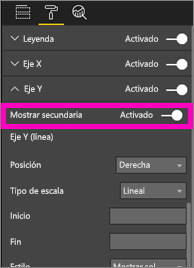

          **Ilustración 60: Mostrar eje secundario**

    1. Establezca **Eje Y (columna)**  > **Título** en **Activado**.

    1. Establezca **Eje Y (línea)**  > **Título** en **Activado**.

  Este es el aspecto que tendrá el gráfico:

  

  **Ilustración 61: Crear un gráfico combinado en su lugar**

* Aproveche los ejes dobles. Es una forma ideal de comparar varias medidas con distintos intervalos de valores. Para ayudar a ilustrar la correlación entre dos medidas en un objeto visual.

Para obtener más información:

* [Gráficos combinados en Power BI](power-bi-visualization-combo-chart.md)

* [Dual-Scaled Axes in Graphs: Are They Ever the Best Solution? ](http://www.perceptualedge.com/articles/visual_business_intelligence/dual-scaled_axes.pdf) (Ejes de escala doble en gráficos: ¿son siempre la mejor solución?)

### <a name="scatter-chart"></a>Gráfico de dispersión


A veces, si tenemos un gran número de variables que queremos ver de forma conjunta, un gráfico de dispersión puede ser una forma útil de obtener una idea general. Los gráficos de dispersión muestran relaciones entre 2 (dispersión) o 3 (burbuja) medidas cuantitativas. Un gráfico de dispersión siempre tiene dos ejes de valores con el fin de mostrar un conjunto de datos numéricos en un eje horizontal y otro conjunto de valores numéricos a lo largo de un eje vertical. El gráfico muestra puntos en la intersección de un valor numérico x e y, y combina estos valores en puntos de datos únicos. Power BI puede distribuir estos puntos de datos de manera uniforme o desigual a través del eje horizontal. Depende de los datos.

Un gráfico de burbujas reemplaza los puntos de datos con burbujas, cuyo tamaño representa una dimensión adicional de los datos.

En el gráfico de burbujas siguiente se muestra Sudamérica y se compara la suma del PIB per cápita (eje Y) del PIB (eje X) y la población por país de Sudamérica.


**Ilustración 62: PIB de Sudamérica y población como un gráfico de burbujas**

El tamaño de las burbujas representa el total de la población de ese país. Brasil tiene la población más elevada (tamaño de la burbuja) y el índice más alto de PIB de Sudamérica. Es el más alejado en el eje X. Pero tenga en cuenta que el PIB per cápita de Uruguay, Chile y Argentina es más elevado que el de Brasil. Están más arriba en el eje Y.

Si agrega un eje de reproducción, puede fingir que es Hans Rosling y contar la historia en un período de tiempo: [From Data to Insight & Impact: Showing Africa's Progress with Power View and PPI by Microsoft](https://www.youtube.com/watch?v=PbaDBJWCeD4) (Desde datos a conclusiones y efecto: presentación del progreso de África con Power View y PPI según Microsoft). Para agregar un eje de reproducción, arrastre un campo de fecha y hora en el **Eje de reproducción**.

#### <a name="best-practices"></a>Procedimientos recomendados

* Los gráficos de burbujas y de dispersión son ideales para los narradores. Pero no son tan útiles cuando se intentan explorar los datos. Stephen Few lo señala:

    > *La fuerza de este enfoque radica en su uso para contar una historia. Cuando Rosling narra lo que ocurre en el gráfico a medida que las burbujas se desplazan y cambian los valores, indicando lo que quiere que veamos, la información cobra vida. Pero los gráficos de burbujas animados son mucho menos efectivos para explorar y comprender los datos en sí. Dudo que Rosling use este método para descubrir las historias, sino más bien para contarlas cuando ya las conozca. No se puede mostrar más de una burbuja de forma simultánea cuando están en movimiento, por lo que tenemos que ejecutar la animación varias veces e intentar comprender lo que ocurre. Podemos agregar trazos a las burbujas seleccionadas, lo que nos permitiría revisar la ruta completa que han realizado las burbujas; pero, si los trazos se usan con más de unas pocas burbujas, el gráfico quedará rápidamente desorganizado. Básicamente, quiero decir que no es la mejor forma de mostrar esta información para la exploración y el análisis.*

* Agregue etiquetas a los ejes X e Y para contar la historia. Especialmente con los gráficos de burbujas, hay muchos componentes en juego y las etiquetas ayudan a los lectores a comprender el objeto visual.

* Agregue etiquetas de datos para que los objetos visuales se interpreten con mayor facilidad. Especialmente con gráficos de burbujas, si tiene un gran número de elementos en la leyenda, puede resultar difícil distinguir colores similares. En el objeto visual anterior, los colores de la leyenda para Surinam, Colombia y Ecuador son muy parecidos.

* ¿Ha creado un gráfico de dispersión y solo ve un punto de datos que suma todos los valores en los ejes X e Y? ¿El gráfico agrega todos los valores a lo largo de una sola línea horizontal o vertical? Para solucionar este problema, agregue un campo al área **Detalles** para indicar a Power BI cómo quiere agrupar los valores. El campo debe ser único para cada punto que quiera trazar. Para obtener ayuda, vea el [Tutorial sobre gráficos de burbujas y dispersión de Power BI](power-bi-visualization-scatter.md).

### <a name="treemap-charts"></a>Gráfico de rectángulos


Los gráficos de rectángulos pueden ser útiles para mostrar información general sobre el tamaño relativo de diferentes componentes de un todo (especialmente, si se agrupan por categorías). Cada vez que intente comprender un nuevo negocio, tener un gráfico de rectángulos de los componentes principales puede ser muy útil para conocer la distribución general.

A continuación, puede ver inmediatamente en el primer gráfico que Brasil tiene aproximadamente la mitad del PIB de Sudamérica. También puede ver que Columbia y Chile tienen aproximadamente el mismo tamaño.

Supongamos que quiere tener más contexto y seguir teniendo una idea del impacto de los principales países contribuyentes. Cree jerarquías visuales con miembros de categoría (países) anidados dentro de regiones. Principalmente, el segundo gráfico de rectángulos nos da una idea del tamaño relativo de las regiones. Luego, dentro de cada región, podemos ver cuáles son los países que más contribuyen. Podemos ver que hay tres regiones de gran tamaño: Europa, Asia y Norteamérica. Dentro de esas regiones, podemos ver fácilmente los principales países y regiones.

La limitación principal de un gráfico de rectángulos es que resulta difícil comparar los rectángulos más pequeños. Es un buen gráfico para obtener información general, pero los gráficos de barras y columnas suelen ser una mejor opción para tener una idea más precisa del tamaño relativo de diferentes componentes.

El primer gráfico de rectángulos ofrece una indicación general del orden del tamaño del PIB. Sin embargo, es difícil identificar diferencias específicas entre países, especialmente las hojas más pequeñas sin etiqueta. Para estos datos, cuando se compara una sola agrupación, un gráfico de barras o columnas podría ser una mejor opción.


**Ilustración 63: Comparación del PIB en Sudamérica como un gráfico de rectángulos**

A continuación, hemos agregado región como otro nivel de datos. Podemos ver la contribución general al PIB por regiones. Además, podemos ver el impacto relativo dentro de las regiones. Tenga en cuenta que, al hacer esto con una medida no sumativa (como las medias), puede que la suma de los detalles no represente el valor real en el nivel del agregado.


**Ilustración 64: PIB por región y país como un gráfico de rectángulos**

Para obtener más información sobre los gráficos de rectángulos:

* [Discovering Business Intelligence Using Treemap Visualizations](http://www.perceptualedge.com/articles/b-eye/treemaps.pdf) (Detección de inteligencia empresarial con las visualizaciones del gráfico de rectángulos)

* [Catálogo de visualización de datos: gráfico de rectángulos](http://www.datavizcatalogue.com/methods/treemap.html#.VYhylI3bL7Y)

### <a name="other-charts"></a>Otros gráficos

#### <a name="pie-or-donut-charts"></a>Gráficos de anillos o circulares


En general, los gráficos de líneas, columnas o barras serán adecuados para fines más generales. Se entiende que los gráficos de anillos o circulares resultan difíciles de interpretar correctamente. De hecho, a menudo pueden distorsionar los datos. Evítelos siempre que sea posible. Stephen Few describe de forma excelente la historia y los peligros en [Save the Pies for Dessert](https://www.perceptualedge.com/articles/08-21-07.pdf).

Explica la única vez en que los gráficos circulares pueden ser útiles: al comparar las relaciones de una parte con un entero. Rara vez es mejor que un gráfico de barras apiladas 100 %.

Otro artículo interesante (con una animación) sobre los gráficos circulares se encuentra en el [sitio de Darkhorse Analytics](http://www.darkhorseanalytics.com/blog/salvaging-the-pie).

#### <a name="radial-gauges--kpis"></a>Medidores radiales y KPI


Los medidores radiales parecen objetos visuales adecuados para indicar el rendimiento en relación con un objetivo y son muy populares en los paneles ejecutivos. Pero tienen dos inconvenientes principales. Al igual que con los gráficos circulares, resulta difícil interpretar el ángulo del área sombreada en comparación con el arco de 180 grados o con la línea del objetivo. Además, usan una gran cantidad de espacio para mostrar una sola métrica.

Una buena alternativa es un objeto visual de KPI sencillo:


En los KPI se muestra el valor, el estado, el objetivo y la desviación del objetivo, así como la tendencia, con la misma cantidad de espacio. El color verde se vuelve rojo si los datos no cumplen el objetivo y puede ser amarillo si los datos satisfacen un objetivo intermedio. Es mucho más fácil de leer e interpretar que el indicador.

Para obtener más información, consulte:

* [Gráficos de medidor radial en Power BI](power-bi-visualization-radial-gauge-charts.md)

* [Objetos visuales de KPI](power-bi-visualization-kpi.md)

## <a name="conclusion"></a>Conclusión

Ahora es el momento de poner en práctica estos procedimientos recomendados en la prueba. Siga en contacto y comparta sus propios procedimientos recomendados. ¿No está de acuerdo con nuestras recomendaciones o encontró otro motivo ideal para saltarse las reglas? Nos encantaría conocer también estas experiencias.

¿Tiene más preguntas? [Pruebe la comunidad de Power BI](http://community.powerbi.com/)

### <a name="book-recommendations"></a>Libros recomendados

Existen muchos libros actualmente para ayudar a los equipos a mejorar su conocimiento de las técnicas de diseño de objetos visuales. El libro *Information Dashboard Design* de Stephen Few es una lectura imprescindible. El autor indaga con más detalle en otros dos libros: *Show Me the Numbers* y *Now You See It*. Few y otros han recibido la inspiración de Edward R. Tufte, cuyo libro *The Visual Display of Quantitative Information* se considera un clásico en el campo. Tufte también ha escrito *Visual Explanations*, *Envisioning Information* y *Beautiful Evidence*. El nuevo libro de Andy Kirk *Data Visualization: A Handbook for Data Driven Design* (Visualización de datos: manual para el diseño basado en datos) es otra gran opción. Otros autores recomendados son: Lachlan James, William McKnight, and Boris Evelson (Forrester), Darkhorse Analytics.
