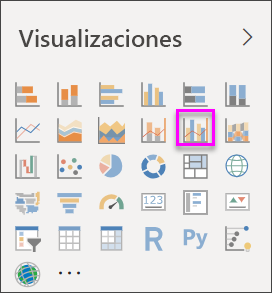
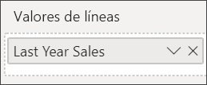
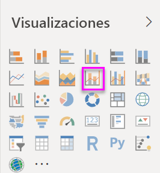
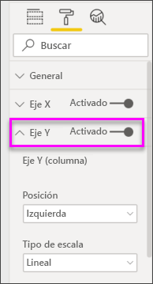
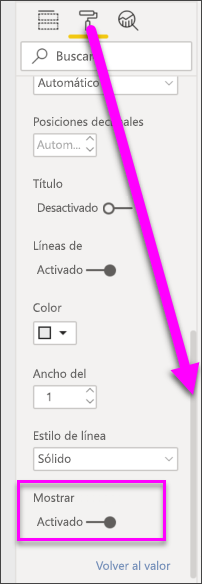

# Gráficos combinados en Power BI

[!INCLUDE [power-bi-visuals-desktop-banner](../includes/power-bi-visuals-desktop-banner.md)]

En Power BI, un gráfico combinado es una visualización única que combina un gráfico de líneas y un gráfico de columnas. La combinación de los dos gráficos en uno permite realizar una comparación más rápida de los datos.

Los gráficos combinados pueden tener uno o dos ejes Y.

## Cuándo usar un gráfico combinado
Los gráficos combinados son una excelente opción:

* Si tiene un gráfico de líneas y un gráfico de columnas con el mismo eje X.
* Para comparar varias medidas con distintos intervalos de valores.
* Para ilustrar la correlación entre dos medidas en una visualización.
* Para comprobar si una medida cumple el objetivo que se define mediante otra medida.
* Para ahorrar espacio en el lienzo.

### Requisitos previos
En este tutorial se usa el [archivo PBIX del Ejemplo de análisis de minoristas](http://download.microsoft.com/download/9/6/D/96DDC2FF-2568-491D-AAFA-AFDD6F763AE3/Retail%20Analysis%20Sample%20PBIX.pbix).

1. En la sección superior izquierda de la barra de menús, seleccione **Archivo** > **Abrir**.
   
2. Busque la copia del **archivo PBIX del Ejemplo de análisis de minoristas**.

1. Abra el **archivo PBIX del Ejemplo de análisis de minoristas** en la vista de informe .

1. Seleccionar  para agregar una nueva página.

## Crear un gráfico combinado básico con un eje único
Vea cómo Will crea un gráfico combinado con el Ejemplo de marketing y ventas.
   > [!NOTE]
   > En este vídeo se usa una versión anterior de Power BI Desktop.
   > 
   > 
<iframe width="560" height="315" src="https://www.youtube.com/embed/lnv66cTZ5ho?list=PL1N57mwBHtN0JFoKSR0n-tBkUJHeMP2cP" frameborder="0" allowfullscreen></iframe>  

1. Empiece en una página de informe en blanco y cree un gráfico de columna que muestre las ventas de este año y el margen bruto por mes.

    a.  En el panel Campos, seleccione **Ventas** \> **Ventas de este año** > **Valor**.

    b.  Arrastre **Ventas** \> **Margen bruto de este año** al área **Valor**.

    c. Seleccione **Time** \> **FiscalMonth** para agregarlo al área **Eje**.

    
5. Haga clic en los puntos suspensivos (...) de la esquina superior derecha de la visualización y seleccione **Ordenar por > MesFiscal**. Para cambiar el criterio de ordenación, vuelva a hacer clic en los puntos suspensivos y elija **Orden ascendente** u **Orden descendente**. En este ejemplo, se usará **Orden ascendente**.

6. Convierta el gráfico de columnas en un gráfico combinado. Hay dos gráficos combinados disponibles: **Gráfico de columnas apiladas y de líneas** y **Gráfico de columnas agrupadas y de líneas**. Con el gráfico de columnas seleccionado, en el panel **Visualizaciones**, seleccione el **Gráfico de columnas agrupadas y de líneas**.

    
7. En el panel **Campos**, arrastre **Ventas** \> **Ventas del último año** al cubo **Valores de línea**.

   

   El gráfico combinado debe tener un aspecto similar al siguiente:

   

## Crear un gráfico combinado con dos ejes
En esta tarea, compararemos el margen bruto y las ventas.

1. Cree un nuevo gráfico de líneas que realice un seguimiento del **Porcentaje de margen bruto del último año** por **FiscalMonth**. Haga clic en los puntos suspensivos para ordenar por **Mes** y **Ascendente**.  
En enero el porcentaje de margen bruto fue de un 35 %, en abril alcanzó un máximo de un 45 %, en julio descendió y luego volvió a alcanzar otro máximo en agosto. ¿Se verá un patrón similar en las ventas del año anterior y este año?

   
2. Agregue **Ventas de este año > Valor** y **Ventas del último año** al gráfico de líneas. La escala de **porcentaje de margen bruto del último año** es mucho menor que la escala de **Ventas**, lo que dificulta la comparación.      

   
3. Para que el objeto visual sea fácil de leer e interpretar, convierta el gráfico de líneas en un gráfico de columnas apiladas y de líneas.

   

4. Arrastre el **Porcentaje de margen bruto del último año** de **Valores de columnas** a **Valores de líneas**. Power BI crea dos ejes, lo que permite escalar los conjuntos de datos de forma distinta; el izquierdo mide ventas en dólares y el derecho mide porcentajes. Y vemos la respuesta a nuestra pregunta; sí, vemos un patrón similar.

       

## Agregar títulos a los ejes
1. Seleccione el icono de rodillo de pintura 
1.  para abrir el panel Formato.
1. Seleccione la flecha hacia abajo para expandir las opciones del **eje Y** .
1. Para **Eje Y (columna)** , establezca **Posición** en **Izquierda**, **Título** en **Activado**, **Estilo** en **Mostrar solo el título** y **Mostrar unidades** en **Millones**.

   
4. En **Eje Y (columna)** , desplácese hacia abajo hasta que vea **Mostrar secundario**. Dado que hay tantas opciones para los ejes Y, puede que tenga que usar ambas barras de desplazamiento. La sección Mostrar secundario muestra opciones para dar formato a la parte de gráfico de líneas del gráfico combinado.

   
5. Para **Eje Y (línea)** , deje **Posición** como **Derecha**, establezca **Título** como **Activado** y **Estilo** como **Mostrar solo el título**.

   El gráfico combinado ahora muestra los dos ejes, ambos con títulos.

   

6. Si lo desea, modifique la fuente, tamaño y color del texto y establezca otras opciones de formato para mejorar la legibilidad del gráfico y la presentación.

Desde aquí puede realizar las siguientes acciones:

* [Agregue el gráfico combinado como un icono de panel](../service-dashboard-tiles.md).
* [Guarde el informe](../service-report-save.md).
* [Haga que el informe sea más accesible para personas con discapacidades](../desktop-accessibility.md).

## Resaltado cruzado y filtrado cruzado

Al resaltar una columna o una línea en un gráfico combinado, se realiza un resaltado cruzado y un filtrado cruzado de las demás visualizaciones en la página del informe y viceversa. Para cambiar este comportamiento predeterminado, use [Interacciones de objetos visuales](../service-reports-visual-interactions.md).

## Pasos siguientes

[Gráficos de anillos en Power BI](power-bi-visualization-doughnut-charts.md)

[Tipos de visualización en Power BI](power-bi-visualization-types-for-reports-and-q-and-a.md)
