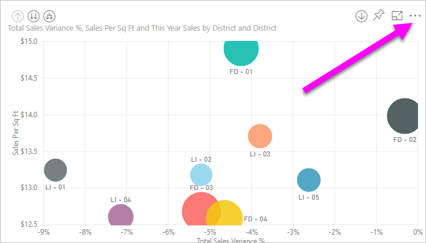
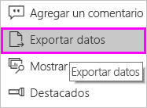
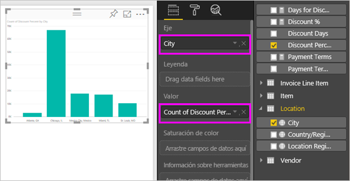
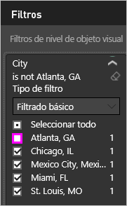
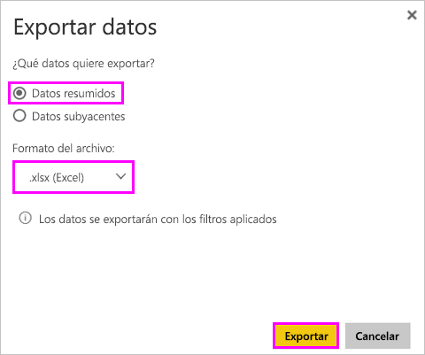
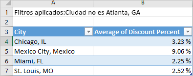
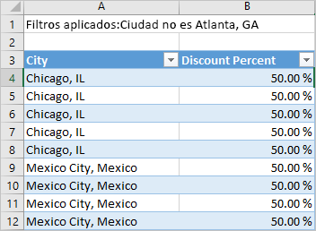

# Exportar datos de visualizaciones

Si quiere ver los datos que Power BI usa para crear una visualización, [puede mostrar dichos datos en Power BI](service-reports-show-data.md). También puede exportar los datos a Excel como un archivo *.xlsx* o *.csv*. La opción de exportar los datos requiere una licencia Pro o Premium y editar los permisos del conjunto de datos y del informe.

Observe cómo Will exporta los datos de una de las visualizaciones de su informe, los guarda como un archivo *.xlsx* y los abre en Excel. Luego, siga las instrucciones paso a paso que aparecen debajo del vídeo para intentarlo.

<iframe width="560" height="315" src="https://www.youtube.com/embed/KjheMTGjDXw" frameborder="0" allowfullscreen></iframe>

## Exportación de datos desde un panel de Power BI

1. Seleccione los puntos suspensivos de la esquina superior derecha de la visualización.

    

1. Elija el icono **Exportar datos**.

    

1. Power BI exporta los datos a un archivo *.csv*. Si ha filtrado la visualización, la aplicación filtrará los datos descargados.

1. El explorador le pedirá que guarde el archivo.  Una vez que lo haya guardado, abra el archivo *.csv* en Excel.

    

## Exportación de datos desde un informe

Para poder continuar, abra el [informe de ejemplo de análisis de adquisiciones](../sample-procurement.md) en la vista de edición. Agregue una nueva página de informe en blanco. A continuación, siga estos pasos para agregar una agregación y un filtro de nivel de visualización.

1. Cree un nuevo **gráfico de columnas apiladas**.

1. En el panel **Campos**, seleccione **Ubicación > Ciudad** y **Factura > Porcentaje de descuento**.  Puede que tenga que mover **Porcentaje de descuento** a **Valor**.

    

1. Cambie la agregación de **Porcentaje de descuento** de **Recuento** a **Media**. En **Valor**, seleccione la flecha situada a la derecha de **Porcentaje de descuento** (es posible que ponga **Recuento de porcentaje de descuento**) y elija **Media**.

    

1. Agregue un filtro a **Ciudad**, seleccione todas las ciudades y luego quite **Atlanta**.

    

   Ahora ya puede probar ambas opciones de exportación de datos.

1. Seleccione los puntos suspensivos de la esquina superior derecha de la visualización. Seleccione **Exportar datos**.

    

    En Power BI en línea, si la visualización tiene un agregado (un ejemplo sería si ha cambiado **Recuento** a *Media*, *Suma* o *Mínimo*), tendrá dos opciones:

    - **Datos resumidos**

    - **Datos subyacentes**

    En Power BI Desktop, solo tendrá la opción de **Datos resumidos**. Para entender mejor los agregados, consulte [Agregados en Power BI](../service-aggregates.md).

1. Desde **Exportar datos**, seleccione **Datos resumidos**, elija *.xlsx* o *.csv*y luego seleccione **Exportar**. Power BI exporta los datos.

    

    Si aplicó filtros a la visualización, los datos exportados se exportarán como filtrados. Cuando seleccione **Exportar**, el explorador le pedirá que guarde el archivo. Una vez que lo haya guardado, abra el archivo en Excel.

    **Datos resumidos**: seleccione esta opción si quiere exportar los datos de lo que ve en ese objeto visual.  Este tipo de exportación muestra únicamente los datos (columnas y medidas) que eligió para crear el objeto visual.  Si el objeto visual tiene un agregado, se exportarán los datos agregados. Por ejemplo, si tiene un gráfico de barras que muestra cuatro barras, obtendrá cuatro filas de datos. Los datos resumidos están disponibles como *.xlsx* y *.csv*.

    En este ejemplo, la exportación a Excel muestra un total por cada ciudad. Puesto que se ha filtrado por Atlanta, no se incluye en los resultados. La primera fila de nuestra hoja de cálculo muestra los filtros que Power BI usó al extraer los datos.

    

1. Ahora pruebe a seleccionar **Datos subyacentes**, *.xlsx* y luego **Exportar**. Power BI exporta los datos. 

    > [!NOTE]
    > Según la configuración del informe, puede o no puede tener la opción para exportar los datos subyacentes.

    Si aplicó filtros a la visualización, los datos exportados se exportarán como filtrados. Cuando seleccione **Exportar**, el explorador le pedirá que guarde el archivo. Una vez que lo haya guardado, abra el archivo en Excel.

    >[!WARNING]
    >Al exportarse los datos subyacentes, se permite a los usuarios ver todos los datos detallados, es decir, todas las columnas de los datos. Los administradores del servicio Power BI pueden desactivar esta opción para su organización. Si es el propietario de un conjunto de datos, puede establecer las columnas de propiedad en **ocultas** para que no aparezcan en la lista **Campo** en el servicio de escritorio o Power BI.

    **Datos subyacentes**: seleccione esta opción si quiere ver los datos en el objeto visual ***y*** más datos del modelo (vea el gráfico de abajo para obtener más información). Si la visualización tiene un agregado, al seleccionar *Datos subyacentes* se quita el agregado. Cuando selecciona **Exportar**, Power BI exporta los datos a un archivo *.xlsx* y el explorador le pide que guarde el archivo. Una vez que lo haya guardado, abra el archivo en Excel.

    En este ejemplo, la exportación de Excel muestra una fila para cada fila de ciudad del conjunto de datos y el porcentaje de descuento para esa única entrada. Power BI aplana los datos. No los agrega. La primera fila de nuestra hoja de cálculo muestra los filtros que Power BI usó al extraer los datos.  

    

## Exportación de los detalles de los datos subyacentes

Lo que se muestra al seleccionar **Datos subyacentes** puede variar. Para comprender estos detalles, puede que sea necesaria la ayuda de su administrador o del departamento de TI. En Power BI Desktop o en el servicio, en la vista Informes, aparece una *medida* en la lista **Campos** con un icono de calculadora . Power BI Desktop crea medidas. El servicio Power BI no.

| Contenido del objeto visual | Información que se mostrará durante la exportación  |
|---------------- | ---------------------------|
| Agregados | *Primer* agregado y datos no ocultos de la tabla completa de dicho agregado |
| Agregados | Datos relacionados: si el objeto visual utiliza datos de otras tablas de datos que están *relacionadas* con la tabla de datos que contiene el agregado (siempre y cuando la relación sea\*:1 o 1:1) |
| Medidas | Todas las medidas en el objeto visual *y* todas las medidas de cualquier tabla de datos que contenga una medida usada en el objeto visual |
| Medidas | Todos los datos no ocultos de las tablas que contengan esa medida (siempre y cuando la relación sea \*:1 o 1:1) |
| Medidas | Todos los datos de todas las tablas relacionadas con la tabla o tablas que contengan las medidas a través de una cadena de tipo \*:1 o 1:1 |
| Solo medidas | Todas las columnas no ocultas de todas las tablas relacionadas (para expandir la medida) |
| Solo medidas | Datos resumidos de todas las filas duplicadas de medidas del modelo |

### Configuración de las opciones de exportación

Los diseñadores de informes de Power BI controlan los tipos de opciones de exportación de datos que están disponibles para sus consumidores. Las opciones son:

- Permitir a los usuarios finales exportar datos resumidos desde el servicio Power BI o Power BI Report Server

- Permitir a los usuarios finales exportar datos resumidos y subyacentes del servicio o Report Server

- No permitir a los usuarios finales exportar datos del servicio o Report Server

    > [!IMPORTANT]
    > Se recomienda que los diseñadores de informes revisen los informes antiguos y restablezcan manualmente la opción de exportación según sea necesario.

Para establecer estas opciones:

1. Empiece en Power BI Desktop.

1. En la esquina superior izquierda, seleccione **Archivo** > **Opciones y configuración** > **Opciones**.

1. En **ARCHIVO ACTUAL**, seleccione **Configuración del informe**.

    

1. Seleccione una opción en la sección **Exportar datos**.

También puede actualizar esta configuración en el servicio Power BI.

Es importante tener en cuenta que si la configuración del portal de administración de Power BI entra en conflicto con la configuración del informe para exportar datos, la configuración de administrador anulará la configuración de exportar datos.

## Limitaciones y consideraciones
Estas limitaciones y consideraciones se aplican a Power BI Desktop y el servicio Power BI, incluidos Power BI Pro y Premium.

- Para exportar los datos de un objeto visual, debe tener [permiso de compilación para el conjunto de datos subyacente](https://docs.microsoft.com/power-bi/service-datasets-build-permissions#build-permissions-for-shared-datasets).

-  El número máximo de filas que **Power BI Desktop** y el **servicio Power BI** pueden exportar desde un **informe de modo de importación** a un archivo *.csv* es 30 000.

- El número máximo de filas que las aplicaciones pueden exportar desde un **informe de modo de importación** a un archivo *.xlsx* es 150 000.

- La exportación mediante *Datos subyacentes* no funcionará si:

  - El origen de datos es una conexiones dinámica de Analysis Services.

  - La versión es anterior a 2016.

  - Las tablas del modelo no tienen una clave única.
    
  -  Si un administrador o diseñador de informes ha deshabilitado esta característica.

- La exportación utilizando *Datos subyacentes* no funcionará si habilita la opción *Mostrar elementos sin datos* para la visualización que Power BI está exportando.

- Cuando use DirectQuery, la cantidad máxima de datos que Power BI puede exportar es 16 MB de datos sin comprimir. Un resultado no deseado puede ser que exporte menos que el número máximo de filas. Esto es probable si:

    - Hay muchas columnas.

    - Hay datos que son difíciles de comprimir.

    - Hay otros factores que haya en juego que aumentan el tamaño del archivo y disminuyen el número de filas que Power BI puede exportar.

- Si la visualización emplea datos de más de una tabla de datos y no existe ninguna relación con esas tablas en el modelo de datos, Power BI solo exporta los datos de la primera tabla.

- Actualmente no se admiten objetos visuales personalizados ni objetos visuales de R.

- La exportación de datos no está disponible para aquellos usuarios de fuera de la organización que usan un panel que un usuario interno ha compartido con ellos.

- En Power BI, puede cambiarse el nombre de un campo (columna) haciendo doble clic en dicho campo y escribiendo un nuevo nombre. Power BI hace referencia al nuevo nombre como un *alias*. Es posible que un informe de Power BI pueda acabar con nombres de campo duplicados, pero Excel no permite duplicados. Por tanto, cuando Power BI exporta los datos a Excel, los alias de los campos cambian a sus nombres originales de campo (columna).  

- Si el archivo *.csv* incluye caracteres Unicode, es posible que el texto no se muestre correctamente en Excel. Algunos ejemplos de caracteres Unicode son los símbolos de moneda y palabras en otros idiomas. Puede abrir el archivo en el Bloc de notas y los caracteres Unicode se mostrarán correctamente. Si desea abrir el archivo en Excel, la solución alternativa consiste en importar el archivo *.csv*. Para importar el archivo en Excel:

  1. Abra Excel.

  1. Vaya a la ficha **Datos**.
  
  1. Seleccione **Obtener datos externos** > **Desde texto**.
  
  1. Vaya a la carpeta local donde se almacena el archivo y seleccione el archivo *.csv*.

- Los administradores de Power BI pueden deshabilitar la exportación de datos.

¿Tiene más preguntas? [Pruebe a preguntar a la comunidad de Power BI](http://community.powerbi.com/)
