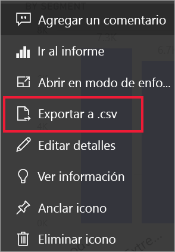
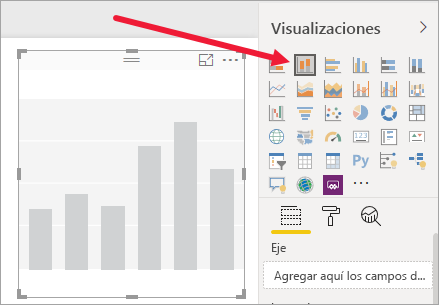
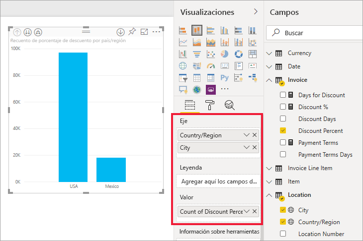
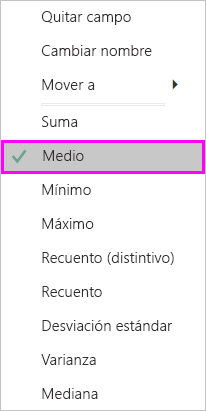
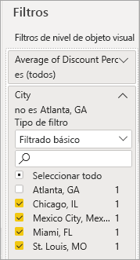

# Exportación de los datos usados para crear una visualización

> [!IMPORTANT]
> Los usuarios no pueden ver o exportar todos los datos. Existen medidas de seguridad que los diseñadores de informes y los administradores usan al crear paneles e informes. Algunos datos están restringidos u ocultos, o son confidenciales, y no se pueden visualizar ni exportar sin permisos especiales. 

## Quién puede exportar datos

Si tiene permisos para los datos, puede ver y exportar los datos que Power BI usa para crear una visualización. A menudo, los datos son confidenciales o están limitados a usuarios específicos. En esos casos, no podrá ver o exportar los datos. Para obtener más información, vea la sección **Limitaciones y consideraciones** al final de este documento. 

## Visualización y exportación de datos

Si quiere ver los datos que Power BI usa para crear una visualización, [puede mostrar dichos datos en Power BI](service-reports-show-data.md). También puede exportar los datos a Excel como un archivo *.xlsx* o *.csv*. La opción para exportar los datos requiere una licencia Pro o Premium, además de permisos de edición en el conjunto de datos y el informe. <!--If you have access to the dashboard or report but the data is classified as *highly confidential*, Power BI will not allow you to export the data.-->

Observe cómo Will exporta los datos de una de las visualizaciones de su informe, los guarda como un archivo *.xlsx* y los abre en Excel. Luego, siga las instrucciones paso a paso que aparecen debajo del vídeo para intentarlo. Tenga en cuenta que en este vídeo se usa una versión anterior de Power BI.

<iframe width="560" height="315" src="https://www.youtube.com/embed/KjheMTGjDXw" frameborder="0" allowfullscreen></iframe>

## Exportación de datos desde un panel de Power BI

1. Seleccione Más acciones (...) en la esquina superior derecha de la visualización.

    

1. Elija la opción **Exportar a .csv**.

    

1. Power BI exporta los datos a un archivo *.csv*. Si ha filtrado la visualización, también se filtrará la exportación a .csv. 

1. El explorador le pedirá que guarde el archivo.  Una vez que lo haya guardado, abra el archivo *.csv* en Excel.

    

## Exportación de datos desde un informe

Para poder continuar, abra el [informe de ejemplo de análisis de adquisiciones](../sample-procurement.md) en la vista de edición en el servicio Power BI. Agregue una nueva página de informe en blanco. Después, siga estos pasos para agregar una agregación, una jerarquía y un filtro de nivel de visualización.

### Creación de un gráfico de columnas apiladas

1. Cree un nuevo **gráfico de columnas apiladas**.

    

1. Desde el panel **Campos**, seleccione **Ubicación > Ciudad**, **Ubicación > País/región** y **Factura > Porcentaje de descuento**.  Puede que tenga que mover **Porcentaje de descuento** a **Valor**.

    

1. Cambie la agregación de **Porcentaje de descuento** de **Recuento** a **Media**. En **Valor**, seleccione la flecha situada a la derecha de **Porcentaje de descuento** (es posible que ponga **Recuento de porcentaje de descuento**) y elija **Media**.

    

1. Agregue un filtro a **Ciudad**, seleccione todas las ciudades y luego quite **Atlanta**.

    

   
1. Explore en profundidad un nivel en la jerarquía. Active la exploración en profundidad y proceda con el nivel **Ciudad**. 

    

Ahora ya puede probar ambas opciones de exportación de datos.

### Exportación de datos ***resumidos***
Seleccione la opción **Datos resumidos** si quiere exportar datos de lo que ve en ese objeto visual.  Este tipo de exportación muestra solo los datos (columnas y medidas) que se usan para crear el objeto visual.  Si el objeto visual tiene un agregado, se exportarán los datos agregados. Por ejemplo, si tiene un gráfico de barras con cuatro barras, obtendrá cuatro filas de datos de Excel. Los datos resumidos están disponibles en el servicio Power BI como archivos *.xlsx* y *.csv*, y como archivos .csv en Power BI Desktop.

1. Seleccione los puntos suspensivos de la esquina superior derecha de la visualización. Seleccione **Exportar datos**.

    

    En el servicio Power BI, como la visualización tiene un agregado (ha cambiado **Recuento** a *promedio*), tendrá dos opciones:

    - **Datos resumidos**

    - **Datos subyacentes**

    Para entender mejor los agregados, consulte [Agregados en Power BI](../service-aggregates.md).

    > [!NOTE]
    > En Power BI Desktop, solo tendrá la opción de exportar los datos resumidos como un archivo .csv. 
    
    
1. Desde **Exportar datos**, seleccione **Datos resumidos**, elija *.xlsx* o *.csv*y luego seleccione **Exportar**. Power BI exporta los datos.

    

1. Cuando seleccione **Exportar**, el explorador le pedirá que guarde el archivo. Una vez que lo haya guardado, abra el archivo en Excel.

    

    En este ejemplo, la exportación a Excel muestra un total por cada ciudad. Puesto que se ha filtrado por Atlanta, no se incluye en los resultados. La primera fila de nuestra hoja de cálculo muestra los filtros que Power BI usó al extraer los datos.
    
    - Se exportan todos los datos usados por la jerarquía, no solo los datos usados para el nivel de detalle actual para el objeto visual. Por ejemplo, se ha explorado en profundidad hasta el nivel Ciudad, pero la exportación también incluye los datos del país.  

    - Los datos exportados están agregados. Se obtiene un total, una fila, para cada ciudad.

    - Como se han aplicado filtros a la visualización, los datos exportados se exportarán como filtrados. Observe que la primera fila muestra **Filtros aplicados: Ciudad no es Atlanta, GA**. 

### Exportación de los datos ***subyacentes***

Seleccione esta opción si quiere ver los datos del objeto visual ***y*** más datos del conjunto de datos. Consulte el gráfico siguiente para obtener más información. Si la visualización tiene un agregado, al seleccionar **Datos subyacentes** se quita el agregado. En este ejemplo, la exportación de Excel muestra una fila para cada fila de ciudad del conjunto de datos y el porcentaje de descuento para esa única entrada. Power BI reduce los datos, no los agrega.  

Cuando selecciona **Exportar**, Power BI exporta los datos a un archivo *.xlsx* y el explorador le pide que guarde el archivo. Una vez que lo haya guardado, abra el archivo en Excel.

1. Seleccione los puntos suspensivos de la esquina superior derecha de la visualización. Seleccione **Exportar datos**.

    

    En el servicio Power BI, como la visualización tiene un agregado (ha cambiado **Recuento** a **promedio**), tendrá dos opciones:

    - **Datos resumidos**

    - **Datos subyacentes**

    Para entender mejor los agregados, consulte [Agregados en Power BI](../service-aggregates.md).

    > [!NOTE]
    > En Power BI Desktop, solo tendrá la opción de exportar datos resumidos. 
    
    
1. En **Exportar datos**, seleccione **Datos subyacentes** y **Exportar**. Power BI exporta los datos.

    

1. Cuando seleccione **Exportar**, el explorador le pedirá que guarde el archivo. Una vez que lo haya guardado, abra el archivo en Excel.

    
    
    - En esta captura de pantalla solo se muestra una pequeña parte del archivo de Excel, que tiene más de 100 000 filas.  
    
    - Se exportan todos los datos usados por la jerarquía, no solo los datos usados para el nivel de detalle actual para el objeto visual. Por ejemplo, se ha explorado en profundidad hasta el nivel Ciudad, pero la exportación también incluye los datos del país.  

    - Como se han aplicado filtros a la visualización, los datos exportados se exportarán como filtrados. Observe que la primera fila muestra **Filtros aplicados: Ciudad no es Atlanta, GA**. 

## Protección de datos de propiedad

Es posible que el conjunto de datos incluya contenido que no deba ser visible para todos los usuarios. Si no tiene cuidado, la exportación de los datos subyacentes puede permitir a los usuarios ver todos los datos detallados de ese objeto visual, todas las columnas y filas de los datos. 

Existen varias estrategias que los administradores y diseñadores de Power BI pueden usar para proteger los datos propietarios. 

- Los diseñadores [deciden qué *opciones de exportación*](#set-the-export-options) están disponibles para los usuarios.  

- Los administradores de Power BI pueden desactivar la exportación de datos para su organización. 

- Los propietarios de conjuntos de datos pueden establecer la seguridad de nivel de fila (RLS). RLS restringirá el acceso a los usuarios de solo lectura. Sin embargo, si ha configurado un área de trabajo de la aplicación y ha asignado permisos de edición a los miembros, no se les aplicarán los roles de RLS. Para obtener más información, vea [Seguridad de nivel de fila](../service-admin-rls.md).

- Los diseñadores de informes pueden ocultar columnas para que no aparezcan en la lista **Campos**. Para obtener más información, vea [Propiedades de conjuntos de datos](../developer/automation/api-dataset-properties.md).

- Los administradores de Power BI pueden agregar [etiquetas de confidencialidad](../admin/service-security-data-protection-overview.md) a paneles, informes, conjuntos de datos y flujos de datos. Después, pueden aplicar opciones de protección, como el cifrado o las marcas de agua, al exportar los datos. 

- Los administradores de Power BI pueden usar [Microsoft Cloud App Security](../admin/service-security-data-protection-overview.md) para supervisar el acceso y la actividad de los usuarios, realizar análisis de riesgos en tiempo real y establecer controles específicos de etiquetas. Por ejemplo, las organizaciones pueden usar Microsoft Cloud App Security para configurar una directiva que impida a los usuarios descargar datos confidenciales de Power BI a dispositivos no administrados. 

## Exportación de los detalles de los datos subyacentes

Lo que se muestra al seleccionar **Datos subyacentes** puede variar. Para comprender estos detalles, puede que sea necesaria la ayuda de su administrador o del departamento de TI. 

>

| Contenido del objeto visual | Información que se mostrará durante la exportación  |
|---------------- | ---------------------------|
| Agregados | *Primer* agregado y datos no ocultos de la tabla completa de dicho agregado |
| Agregados | Datos relacionados: si el objeto visual utiliza datos de otras tablas de datos que están *relacionadas* con la tabla de datos que contiene el agregado (siempre y cuando la relación sea\*:1 o 1:1) |
| Medidas* | Todas las medidas en el objeto visual *y* todas las medidas de cualquier tabla de datos que contenga una medida usada en el objeto visual |
| Medidas* | Todos los datos no ocultos de las tablas que contengan esa medida (siempre y cuando la relación sea \*:1 o 1:1) |
| Medidas* | Todos los datos de todas las tablas relacionadas con la tabla o tablas que contengan las medidas a través de una cadena de tipo \*:1 o 1:1 |
| Solo medidas | Todas las columnas no ocultas de todas las tablas relacionadas (para expandir la medida) |
| Solo medidas | Datos resumidos de todas las filas duplicadas de medidas del modelo |

\* En Power BI Desktop o en el propio servicio, en la vista Informes, aparece una *medida* en la lista **Campos** con un icono de calculadora . Las medidas se pueden crear en Power BI Desktop.

### Configuración de las opciones de exportación

Los diseñadores de informes de Power BI controlan los tipos de opciones de exportación de datos que están disponibles para sus consumidores. Las opciones son:

- Permitir a los usuarios finales exportar datos resumidos desde el servicio Power BI o Power BI Report Server

- Permitir a los usuarios finales exportar datos resumidos y subyacentes del servicio o Report Server

- No permitir a los usuarios finales exportar datos del servicio o Report Server

    > [!IMPORTANT]
    > Se recomienda que los diseñadores de informes revisen los informes antiguos y restablezcan manualmente la opción de exportación según sea necesario.

Para establecer estas opciones:

1. Empiece en Power BI Desktop.

1. En la esquina superior izquierda, seleccione **Archivo** > **Opciones y configuración** > **Opciones**.

1. En **ARCHIVO ACTUAL**, seleccione **Configuración del informe**.

    

1. Seleccione una opción en la sección **Exportar datos**.

También puede actualizar esta configuración en el servicio Power BI.

Es importante tener en cuenta que si la configuración del portal de administración de Power BI entra en conflicto con la configuración del informe para exportar datos, la configuración de administrador anulará la configuración de exportar datos.

## Limitaciones y consideraciones
Estas limitaciones y consideraciones se aplican a Power BI Desktop y el servicio Power BI, incluidos Power BI Pro y Premium.

- Para exportar los datos de un objeto visual, debe tener [permiso de compilación para el conjunto de datos subyacente](https://docs.microsoft.com/power-bi/service-datasets-build-permissions).

-  El número máximo de filas que **Power BI Desktop** y el **servicio Power BI** pueden exportar desde un **informe de modo de importación** a un archivo *.csv* es 30 000.

- El número máximo de filas que las aplicaciones pueden exportar desde un **informe de modo de importación** a un archivo *.xlsx* es 150 000.

- La exportación mediante *Datos subyacentes* no funcionará si:

  - la versión es anterior a 2016.

  - las tablas del modelo no tienen una clave única.
    
  -  un administrador o un diseñador de informes han deshabilitado esta característica.

- La exportación utilizando *Datos subyacentes* no funcionará si habilita la opción *Mostrar elementos sin datos* para la visualización que Power BI está exportando.

- Si se usa DirectQuery, la cantidad máxima de datos que Power BI puede exportar es 16 MB de datos sin comprimir. Un resultado no deseado puede ser que exporte menos que el número máximo de 150 000 filas. Esto es probable si:

    - Hay muchas columnas.

    - Hay datos que son difíciles de comprimir.

    - Hay otros factores que haya en juego que aumentan el tamaño del archivo y disminuyen el número de filas que Power BI puede exportar.

- Si la visualización emplea datos de más de una tabla de datos y no existe ninguna relación con esas tablas en el modelo de datos, Power BI solo exporta los datos de la primera tabla.

- Actualmente no se admiten objetos visuales de Power BI ni de R.

- En Power BI, puede cambiarse el nombre de un campo (columna) haciendo doble clic en dicho campo y escribiendo un nuevo nombre. Power BI hace referencia al nuevo nombre como un *alias*. Es posible que un informe de Power BI pueda acabar con nombres de campo duplicados, pero Excel no permite duplicados. Por tanto, cuando Power BI exporta los datos a Excel, los alias de los campos cambian a sus nombres originales de campo (columna).  

- Si el archivo *.csv* incluye caracteres Unicode, es posible que el texto no se muestre correctamente en Excel. Algunos ejemplos de caracteres Unicode son los símbolos de moneda y palabras en otros idiomas. Puede abrir el archivo en el Bloc de notas y los caracteres Unicode se mostrarán correctamente. Si desea abrir el archivo en Excel, la solución alternativa consiste en importar el archivo *.csv*. Para importar el archivo en Excel:

  1. Abra Excel.

  1. Vaya a la ficha **Datos**.
  
  1. Seleccione **Obtener datos externos** > **Desde texto**.
  
  1. Vaya a la carpeta local donde se almacena el archivo y seleccione el archivo *.csv*.

- Los administradores de Power BI pueden deshabilitar la exportación de datos.

¿Tiene más preguntas? [Pruebe a preguntar a la comunidad de Power BI](https://community.powerbi.com/)
