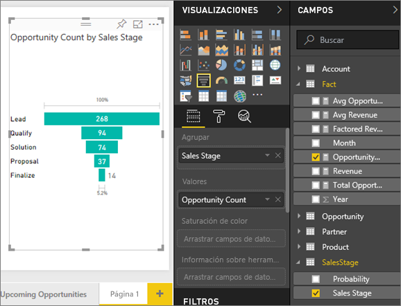
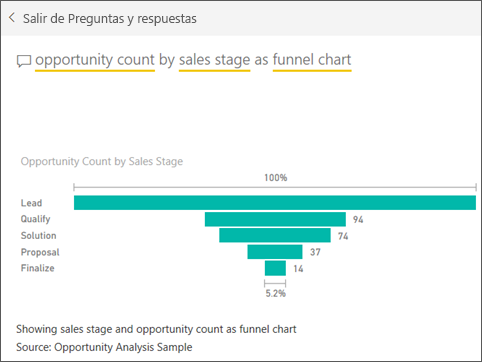

# Gráficos de embudo
Los gráficos de embudo ayudan a visualizar un proceso lineal con fases secuenciales conectadas. Por ejemplo, un embudo de ventas que realiza el seguimiento de los clientes a través de las fases: cliente potencial \> cliente potencial calificado \> prospecto \> contrato \> cierre.  De un vistazo, la forma del embudo indica el estado del proceso del que está realizando el seguimiento.

Cada fase del embudo representa un porcentaje del total. Por lo tanto, en la mayoría de los casos, un gráfico de embudo tiene la forma de embudo: la primera fase es la más grande y cada fase posterior es menor que su predecesora.  Los embudos en forma de pera también son útiles, porque pueden identificar un problema en el proceso.  Pero por lo general, la primera fase, la fase de "entrada", es la de mayor tamaño.

## Cuándo usar un gráfico de embudo
Los gráficos de embudo son una excelente opción:

* Cuando los datos son secuenciales y se mueven por al menos 4 fases.
* Cuando se espera que el número de "elementos" de la primera fase sea mayor que el número de la fase final.
* Para calcular el potencial (ingresos, ventas, ofertas, etc.) por fases.
* Para calcular las tasas de conversión y retención y realizar un seguimiento de las mismas.
* Para mostrar cuellos de botella en un proceso lineal.
* Para realizar el seguimiento del flujo de trabajo de un carro de la compra.
* Para realizar el seguimiento del progreso y el éxito de las campañas de marketing y publicidad de click-through.

## Trabajar con gráficos de embudo
Gráficos de embudo:

* Se pueden anclar desde los informes y desde Preguntas y respuestas.
* Se pueden ordenar.
* Se admiten múltiples gráficos.
* Otras visualizaciones pueden resaltarlo y realizar un filtrado cruzado en la misma página del informe.
* Se pueden usar para resaltar y realizar un filtrado cruzado de otras visualizaciones en la misma página del informe.

## Crear un gráfico de embudo básico
Vea este vídeo para ver cómo Guillermo crea un gráfico de embudo con el Ejemplo de marketing y ventas.

<iframe width="560" height="315" src="https://www.youtube.com/embed/qKRZPBnaUXM" frameborder="0" allow="autoplay; encrypted-media" allowfullscreen></iframe>

Ahora cree su propio gráfico de embudo que muestre la cantidad de oportunidades que cada uno de nosotros tiene en nuestras fases de ventas.

Estas instrucciones usan el Ejemplo de análisis de oportunidades. Para poder continuar, [descargue el ejemplo](../sample-datasets.md) del servicio Power BI (app.powerbi.com) o Power BI Desktop.   

1. Comience en una página de informe en blanco y seleccione el campo **SalesStage** \> **Fase de ventas**. Si está utilizando el servicio Power BI, asegúrese de que abre el informe en [Vista de edición](../service-interact-with-a-report-in-editing-view.md).
   
    
2. [Convierta el gráfico](power-bi-report-change-visualization-type.md) en un embudo. Observe que la **Fase de ventas** también esté en el **Grupo** . 
3. En el panel **Campos**, seleccione **Hecho** \> **Recuento de oportunidades**.
   
    
4. Al mantener el mouse sobre una barra se muestra una gran cantidad de información.
   
   * El nombre de la fase
   * El número de oportunidades en esta fase
   * La tasa de conversión general (% de Clientes potenciales) 
   * Tasa de etapa a etapa (también conocida como tasa de abandono) que es el porcentaje de la fase anterior (en este caso, fase propuesta/fase de solución)
     
     
5. [Agregue el embudo como un icono de panel](../service-dashboard-tiles.md). 
6. [Guarde el informe](../service-report-save.md).

## Resaltado y filtrado cruzado
Para más información acerca de cómo usar el panel Filtros, consulte [Agregar un filtro a un informe](../power-bi-report-add-filter.md).

Al resaltar una barra en un gráfico de embudo, se realiza un filtrado cruzado de las demás visualizaciones en la página del informe, y viceversa. Para poder continuar, agregue algunos objetos visuales más a la página de informe que contiene el gráfico de embudo.

1. En el embudo, seleccione la barra **Propuesta**. Esto realiza un resaltado cruzado de las demás visualizaciones de la página. Use CTRL para realizar una selección múltiple.
   
   
2. Para establecer las preferencias del resaltado cruzado y del filtrado cruzado de los objetos visuales, consulte [Interacciones visuales en Power BI](../service-reports-visual-interactions.md).

## Creación de un gráfico de embudo con Preguntas y respuestas
Abra el panel de ejemplo de análisis de oportunidades, o cualquier otro panel que tenga al menos una visualización anclada del conjunto de datos de este ejemplo.  Cuando escriba una pregunta en Preguntas y respuestas, Power BI busca respuestas en todos los conjuntos de datos que están asociados (que tienen iconos anclados) al panel seleccionado. Para más información, consulte [Power BI: Conceptos básicos](../service-basic-concepts.md).

1. En el panel de ejemplo de análisis de oportunidades, comience a escribir la pregunta en el cuadro Preguntas y respuestas.
   
   
   
2. No olvide agregar "como embudo" para que Power BI sepa qué tipo de visualización prefiere.

## Pasos siguientes

[Medidores en Power BI](power-bi-visualization-radial-gauge-charts.md)

[Tipos de visualización en Power BI](power-bi-visualization-types-for-reports-and-q-and-a.md)
