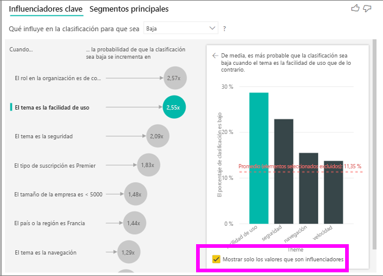
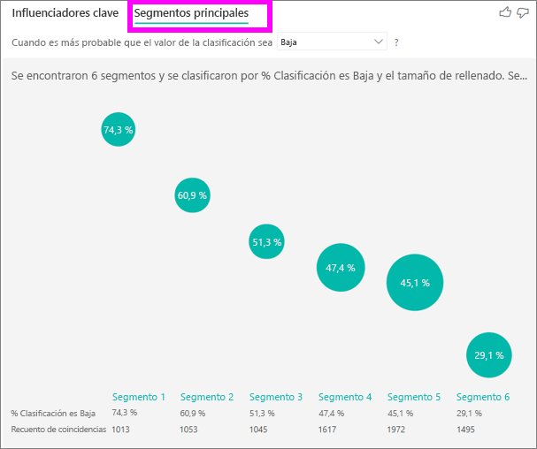
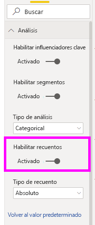
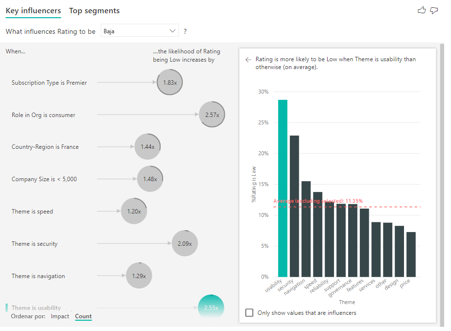
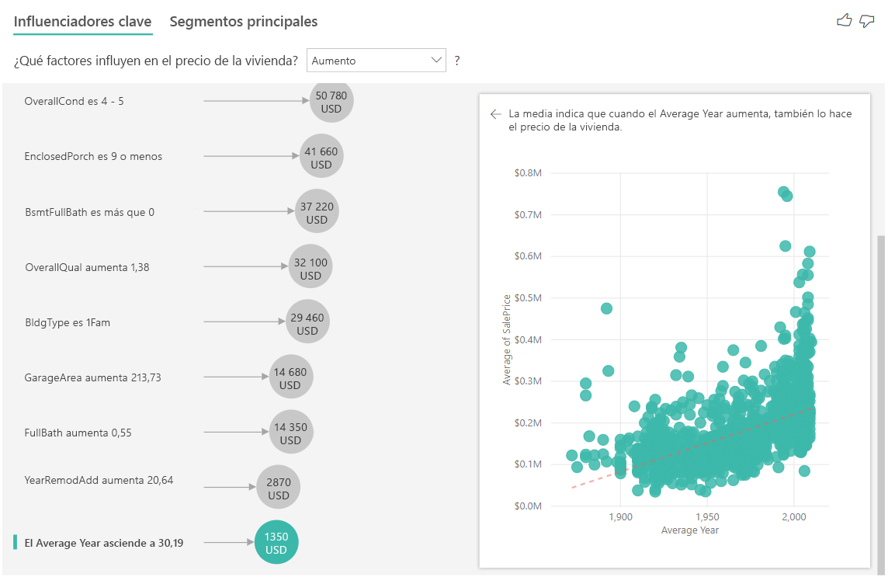
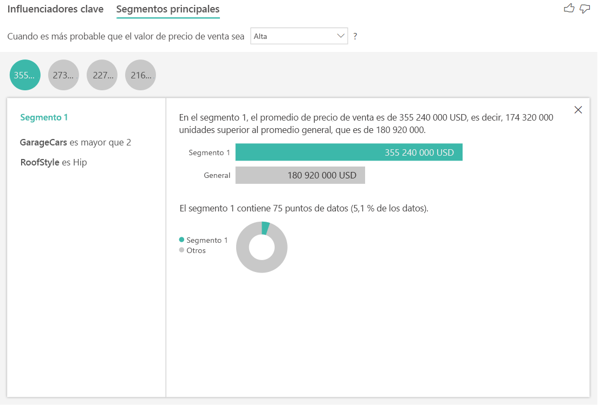
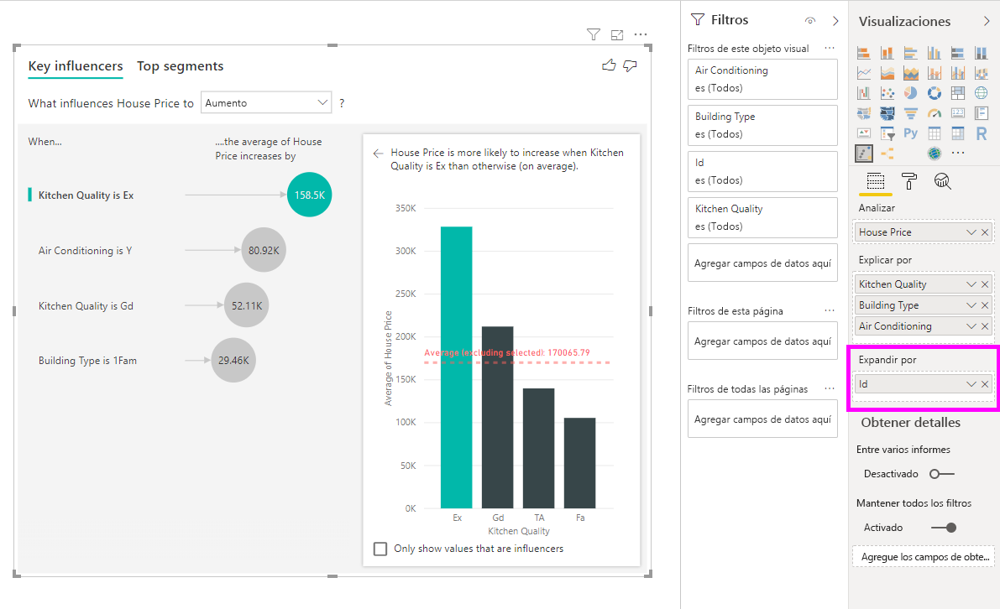
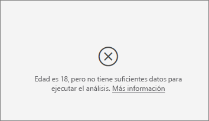

# Visualización de influenciadores clave

[!INCLUDE [power-bi-visuals-desktop-banner](../includes/power-bi-visuals-desktop-banner.md)]

El objeto visual de influenciador clave le ayudará a reconocer los factores que controlan una métrica de su interés. Analiza los datos, clasifica los factores que son importantes y los muestra como influenciadores clave. Por ejemplo, suponga que desea averiguar qué influye en la rotación de los empleados, lo que también se conoce como abandono. La duración del contrato de empleo puede ser uno de los factores, mientras que otro puede ser la edad del empleado. 
 
## Cuándo se deben usar los influenciadores clave 
El objeto visual de influenciador clave es una excelente opción si desea: 
- Ver qué factores afectan a la métrica que se está analizando.
- Comparar la importancia relativa de estos factores. Por ejemplo, ¿los contratos a corto plazo tienen más impacto en el abandono que los contratos a largo plazo? 

## Características del objeto visual de influenciador clave

1. **Pestañas**: seleccione una pestaña para alternar entre las vistas. La opción **Influenciadores clave** muestra los principales factores que contribuyen al valor de la métrica seleccionada. La opción **Segmentos principales** muestra los segmentos principales que contribuyen al valor de la métrica seleccionada. Un *segmento* está formado por una combinación de valores. Por ejemplo, un segmento puede estar integrado por los consumidores que han sido clientes durante veinte años como mínimo y residen en la región occidental. 

2. **Cuadro de lista desplegable**: el valor de la métrica que se está investigando. En este ejemplo, veamos la métrica **Calificación**. El valor seleccionado es **Baja**.

3. **Redefinición**: nos ayuda a interpretar el objeto visual en el panel izquierdo.

4. **Panel izquierdo**: el panel izquierdo contiene un objeto visual. En este caso, el panel izquierdo muestra una lista de los principales influenciadores clave.

5. **Redefinición**: nos ayuda a interpretar el objeto visual en el panel derecho.

6. **Panel derecho**: el panel derecho contiene un objeto visual. En este caso, el gráfico de columnas muestra todos los valores del influenciador clave, **Tema**, que está seleccionado en el panel izquierdo. El valor específico de **facilidad de uso** en el panel izquierdo se muestra en verde. Todos los valores de **Tema** se muestran en color negro.

7. **Línea promedio**: el promedio se calcula para todos los otros valores posibles de **Tema**, excepto **facilidad de uso** (que es el influenciador seleccionado). Por lo tanto, el cálculo se aplica a todos los valores de color negro. Indica qué porcentaje de los demás **Temas** han tenido una calificación baja. En este caso, el 11,35 % tenía una clasificación baja (que se muestra en la línea de puntos).

8. **Casilla de verificación**: filtra el objeto visual del panel derecho para mostrar solo los valores que son influenciadores para ese campo. En este ejemplo, se filtraría el objeto visual por facilidad de uso, seguridad y navegación.

## Análisis de una métrica categórica
 
Vea este vídeo para aprender a crear un objeto visual de influenciador clave con una métrica categórica. A continuación, siga estos pasos para crear uno. 

   > [!NOTE]
   > En este vídeo se usa una versión anterior de Power BI Desktop.
   > 
   > 
<iframe width="560" height="315" src="https://www.youtube.com/embed/fDb5zZ3xmxU" frameborder="0" allow="accelerometer; autoplay; encrypted-media; gyroscope; picture-in-picture" allowfullscreen></iframe>

El director de producto quiere averiguar qué factores conducen a los clientes a dejar reseñas negativas sobre su servicio en la nube. Para continuar, abra el [archivo PBIX de comentarios del cliente](https://github.com/Microsoft/powerbi-desktop-samples/blob/master/2019/customerfeedback.pbix) en Power BI Desktop. También puede descargar el [archivo de Excel de comentarios del cliente para el servicio Power BI o Power BI Desktop](https://github.com/Microsoft/powerbi-desktop-samples/blob/master/2019/customerfeedback.xlsx). 

> [!NOTE]
> El conjunto de datos de comentarios del cliente se basa en [Moro et al., 2014] S. Moro, P. Cortez y P. Rita. "A Data-Driven Approach to Predict the Success of Bank Telemarketing." *Decision Support Systems*, Elsevier, 62:22-31, junio de 2014. 

1. Abra el informe y seleccione el icono **Influenciadores clave**. 

    

2. Mueva la métrica que quiera investigar al campo **Analizar**. Para ver lo que impulsa a un cliente a dejar una calificación baja del servicio, seleccione **Tabla de clientes** > **Calificación**.

3. Mueva los campos que piensa que podrían influir en el valor de **Calificación** a la sección **Explicar por**. Puede mover tantos campos como desee. En este caso, comience con:
    - País-región 
    - Rol en la organización 
    - Tipo de suscripción 
    - Tamaño de la empresa 
    - Tema
    
4. Deje vacío el campo **Expandir por**. Este campo solo se usa al analizar una medida o un campo resumido. 

5. Para centrarse en las calificaciones negativas, seleccione **Baja** en el cuadro desplegable **Qué influye en la calificación para que sea**.  

    

El análisis se ejecuta en el nivel de tabla del campo que se está analizando. En este caso, es la métrica **Calificación**. Esta métrica se define en el nivel de cliente. A cada cliente se le ha concedido una puntuación alta o una puntuación baja. Todos los factores explicativos deben estar definidos en el nivel de cliente para que el objeto visual haga uso de ellos. 

En el ejemplo anterior, todos los factores explicativos tienen una relación de uno a uno o de varios a uno con la métrica. En este caso, cada cliente ha asignado un solo tema a su clasificación. De forma similar, los clientes proceden de un país y tienen un tipo de pertenencia y un rol en su organización. Los factores explicativos ya son, por tanto, atributos de un cliente y no se necesita ninguna transformación. El objeto visual puede hacer un uso inmediato de ellos. 

Más adelante en el tutorial veremos ejemplos más complejos donde hay relaciones de uno a varios. En esos casos, las columnas deben agregarse primero de forma descendente hasta el nivel de cliente para poder ejecutar el análisis. 

Las medidas y los agregados que se utilizan como factores explicativos también se evalúan en el nivel de tabla de la métrica **Analizar**. Más adelante en este artículo se muestran algunos ejemplos. 

## Interpretación de los influenciadores clave categóricos 
Echemos un vistazo a los influenciadores clave de las calificaciones bajas. 

### Principal factor único que influye en la probabilidad de una calificación baja

El cliente de este ejemplo puede tener tres roles: consumidor, administrador y publicador. Ser un consumidor es el factor principal que contribuye a una calificación baja. 

Más concretamente, existe una probabilidad 2,57 veces mayor de que nuestros clientes nos den una puntuación negativa. El gráfico de influenciadores clave indica **Rol en la organización es consumidor** en primer lugar en la lista de la izquierda. Al seleccionar **Rol en la organización es consumidor**, Power BI muestra detalles adicionales en el panel derecho. Se muestra el efecto comparativo de cada rol en la probabilidad de una calificación baja.
  
- Un 14,93 % de los consumidores da una puntuación baja. 
- De promedio, todos los demás roles dan una puntuación baja en el 5,78 % de las ocasiones.
- Existe una probabilidad 2,57 veces mayor de que los consumidores den una puntuación baja en comparación con todos los demás roles. Para determinarlo, divida la barra verde por la línea roja de puntos. 

### Segundo factor único que influye en la probabilidad de una calificación baja

El objeto visual de influenciador clave puede comparar y clasificar los factores de muchas variables diferentes. El segundo influenciador clave no tiene nada que ver con **Rol en la organización**. Seleccione el segundo influenciador de la lista, que es **Tema es facilidad de uso**. 

El segundo factor más importante está relacionado con el tema de la reseña del cliente. Los clientes que han hecho algún comentario sobre la facilidad de uso del producto tienen una probabilidad 2,55 veces superior de dar una puntuación baja en comparación con los clientes que han hecho comentarios sobre otros temas, como la confiabilidad, el diseño o la velocidad. 

Entre los objetos visuales, el promedio (línea discontinua roja) ha cambiado del 5,78 % al 11,34 %. El promedio es dinámico, porque se basa en el promedio de todos los demás valores. Para el primer influenciador, en el promedio se excluyó el rol de cliente. Para el segundo influenciador, se excluyó el tema de facilidad de uso. 
 
Active la casilla **Mostrar solo los valores que son influenciadores** para filtrar usando solo los valores destacados. En este caso, son los roles que impulsan una puntuación baja. Los doce temas se reducen a los cuatro que Power BI ha identificado como los temas que impulsan las calificaciones bajas. 

## Interacción con otros objetos visuales 
 
Cada vez que un usuario selecciona una segmentación, un filtro u otro objeto visual en el lienzo, el objeto visual de influenciador clave vuelve a ejecutar el análisis en la parte de datos nueva. Por ejemplo, vamos a mover **Tamaño de la empresa** al informe y a utilizarlo como segmentación. Úselo para ver si los influenciadores clave de nuestros clientes de empresa de gran tamaño difieren de los de la población general. Una empresa de gran tamaño tiene más de 50 000 empleados.
 
Al seleccionar **>50 000** se vuelve a ejecutar el análisis y podemos ver que los influenciadores han cambiado. Para los clientes de empresas de gran tamaño, el mayor influenciador para las calificaciones bajas tiene un tema relacionado con la seguridad. Quizás quiera investigarlo en profundidad para ver si hay características de seguridad específicas con las que los clientes de gran tamaño no se sienten satisfechos. 

## Interpretación de los influenciadores clave continuos 
 
Hasta ahora hemos visto cómo usar el objeto visual para explorar cómo influyen los distintos campos categóricos en las calificaciones bajas. También es posible que haya factores continuos, como la edad, la altura y el precio, en el campo **Explicar por**. Veamos lo que sucede si movemos **Antigüedad** de la tabla de cliente a **Explicar por**. La antigüedad muestra el tiempo que el cliente ha usado el servicio. 
 
A medida que la antigüedad aumenta, también aumenta la probabilidad de recibir una calificación inferior. Esta tendencia sugiere que es más probable que los clientes más antiguos den una puntuación negativa. Esta información es interesante y tal quiera realizar un seguimiento más adelante. 
 
La visualización muestra que cada vez que antigüedad sube 13,44 meses, la probabilidad de una calificación baja aumenta 1,23 veces como promedio. En este caso, 13,44 meses representa la desviación estándar de la antigüedad. Por lo tanto, la información que recibe examina cómo el aumento de la antigüedad en una cantidad estándar (la desviación estándar de la antigüedad) afecta a la probabilidad de recibir una calificación baja. 
 
El gráfico de dispersión del panel derecho traza el porcentaje promedio de las calificaciones bajas para cada valor de antigüedad. Resalta la pendiente con una línea de tendencia.

## Influenciadores clave continuos discretizados

En algunos casos, es posible que vea que los factores continuos se han convertido automáticamente en factores categóricos. Esto se debe a que nos dimos cuenta de que la relación entre las variables no es lineal y, por tanto, no podemos describir la relación como simplemente ascendente o descendente, como hemos hecho en el ejemplo anterior.

Hemos realizado pruebas de correlación para determinar hasta qué punto el influenciador es lineal con respecto al objetivo. Si el destino es continuo, se ejecuta la correlación de Pearson y, si es categórico, se ejecutan pruebas de correlación biserial-puntual. Asimismo, si se detecta que la relación no es suficientemente lineal, realizamos una discretización supervisada y generamos un máximo de cinco intervalos. Para averiguar qué intervalos tienen más sentido, usamos un método de discretización supervisado, que examina la relación entre el factor explicativo y el objetivo que se analiza.

## Interpretación de medidas o agregados como influenciadores clave 
 
Puede usar también medidas y agregados como factores explicativos dentro de su análisis. Por ejemplo, quizás quiera ver lo que afecta al número de incidencias de soporte técnico del cliente o el efecto que la duración media de una incidencia abierta tiene en la puntuación que recibe. 
 
En este caso, queremos ver si el número de incidencias de soporte técnico que tiene un cliente influye en la puntuación que da. Ahora, tome el **Identificador de incidencia de soporte técnico** de la tabla Incidencia de soporte técnico. Como un cliente puede tener varias incidencias de soporte técnico, es necesario agregar el identificador en el nivel de cliente. Esta agregación es importante porque el análisis se ejecuta en el nivel de cliente, de modo que todos los controladores deben definirse en ese nivel de granularidad. 
 
Veamos el número de identificadores. Cada fila del cliente tiene un número de incidencias de soporte técnico asociado con él. En este caso, vemos que a medida que el número de incidencias de soporte técnico aumenta, la probabilidad de que la calificación sea baja es 5,51 veces superior. El objeto visual de la derecha nos muestra el número medio de incidencias de soporte técnico por los diferentes valores de **Calificación** que se evalúan en el nivel de cliente. 

## Interpretar los resultados: Segmentos principales 
 
Puede usar la pestaña **Influenciadores clave** para evaluar cada factor de forma individual. También puede usar la pestaña **Principales segmentos** para ver cómo una combinación de factores afecta a la métrica que está analizando. 
 
Segmentos principales muestra inicialmente una información general de todos los segmentos que ha detectado Power BI. El ejemplo siguiente muestra que se han encontrado seis segmentos. Estos segmentos se clasifican según el porcentaje de calificaciones bajas dentro del segmento. Vemos que el segmento 1, por ejemplo, tiene un 74,3 % de las calificaciones de cliente bajas. Cuanto mayor sea la burbuja, mayor será la proporción de clasificaciones bajas. El tamaño de la burbuja representa el número de clientes que se encuentran dentro del segmento. 

Al seleccionar una burbuja se profundiza en los detalles del segmento. Si selecciona el segmento 1, por ejemplo, encontrará que se compone de clientes relativamente establecidos. Han sido clientes durante más de 29 meses y tienen más de cuatro incidencias de soporte técnico. Por último, no son editores, por lo que son consumidores o administradores. 
 
En este grupo, el 74,3 % de los clientes asignó una calificación baja. El cliente promedio dio una calificación baja el 11,7 % de las veces, por lo que este segmento tiene una proporción mayor de calificaciones bajas. Su porcentaje es 63 puntos mayor. El segmento 1 contiene aproximadamente el 2,2 % de los datos, por lo que representa una parte de la población que puede corregirse. 

## Adición de recuentos

En ocasiones, un influenciador puede tener un gran impacto pero representar muy pocos datos. Por ejemplo, **Tema** es **facilidad de uso** es el segundo influenciador más importante para las clasificaciones bajas. Pero es posible que solo haya una serie de clientes que se hayan quejado de la facilidad de uso. Los recuentos pueden ayudarle a priorizar en qué influenciadores se quiere centrar.

Los recuentos se pueden activar a través de la **tarjeta Análisis** del panel de formato.

Una vez que se activan los recuentos, verá un anillo alrededor de la burbuja de cada influenciador, que representa el porcentaje aproximado de datos que contiene ese influenciador. Cuanto mayor sea la burbuja, más datos contendrá. Se puede ver que **Tema** es **facilidad de uso** contiene una proporción de datos muy pequeña.

También puede usar el botón de alternancia Ordenar por de la parte inferior izquierda del objeto visual para ordenar las burbujas primero por recuento en lugar de impacto. **Tipo de suscripción** es **Premier** es el influenciador principal en función del recuento.

Un anillo completo alrededor del círculo significa que el influenciador contiene el 100 % de los datos. Puede cambiar el tipo de recuento para que sea relativo al influenciador mediante la lista desplegable **Tipo de recuento** de la **tarjeta Análisis** del panel de formato. Ahora, el influenciador con la mayor cantidad de datos se representará mediante un anillo completo y todos los demás recuentos serán relativos a él.

## Análisis de una métrica numérica

Si mueve un campo numérico sin resumir al campo **Analizar**, puede elegir cómo administrar ese escenario. Para cambiar el comportamiento del objeto visual, puede ir al **Panel de formato** y cambiar entre **Tipo de análisis categórico** y **Tipo de análisis continuo**.

El **Tipo de análisis categórico** se comporta tal y como se describió anteriormente. Por ejemplo, si está viendo puntuaciones de encuestas entre 1 y 10, podría preguntarse "¿Qué hace que una puntuación en una encuesta sea 1?"

El **Tipo de análisis continuo** cambia la pregunta a una continua. En el ejemplo anterior, la nueva pregunta sería "¿Qué hace que las puntuaciones de la encuesta aumenten o disminuyan?".

Esta distinción es muy útil cuando se tiene una gran cantidad de valores únicos en el campo que se va a analizar. En el ejemplo siguiente, consultamos precios de casas. No es muy significativo preguntar "¿Qué hace que el precio de la casa sea 156 214?" porque es muy específica y es probable que no tengamos datos suficientes para inferir un patrón.

En su lugar, nos conviene preguntar, "¿Qué hace que el precio de la casa aumente?" para tratar los precios de la casa como un intervalo en lugar de valores distintos.

## Interpretar los resultados: Influenciadores clave 

En este escenario, vemos "¿Qué hace que el precio de la casa aumente?". Estamos viendo una serie de factores explicativos que pueden afectar al precio de la casa, como **YearBuilt** (año en que se construyó la casa), **KitchenQual** (calidad de la cocina) y **YearRemodAdd** (año de reforma). 

En el ejemplo siguiente, miramos al principal influenciador, que es que la calidad de la cocina sea excelente. Los resultados son muy similares a los que vimos cuando analizamos las métricas categóricas, con algunas diferencias importantes:

- El gráfico de columnas de la derecha mira los promedios en lugar de los porcentajes. Por lo tanto, nos muestra que el precio promedio de una casa con una cocina excelente es (barra verde) en comparación con el precio medio de una casa sin una cocina excelente (línea de puntos)
- El número de la burbuja sigue siendo la diferencia entre la línea de puntos rojos y la barra de color verde, pero se expresa como un número (158 490 USD) en lugar de una probabilidad (1,93x). Eso quiere decir que, de media, las casas con cocinas excelentes son casi 160 000 USD más caras que las casas sin cocinas excelentes.

En el ejemplo siguiente, examinamos el impacto que un factor continuo (año en que se reformó la casa) tiene sobre el precio de la casa. Estas son las diferencias respecto a cómo se analizan los influenciadores continuos de las métricas categóricas:

-   El gráfico de dispersión del panel derecho traza el precio medio de la casa para cada valor distinto del año de reforma. 
-   El valor de la burbuja muestra cuánto aumenta el promedio del precio de la casa (en este caso, 2870 USD) cuando el año de reforma de la casa aumenta la desviación estándar (en este caso 20 años).

Por último, en el caso de las medidas, estamos examinando el promedio del año en que construyó la casa. Aquí, el análisis es el siguiente:

-   El gráfico de dispersión del panel derecho traza el precio medio de la casa para cada valor distinto de la tabla.
-   El valor de la burbuja muestra cuánto aumenta el promedio del precio de la casa (en este caso, 1350 USD) cuando el promedio del año aumenta la desviación estándar (en este caso 30 años).

## Interpretar los resultados: Segmentos principales

Los segmentos principales para destinos numéricos muestran a grupos donde la casa los precios de Media son mayores que en el conjunto de datos general. Por ejemplo, a continuación vemos que **Segmento 1** se compone de casas en las que **GarageCars** (número de plazas de garaje) es mayor que 2 y **RoofStyle** (estilo de tejado) es Hip (a dos aguas). Las casas con estas características tienen un precio promedio de 355 000 USD en comparación con el promedio general de los datos, que es de 180 000 USD.

## Análisis de una métrica que es una medida o una columna resumida

En el caso de una medida o columna resumida, el análisis toma como valor predeterminado el **Tipo de análisis continuo** descrito [antes](https://docs.microsoft.com/en-us/power-bi/visuals/power-bi-visualization-influencers#analyze-a-metric-that-is-numeric). Esto no se puede cambiar. La diferencia más importante entre analizar una medida o columna resumida, y una columna numérica no resumida es el nivel en el que se ejecuta el análisis.

En el caso de las columnas no resumidas, el análisis siempre se ejecuta en el nivel de tabla. En el ejemplo de precio de la casa anterior, se ha analizado la métrica **House Price** (Precio de la casa) para ver qué influye en el aumento o disminución del precio de una casa. El análisis se ejecuta de forma automática en el nivel de tabla. La tabla tiene un identificador único para cada casa, por lo que el análisis se ejecuta en nivel de la casa.

En el caso de las medidas y las columnas resumidas, no se sabe de forma inmediata en qué nivel se deben analizar. Si **House Price** se ha resumido como un **Promedio**, se debería tener en cuenta a qué nivel nos gustaría que se calculara este precio promedio de la casa. ¿El precio promedio de la casa está en un nivel de vecindario? ¿O bien posiblemente en un nivel regional?

Las medidas y las columnas resumidas se analizan de forma automática en el nivel de los campos **Explicar por** que se usan. Imagine que hay tres campos **Explicar por** que le interesan: **Calidad de la cocina**, **Tipo de edificación** y **Aire acondicionado**. **Precio medio de la casa** se calcularía para cada combinación única de esos tres campos. A menudo resulta útil cambiar a una vista de tabla para comprobar la apariencia de los datos que se evalúan.

Este análisis está muy resumido y, por tanto, será difícil para el modelo de regresión encontrar en los datos patrones de los que pueda aprender. Para obtener mejores resultados, el análisis se debe ejecutar en un nivel más detallado. Si se quisiera analizar el precio de la casa en el nivel de la casa, sería necesario agregar de forma explícita el campo **ID** al análisis. Pero el objetivo no es que el Id. de la casa se considere un influenciador. No resulta útil saber que a medida que aumenta el Id. de la casa aumenta su precio. Aquí es donde el campo **Expandir por** resulta útil. Puede usar **Expandir por** para agregar los campos que quiera usar para establecer el nivel del análisis sin buscar nuevos influenciadores.

Observe la apariencia de la visualización después de agregar **ID** a **Expandir por**. Una vez que haya definido el nivel en el que quiere evaluar la medida, la interpretación de los influenciadores es exactamente la misma que para las [columnas numéricas no resumidas](https://docs.microsoft.com/en-us/power-bi/visuals/power-bi-visualization-influencers#analyze-a-metric-that-is-numeric).

Si quiere obtener más información sobre cómo puede analizar medidas con las visualización de influenciadores clave, vea el tutorial siguiente.

<iframe width="1167" height="631" src="https://www.youtube.com/embed/2X1cW8oPtc8" frameborder="0" allow="accelerometer; autoplay; encrypted-media; gyroscope; picture-in-picture" allowfullscreen></iframe>

## Consideraciones y solución de problemas 
 
**¿Cuáles son las limitaciones del objeto visual?** 
 
El objeto visual de los influenciadores clave tiene algunas limitaciones:

- No se admite DirectQuery.
- No se admite la conexión dinámica a Azure Analysis Services ni SQL Server Analysis Services.
- No se admite la opción Publicar en la web.
- Se requiere .NET Framework 4.6 o una versión posterior.

**Un error me indica que no se encontraron influenciadores o segmentos. ¿Por qué?** 

Este error se produce cuando se han incluido campos en **Explicar por** pero no se han encontrado influenciadores. 
- La métrica que se estaba analizando se ha incluido en **Analizar** y en **Explicar por**. Quítela de **Explicar por**. 
- Los campos explicativos tienen demasiadas categorías con pocas observaciones. Esta situación dificulta la visualización para determinar qué factores son influenciadores. Es difícil generalizar solo con unas pocas observaciones. Si está analizando un campo numérico, quizás quiera cambiar de **Análisis categórico** a **Análisis continuo** en **Panel de formato**, en la tarjeta **Análisis**.
- Los factores explicativos tienen un número suficiente de observaciones para realizar generalizaciones, pero la visualización no ha buscado ninguna correlación significativa sobre la cual informar.
 
**Veo un error que indica que la métrica que estoy analizando no tiene suficientes datos para que se ejecute el análisis a partir de ella. ¿Por qué?** 

La visualización funciona examinando los patrones en los datos de un grupo en comparación con otros grupos. Por ejemplo, busca los clientes que asignaron calificaciones bajas en comparación con los clientes que asignaron calificaciones altas. Si los datos del modelo tienen muy pocas observaciones, resulta difícil encontrar patrones. Si la visualización no tiene suficientes datos para buscar influenciadores significativos, esto indica que se necesitan más datos para ejecutar el análisis. 

Recomendamos que tenga al menos 100 observaciones del estado seleccionado. En este caso, el estado es los clientes que abandonaron. También necesita al menos 10 observaciones de los estados que utiliza para la comparación. En este caso, el estado de comparación es los clientes que no abandonaron.

Si está analizando un campo numérico, quizás quiera cambiar de **Análisis categórico** a **Análisis continuo** en **Panel de formato**, en la tarjeta **Análisis**.

**Aparece un error que hace que, cuando no se resume "Analizar", el análisis siempre se ejecuta en el nivel de fila de su tabla primaria. No se permite cambiar este nivel a través de los campos "Expandir por". ¿Por qué?**

Al analizar una columna numérica o categórica, el análisis siempre se ejecuta en el nivel de tabla. Por ejemplo, si va analizar los precios de la vivienda y la tabla contiene una columna ID, el análisis se ejecutará de forma automática en el nivel de identificador de la casa. 

Cuando se analiza una medida o una columna resumida, es necesario indicar de forma explícita el nivel en el que se quiere ejecutar el análisis. Puede usar **Expandir por** para cambiar el nivel del análisis para medidas y columnas resumidas sin agregar influenciadores nuevos. Si **Precio de la casa** se ha definido como una medida, podría agregar la columna ID de la casa a **Expandir por** para cambiar el nivel del análisis.

**Veo un error que indica que un campo en *Explicar por* no está relacionado de forma exclusiva con la tabla que contiene la métrica que estoy analizando. ¿Por qué?**
 
El análisis se ejecuta en el nivel de tabla del campo que se está analizando. Por ejemplo, si analiza los comentarios de los clientes acerca del servicio, podría obtener una tabla que indique si un cliente ha dado una calificación alta o baja. En este caso, el análisis se ejecuta en el nivel de tabla del cliente. 

Si tiene una tabla relacionada que está definida en un nivel más pormenorizado que la tabla que contiene su métrica, le aparece este error. Este es un ejemplo: 
 
- Analiza qué hace que los clientes den calificaciones bajas a su servicio.
- Quiere ver si el dispositivo en el cual el cliente está consumiendo el servicio influye en las reseñas que aporta.
- Un cliente puede consumir el servicio de varias maneras diferentes.
- En el ejemplo siguiente, el cliente 10000000 usa un navegador y una tableta para interactuar con el servicio.

Si intenta usar la columna de dispositivo como un factor explicativo, verá el siguiente error: 

Este error aparece porque el dispositivo no está definido en el nivel de cliente. Un cliente puede consumir el servicio en varios dispositivos. Para que la visualización encuentre patrones, el dispositivo debe ser un atributo del cliente. Existen varias soluciones que dependen de cuánto conozca su empresa: 
 
- Puede cambiar el resumen de dispositivos para contar. Por ejemplo, use el recuento si el número de dispositivos puede afectar a la puntuación que da un cliente. 
- Puede dinamizar la columna de dispositivo para ver si utilizar el servicio en un dispositivo específico influye en la calificación de un cliente.
 
En este ejemplo, los datos se han dinamizado para crear otras columnas para un explorador, dispositivos móviles y tabletas; asegúrese de eliminar y volver a crear las relaciones en la vista de modelado después de dinamizar los datos. Ahora puede usar estos dispositivos específicos en **Explicar por**. Descubrimos que todos los dispositivos son influenciadores y que el navegador tiene el mayor impacto en la puntuación del cliente.

Más concretamente, los clientes que no usan el navegador para consumir el servicio tienen una probabilidad 3,79 veces superior de asignar una puntuación baja que quienes sí lo usan. Más abajo en la lista, para dispositivos móviles, se cumple lo contrario. Los clientes que usan una aplicación móvil tienen una mayor probabilidad de dar una puntuación baja que aquellos que no la usan. 

**Veo una advertencia que indica que las medidas no se han incluido en mi análisis. ¿Por qué?** 

El análisis se ejecuta en el nivel de tabla del campo que se está analizando. Si está analizando el abandono de clientes, puede tener una tabla que le indique si un cliente ha abandonado o no. En este caso, el análisis se ejecuta en el nivel de tabla del cliente.
 
Las medidas y los agregados se analizan en este nivel de tabla, de forma predeterminada. Si tuviéramos una medida para el gasto mensual promedio, se analizaría en el nivel de tabla de cliente. 

Si la tabla de cliente no tiene un identificador único, no es posible evaluar la medida y el análisis la pasa por alto. Para evitar esta situación, asegúrese de que la tabla con la métrica tiene un identificador único. En este caso, es la tabla de clientes y el identificador único es el identificador de cliente. También es muy fácil agregar una columna de índice con Power Query.
 
**Veo una advertencia que indica que la métrica que estoy analizando tiene más de 10 valores únicos y que esto puede afectar a la calidad del análisis. ¿Por qué?** 

La visualización de inteligencia artificial puede analizar los campos categóricos y los campos numéricos. En el caso de los campos categóricos, un ejemplo puede ser Abandono es Sí o No, y Satisfacción del cliente es Alta, Media o Baja. Aumentar el número de categorías para analizar significa que se realizan menos observaciones por categoría. Esto hace que a la visualización le resulte más difícil encontrar patrones en los datos. 

Al analizar los campos numéricos, tiene la opción de tratar los campos numéricos como texto, en cuyo caso se ejecutará el mismo análisis que usaría con los datos categóricos (**Análisis categóricos**). Si tiene muchos valores distintos, le recomendamos que cambie el análisis a **Análisis continuo** porque eso significa que podemos deducir los patrones cuando los números aumentan o disminuyen, en lugar de tratarlos como valores distintos. Puede cambiar de **Análisis categórico** a **Análisis continuo** en **Panel de formato**, en la tarjeta **Análisis**.

Para buscar influenciadores más sólidos, se recomienda agrupar valores similares en una sola unidad. Por ejemplo, si tiene una métrica para el precio, es probable que obtenga mejores resultados mediante la agrupación de precios similares en algo parecido a categorías como Alto, Medio o Bajo, frente al uso de puntos de precio individuales. 

**Hay factores en mis datos que parecen indicar que son influenciadores clave, pero no lo son. ¿Cómo puede suceder esto?**

En el ejemplo siguiente, los clientes que son consumidores dan calificaciones bajas, con 14,93 % de las calificaciones bajas. El rol de administrador también tiene una proporción alta de calificaciones bajas (un 13,42 %) pero no se considera un influenciador. 

La razón de esta decisión es que la visualización también tiene en cuenta el número de puntos de datos cuando encuentra personas con influencia. El siguiente ejemplo tiene más de 29 000 consumidores y 10 veces menos administradores, aproximadamente 2900. Además, solo 390 de ellos dieron una calificación baja. El objeto visual no tiene suficientes datos para determinar si realmente ha encontrado un patrón en las calificaciones de administrador o si es simplemente un hallazgo casual. 

**¿Cómo calcula los influenciadores clave para el análisis categórico?**

En segundo plano, la visualización de inteligencia artificial usa [ML.NET](https://dotnet.microsoft.com/apps/machinelearning-ai/ml-dotnet) para ejecutar una regresión logística para calcular los influenciadores clave. Una regresión logística es un modelo estadístico que compara los distintos grupos entre sí. 

Si quiere ver lo que genera las calificaciones bajas, la regresión logística se centrará en cómo los clientes que han dado una puntuación baja difieren de los que han dado una puntuación alta. Si tiene varias categorías, como las puntuaciones altas, neutras y bajas, examina en qué se diferencian los clientes que le dieron una calificación baja de los clientes que no. En este caso, ¿en qué se diferencian los clientes que le dieron una puntuación baja se diferencia de los clientes que le dieron una calificación alta o neutra? 
 
La regresión logística busca patrones en los datos, centrándose en las diferencias entre los clientes que han dado una calificación baja y los clientes que han dado una calificación alta. Podría ser, por ejemplo, que los clientes que tienen más incidencias de soporte técnico dan un porcentaje mucho mayor de calificaciones bajas que los que tienen pocas incidencias de soporte técnico, o ninguna.
 
La regresión logística también tiene en cuenta cuántos puntos de datos están presentes. Si, por ejemplo, los clientes que desempeñan un rol de administrador dan, proporcionalmente, puntuaciones más negativas pero solo son una serie limitada de administradores, no se considera un factor influyente. Esta determinación se realiza porque no hay suficientes puntos de datos disponibles para deducir un modelo. Se usa una prueba estadística (prueba de Wald) para determinar si un factor se considera un influenciador. El objeto visual utiliza un valor p de 0,05 para determinar el umbral. 

**¿Cómo se calculan los influenciadores clave para el análisis numérico?**

En segundo plano, la visualización de inteligencia artificial usa [ML.NET](https://dotnet.microsoft.com/apps/machinelearning-ai/ml-dotnet) para ejecutar una regresión lineal para calcular los influenciadores clave. Una regresión lineal es un modelo estadístico que estudia cómo cambia el resultado del campo que está analizando según sus factores explicativos.

Por ejemplo, si estamos analizando precios de casas, la regresión lineal mirará el impacto que tiene una cocina excelente en el precio de la casa. ¿Las casas con cocinas excelentes generalmente tienen precios mayores o menores en comparación con las casas sin cocinas excelentes?

La regresión lineal también tiene en cuenta el número de puntos de datos. Por ejemplo, si las casas con pista de tenis tienen precios más altos pero hay muy pocas casas con pista de tenis, este factor no se considera influyente. Esta determinación se realiza porque no hay suficientes puntos de datos disponibles para deducir un modelo. Se usa una prueba estadística (prueba de Wald) para determinar si un factor se considera un influenciador. El objeto visual utiliza un valor p de 0,05 para determinar el umbral. 

**¿Cómo se calculan los segmentos?**

En segundo plano, la visualización de inteligencia artificial usa [ML.NET](https://dotnet.microsoft.com/apps/machinelearning-ai/ml-dotnet) para ejecutar un árbol de decisión para buscar los subgrupos interesantes. El objetivo final del árbol de decisión es un subgrupo de puntos de datos relativamente alto en la métrica en la cual estamos interesados. Podría tratarse de clientes con calificaciones bajas o casas con precios altos.

El árbol de decisión toma cada factor explicativo e intenta razonar qué factor le dará la mejor *división*. Por ejemplo, si filtramos los datos para incluir a solo a los clientes de las empresa de gran tamaño, ¿se diferenciarán los clientes que nos han dado una calificación alta y los que han dado una calificación baja? ¿O quizás será mejor si filtramos los datos para incluir solo a los clientes que han realizado comentarios sobre la seguridad? 

Después de que el árbol de decisión realiza una división, toma el subgrupo de datos y determina la división siguiente recomendada para esos datos. En este caso, el subgrupo son los clientes que enviaron comentarios sobre seguridad. Después de cada división, también tiene en cuenta si tiene suficientes puntos de datos para que este sea un grupo representativo a partir del cual se puede deducir un patrón o si simplemente puede ser una anomalía en los datos y, por lo tanto, no un segmento real. Se aplica otra prueba estadística para comprobar la importancia estadística de la condición de división, con un valor p de 0,05. 

Cuando finaliza la ejecución del árbol de decisión, toma todas las divisiones (comentarios de seguridad, empresa de gran tamaño) y crea los filtros de Power BI. Esta combinación de filtros se empaqueta como un segmento en el objeto visual. 
 
**¿Por qué ciertos factores se convierten en influenciadores o dejan de ser influenciadores a medida que muevo más campos a *Explicar por*?**

La visualización evalúa todos los factores explicativos conjuntamente. Un factor podría ser un influenciador pero, cuando se considera con otros factores, podría no serlo. Supongamos que quiere analizar qué es lo que hace que el precio de una casa sea alto, siendo el tamaño de la casa y los dormitorios los factores explicativos:

- Por sí mismo, una cantidad mayor de dormitorios puede ser un impulsor para que los precios de las casas sean altos.
- La inclusión del tamaño de la casa en el análisis significa que ahora veremos lo que ocurre con los dormitorios si el tamaño de la casa se mantiene constante.
- Si el tamaño de la casa se fija en 150 metros cuadrados, no es probable que un aumento continuo en el número de dormitorios aumente considerablemente el precio de la casa. 
- Los dormitorios podrían no ser un factor tan importante como era cuando se tenía en cuenta el tamaño de la casa. 

## Pasos siguientes
- [Gráficos combinados en Power BI](power-bi-visualization-combo-chart.md)
- [Tipos de visualización en Power BI](power-bi-visualization-types-for-reports-and-q-and-a.md)
