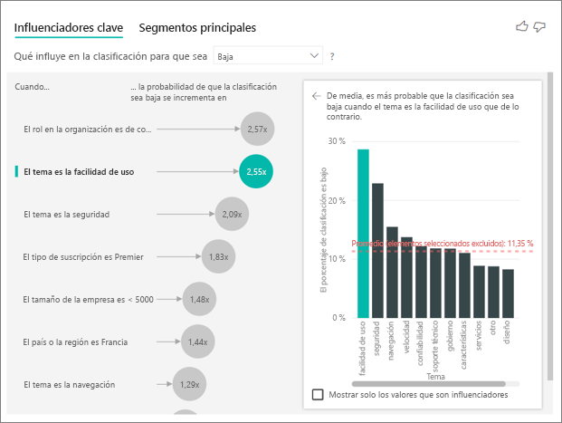
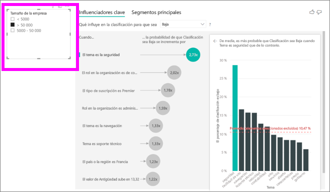
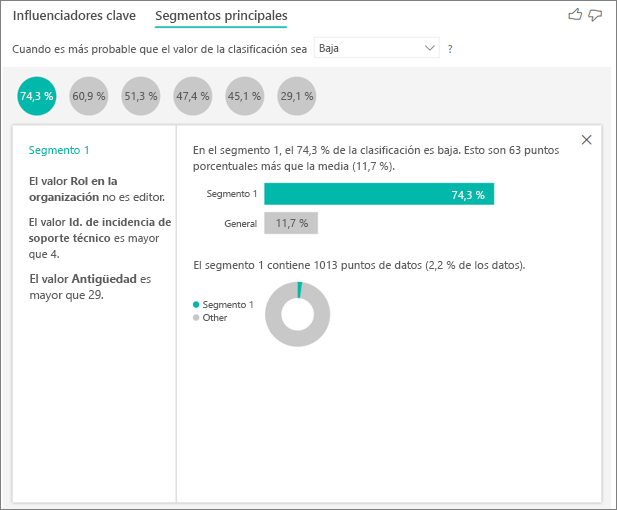
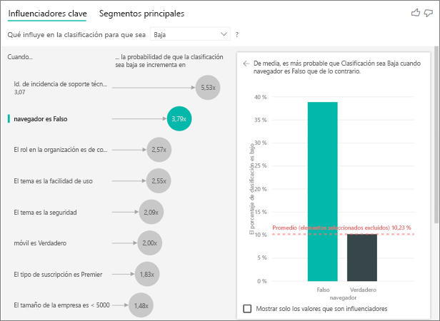
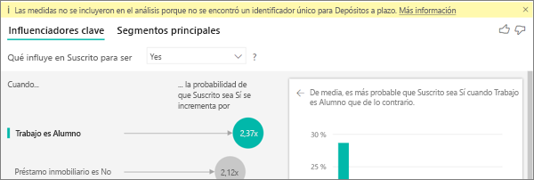

# Visualización de influenciadores clave
El objeto visual de influenciadores clave le ayudará a reconocer los factores que controlan una métrica de su interés. Analiza los datos, clasifica los factores que son importantes y los muestra como influenciadores clave. Por ejemplo, digamos que le interesa averiguar lo que influye en la rotación de empleados (abandono). La duración del contrato de empleo puede ser uno de los factores, mientras que otro puede ser la edad del empleado. 
 
## ¿Cuándo se deben usar influenciadores clave? 
El objeto visual de influenciador clave es una excelente opción: 
- Para ver qué factores afectan a la métrica que se está analizando.

- Para comparar la importancia relativa de estos factores. Por ejemplo, ¿los contratos a corto plazo tienen más impacto en el abandono que los contratos a largo plazo? 

## Requisitos de los influenciadores clave 
La métrica que se analiza debe ser un campo de categoría.    

## Características del objeto visual de influenciador clave

    

1. ***Pestañas***: seleccione una pestaña para alternar entre vistas. La opción Influenciadores clave muestran los principales contribuidores al valor de la métrica seleccionada. La opción Segmentos principales muestra los segmentos principales que contribuyen al valor de la métrica seleccionado. Un *segmento* está formado por una combinación de valores.  Por ejemplo, un segmento puede estar integrado por los consumidores que han sido clientes durante veinte años como mínimo y residen en la región occidental. 

2. ***Lista desplegable***: valor de la métrica que se está investigando. En este ejemplo vamos a examinar la métrica **Clasificación** y el valor que hemos seleccionado es **Baja**.    

3. ***Redefinición***: nos ayuda a interpretar el objeto visual en el panel izquierdo. 

4. ***Panel izquierdo***: el panel izquierdo contiene un objeto visual.  En este caso, el panel izquierdo muestra una lista de los principales influenciadores clave.

5. ***Redefinición***: nos ayuda a interpretar el objeto visual en el panel derecho.

6. ***Panel derecho***: el panel derecho contiene un objeto visual. En este caso, el gráfico de columnas muestra todos los valores para el **influenciador clave**, **Tema**, que está seleccionado en el panel izquierdo. El valor específico (**Facilidad de uso**) en el panel izquierdo se muestra de color verde y todos los demás valores de **Tema** se muestran en negro.

7. ***Línea promedio***: el promedio se calcula para todos los otros valores posibles para **Tema** excepto la **facilidad de uso**. Por lo tanto, el cálculo se aplica a todos los valores de color negro. Nos indica qué porcentaje de los demás **temas** ha dado como resultado una clasificación baja. En otras palabras, cuando un cliente da una clasificación, el cliente también describe el motivo o el **tema** para la clasificación. Algunos de estos temas son la facilidad de uso, la velocidad, la seguridad, etc. El valor **Tema** es **Facilidad de uso** corresponde al segundo influenciador clave más importante para una clasificación baja, según nuestro objeto visual en el panel izquierdo. Si hacemos un promedio de todos los otros temas, y su contribución a una clasificación **baja**, obtenemos el resultado que aquí se muestra en rojo. De todos los demás temas dados, solo el 11,35 % son mayores que la **facilidad de uso**. 

8. ***Casilla de verificación***: mostrar solo los valores que son influenciadores.

## Creación de un objeto visual de influenciadores clave 
 
Vea este vídeo para aprender el procedimiento para crear un objeto visual de influenciadores clave y, después, siga los pasos que se indican a continuación para crear uno propio. 

<iframe width="560" height="315" src="https://www.youtube.com/embed/fDb5zZ3xmxU" frameborder="0" allow="accelerometer; autoplay; encrypted-media; gyroscope; picture-in-picture" allowfullscreen></iframe>

Nuestro director de producto quiere averiguar qué factores conducen a los clientes a dejar reseñas negativas sobre nuestro servicio en la nube.  Para continuar, abra el [archivo PBIX de comentarios del cliente](https://github.com/Microsoft/powerbi-desktop-samples/blob/master/2019/customerfeedback.pbix) en Power BI Desktop. También puede descargar el [archivo de Excel de comentarios del cliente para el servicio Power BI o Power BI Desktop](https://github.com/Microsoft/powerbi-desktop-samples/blob/master/2019/customerfeedback.xlsx). 

> [!NOTE]
> El conjunto de datos de comentarios del cliente se basa en [Moro et al., 2014] S. Moro, P. Cortez y P. Rita. A Data-Driven Approach to Predict the Success of Bank Telemarketing. Decision Support Systems, Elsevier, 62:22-31, junio de 2014 

1. Abra el informe y seleccione el icono de influenciadores clave.  

    

2. Arrastre la métrica que quiera investigar al campo **Analizar**. El campo **Analizar** admite solo variables (no continuas) de categorías. Puesto que estamos interesados en saber qué es lo que hace que la clasificación de un cliente de nuestro servicio sea **baja**, seleccionamos **Tabla de cliente** > **Clasificación**.    
3. A continuación, arrastre los campos que piensa que podrían influir en **Clasificación** a la sección **Explicar por**. Puede arrastrar tantos campos como quiera. En este caso, empezamos con los siguientes: 
    - País o región 
    - Rol en la organización 
    - Tipo de suscripción 
    - Tamaño de la empresa 
    - Tema     
4. Puesto que estamos interesados en las clasificaciones negativas, seleccione **Baja** en la lista desplegable **Qué influye en Clasificación para ser**.  

    

El análisis se ejecuta en el nivel de tabla del campo que se analiza. En este caso, estamos interesados en la métrica **Clasificación**, que se define en el nivel de cliente (cada cliente ha proporcionado una puntuación alta o una puntuación baja). Todos nuestros factores explicativos deben estar definidos en el nivel de cliente para que el objeto visual haga uso de ellos. 

En el ejemplo anterior, todos nuestros factores explicativos tienen una relación uno a uno o varios a uno con nuestra métrica. Por ejemplo, cada puntuación tiene exactamente un tema asociado a ella (que era el tema principal de la reseña del cliente). De forma similar, los clientes proceden de un país, y tienen un tipo de pertenencia y un rol en su organización. Nuestros factores explicativos ya son, por tanto, atributos de un cliente y no se necesita ninguna transformación; el objeto visual puede hacer uso inmediato de ellos. 

Más adelante en el tutorial veremos ejemplos más complejos donde tenemos relaciones de uno a varios. En esos casos, las columnas deben agregarse primero de forma descendente hasta el nivel de cliente, para poder ejecutar el análisis.  

Las medidas y agregados que se utilizan como factores explicativos también se evalúan en el nivel de tabla de la métrica **Analizar**; veremos algunos ejemplos más adelante en este artículo. 

## Interpretación de influenciadores clave de categorías 
Echemos un vistazo a nuestro influenciadores clave para las clasificaciones bajas. 

### Factor único principal que influye en la probabilidad de una clasificación baja

En nuestra organización, tenemos tres roles: consumidores, administradores y editores. Vemos que ser un consumidor es el factor principal que contribuye a una clasificación baja. 

Más concretamente, existe una probabilidad 2,57 veces superior de que nuestros clientes nos den una puntuación negativa. El gráfico de influenciadores clave indica **Rol en la organización es consumidor** en primer lugar en la lista de la izquierda. Al seleccionar **Rol en la organización es consumidor**, Power BI nos muestra detalles adicionales en el panel de la derecha; el impacto comparativo de cada **rol** en la probabilidad de una clasificación baja.
  
- Un 14,93 % de los consumidores da una puntuación baja.  
- En promedio, todos los demás roles dan una puntuación baja en el 5,78 % de las ocasiones. 
- Por lo tanto, existe una probabilidad 2,57 veces superior de dar una puntuación baja en comparación con todos los demás roles (diferencia entre la barra verde y la línea de puntos rojos). 

### Segundo factor único que influye en la probabilidad de una clasificación baja

El objeto visual de influenciadores clave puede comparar y clasificar factores de muchas variables diferentes.  Nuestro segundo influenciador clave no tiene nada que ver con **Rol en la organización**.  Seleccione el segundo influenciador de la lista; **Tema es facilidad de uso**. 

Aquí vemos que el segundo factor más importante está relacionado con el tema de la reseña del cliente. Los clientes que han hecho algún comentario sobre la *facilidad de uso* del producto tienen una probabilidad 2,21 veces superior de dar una puntuación baja en comparación con los clientes que han hecho comentarios sobre otros temas, como la confiabilidad, el diseño o la velocidad. 

Entre los objetos visuales se puede percibir que el promedio (línea discontinua roja) ha cambiado del 5,78 % al 11,34 %. El promedio es dinámico, ya que se basa en el promedio de todos los demás valores. En el caso del primer influenciador clave, el promedio ha excluido el rol de cliente, mientras que en el caso del segundo, ha excluido el tema de la facilidad de uso. 
 
Si se marca la casilla de la parte inferior del objeto visual, se producirá el filtrado visual a solo los valores influyentes (en este caso, los roles que generan una puntuación baja). Por lo tanto, pasamos de los doce temas a los cuatro que Power BI ha identificado como generadores de clasificaciones bajas. 

## Interacción con otros objetos visuales 
 
Cada vez que un usuario hace clic en una segmentación, un filtro u otro objeto visual en el lienzo, el objeto visual de influenciadores clave vuelve a ejecutar el análisis en la parte de datos nueva. Por ejemplo, vamos a arrastrar Tamaño de la empresa al informe y a utilizarlo como segmentación. Queremos ver si los influenciadores clave para nuestros clientes empresariales (el tamaño de la empresa es superior a 50 000) son diferentes respecto a la población general.  
 
Al seleccionar **>50 000** se vuelve a ejecutar el análisis y podemos ver que los influenciadores han cambiado. Para los clientes de empresas de gran tamaño, el mayor influenciador para las clasificaciones bajas tiene un **Tema** relacionado con **seguridad**. Quizás queremos investigarlo en profundidad, para ver si hay características de seguridad específicas con las que nuestros clientes de gran tamaño no se sientes satisfechos. 

## Interpretación de influenciadores clave continuos 
 
Hasta ahora hemos usado el objeto visual para explorar de qué manera los distintos campos de categorías influyen en las clasificaciones bajas. También es posible hacer que factores continuos (por ejemplo, edad, altura, precio) vayan a "Explicar por". Echemos un vistazo a lo que sucede si colocamos "Antigüedad" desde la tabla de cliente a "Explicar por". La antigüedad muestra el tiempo que el cliente ha estado usando el servicio. 
 
Descubrimos que, a medida que **Antigüedad** aumenta, también aumenta la probabilidad de recibir una clasificación inferior. Esta tendencia sugiere que, de hecho, nuestros clientes más a largo plazo tienen una mayor probabilidad de dar una puntuación negativa, lo cual es una información interesante y sobre la cual probablemente querremos realizar un seguimiento más adelante.  
 
La visualización nos indica que cada vez antigüedad sube 13,44 meses, como promedio, la probabilidad de clasificación baja aumenta 1,23 veces. En este caso, 13,44 meses representa la desviación estándar de la antigüedad. Por lo tanto, la información que recibimos examina cómo el aumento de la antigüedad en una cantidad estándar (la desviación estándar de la antigüedad) afecta a la probabilidad de recibir una clasificación baja. 
 
El gráfico de dispersión del lado derecho traza el porcentaje medio de clasificaciones bajas para cada valor de antigüedad e incluye una línea de tendencia para resaltar la pendiente.  

## Interpretación de medidas o agregados como influenciadores clave 
 
Por último, los usuarios pueden también usar medidas y agregados como factores explicativos dentro de su análisis. Por ejemplo, quizás queremos ver lo que afecta al número de incidencias de soporte técnico del cliente o la duración media que una incidencia abierta tiene en la puntuación que recibimos. 
 
En este caso, queremos ver si el número de incidencias de soporte técnico que tiene un cliente influye en la puntuación que nos da. Vamos a recuperar el identificador de incidencia de soporte técnico de la tabla Incidencia de soporte técnico. Dado que un cliente puede tener varias incidencias de soporte técnico, necesitamos agregar el identificador en el nivel de cliente. Esta agregación es importante, porque estamos ejecutando el análisis en el nivel de cliente, de modo que todos los controladores deben definirse en ese nivel de granularidad. 
 
Vamos a observar el número de identificadores (por lo que cada fila del cliente tendrá un número de incidencias de soporte técnico asociadas a ella). En este caso, vemos que a medida que el número de incidencias de soporte técnico aumenta, la probabilidad de que la clasificación sea baja es 5,51 veces superior. El objeto visual del lado derecho nos muestra el número medio de incidencias de soporte técnico por los diferentes valores de Clasificación (que se evalúan en el nivel de cliente). 

## Interpretación de los resultados: segmentos principales 
 
Mientras que la pestaña "Influenciadores clave" permite a los usuarios evaluar cada factor de forma individual, los usuarios pueden cambiar a "Segmentos principales" para ver cómo una combinación de factores afecta a la métrica que están analizando. 
 
Segmentos principales inicialmente muestra una información general de todos los segmentos que ha detectado Power BI. En el ejemplo siguiente podemos ver que se han encontrado seis segmentos. Estos segmentos se clasifican según el porcentaje de calificaciones bajas dentro del segmento. Vemos que el segmento 1, por ejemplo, tiene un 74,3 % de las clasificaciones de cliente bajas.  Cuanto mayor sea la burbuja, mayor será la proporción de clasificaciones bajas. El tamaño de la burbuja del otro lado representa el número de clientes que se encuentran dentro del segmento. 

Al seleccionar una burbuja se profundiza en los detalles del segmento. Si seleccionamos el Segmento 1, por ejemplo, vemos que se compone de un cliente relativamente consolidado (ya lleva con nosotros 29 meses) que tiene un gran número de incidencias de soporte técnico (más de 4). Por último, no son editores (por lo que son consumidores o administradores).  
 
En este grupo, el 74,3 % ha dado una clasificación baja. El cliente promedio proporciona una clasificación baja el 11,7 % de las veces, por lo que este segmento tiene una proporción mucho mayor de clasificaciones bajas (63 puntos porcentuales más). También vemos que el segmento 1 contiene aproximadamente 2,2 % de los datos, por lo que representa una parte de la población que puede corregirse. 

## Consideraciones y solución de problemas 
 
**¿Cuáles son las limitaciones de la versión preliminar?** 
 
Los objetos visuales de influenciadores clave están actualmente en versión preliminar pública, y existen varias limitaciones que los usuarios deben tener en cuenta. Entre la funcionalidad que actualmente no está disponible se incluye lo siguiente: 
- Análisis de las métricas que son agregados o medidas 
- Consumo del objeto visual en Power BI Embedded
- Consumo del objeto visual en aplicaciones móviles de Power BI
- Compatibilidad con RLS 
- Compatibilidad con las consultas directas 
- Compatibilidad con las conexiones dinámicas 
 
**Veo un error que indica que no se han encontrado influenciadores o segmentos. ¿Por qué?**  

Este error se produce cuando se han incluido campos en **Explicar por** pero no se han encontrado influenciadores.   
- Se ha incluido la métrica que se estaba analizando en "Analizar" y en "Explicar por" (debe eliminarse de **Explicar por**). 
- Los campos explicativos tienen demasiadas categorías con pocas observaciones. Esto dificulta a la visualización determinar los factores que son influenciadores, ya que resulta complicado generalizar las cosas en base a una serie limitada de observaciones. 
- Los factores explicativos tienen un número suficiente de observaciones para realizar generalizaciones, pero la visualización no ha buscado ninguna correlación significativa sobre la cual informar. 
 
**Veo un error que indica que la métrica que estoy analizando no tiene suficientes datos para que se ejecute el análisis a partir de ella. ¿Por qué?**  

La visualización funciona observando los patrones en los datos de un grupo (por ejemplo, los clientes que han dado clasificaciones bajas) en comparación con otros grupos (por ejemplo, los clientes que han dado clasificaciones altas). Si los datos en el modelo tienen muy pocas observaciones, resulta difícil buscar patrones. Si la visualización no tiene suficientes datos para buscar influenciadores significativos, esto indicará que se necesitan más datos para ejecutar el análisis. Recomendamos tener al menos 100 observaciones para el estado seleccionado (clientes que abandonan) y al menos 10 observaciones para los estados que se usan para la comparación (clientes que no abandonan).  
 
**Veo un error que indica que un campo en "Explicar por" no está relacionado de forma exclusiva con la tabla que contiene la métrica que estoy analizando. ¿Por qué?**  
 
El análisis se ejecuta en el nivel de tabla del campo que se analiza. Por ejemplo, si está analizando los comentarios del cliente sobre su servicio, podría tener una tabla que le indique si un cliente ha dado una clasificación alta o baja. En este caso, el análisis se ejecutará en el nivel de tabla del cliente. 

Si tiene una tabla relacionada que está definida en un nivel más pormenorizado que la tabla que contiene su métrica, le aparecerá este error. Vamos a ilustrarlo con un ejemplo: 
 
- Está analizando qué es lo hace que los clientes den unas clasificaciones bajas a su servicio. 
- Está interesado en ver si el dispositivo en el cual el cliente está consumiendo el servicio influye en las reseñas que aporta. 
- Un cliente puede consumir el servicio de varias maneras diferentes.   
- En el ejemplo siguiente, el cliente 10 000 000 usa un navegador y una tableta para interactuar con el servicio. 

Si intenta usar la columna de dispositivo como un factor explicativo, verá el siguiente error: 

Esto es porque el dispositivo no está definido en el nivel de cliente: un cliente puede consumir el servicio en varios dispositivos. Para que la visualización busque patrones, el dispositivo debe ser un atributo del cliente. En este caso, tengo varias soluciones según mis conocimientos del negocio: 
 
- Puedo cambiar el resumen del dispositivo para, por ejemplo, contar si creo que el número de dispositivos puede tener un impacto en la puntuación que da un cliente. 
- Puedo dinamizar la columna de dispositivo para ver si utilizar el servicio en un dispositivo específico influye en la clasificación de un cliente.  
 
En este ejemplo he dinamizado los datos para crear nuevas columnas para "navegador", "móvil" y "tableta". Ahora puedo usarlos en "Explicar por". Descubrimos que todos los dispositivos pasan a ser influenciadores, y que el navegador tiene el mayor impacto en la puntuación del cliente. 

Más concretamente, los clientes que no usan el navegador para consumir el servicio tienen una probabilidad 3,79 veces superior de asignar una puntuación baja que quienes sí lo usan. Más abajo en la lista vemos que en el caso del móvil, se produce el caso inverso. Los clientes que usan la aplicación móvil tienen mayor probabilidad de dar una puntuación baja que aquellos que no la usan.  

**Veo una advertencia que indica que las medidas no se han incluido en mi análisis. ¿Por qué?** 

El análisis se ejecuta en el nivel de tabla del campo que se analiza. Si está analizando el abandono de clientes, puede tener una tabla que le indique si un cliente ha abandonado o no. En este caso, el análisis se ejecutará en el nivel de tabla del cliente.
 
Las medidas y los agregados se analizan en este nivel de tabla, de forma predeterminada. Si tenemos una medida para "Gasto mensual promedio" para analizar en el nivel de tabla de cliente.  

Si la tabla de cliente no tiene un identificador único, no es posible evaluar la medida y el análisis la pasa por alto. Para evitarlo, asegúrese de que la tabla con la métrica (en este caso, la tabla de cliente) tiene un identificador único (por ejemplo, el identificador de cliente). También es muy fácil agregar una columna de índice con Power Query.
 
**Veo una advertencia que indica que la métrica que estoy analizando tiene más de 10 valores únicos y que esto puede afectar a la calidad del análisis. ¿Por qué?**  

La visualización de inteligencia artificial se optimiza para analizar las categorías (por ejemplo, Abandono es "Sí" o "No", Satisfacción del cliente es "Alta", "Media" o "Baja", etc.). Aumentar el número de categorías para analizar significa que tenemos menos observaciones por categoría, lo cual dificulta que la visualización busque patrones en los datos. 

Para buscar influenciadores más sólidos, se recomienda agrupar valores similares en una sola unidad. Por ejemplo, si tiene una métrica para el precio, es probable que obtenga mejores resultados mediante la agrupación de precios similares en algo parecido a categorías como "Alto", "Medio" o "Bajo", frente al uso de puntos de precio individuales. 

**Hay factores en mis datos que parecen indicar que son influenciadores clave, pero no lo son. ¿Cómo puede suceder esto?**

En el siguiente ejemplo vemos que los clientes que son consumidores generan unas clasificaciones bajas (un 14,93 % de las clasificaciones son bajas). Curiosamente, el rol de administrador también tiene una proporción alta de clasificaciones bajas (un 13,42 %) pero no se considera un influenciador. 

La razón de ello es que la visualización también tiene en cuenta el número de puntos de datos al buscar influenciadores. En el ejemplo siguiente, tenemos más de 29 000 consumidores y 10 veces menos administradores (aproximadamente, 2900). Además, solo 390 de ellos han dado una clasificación baja. El objeto visual, por lo tanto, no tiene suficientes datos para determinar si realmente ha buscado un patrón con clasificaciones de administrador o si es simplemente una búsqueda casual.  

**¿Cómo se calculan los influenciadores clave?**

En segundo plano, la visualización de inteligencia artificial usa [ML.NET](https://dotnet.microsoft.com/apps/machinelearning-ai/ml-dotnet) para ejecutar una regresión logística para calcular los influenciadores clave. Una regresión logística es un modelo estadístico que compara los distintos grupos entre sí. Si observamos lo que genera las clasificaciones bajas, la regresión logística se centrará en cómo los clientes que han dado una puntuación baja difieren de los que han dado una puntuación alta. Si tenemos varias categorías (puntuación alta, puntuación neutra, puntuación baja) nos centraremos en cómo los que han dado una clasificación baja difieren de los clientes que no han dado una clasificación baja (cómo difieren de los que han dado una clasificación alta O BIEN una clasificación neutral). 
 
La regresión logística busca patrones en los datos, centrándose en cómo los clientes que han dado una clasificación baja pueden diferir de los que han dado una clasificación alta. Puede descubrir, por ejemplo, que los clientes que tienen más incidencias de soporte técnico dan un porcentaje mucho mayor de clasificaciones bajas que los que tienen pocas incidencias de soporte técnico, o ninguna.
 
La regresión logística también tiene en cuenta cuántos puntos de datos están presentes. Si, por ejemplo, los clientes que desempeñan un rol de administrador dan, proporcionalmente, puntuaciones más negativas pero solo son una serie limitada de administradores, no se considera un factor influyente. Esto es porque no hay suficientes puntos de datos disponibles para deducir un patrón. Se usa una prueba estadística (prueba de Wald) para determinar si un factor se considera un influenciador. El objeto visual utiliza un valor p de 0,05 para determinar el umbral. 

**¿Cómo se calculan los segmentos?**

En segundo plano, la visualización de inteligencia artificial usa [ML.NET](https://dotnet.microsoft.com/apps/machinelearning-ai/ml-dotnet) para ejecutar un árbol de decisión para buscar los subgrupos interesantes. El objetivo final del árbol de decisión es un subgrupo de puntos de datos relativamente alto en la métrica en la cual estamos interesados (por ejemplo, los clientes que han dado una clasificación baja). 

El árbol de decisión toma cada factor explicativo e intenta razonar el factor que le dará la mejor "división". Por ejemplo, si filtramos los datos para incluir a solo a los clientes de las empresa de gran tamaño, ¿se diferenciarán los clientes que nos han dado una clasificación alta y los que han dado una clasificación baja? ¿O quizás será mejor si filtramos los datos para incluir solo a los clientes que han realizado comentarios sobre la seguridad? 

Una vez que el árbol de decisión realiza una división, toma el subgrupo de datos (por ejemplo, los clientes que han realizado comentarios sobre la seguridad) e intenta averiguar cuál será la siguiente división recomendada para estos datos. Después de cada división, también tiene en cuenta si tiene suficientes puntos de datos para que este sea un grupo representativo a partir del cual se puede deducir un patrón o si simplemente puede ser una anomalía en los datos y, por lo tanto, no un segmento real. (Se aplica otra prueba estadística para comprobar la importancia estadística de la condición de división, con un valor p de 0,05). 

Cuando finaliza la ejecución del árbol de decisión, toma todas las divisiones (comentarios de seguridad, empresa de gran tamaño) y crea los filtros de Power BI. Esta combinación de filtros se empaqueta como un segmento en el objeto visual. 
 
**¿Por qué ciertos factores se convierten en influenciadores o dejan de ser influenciadores a medida que arrastro más campos a "Explicar por"?**

La visualización evalúa todos los factores explicativos conjuntamente. Esto significa que mientras que por sí mismo un factor puede ser un influenciador, cuando se toma en consideración con otros factores puede no serlo. Imaginemos que analizamos qué es lo que hace que el precio de una casa sea alto, siendo el tamaño de la casa y los dormitorios los factores explicativos: 
- Por sí mismo, una cantidad mayor de dormitorios puede ser un impulsor para que los precios de la casa sean altos. 
- La inclusión del tamaño de la casa en el análisis significa que ahora veremos lo que ocurre con los dormitorios si el tamaño de la casa se mantiene constante. 
- Si fijamos el tamaño de la casa en 1500 metros cuadrados, es poco probable que aumentar continuadamente el número de dormitorios aumente considerablemente el precio de la casa. Los dormitorios pueden no ser un factor tan importante como lo era antes de que se tuviera en cuenta el tamaño de la casa. 

## Pasos siguientes
[Gráficos combinados en Power BI](power-bi-visualization-combo-chart.md)

[Tipos de visualización en Power BI](power-bi-visualization-types-for-reports-and-q-and-a.md)
