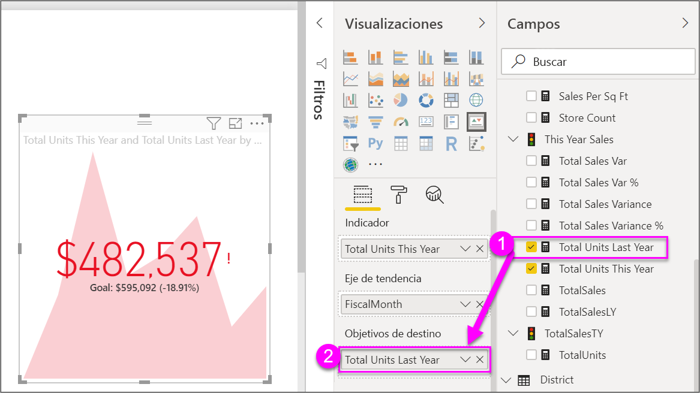

# Objetos visuales de KPI
Un indicador clave de rendimiento (KPI) es una indicación visual que comunica el progreso realizado para lograr un objetivo cuantificable. Para más información acerca de los KPI, consulte [Microsoft Developer Network](https://msdn.microsoft.com/library/hh272050).

Si no está registrado en Power BI, [regístrese para obtener una evaluación gratuita](https://app.powerbi.com/signupredirect?pbi_source=web) antes de empezar.

## Requisitos previos
* [Power BI Desktop: es gratuito.](https://powerbi.microsoft.com/get-started/)
* [Archivo PBIX del ejemplo de análisis de minoristas](http://download.microsoft.com/download/9/6/D/96DDC2FF-2568-491D-AAFA-AFDD6F763AE3/Retail%20Analysis%20Sample%20PBIX.pbix)

## Cuándo usar un KPI
Los KPI son una excelente opción:

* para medir el progreso (¿voy adelantado o retrasado?)
* para medir la distancia hasta un objetivo (¿cuánto adelanto o retraso tengo?)   

## Requisitos de KPI
Un indicador clave de rendimiento (KPI) se basa en una medida específica y está diseñado para ayudarle a evaluar el valor y el estado actuales de una métrica con respecto al objetivo definido. Por tanto, un objeto visual KPI requiere una medida *base* que se evalúa en un valor y una medida o un valor de *destino*, y un *umbral* u *objetivo*.

Actualmente, un conjunto de datos de KPI debe contener los valores objetivo de un KPI. Si el conjunto de datos no contiene uno, puede crear objetivos mediante la incorporación de una hoja de Excel con los objetivos a su modelo de datos o archivo PBIX.

## Cómo crear un KPI
Para continuar, abra el [archivo PBIX de análisis de minoristas](http://download.microsoft.com/download/9/6/D/96DDC2FF-2568-491D-AAFA-AFDD6F763AE3/Retail%20Analysis%20Sample%20PBIX.pbix) en Power BI Desktop. Vamos a crear un KPI que mide el progreso realizado para lograr un objetivo de ventas.

También puede ver otro en el que Will muestra cómo crear objetos visuales de métricas individuales: medidores, tarjetas y KPI.

<iframe width="560" height="315" src="https://www.youtube.com/embed/xmja6EpqaO0?list=PL1N57mwBHtN0JFoKSR0n-tBkUJHeMP2cP" frameborder="0" allowfullscreen></iframe>

1. Abra el informe en la Vista de informe y seleccione la pestaña de color amarillo para agregar una nueva página.    
2. Desde el panel Campos, seleccione **Ventas > Unidades totales de este año**.  Este será el indicador.
3. Agregue **Tiempo > MesFiscal**.  Esto representará la tendencia.
4. IMPORTANTE: Ordene el gráfico por **MesFiscal**. Una vez que convierta la visualización en un KPI no habrá ninguna opción para ordenar.

    
5. Para convertir el objeto visual en un KPI, seleccione el icono KPI en el panel Visualización.
   
    
6. Agregue un objetivo. Agregue los últimos años de ventas como objetivo. Arrastre **Unidades totales del último año** al campo **Objetivos de destino**.
   
    
7. Para dar formato al KPI, seleccione el icono de rodillo de pintar para abrir el panel Formato.
   
   * **Indicador**: controla las unidades de visualización y los decimales del indicador.
   * **Eje de tendencia**: cuando se establece en **Activado**, el eje de tendencia se muestra como el fondo del objeto visual de KPI.  
   * **Objetivos**: cuando se establece en **Activado**, el objeto visual muestra el objetivo y la distancia desde el objetivo como un porcentaje.
   * **Codificación del color > Dirección**: algunos KPI se consideran *mejores* para valores mayores y otros son *mejores* con valores menores. Por ejemplo, ganancias frente a tiempo de espera. Normalmente, un mayor valor de ganancias es mejor que un mayor valor de tiempo de espera. Seleccione **alto es mejor** y, opcionalmente, cambie la configuración del color.

Los KPI también están disponibles en el servicio Power BI y en los dispositivos móviles: manténgase al día del progreso de sus negocios.

## Consideraciones y solución de problemas
* Si el KPI no se parece al anterior, puede deberse a que necesita ordenarlo por mes fiscal. Como los KPI no tienen una opción de ordenación, debe ordenar por mes fiscal *antes de* convertir la visualización en un KPI.

## Pasos siguientes

[Mapas básicos en Power BI](power-bi-map-tips-and-tricks.md)

[Tipos de visualización en Power BI](power-bi-visualization-types-for-reports-and-q-and-a.md)