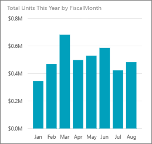
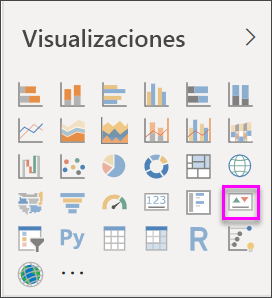

# Creación de visualizaciones de indicador clave de rendimiento (KPI)

[!INCLUDE [power-bi-visuals-desktop-banner](../includes/power-bi-visuals-desktop-banner.md)]

Un indicador clave de rendimiento (KPI) es una indicación visual que comunica el progreso realizado para lograr un objetivo cuantificable. Para más información sobre KPI, vea [Indicadores clave de rendimiento (KPI) en PowerPivot](/previous-versions/sql/sql-server-2012/hh272050(v=sql.110)).

Puede ver otro en el que Will muestra cómo crear objetos visuales de métricas individuales: medidores, tarjetas y KPI.
   > [!NOTE]
   > En este vídeo se usa una versión anterior de Power BI Desktop.
   > 
   > 
<iframe width="560" height="315" src="https://www.youtube.com/embed/xmja6EpqaO0?list=PL1N57mwBHtN0JFoKSR0n-tBkUJHeMP2cP" frameborder="0" allowfullscreen></iframe>

## Cuándo usar un KPI

Los KPI son una excelente opción:

* Para medir el progreso. Responde a la pregunta "¿en qué voy por delante o por detrás?"

* Para medir la distancia hasta un objetivo. Responde a la pregunta "¿A qué distancia por delante o por detrás estoy?"

## Requisitos de KPI

Un diseñador basa un objeto visual de KPI en una medida específica. La intención del KPI es ayudarlo a evaluar el valor y el estado actuales de una métrica con respecto a un objetivo definido. Un objeto visual de KPI requiere una medida *base* que se evalúa en un valor, una medida o un valor de *destino* y un *umbral* u *objetivo*.

Un conjunto de datos de KPI debe contener los valores objetivo de un KPI. Si el conjunto de datos no contiene valores objetivo, puede crearlos mediante la incorporación de una hoja de Excel con los objetivos a su modelo de datos o archivo PBIX.

## Requisitos previos

En este tutorial se usa el [archivo PBIX del Ejemplo de análisis de minoristas](https://download.microsoft.com/download/9/6/D/96DDC2FF-2568-491D-AAFA-AFDD6F763AE3/Retail%20Analysis%20Sample%20PBIX.pbix).

1. En la sección superior izquierda de la barra de menús, seleccione **Archivo** > **Abrir**.

1. Busque la copia del **archivo PBIX del Ejemplo de análisis de minoristas**.

1. Abra el **archivo .PBIX del Ejemplo de análisis de minoristas** en la vista de informe. 

1. Seleccione **+** para agregar una página nueva. 

## Cómo crear un KPI

En este ejemplo, creará un KPI que mide el progreso que ha realizado para lograr un objetivo de ventas.

1. En el panel **Campos**, seleccione **Ventas > Total de unidades este año**.  Este valor será el indicador.

1. Agregue **Tiempo > MesFiscal**.  Este valor representará la tendencia.

1. En la esquina superior derecha del objeto visual, seleccione los puntos suspensivos y compruebe que Power BI ordenó las columnas en orden ascendente por **MesFiscal**.

    > [!IMPORTANT]
    > Una vez que convierta la visualización en un KPI **no** habrá ninguna opción para ordenar. Debe ordenarlo correctamente ahora.

    

    Una vez ordenado correctamente, el objeto visual tendrá este aspecto:

    

1. Para convertir el objeto visual en un KPI, seleccione el icono **KPI** en el panel **Visualización**.

    

1. Para agregar un objetivo, arrastre **Total de unidades año anterior** al campo **Objetivos de destino**.

    

1. Para dar formato al KPI, seleccione el icono de rodillo de pintar para abrir el panel Formato.

    * **Indicador**: controla las unidades de visualización y los decimales del indicador.

    * **Eje de tendencia**: cuando se establece en **Activado**, el objeto visual muestra el eje de tendencia como el fondo del objeto visual de KPI.  

    * **Objetivos**: cuando se establece en **Activado**, el objeto visual muestra el objetivo y la distancia desde el objetivo como un porcentaje.

    * **Codificación del color > Dirección**: las personas consideran algunos KPI mejores para valores *más altos* y otros mejores para valores *más bajos*. Por ejemplo, ganancias frente a tiempo de espera. Normalmente, un mayor valor de ganancias es mejor que un mayor valor de tiempo de espera. Seleccione **Alto está bien** y, opcionalmente, cambie la configuración del color.

Los KPI están también disponibles en el servicio Power BI y en los dispositivos móviles. Ofrece la opción de estar siempre conectado al latido de su empresa.

## Consideraciones y solución de problemas

Si el KPI no se parece al anterior, puede deberse a que no ordenó por **MesFiscal**. Los KPI no tienen una opción de ordenación. Tiene que empezar de nuevo y ordenar por **Mes fiscal** *antes* de convertir la visualización en un KPI.

## Pasos siguientes

* [Sugerencias y trucos para las visualizaciones de mapas de Power BI](power-bi-map-tips-and-tricks.md)

* [Tipos de visualización en Power BI](power-bi-visualization-types-for-reports-and-q-and-a.md)

¿Tiene más preguntas? [Pruebe la comunidad de Power BI](https://community.powerbi.com/)
