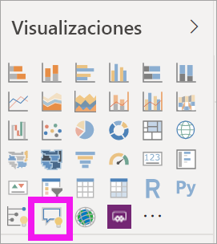
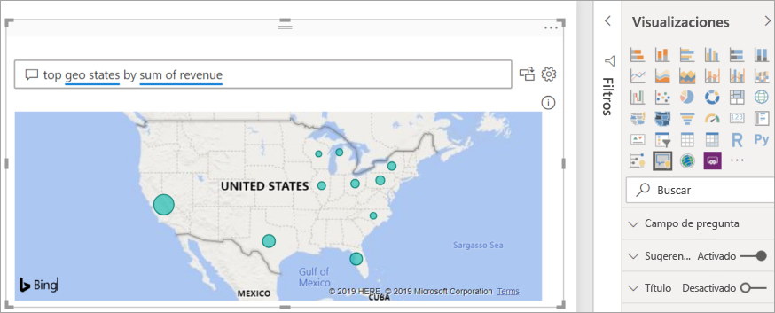
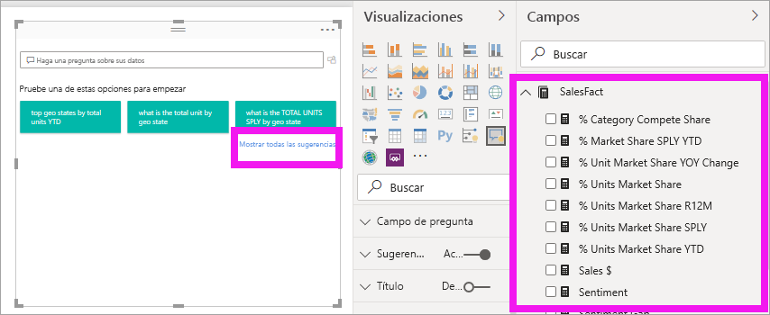
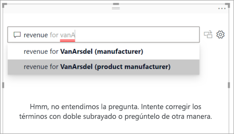
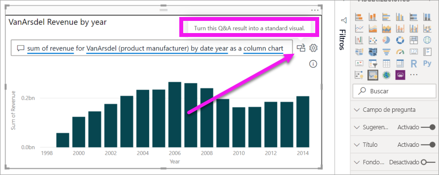
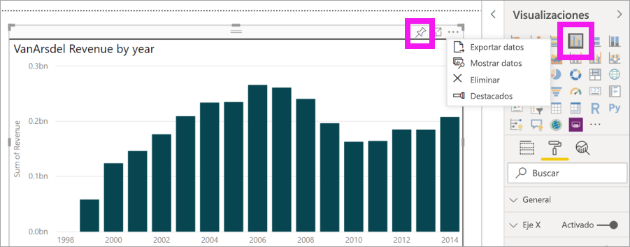
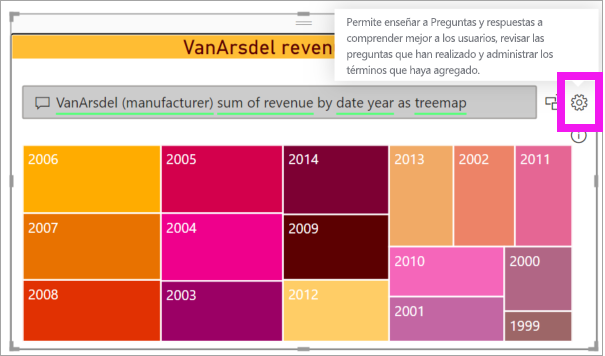
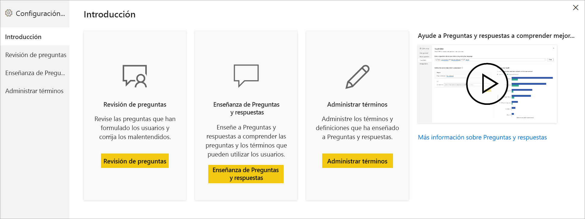

# Introducción a las visualizaciones de preguntas y respuestas de Power BI

[!INCLUDE[consumer-appliesto-nyyn](../includes/consumer-appliesto-nyyn.md)]    

[!INCLUDE [power-bi-service-new-look-include](../includes/power-bi-service-new-look-include.md)]

## ¿Qué son las visualizaciones de preguntas y respuestas?

El objeto visual Preguntas y respuestas permite a los usuarios realizar preguntas con lenguaje natural y obtener las respuestas en forma de objeto visual. 

[!INCLUDE [power-bi-visuals-desktop-banner](../includes/power-bi-visuals-desktop-banner.md)]

El objeto visual Preguntas y respuestas se puede usar no solo como una herramienta que permita a los *consumidores* obtener respuestas rápidamente para sus datos, sino que también pueden usarlo los *diseñadores* para crear objetos visuales en un informe simplemente haciendo doble clic en cualquier parte del mismo y usando lenguaje natural desde el principio. Al comportarse como cualquier otro, el objeto visual Preguntas y respuestas admite los filtros cruzados y los elementos destacados cruzados, así como los marcadores. El objeto visual Preguntas y respuestas también admite temas y otras opciones de formato predeterminadas que están disponibles en Power BI.

El objeto visual Preguntas y respuestas consta de cuatro componentes principales:

- El cuadro de preguntas. Ahí es donde los usuarios escriben sus preguntas y donde se muestran sugerencias que les ayudan a completar su pregunta.
- Una lista rellenada previamente de preguntas sugeridas.
- Icono para convertir el objeto visual Preguntas y respuestas en un objeto visual estándar. 
- Icono para abrir las herramientas de Preguntas y respuestas que permiten a los diseñadores configurar el motor de lenguaje natural subyacente.

## Requisitos previos

1. En este tutorial se usa el [archivo .PBIX del ejemplo de ventas y marketing](https://download.microsoft.com/download/9/7/6/9767913A-29DB-40CF-8944-9AC2BC940C53/Sales%20and%20Marketing%20Sample%20PBIX.pbix). 

1. En la sección superior izquierda de la barra de menús de Power BI Desktop, seleccione **Archivo** > **Abrir**.
   
2. Busque su copia del **archivo .PBIX de ejemplo de ventas y marketing**.

1. Abra el archivo en la vista de informe. .

1. Seleccionar  para agregar una nueva página.

Si aparece algún error al crear un objeto visual Preguntas y respuestas, asegúrese de consultar la sección de [limitaciones](../natural-language/q-and-a-limitations.md) para ver si se admite la configuración del origen de datos.    

> [!NOTE]
> Para compartir el informe con un compañero en Power BI es necesario que los dos tengan licencias de Power BI Pro individuales o que el informe esté guardado en la capacidad Premium. Consulte [cómo compartir informes](../collaborate-share/service-share-reports.md).

## Creación de un objeto visual Preguntas y respuestas mediante una pregunta sugerida
En este ejercicio, vamos a seleccionar una de las preguntas sugeridas para crear un objeto visual Preguntas y respuestas. 

1. Inicie una página de informe en blanco y seleccione el icono de objeto visual Preguntas y respuestas en el panel Visualizaciones.

    

2. Arrastre el borde para cambiar el tamaño del objeto visual.

    

3. Para crear el objeto visual, seleccione una de las preguntas que se sugieren o empiece a escribir en el cuadro de preguntas. En este ejemplo, hemos seleccionado los **top geo states by sum of revenue** (estados geográficos con mayor suma de ingresos). Power BI selecciona lo mejor posible el tipo de objeto visual que se va a usar. En este caso, es un mapa.

    

    Pero puede indicar a Power BI qué tipo de objeto visual se va a usar. Para ello, no tiene más que agregarlo a su consulta en lenguaje natural. Tenga en cuenta que no todos los tipos de objetos visuales funcionan o tienen sentido con sus datos. Por ejemplo, estos datos no generarían un gráfico de dispersión significativo. Sin embargo, funcionan como un mapa coroplético.

    

## Creación de un objeto visual Preguntas y respuestas mediante el uso de una consulta en lenguaje natural
En el ejemplo anterior, seleccionamos una de las preguntas sugeridas para crear un objeto visual Preguntas y respuestas.  En este, vamos a escribir nuestra propia pregunta. A medida que escribimos la pregunta, Power BI nos ayuda con Autocompletar, sugerencias y comentarios.

Si no está seguro del tipo de preguntas que se deben formular o la terminología que se utiliza, expanda **Mostrar todas las sugerencias** o examine el panel Campos, que se puede encontrar en el lado derecho del lienzo. Esto le ayudará a familiarizarse con los términos y el contenido del conjunto de datos Sales & Marketing.

1. Escriba una pregunta en el campo de preguntas y respuestas. Power BI subraya en rojo las palabras que no reconoce. Siempre que es posible, Power BI ayuda a definir las palabras que no se reconocen.  En el primer ejemplo que aparece a continuación, se podrá seleccionar cualquiera de las sugerencias.  

    

2. A medida que escribimos más contenido de la pregunta, Power BI nos hace saber que no entiende la pregunta e intenta ayudarnos. En el ejemplo siguiente, Power BI nos pregunta "¿quiso decir..." y sugiere una manera diferente de formular la pregunta con terminología del conjunto de datos. 

    

5. Con la ayuda de Power BI, pudimos formular una pregunta con todos los términos reconocibles. Power BI muestra los resultados en forma de gráfico de líneas. 

    

6. Vamos a cambiar el objeto visual a un gráfico de columnas. 

    

7.  Agregue más objetos visuales a la página del informe y vea cómo interactúa el objeto visual Preguntas y respuestas con los demás objetos visuales de la página. En este ejemplo, el objeto visual Preguntas y respuestas ha aplicado un filtro cruzado al gráfico de líneas y al mapa, y ha aplicado un resaltado cruzado al gráfico de barras.

    

## Formato y personalización del objeto visual Preguntas y respuestas
El objeto Preguntas y respuestas se puede personalizar tanto desde el panel de formato como aplicando un tema. 

### Aplicación de un tema
Al seleccionar un tema, este se aplica a toda la página del informe. Hay muchos temas entre los que elegir, así que pruébelos hasta que obtenga la apariencia que desee. 

1. En la barra de menús, seleccione la pestaña **Inicio** y elija **Cambiar tema**. 

    

    
    
2. En este ejemplo hemos seleccionado **Más temas** > **Color blind safe** (Para daltónicos).

    

### Formato del objeto visual Preguntas y respuestas
Dé formato al objeto visual Preguntas y respuestas, al campo de preguntas y a la forma en que se muestran las sugerencias. Puede cambiar todos los elementos, desde el fondo de un título hasta el color de las palabras no reconocidas cuando se pasa el puntero. Aquí hemos agregado un fondo gris al cuadro de preguntas y hemos cambiado el subrayado a amarillo y verde. El título está centrado y tiene un fondo amarillo. 

## Conversión de un objeto visual Preguntas y respuestas en un objeto visual estándar
Hemos dado algo de formato al objeto visual del gráfico de columnas del tema Color blind safe (Para daltónicos): hemos agregado un título y un borde, y ya estamos preparados para convertirlo en un objeto visual estándar del informe y a anclarlo a un panel.

Seleccione el  para **convertir este objeto Preguntas y respuestas en un objeto visual estándar**.

Este ya no es un objeto visual Preguntas y respuestas, sino un gráfico de columnas estándar. Se puede anclar a un panel. En el informe, este objeto visual se comporta de la misma forma que los restantes objetos visuales estándar. Observe que en el panel Visualizaciones está seleccionado el icono de gráfico de columnas en lugar del icono del objeto visual Preguntas y respuestas.

Si usa el ***servicio Power BI***, ahora puede anclar el objeto visual a un panel, para lo que debe seleccionar el icono Anclar. 

## Características avanzadas del objeto visual Preguntas y respuestas
Al seleccionar el icono de engranaje, se abre el panel de herramientas del objeto visual Preguntas y respuestas. 

Use el panel de herramientas para enseñar a los términos de Preguntas y respuestas que no se reconocen, a administrar esos términos y a administrar las preguntas sugeridas para este conjunto de herramientas e informe. En el panel de herramientas también puede examinar las preguntas que se han formulado mediante este objeto visual Preguntas y respuestas, y ver las preguntas que han marcado los usuarios. Para más información, consulte el artículo en el que se realiza una [introducción a las herramientas de Preguntas y respuestas](../natural-language/q-and-a-tooling-intro.md).

## Consideraciones y solución de problemas
El objeto visual Preguntas y respuestas se integra con Office y Bing para intentar encuadrar las palabras comunes que no se reconocen en los campos del conjunto de datos.  

## Pasos siguientes

Hay varias formas de integrar el lenguaje natural. Para más información, consulte los siguientes artículos:

* [Introducción a Preguntas y respuestas](../natural-language/q-and-a-tooling-intro.md)
* [Procedimientos recomendados de Preguntas y respuestas](../natural-language/q-and-a-best-practices.md)
