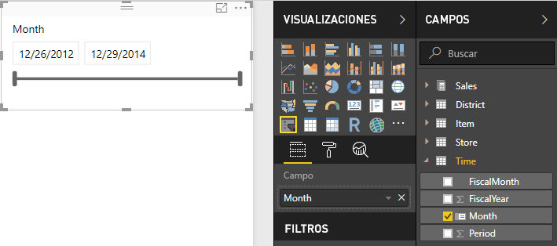
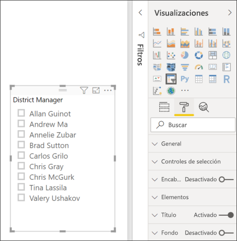
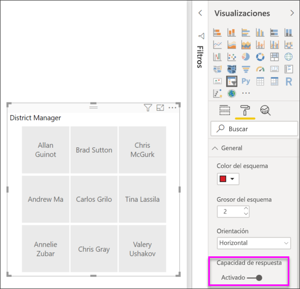
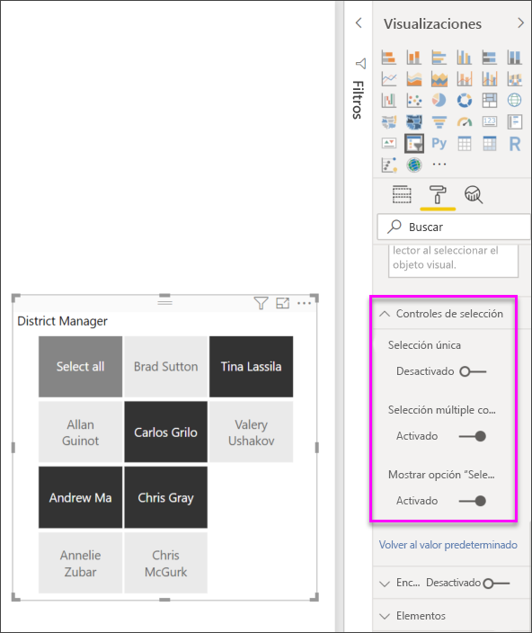

# Segmentaciones de datos en Power BI
Quiere que los lectores del informe puedan buscar métricas de ventas generales, pero también resaltar el rendimiento de los administradores de distrito y los diferentes plazos de tiempo. Podría crear informes independientes o gráficos comparativos, o bien utilizar segmentaciones. Una segmentación es una forma alternativa de filtro que limita la parte del conjunto de datos que se muestra en otras visualizaciones de un informe. 

En este tutorial se usa el [ejemplo de análisis de minoristas](../sample-retail-analysis.md) gratuito para guiarlo a la hora de crear segmentaciones de plazos de tiempo, así como darles formato y crear listas de ellas. Diviértase descubriendo maneras de dar formato y usar segmentaciones. 

## Cuándo usar una segmentación
Las segmentaciones son una excelente opción si desea:

* Mostrar filtros importantes o que se usan con comúnmente en el lienzo de informes para facilitar el acceso.
* Facilitar la visualización del estado filtrado actual sin tener que abrir una lista desplegable. 
* Filtrar por columnas innecesarias y ocultas en las tablas de datos.
* Crear informes más enfocados colocando las segmentaciones junto a objetos visuales importantes.

Las segmentaciones de Power BI tienen las siguientes limitaciones:

- Las segmentaciones no admiten campos de entrada.
- Las segmentaciones se anclan en un panel.
- No se admite la exploración en profundidad para las segmentaciones.
- Las segmentaciones no admiten los filtros de nivel de objetos visuales.

## Creación de segmentaciones

Para crear una nueva segmentación, puede seleccionar el icono de segmentación y, luego, seleccionar el campo de datos para filtrar (o arrastrarlo al cuadro **Campos** del panel **Visualizaciones**). También puede seleccionar o arrastrar primero el campo de datos para crear una visualización y, luego, seleccionar el icono de segmentación para activar la visualización en una segmentación. Diferentes tipos de datos crean distintos tipos de segmentaciones, con opciones y efectos también diferentes. 

La primera vez que cambia un informe, se ilumina el botón **Restablecer valores predeterminados**. Se trata de un aviso de que ha realizado un cambio en la configuración del informe original. Si navega fuera del informe, ese cambio se guarda (se conserva). Cuando vuelve al informe, no tiene que volver a segmentar el informe.  Pero si lo que quiere es restablecer el informe a la configuración predeterminada del autor, tiene que presionar el botón **Restablecer valores predeterminados** en la barra de menús superior.

> [!NOTE]
> Si el botón **Restablecer valores predeterminados** permanece deshabilitado, puede significar que el autor del informe ha deshabilitado la característica para el informe o que el informe contiene un objeto visual personalizado. Solo tiene que mantener el mouse sobre el botón para leer la información sobre herramientas y obtener una explicación. 

**Para crear una nueva segmentación con el fin de filtrar los datos por administrador de distrito**

1. Abra el [ejemplo Retail Analysis](../sample-retail-analysis.md) en Power BI Desktop o en el servicio Power BI. En el servicio Power BI, seleccione **Editar informe**.
2. En la página **Información general**, sin nada seleccionado en el lienzo, elija el icono de **Segmentación**  en el panel **Visualizaciones** para crear una nueva segmentación. 
3. Con la nueva segmentación seleccionada, elija la opción **Administrador de distrito** de **Distrito**, en el panel **Campos** para rellenar la segmentación. La nueva segmentación es una lista con cuadros de selección antes de los nombres. 
    
    
    
4. Cambie el tamaño de la segmentación y otros elementos, y arrástrelos en el lienzo para dejar espacio a la segmentación. Tenga en cuenta que los elementos de segmentación se recortan si elige un tamaño de segmentación demasiado pequeño. 
5. Seleccione los nombres en la segmentación y observe el efecto que tiene en las otras visualizaciones de la página. Seleccione los nombres de nuevo para anular la selección y mantenga presionada la tecla **Ctrl** para elegir más de un nombre. Seleccionar todos los nombres es lo mismo que no elegir ninguno. 

>[!TIP]
>De forma predeterminada, los elementos de la segmentación de lista se ordenan de forma ascendente y alfanumérica. Para ordenar los elementos de la segmentación en el orden alfabético inverso, seleccione el botón de puntos suspensivos (**...**), situado en la esquina superior derecha de la segmentación, y elija **Ordenar por Administrador del distrito**. 

**Para crear una nueva segmentación con el fin de filtrar datos por intervalo de fechas**

1. Sin ningún elemento seleccionado en el lienzo, haga clic en **Hora** en el panel Campos y arrastre **Mes** (o **Fecha** en el servicio Power BI) al cuadro **Valores**del panel Visualizaciones para crear una visualización.
2. Con la nueva visualización elegida, seleccione el icono de **Segmentación** en el panel Visualizaciones para convertir la nueva visualización en una segmentación. Esta segmentación es un control deslizante con el intervalo de fechas rellenado.
    
    
    
4. Cambie el tamaño de la segmentación y otros elementos, y arrástrelos en el lienzo para dejar espacio a la segmentación. Tenga en cuenta que con el tamaño de segmentación se cambia el tamaño del control deslizante, pero desaparece y las fechas se recortan si elige un tamaño demasiado pequeño para la segmentación. 
4. Seleccione intervalos de fechas diferentes con el control deslizante, o bien un campo de fecha para escribir un valor o abrir una ventana emergente con un calendario para hacer una selección más precisa. Observe los efectos que tiene en las demás visualizaciones de la página.
    
    >[!NOTE]
    >Los tipos de datos numéricos y de fecha/hora generan las segmentaciones de control deslizante de intervalo de forma predeterminada. A partir de la actualización de febrero de 2018 de Power BI, las segmentaciones de intervalo de tipo de datos de número entero ahora se ajustan a los valores de número entero en lugar de mostrar las posiciones decimales. 

>[!TIP]
>Aunque el campo de datos **Mes** genera un tipo de segmentación de control deslizante de intervalo **Entre** de forma predeterminada, puede cambiarlo a otros tipos de segmentación y otras opciones de selección. Para cambiar el tipo de segmentación, con la segmentación seleccionada, mantenga el mouse sobre el área superior derecha de la segmentación, haga clic en el acento circunflejo que aparece y elija una de las otras opciones, como **Lista** o **Antes**. Observe cómo cambian las opciones de selección y la apariencia de las segmentaciones. 

Consulte [Uso de la segmentación de intervalos numéricos en Power BI Desktop](../desktop-slicer-numeric-range.md) para obtener más información sobre cómo crear y usar las segmentaciones de intervalos numérico y de fecha.
<iframe width="560" height="315" src="https://www.youtube.com/embed/zIZPA0UrJyA" frameborder="0" allowfullscreen></iframe> 

## Control de qué objetos visuales de página se ven afectados por las segmentaciones
De forma predeterminada, las segmentaciones de las páginas del informe afectan a todas las visualizaciones de la página. Cuando elija los valores en los controles deslizante de lista y fecha que acaba de crear, observe cómo afecta a las otras visualizaciones. Los datos filtrados están una intersección de los valores seleccionados en las dos segmentaciones. 

Use **Interacciones de objetos visuales** para impedir que algunas visualizaciones de página se vean afectadas. En la página **Información general**, el gráfico "Varianza total de ventas por mes fiscal y administrador del distrito" muestra datos comparativos generales de los administradores del distrito por mes, que quiere que sean visibles en todo momento. Puede usar **Interacciones de objetos visuales** para que las selecciones de segmentación sigan filtrando este gráfico. 

1. Con la segmentación de administrador de distrito:
    - En Power BI Desktop, haga clic en el menú **Formato** en **Visual Tools** y seleccione **Editar interacciones**.
    - En el servicio Power BI, vaya a la lista desplegable **Interacciones de objetos visuales** desde la barra de menús y active **Editar interacciones**. 
   
   Los controles de filtro  aparecen encima de los demás objetos visuales de la página. Inicialmente, todos los iconos de **Filtro** están seleccionados.
   
2. Seleccione el icono de **Ninguno** encima del gráfico **Varianza total de ventas por mes fiscal y administrador del distrito** para hacer que la segmentación deje de filtrarla. 
3. Seleccione la segmentación **Mes** y, de nuevo, elija el icono de **Ninguno** encima del gráfico **Varianza total de ventas por mes fiscal y administrador del distrito** para hacer que la segmentación deje de filtrarla. Ahora, cuando seleccione los nombres e intervalos de fechas en las segmentaciones, el gráfico Varianza total de ventas por mes fiscal y administrador del distrito no se modifica. 

Vea [Interacciones de visualización en un informe de Power BI](../consumer/end-user-interactions.md) para obtener más información sobre cómo editar las interacciones.

## Sincronización y uso de las segmentaciones en otras páginas
A partir de la actualización de febrero de 2018 de Power BI se puede sincronizar una segmentación y usarla en una o todas las páginas de un informe. 

En el informe actual, la página **Ventas mensuales de distrito** también hay una segmentación **Administrador de distrito**, pero no se ha sincronizado con la que creó en la página **Información general** (las dos segmentaciones pueden tener diferentes selecciones de elementos). La página **Nuevas tiendas** tiene solo una segmentación **Nombre de la tienda**. Puede sincronizar la nueva segmentación **Administrador de distrito** con estas páginas, para que las selecciones de segmentación de cualquier página afecten a las visualizaciones de las tres páginas. 

1. En el menú **Ver**, seleccione **Sincronización de segmentaciones** en Power BI Desktop o active **Panel de segmentaciones de sincronización** en el servicio Power BI. Aparecerá el **panel de segmentaciones** de sincronización. 
2. En la página **Información general**, seleccione la segmentación **Administrador del distrito**. Tenga en cuenta que la página **Ventas mensuales de distrito** ya está seleccionada en la columna **Visible** porque también hay una segmentación Administrador de distrito en esa página, pero no está seleccionada en la columna **Sincronización**. 
    
    
    
3. En la columna **Sincronización**, seleccione las páginas **Nuevas tiendas** y **Ventas mensuales de distrito** para sincronizar la segmentación **Información general** con esas páginas. 
    
3. En la columna **Visible**, seleccione la página **Nuevas tiendas** y deje seleccionada la página **Ventas mensuales de distrito**. 
4. Observe los efectos de sincronizar la segmentación y hacerla visible en las otras páginas. En la página **Ventas mensuales de distrito**, el control deslizante **Administrador de distrito** muestra ahora las mismas selecciones que en la página **Información general**. En la página **Nuevas tiendas**, las selecciones de la segmentación **Administrador de distrito** afecta a las selecciones que están disponibles en la segmentación **Nombre de la tienda**. 
    
    >[!TIP]
    >Aunque la segmentación aparece inicialmente en las páginas sincronizadas con el mismo tamaño y posición que en la página original, puede mover, cambiar el tamaño y dar formato de forma independiente a segmentaciones sincronizadas en las distintas páginas. 

>[!NOTE]
>Si sincroniza una segmentación con una página, pero no la hace visible en la página, las selecciones de segmentación realizadas en las demás páginas seguirán filtrando los datos en la página.
 
## Segmentaciones de formato
Existen diferentes opciones de formato según el tipo de segmentación. Con la orientación **Horizontal**, el diseño **dinámico** y la posibilidad de colorear **elementos**, puede generar botones o iconos en lugar de elementos de lista estándar, y hacer que los elementos de segmentación cambien de tamaño para ajustarse a diferentes diseños y tamaños de pantalla.  

1. Con la segmentación **Administrador de distrito** seleccionada, en el panel **Visualizaciones**, seleccione el icono **Formato**  para mostrar los controles de formato. 
    
    
    
2. Seleccione las flechas desplegables situadas junto a cada categoría para mostrar y editar las opciones. 

### Opciones generales
1. Seleccione el color rojo en **Color del esquema** y cambie **Grosor del esquema** a "2". Así se establecerá el color y el grosor de los esquemas o subrayados de los encabezados y elementos, en el caso de que estén habilitados. 
2. En **Orientación**, **Vertical** es el valor predeterminado. Seleccione **Horizontal** para producir una segmentación con botones o iconos organizados horizontalmente, y flechas de desplazamiento para tener acceso a elementos que no caben en la segmentación.
    
    
    
3. Active el diseño **dinámico** para cambiar el tamaño y la disposición de los elementos de segmentación según el tamaño de la segmentación y la pantalla. Para las segmentaciones de lista, el diseño dinámico solo está disponible en orientación horizontal y evita que los elementos queden recortados en pantallas pequeñas. Para las segmentaciones de control deslizante de intervalo, el diseño dinámico cambia el estilo del control deslizante y proporciona más flexibilidad para cambiar de tamaño. Ambos tipos de segmentaciones se convierten en iconos de filtro en tamaños muy pequeños. 
    
    
    
    >[!NOTE]
    >Los cambios del diseño de capacidad de respuesta pueden invalidar un determinado formato de encabezados y elementos que establezca. 
    
4. Establezca la posición y el tamaño de la segmentación con una precisión numérica en **Posición X**, **Posición Y**, **Ancho** y **Alto**, o bien mueva y cambie el tamaño de la segmentación directamente en el lienzo. Experimente con diferentes tamaños de elementos y organizaciones, y observe cómo el diseño dinámico cambia en consecuencia.  

    

Vea [Crear una segmentación con capacidad de respuesta que se puede cambiar de tamaño en Power BI](../power-bi-slicer-filter-responsive.md) para obtener más información sobre la orientación horizontal y el diseño dinámico.

### Opciones de controles de selección (solo segmentaciones de lista)
1. La opción **Mostrar Seleccionar todo** está **desactivada** de forma predeterminada. **Actívela** para agregar un elemento **Seleccionar todo** a la segmentación que seleccione todos los elementos o anule su selección cuando esté activa la opción. Cuando se seleccionan todos los elementos, al hacer clic o tocar en uno se anula la selección, con lo que se permite un filtro de tipo "No es…". 
    
    
    
2. La opción **Selección única** está **activada** de forma predeterminada. Al hacer clic o tocar en un elemento se selecciona y, si se mantiene presionada la tecla **Ctrl** mientras se hace clic o se toca, se seleccionan varios elementos. **Desactive** la opción **Selección única** para poder seleccionar varios elementos sin mantener presionada la tecla **Ctrl**. Si vuelve a hacer clic o tocar en un elemento, se anulará su selección. 

### Opciones de encabezado
El **encabezado** está **activado** de forma predeterminada y muestra el nombre del campo de datos en la parte superior de la segmentación. 
1. Dé formato al texto de encabezado para que el **color de fuente** sea rojo, el **tamaño del texto** sea de 14 puntos y la **familia de fuentes** sea Arial Black. 
2. En **Esquema**, elija **Solo abajo** para generar un subrayado con el tamaño y el color que establezca en **Opciones generales**. 

### Opciones de elemento (solo segmentaciones de lista)
1. Dé formato al texto y al fondo de los elementos para que el **color de fuente** sea negro, el **fondo** sea rojo claro, el **tamaño del texto** sea de 10 puntos y la **familia de fuentes** sea Arial. 
2. En **Esquema**, elija **Marco** para dibujar un borde alrededor de cada elemento con el tamaño y el color que establezca en **Opciones generales**. 
    
    
    
    >[!TIP]
    >- Con la **orientación horizontal**, los elementos no seleccionados muestran los colores de texto y fondo elegidos, mientras que los elementos seleccionados usan los colores predeterminados del sistema, que normalmente son el negro para los fondos con el texto de color blanco.
    >- Con la **orientación vertical**, los elementos siempre muestran los colores establecidos y los cuadros de selección siempre son de color negro cuando se seleccionan. 

### Entradas numéricas y de fecha, y opciones de control deslizante (solo segmentaciones de controles deslizantes de intervalo)
- Las entradas numéricas y de fecha son las mismas que las opciones de **Elemento** de las segmentaciones de lista, pero no hay ningún **esquema** ni subrayado.
- Las opciones de control deslizante permiten establecer el color del control deslizante de intervalo o **desactivar** el control deslizante para dejar solamente las entradas numéricas.

### Otras opciones de formato
Las demás opciones de formato están desactivadas de forma predeterminada. Si se **activan**: 
- **Título:** agrega un título y le da formato (de forma adicional e independiente del encabezado) en la parte superior de la segmentación. 
- **Fondo:** agrega un color de fondo a la segmentación general y establece su transparencia.
- **Aspecto de bloqueo:** conserva la forma de la segmentación si se cambia su tamaño.
- **Borde:** agrega un borde de 1 píxel alrededor de la segmentación y establece su color (este borde de la segmentación es independiente y no se ve afectado por la configuración general de Esquema). 

## Pasos siguientes
[Registrarse para obtener una evaluación gratuita](https://powerbi.microsoft.com/get-started/)

¿Tiene ideas sobre cómo mejorar Power BI? [Enviar una idea](https://ideas.powerbi.com/forums/265200-power-bi-ideas).

¿Tiene más preguntas? [Pruebe la comunidad de Power BI](http://community.powerbi.com/)

[Agregar una visualización a un informe](power-bi-report-add-visualizations-i.md)

[Tipos de visualización en Power BI](power-bi-visualization-types-for-reports-and-q-and-a.md)

[Power BI: Conceptos básicos](../consumer/end-user-basic-concepts.md)

