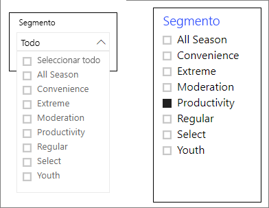
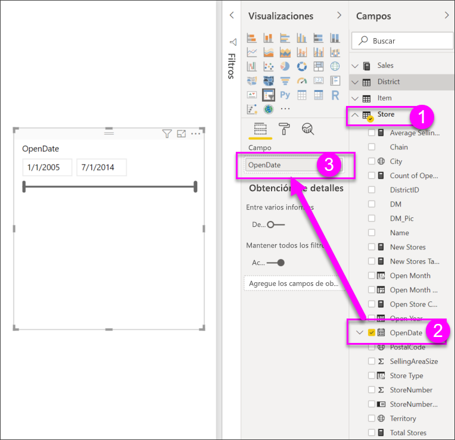
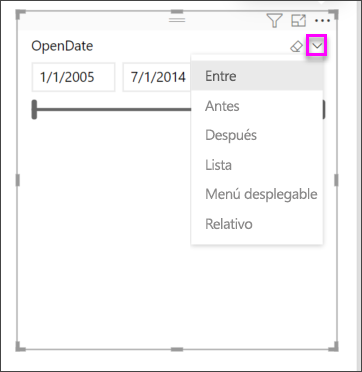
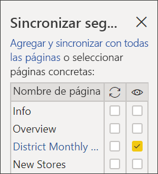
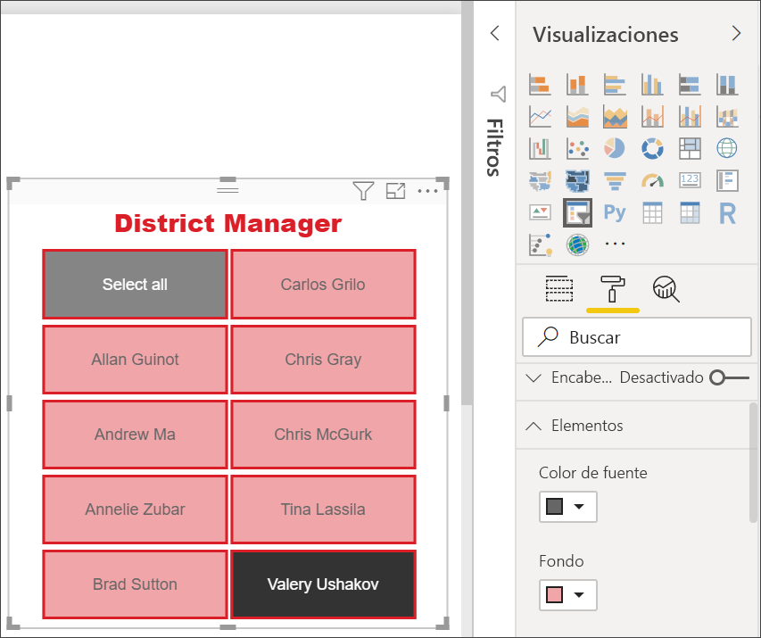

# Segmentaciones de datos en Power BI

[!INCLUDE [power-bi-visuals-desktop-banner](../includes/power-bi-visuals-desktop-banner.md)]

Imagine que quiere que los lectores del informe puedan consultar métricas de ventas generales, pero también resaltar el rendimiento de administradores de distrito concretos y diferentes períodos de tiempo. Podría crear informes independientes o gráficos comparativos. O bien, podría usar segmentaciones. Una segmentación es una forma alternativa de filtro que limita la parte del conjunto de datos que se muestra en otras visualizaciones de un informe. 

En este tutorial se usa el [ejemplo de análisis de minoristas](../sample-retail-analysis.md) gratuito para guiarlo a la hora de crear segmentaciones de plazos de tiempo, así como darles formato y crear listas de ellas. Diviértase descubriendo maneras de dar formato y usar segmentaciones. 

## Cuándo usar una segmentación
Las segmentaciones son una excelente opción si desea:

* Mostrar filtros importantes o que se usan comúnmente en el lienzo del informe para facilitar el acceso.
* Facilitar la visualización del estado filtrado actual sin tener que abrir una lista desplegable. 
* Filtrar por columnas innecesarias y ocultas en las tablas de datos.
* Crear informes más enfocados colocando las segmentaciones junto a objetos visuales importantes.

Las segmentaciones de Power BI no admiten:

- Campos de entrada
- Exploración en profundidad

## Creación de segmentaciones

**Creación de una segmentación para filtrar los datos por administrador de distrito**

1. Descargue el [archivo PBIX del ejemplo de análisis de minoristas](https://download.microsoft.com/download/9/6/D/96DDC2FF-2568-491D-AAFA-AFDD6F763AE3/Retail%20Analysis%20Sample%20PBIX.pbix).

1. Desde la barra de menús de Power BI Desktop, seleccione **Archivo** > **Abrir**.
   
1. Vaya al archivo **Ejemplo de análisis de venta al por menor PBIX.pbix** y seleccione **Abrir**.

1. En el panel de la izquierda, seleccione el icono **Informe**  para abrir el archivo en la vista de informe.

1. En la página **Información general**, sin nada seleccionado en el lienzo del informe, seleccione el icono **Segmentación**  en el panel **Visualizaciones** para crear una segmentación. 

1. Con la nueva segmentación seleccionada, seleccione **Distrito** > **Administrador de distrito** en el panel **Campos** para rellenar la segmentación. 

    Ahora la nueva segmentación se rellena con una lista de nombres de administradores de distrito y sus casillas de selección.
    
    
    
1. Cambie el tamaño de los elementos y arrástrelos en el lienzo para dejar espacio a la segmentación. Tenga en cuenta que si reduce demasiado el tamaño de la segmentación, sus elementos se recortan. 

1. Seleccione los nombres en la segmentación y observe el efecto que tiene en las demás visualizaciones de la página. Vuelva a seleccionar los nombres para anular la selección, o bien mantenga presionada la tecla **Ctrl** para elegir más de uno. Seleccionar todos los nombres es lo mismo que no elegir ninguno. 

1. Como alternativa, seleccione **Formato** (icono de rodillo de pintura) en el panel **Visualizaciones** para dar formato a la segmentación. 

   Hay demasiadas opciones como para describirlas todas; experimente y cree una segmentación que le resulte adecuada. En la imagen siguiente, la primera segmentación tiene una orientación horizontal y fondos en color para los elementos. La segunda segmentación tiene una orientación vertical y texto de color para lograr un aspecto más estándar.

   

   >[!TIP]
   >De forma predeterminada, los elementos de lista de la segmentación se ordenan de forma ascendente. Para ordenar en orden descendente, haga clic en el botón de puntos suspensivos ( **...** ), situado en la esquina superior derecha de la segmentación, y elija **Orden descendente**.

**Creación de una segmentación para filtrar los datos por intervalo de fechas**

1. Seleccione la página **Información general** del informe. Sin ninguna selección en el lienzo del informe, en el panel **Campos**, seleccione **Tienda** >  **Fecha de apertura**.

    Esta acción rellena el cuadro **Valores** del panel **Visualizaciones** para crear una visualización.

1. Con la nueva visualización seleccionada en el informe, seleccione el icono **Segmentación** en el panel **Visualizaciones** para convertirla en una segmentación. Esta segmentación **Fecha de apertura** es un control deslizante con el intervalo de fechas rellenado.
    
    

1. Cambie el tamaño de la segmentación y los demás elementos, y arrástrelos en el lienzo para dejar espacio a la segmentación. Aunque el tamaño de la segmentación se cambia con el del control deslizante, desaparece y las fechas se recortan si elige un tamaño demasiado pequeño para la segmentación. 

1. Seleccione otros intervalos de fechas con el control deslizante, o bien un campo de fecha para escribir una fecha o abrir una ventana emergente con un calendario para hacer una selección más precisa. Observe los efectos que tiene en las demás visualizaciones de la página.
    
    >[!NOTE]
    >Los tipos de datos numéricos y de fecha/hora generan las segmentaciones de control deslizante de intervalo de forma predeterminada. A partir de la actualización de febrero de 2018 de Power BI, las segmentaciones de intervalo de tipo de datos de número entero ahora se ajustan a los valores de número entero en lugar de mostrar las posiciones decimales. 

1. Para cambiar el tipo de segmentación, con la segmentación seleccionada, mantenga el mouse sobre el área superior derecha, seleccione el icono de acento circunflejo que aparece y elija una de las opciones, como **Lista** o **Antes**. Observe cómo cambian las opciones de selección y la apariencia de la segmentación. 
 
    

Para obtener más información sobre cómo crear segmentaciones de intervalos numéricos y de fecha, vea el vídeo siguiente y vea [Uso de la segmentación de intervalos numéricos en Power BI Desktop](../desktop-slicer-numeric-range.md).
   > [!NOTE]
   > En este vídeo se usa una versión anterior de Power BI Desktop.
   > 
   > 

<iframe width="560" height="315" src="https://www.youtube.com/embed/zIZPA0UrJyA" frameborder="0" allowfullscreen></iframe> 

## Control de qué objetos visuales de página se ven afectados por las segmentaciones
De forma predeterminada, las segmentaciones de las páginas del informe afectan a todas las visualizaciones de la página. Cuando elija los valores en los controles deslizantes de lista y fecha que acaba de crear, observe los efectos en las demás visualizaciones. Los datos filtrados están una intersección de los valores seleccionados en las dos segmentaciones. 

Use interacciones de objetos visuales para impedir que algunas visualizaciones de página se vean afectadas. En la página **Información general**, el gráfico **Varianza total de ventas por mes fiscal y administrador de distrito** muestra datos comparativos generales de los administradores de distrito por mes, que quiere que sean visibles en todo momento. Use interacciones de objetos visuales para que las selecciones de segmentación sigan filtrando este gráfico. 

1. Vaya a la página **Información general** del informe y, después, seleccione la segmentación **Administrador de distrito** que ha creado antes.

1. En el menú de Power BI Desktop, seleccione el menú **Formato** en **Herramientas de objetos visuales** y, después, seleccione **Editar interacciones**.
   
   Encima de todos los objetos visuales de la página aparecen controles de filtro , cada uno con un **Filtro** y una opción **Ninguno**. Inicialmente, la opción **Filtro** está preseleccionada en todos los controles.
   
1. Seleccione la opción **Ninguno** del control de filtro situado sobre el gráfico **Varianza total de ventas por mes fiscal y administrador del distrito** para hacer que la segmentación **Administrador de distrito** deje de filtrarlo. 

1. Seleccione la segmentación **Fecha de apertura** y después la opción **Ninguno** situada sobre el gráfico **Varianza total de ventas por mes fiscal y administrador de distrito** para hacer que esta segmentación deje de filtrarlo. 

   Ahora, cuando seleccione los nombres e intervalos de fechas en las segmentaciones, el gráfico **Varianza total de ventas por mes fiscal y administrador de distrito** no se modifica.

Para más información sobre cómo editar las interacciones, vea [Cambio de la interacción de los objetos visuales en un informe de Power BI](../service-reports-visual-interactions.md).

## Sincronización y uso de las segmentaciones en otras páginas
A partir de la actualización de febrero de 2018 de Power BI se puede sincronizar una segmentación y usarla en una o todas las páginas de un informe. 

En el informe actual, la página **Ventas mensuales de distrito** tiene también una segmentación **Administrador de distrito**, pero ¿qué ocurriría si también quisiera que esa segmentación estuviera en la página **Nuevas tiendas**? La página **Nuevas tiendas** tiene una segmentación, pero solo proporciona información sobre el **nombre de la tienda**. Con el panel **Sincronizar segmentaciones** se puede sincronizar la segmentación **Administrador de distrito** con estas páginas, para que las selecciones de segmentación de cualquier página afecten a las visualizaciones de las tres páginas.

1. En el menú **Vista** de Power BI Desktop, seleccione **Sincronizar segmentaciones**.

    

    Aparece el panel **Sincronizar segmentaciones** entre los paneles **Filtros** y **Visualizaciones**.

    

1. En la página **Ventas mensuales de distrito** del informe, seleccione la segmentación **Administrador de distrito**. 

    Como ya ha creado una segmentación **Administrador de distrito** (**DM**) en la página **Información general**, el panel **Sincronizar segmentaciones** tiene este aspecto:
    
    
    
1. En la columna **Sincronizar** del panel **Sincronizar segmentaciones**, seleccione las páginas **Información general**, **Ventas mensuales de distrito** y **Nuevas tiendas**. 

    Esta selección hace que la segmentación **Ventas mensuales de distrito** se sincronice en estas tres páginas. 
    
1. En la columna **Visible** del panel **Sincronizar segmentaciones**, seleccione la página **Nuevas tiendas**. 

    Esta selección hace que la segmentación **Ventas mensuales de distrito** sea visible en estas tres páginas. Ahora el panel **Sincronizar segmentaciones** aparece de esta forma:

    

1. Observe los efectos de sincronizar la segmentación y hacerla visible en las otras páginas. En la página **Ventas mensuales de distrito**, observe que el control deslizante **Administrador de distrito** muestra ahora las mismas selecciones que en la página **Información general**. En la página **Nuevas tiendas**, ahora la segmentación **Administrador de distrito** es visible y sus selecciones afectan a las que son visibles en la segmentación **Nombre de la tienda**. 
    
    >[!TIP]
    >Aunque la segmentación aparece inicialmente en las páginas sincronizadas con el mismo tamaño y posición que en la página original, puede mover, cambiar el tamaño y dar formato de forma independiente a segmentaciones sincronizadas en las distintas páginas. 

    >[!NOTE]
    >Si sincroniza una segmentación con una página pero no la hace visible en esa página, las selecciones de segmentación realizadas en las demás páginas seguirán filtrando los datos en la página.
 
## Segmentaciones de formato
Existen diferentes opciones de formato según el tipo de segmentación. Con la orientación **Horizontal**, el diseño **dinámico** y la posibilidad de colorear **elementos**, puede generar botones o iconos en lugar de elementos de lista estándar, y hacer que los elementos de segmentación cambien de tamaño para ajustarse a diferentes diseños y tamaños de pantalla.  

1. Con la segmentación **Administrador de distrito** seleccionada en cualquier página, en el panel **Visualizaciones**, seleccione el icono **Formato**  para mostrar los controles de formato. 
    
    
    
1. Seleccione las flechas desplegables situadas junto a cada categoría para mostrar y editar las opciones. 

### Opciones generales
1. En **Formato**, seleccione **General**, seleccione un color rojo en **Color del esquema** y, después, cambie **Grosor del esquema** a *2*. 

    Este valor cambia el color y el grosor de los esquemas y subrayados de los encabezados y elementos.

1. En **Orientación**, **Vertical** es la opción seleccionada de forma predeterminada. Seleccione **Horizontal** para generar una segmentación con botones o iconos organizados horizontalmente, y flechas de desplazamiento para acceder a los elementos que no caben en la segmentación.
    
    
    
1. **Active** el diseño **dinámico** para cambiar el tamaño y la disposición de los elementos de segmentación según el tamaño de la segmentación y la pantalla. 

    Para las segmentaciones de lista, el diseño dinámico evita que los elementos queden recortados en pantallas pequeñas. Solo está disponible en las orientaciones horizontales. Para las segmentaciones de control deslizante de intervalo, el diseño dinámico cambia el estilo del control deslizante y proporciona más flexibilidad para cambiar de tamaño. Los dos tipos de segmentaciones se convierten en iconos de filtro en tamaños pequeños.
    
    
    
    >[!NOTE]
    >Los cambios de diseño dinámico pueden invalidar un determinado formato de título y elementos que haya establecido. 
    
1. En **Posición X**, **Posición Y**, **Ancho** y **Alto**, establezca la posición y el tamaño de la segmentación con una precisión numérica, o bien mueva y cambie el tamaño de la segmentación directamente en el lienzo. 

    Experimente con diferentes tamaños de elementos y organizaciones, y observe cómo el diseño dinámico cambia en consecuencia. Estas opciones solo están disponibles cuando se seleccionan orientaciones horizontales. 

    

Para más información sobre las orientaciones horizontales y los diseños dinámicos, vea [Creación de una segmentación con capacidad de respuesta que se puede cambiar de tamaño en Power BI](../power-bi-slicer-filter-responsive.md).

### Opciones de controles de selección (solo segmentaciones de lista)
1. En **Controles de selección**, **active** **Mostrar la opción "Seleccionar todo"** para agregar un elemento **Seleccionar todo** a la segmentación. 

    **Mostrar opción "Seleccionar todo"** está **desactivada** de forma predeterminada. Cuando se habilita esta opción, al activarla, se seleccionan todos los elementos o se anula su selección. Si selecciona todos los elementos, al seleccionar un elemento se anula la selección, lo que permite un tipo de filtro *no es*.
    
    
    
1. **Desactive** la opción **Selección única** para poder seleccionar varios elementos sin necesidad de mantener presionada la tecla **Ctrl**. 

    La opción **Selección única** está **activada** de forma predeterminada. Al seleccionar un elemento se selecciona y, si se mantiene presionada la tecla **Ctrl**, se seleccionan varios elementos. Si vuelve seleccionar un elemento, se anula su selección.

### Opciones de título
La opción **Título** está **activada** de forma predeterminada. Esta selección muestra el nombre del campo de datos en la parte superior de la segmentación. 
- En este tutorial, dé formato al texto del título como se indica a continuación: 
   - **Color de fuente**: rojo
   - **Tamaño del texto**: **14 pt**
   - **Alineación**: **Centro**
   - **Familia de fuentes**: **Arial Black**

### Opciones de Elementos (solo para segmentaciones de lista)
1. En este tutorial, dé formato a las opciones de **Elementos** como se indica a continuación:
    - **Color de fuente**: negro
    - **Fondo**: rojo claro
    - **Tamaño del texto**: **10 pt**
    - **Familia de fuentes**: **Arial**
 
1. Para **Contorno**, elija **Marco** a fin de dibujar un borde alrededor de cada elemento con el tamaño y el color que establezca en **Opciones generales**. 
    
    
    
    >[!TIP]
    >- Al seleccionar **General** > **Orientación** > **Horizontal**, los elementos no seleccionados muestran los colores de texto y fondo elegidos, mientras que en los seleccionados se usan los colores predeterminados del sistema, que normalmente son el negro para los fondos y el blanco para el texto.
    >- Al seleccionar **General** > **Orientación > Vertical**, los elementos siempre muestran los colores seleccionados y las casillas siempre son de color negro cuando se seleccionan. 

### Entradas numéricas y de fecha, y opciones de control deslizante (solo para segmentaciones de controles deslizantes de intervalo)
- Para las segmentaciones de lista, las opciones de entradas numéricas y de fecha son las mismas que las de **Elementos**, salvo que no hay opciones de contorno ni subrayado.
- Las opciones de **control deslizante** permiten establecer el color del control deslizante de intervalo o **desactivar** el control deslizante para dejar solamente las entradas numéricas.

### Otras opciones de formato
Las demás opciones de formato están **desactivadas** de forma predeterminada. **Active** estas opciones para controlarlas: 
- **Fondo**: agrega un color de fondo a la segmentación y establece su transparencia.
- **Bloquear relación de aspecto**: conserva la forma de la segmentación si se cambia de tamaño.
- **Borde**: agrega un borde alrededor de la segmentación y establece su color. Este borde de la segmentación es independiente y no se ve afectado por la configuración **General**. 

## Pasos siguientes
Para obtener más información, consulte los artículos siguientes:

- [Tipos de visualización en Power BI](power-bi-visualization-types-for-reports-and-q-and-a.md)

- [Tablas en Power BI](power-bi-visualization-tables.md)

