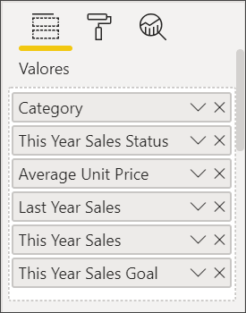
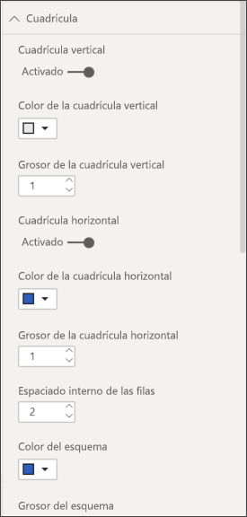
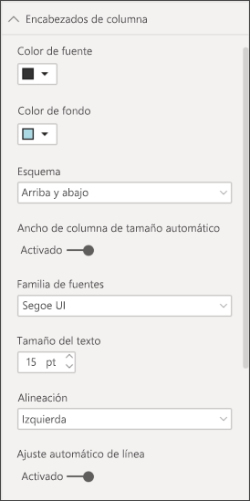
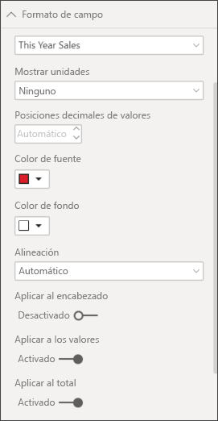
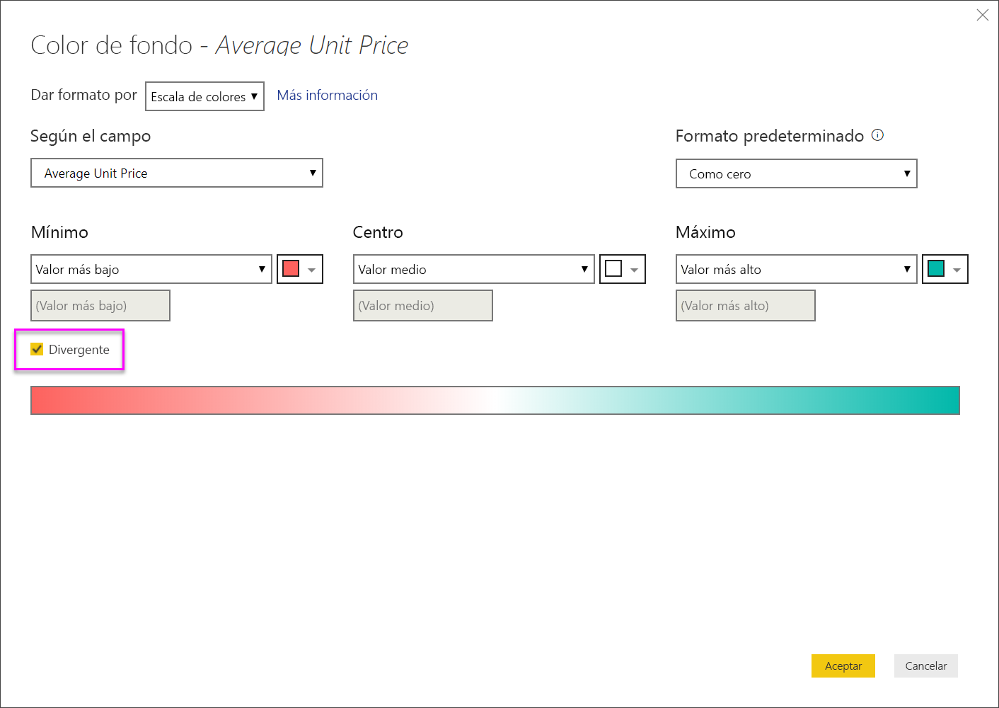
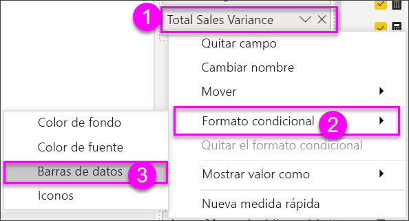
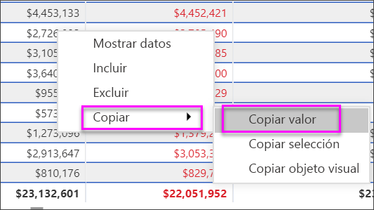
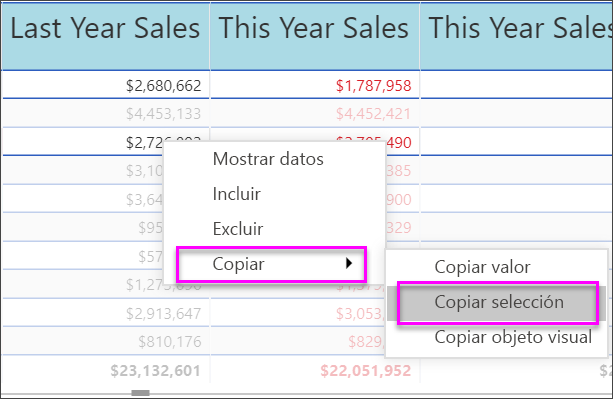

# Tablas en informes y paneles de Power BI
Una tabla es una cuadrícula que contiene datos relacionados en una serie lógica de filas y columnas. También puede contener encabezados y una fila de totales. Las tablas funcionan bien con comparaciones cuantitativas en las que está mirando muchos valores para una única categoría. Por ejemplo, esta tabla muestra 5 medidas distintas para **Categoría**.

Cree tablas en los informes y resalte los elementos dentro de la tabla con otros objetos visuales en la misma página del informe.  Además, puede seleccionar filas, columnas y e incluso celdas individuales y realizar un resaltado cruzado. Las celdas individuales y las selecciones de celdas múltiples pueden copiarse y pegarse en otras aplicaciones.

## Cuándo usar una tabla
Las tablas son una excelente opción:

* Para ver y comparar datos detallados y valores exactos (en lugar de representaciones visuales)
* Para mostrar datos en un formato tabular
* Para mostrar datos numéricos por categorías   

> [!NOTE]
> Si una tabla tiene demasiados valores, considere la posibilidad de convertirla en una matriz o de realizar una exploración en profundidad. El número máximo de puntos de datos que se mostrará en una tabla es 3 500.

## Requisitos previos
- Servicio Power BI o Power BI Desktop
- Ejemplo de análisis de venta al por menor

## Crear una tabla
Vamos a crear la tabla de la imagen anterior para mostrar los valores de ventas por categoría de producto. Para continuar, inicie sesión en el servicio Power BI y seleccione **Obtener datos \> Ejemplos \> Ejemplo de análisis de minoristas > Conectar** y elija **Ir al panel**. La creación de una visualización requiere permisos de edición para el conjunto de datos e informes. Por suerte, los ejemplos de Power BI son todos editables. Si el informe se ha compartido con usted, no podrá crear visualizaciones en los informes.

1. En el panel de navegación izquierdo, seleccione **Áreas de trabajo > Mi área de trabajo**.    
2. Seleccione la pestaña Conjuntos de datos y desplácese hasta el conjunto de datos del ejemplo Retail Analysis que acaba de agregar.  Seleccione el icono **Crear informe**.

    
2. En el editor de informes, seleccione **Elemento** > **Categoría**.  Power BI crea automáticamente una tabla que enumera todas las categorías.

    
3. Seleccione **Ventas > Precio unitario medio** y **Ventas > Ventas del último año** y **Ventas > Ventas de este año** y elija las 3 opciones (Valor, Objetivo, Estado).   
4. En el panel Visualizaciones, busque el área **Valores** y arrastre y coloque los valores hasta que el orden de las columnas del gráfico coincida con la primera imagen de esta página.  El área Valores debe ser similar a esta.

    
5. Ancle la tabla al panel seleccionando el icono de anclar.  

     

## Dar formato a la tabla
Hay muchas maneras de dar formato a una tabla y aquí solo trataremos algunas de ellas. Una buena manera de conocer las demás opciones de formato es abrir el panel Formato (icono de rodillo de pintar ) y explorar.

* Pruebe a dar formato a la cuadrícula de tabla. En este caso se ha agregado una cuadrícula vertical azul, se ha agregado espacio a las filas y se ha aumentado ligeramente el esquema y el tamaño de texto.

    

    
* Para los encabezados de columna se ha cambiado el color de fondo, se ha agregado un esquema y se ha aumentado el tamaño de fuente. 

    

    

* Incluso puede aplicar formato a encabezados de columna y columnas individuales. Empiece por ampliar el **Formato de campo** y seleccione la columna a la que se va a dar formato en la lista desplegable. Dependiendo de los valores de columna, el Formato de campo permite configurar parámetros como mostrar unidades, el color de fuente, el número de posiciones decimales, el fondo, la alineación y más. Una vez que haya ajustado la configuración, decida si desea aplicar esta configuración también al encabezado y la fila de totales.

    

* Y después de algunos cambios de formato adicionales, esta es nuestra tabla final. Dado que hay muchas opciones de formato, la mejor manera de aprender es comenzar con el formato predeterminado, abrir el panel Formato  y comenzar a explorar. 

    

### Formato condicional
Hay un tipo de formato conocido como *formato condicional* que se aplica a los campos del área **Valores** del panel **Visualizaciones** del servicio Power BI o Desktop. 

Con el formato condicional para tablas, puede especificar colores personalizados de fondo de las celdas y colores de fuente según los valores de la celda e incluso puede usar colores de degradado. 

1. En el panel **Visualizaciones** del servicio Power BI o Desktop, seleccione la flecha hacia abajo que está situada junto al valor del área **Valores** que desea formatear (o haga clic con el botón derecho en el campo). El formato condicional solo se puede administrar en el área **Valores** de **Campos**.

    
2. Seleccione **Escalas de colores de fondo**. En el cuadro de diálogo que aparece, puede configurar el color, así como los valores de *Mínimo* y *Máximo*. Si selecciona el cuadro **Diverging**, puede configurar un valor *Centro* opcional.

    

    Vamos a aplicar un formato personalizado a los valores de Precio unitario medio. Seleccione **Divergente**, agregue algunos colores y elija **Aceptar**. 

    
3. Agregue un nuevo campo a la tabla que contenga valores positivos y negativos.  Seleccione **Ventas > Varianza total de ventas**. 

    
4. Agregue el formato condicional de la barra de datos seleccionando la flecha abajo situada junto a **Varianza total de ventas** y eligiendo **Formato condicional > Barras de datos**.

    
5. En el cuadro de diálogo que aparece, establezca los colores para **Barra positiva** y **Barra negativa**, coloque una marca de verificación junto a **Mostrar solo la barra** y realice cualquier otro cambio que desee.

    

    Si selecciona **Aceptar**, las barras de datos reemplazarán los valores numéricos en la tabla, lo cual facilitará el análisis.

    
6. Para quitar el formato condicional de una visualización, simplemente vuelva a hacer clic con el botón derecho en el campo y seleccione **Quitar formato condicional**.

> [!TIP]
> El formato condicional también está disponible en el panel Formato (icono de rodillo de pintura). Seleccione el valor al que va a dar formato y, a continuación, establezca **Escalas de colores** o **Barras de datos** en **Activado** para aplicar la configuración predeterminada o, para personalizar la configuración, y seleccione **Controles avanzados**.
> 
## Copia de los valores de las tablas de Power BI para su uso en otras aplicaciones

Su tabla o matriz puede tener contenido que le gustaría utilizar en otras aplicaciones, como Dynamics CRM, Excel e incluso otros informes de Power BI. Con el botón derecho de Power BI, puede copiar una sola celda o una selección de celdas en el portapapeles y pegarlas en la otra aplicación.

* Para copiar el valor de una sola celda, seleccione la celda, haga clic con el botón derecho del ratón y elija **Copiar valor**. Con el valor de la celda sin formato en el portapapeles, ahora puede pegarlo en otra aplicación.

    

* Para copiar más de una celda, seleccione un rango de celdas o utilice CTRL para seleccionar una o más celdas. La copia incluirá los encabezados de columna y de fila.

    

    La copia incluye los encabezados de columna y de fila.

    

## Ajustar el ancho de columna de una tabla
A veces, Power BI trunca un encabezado de columna en un informe o un panel. Para mostrar el nombre de columna completo, mantenga el puntero sobre el espacio a la derecha del encabezado para mostrar las flechas dobles, selecciónelas y arrástrelas.

## Consideraciones y solución de problemas
* Al aplicar el formato de las columnas, solo puede elegir una opción de alineación por cada columna: Automática, Izquierda, Centro, Derecha. Normalmente, una columna contiene todo el texto o todos los números, y no una combinación de ellos. Pero en casos donde una columna contiene números y texto, **Automática** alineará el texto a la izquierda y los números a la derecha. Este comportamiento es compatible con idiomas en los que se lee de izquierda a derecha.   

## Pasos siguientes

[Gráficos de rectángulos en Power BI](power-bi-visualization-treemaps.md)

[Tipos de visualización en Power BI](power-bi-visualization-types-for-reports-and-q-and-a.md)