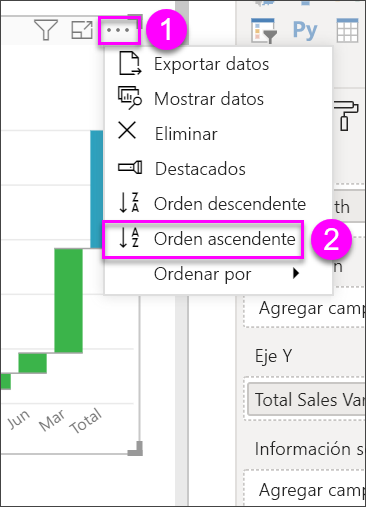

# Gráficos de cascada en Power BI

Los gráficos de cascada muestran un total acumulado a medida que Power BI agrega y resta valores. Son útiles para comprender cómo afecta una serie de cambios positivos y negativos a un valor inicial (por ejemplo, ingresos netos).

Las columnas están codificadas por color para identificar rápidamente los aumentos y las disminuciones. Las columnas de valores iniciales y finales a menudo [comienzan en el eje horizontal](https://support.office.com/article/Create-a-waterfall-chart-in-Office-2016-for-Windows-8de1ece4-ff21-4d37-acd7-546f5527f185#BKMK_Float "comienzan en el eje horizontal"), mientras que los valores intermedios son columnas flotantes. Debido a este estilo, los gráficos de cascada también se denominan gráficos de puente.

<iframe width="560" height="315" src="https://www.youtube.com/embed/qKRZPBnaUXM" frameborder="0" allow="autoplay; encrypted-media" allowfullscreen></iframe>

## Cuándo usar un gráfico de cascada

Los gráficos de cascada son una excelente opción:

* Cuando la medida sufre cambios con el transcurso del tiempo y a través de una serie o de diferentes categorías.

* Para auditar los cambios más importantes que contribuyen al valor total.

* Para trazar el beneficio anual de la compañía mostrando varias fuentes de ingresos y obtener la ganancia total (o pérdida).

* Para ilustrar la plantilla inicial y final de su empresa en un año.

* Para visualizar la cantidad de dinero que genera y gasta cada mes, y el saldo corriente de su cuenta.

## Requisitos previos

* Servicio Power BI o Power BI Desktop

* Informe del Ejemplo de análisis de minoristas

## Obtención del informe del Ejemplo de análisis de minoristas

Estas instrucciones usan el Ejemplo de análisis de minoristas. La creación de una visualización requiere permisos de edición para el conjunto de datos e informes. Por suerte, los ejemplos de Power BI son todos editables. Si alguien comparte un informe con usted, no podrá crear visualizaciones en informes. Para continuar, abra el [informe del Ejemplo de análisis de minoristas](../sample-datasets.md).

Después de obtener el conjunto de datos **Ejemplo de análisis de minoristas**, puede empezar a trabajar.

## Crear un gráfico de cascada

Vamos a crear un gráfico de cascada que muestre la varianza de las ventas (ventas estimadas frente a las ventas reales) por mes.

1. En **Mi área de trabajo**, seleccione **Conjuntos de datos** > **Crear un informe**.

    

1. En el panel **Campos**, seleccione **Ventas** > **Varianza total de ventas**.

   

1. Seleccione el icono de cascada  para convertir el gráfico en un gráfico de rectángulos.

    Si **Varianza total de ventas** no está en el área **Eje Y**, arrástrelo aquí.

    

1. Seleccione **Tiempo** > **MesFiscal** para agregarlo al área **Categoría**.

    

1. Asegúrese de que Power BI ordenó el gráfico de cascada cronológicamente. En la esquina superior derecha del gráfico, seleccione los puntos suspensivos (...).

    Compruebe que hay un indicador amarillo próximo a la izquierda de las opciones **Orden ascendente** y **MesFiscal**.

    

    También puede fijarse en los valores del eje X y comprobar que estén en orden de **Ene** a **Ago**.

    Profundice un poco más para ver lo que está contribuyendo más a los cambios de un mes a otro.

1. Arrastre **Store** > **Territory** al cubo **Desglose**.

    

    De forma predeterminada, Power BI agrega los principales cinco factores que contribuyen a los aumentos o disminuciones por mes.

    

    Solo le interesan los dos factores principales.

1. En el panel **Formato**, seleccione **Desglose** y establezca **Número máximo de desgloses** en **2**.

    

    Una revisión rápida revela que los territorios de Ohio y Pennsylvania son los factores que más contribuyen al movimiento, negativo y positivo, en el gráfico de cascada.

    

    Se trata de un dato interesante. ¿Ohio y Pennsylvania tienen tal impacto porque las ventas en estos dos territorios son mucho mayores que en los otros territorios? Puede comprobarlo.

1. Cree un mapa que examine el valor de ventas por territorio para el año en curso y el anterior.

    

    El mapa confirma su teoría. Muestra que estos dos territorios tenían el mayor valor de ventas del año anterior (tamaño de burbuja) y este año (sombreado de burbuja).

## Resaltado y filtrado cruzado

Para obtener información sobre cómo usar el panel **Filtros**, consulte [Incorporación de un filtro a un informe en la vista Editar](../power-bi-report-add-filter.md).

Al resaltar una columna en un gráfico de cascada, se realiza un filtrado cruzado de las demás visualizaciones de la página del informe, y viceversa. Sin embargo, la columna **Total** no desencadena el resaltado ni responde al filtrado cruzado.

## Pasos siguientes

* [Cambiar cómo interactúan los objetos visuales en un informe de Power BI](../service-reports-visual-interactions.md)

* [Tipos de visualización en Power BI](power-bi-visualization-types-for-reports-and-q-and-a.md)
