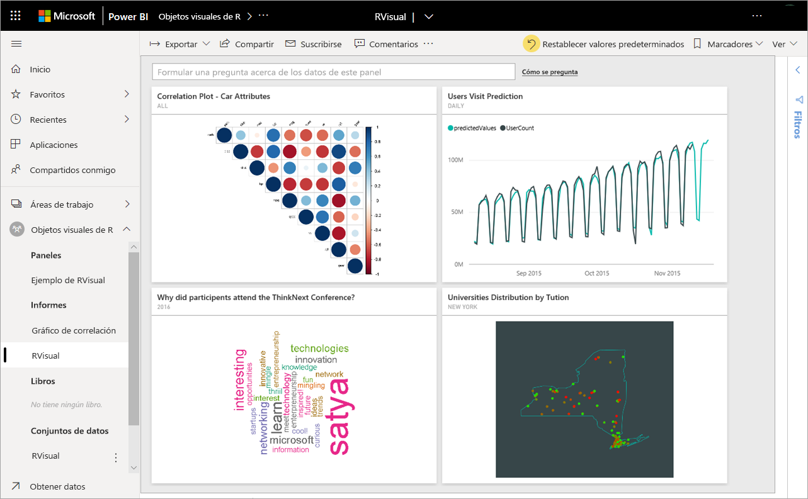
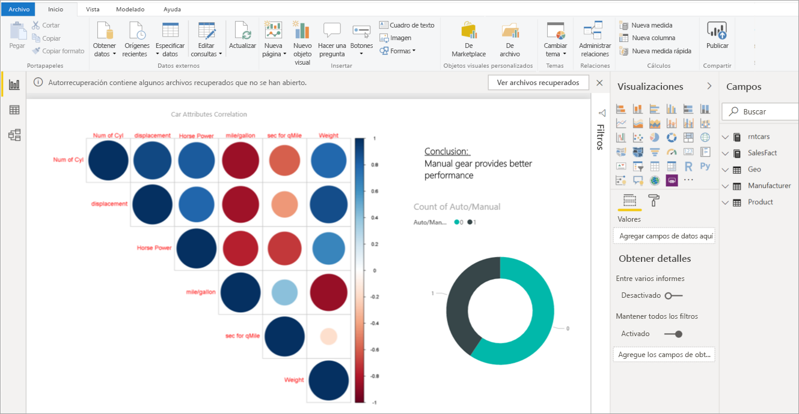
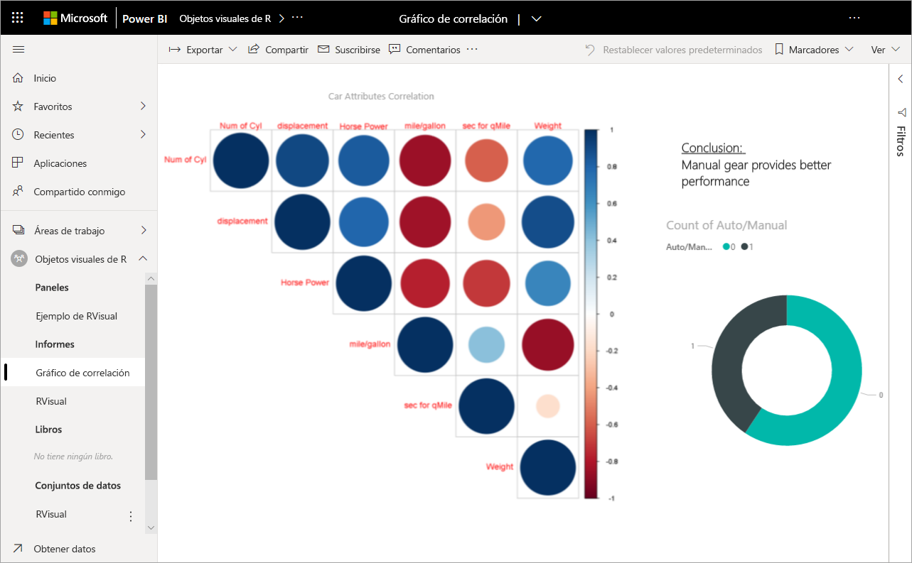
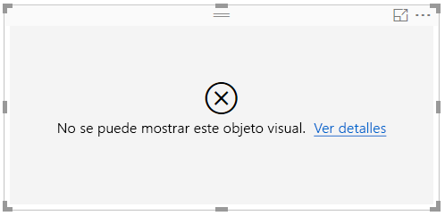

# Creación y uso de objetos visuales de R en Power BI
Actualmente, los objetos visuales R solo se pueden crear en **Power BI Desktop** y, después, se publican en el servicio Power BI. Para obtener más información sobre cómo crear objetos visuales de R, vea [Crear objetos visuales de Power BI con R ](../desktop-r-visuals.md).

## Visualización de objetos visuales de R en el servicio Power BI
El servicio Power BI permite ver e interactuar con objetos visuales creados con scripts R. Los objetos visuales creados con scripts R, normalmente denominados *objetos visuales R*, pueden presentar forma de datos y análisis avanzados como la previsión, con análisis enriquecidos y la potencia de visualización de R.

> [!NOTE]
> El [lenguaje de programación R](https://www.r-project.org/) se encuentra entre los lenguajes de programación más usados normalmente por analistas de negocios, científicos de datos y estadistas. El lenguaje R tiene una comunidad de código abierto que ofrece más de 7.000 paquetes de complementos, así como grupos de usuarios de R ampliamente usados. La versión de R implementada en el servicio Power BI es *Microsoft R 3.4.4.*
> 
> 

La siguiente imagen muestra un panel de Power BI con una colección de objetos visuales R que se usan para análisis avanzados.

Los objetos visuales R se crean en un [informe de Power BI Desktop](../desktop-get-the-desktop.md), al igual que el informe que se muestra en la siguiente imagen.

Una vez creado el informe en **Power BI Desktop**, puede publicar el informe que contiene uno o más objetos visuales R en el servicio Power BI. 

 En el servicio, no se admiten todos los paquetes de R. Vea los paquetes compatibles al final de este artículo para obtener la lista de paquetes que se admiten actualmente en el servicio Power BI.

Puede descargar este [archivo de ejemplo de Power BI Desktop](https://download.microsoft.com/download/D/9/A/D9A65269-D1FC-49F8-8EC3-1217E3A4390F/RVisual_correlation_plot_sample%20SL.pbix) (archivo .pbix) que contiene algunos objetos visuales R para ver cómo funciona y experimentar.

Los objetos visuales R se crean en **Power BI Desktop** y, después, se publican en el servicio Power BI. La mayor parte de las veces se comportan como cualquier otro objeto visual en el servicio Power BI: puede interactuar, filtrar, segmentar y anclarlos en un panel o compartirlos con otras personas. Para obtener más información sobre cómo compartir paneles y objetos visuales, consulte [Compartir un panel con compañeros y otros usuarios](../service-share-dashboards.md). Una diferencia con otros objetos visuales es que los objetos visuales R no pueden mostrar información sobre herramientas y no se pueden usar para filtrar otros objetos visuales.

Como puede ver en la siguiente imagen, los objetos visuales R en el servicio Power BI, ya sea en paneles o informes, aparecen y se comportan en gran medida como cualquier otro objeto visual y los usuarios no tienen que tener en cuenta el script R subyacente que ha creado el objeto visual.

## Seguridad de scripts R
Los objetos visuales R se crean a partir de scripts R, que podrían contener código que presente riesgos para la seguridad o la privacidad.

Estos riesgos existen principalmente en la fase de creación cuando el autor del script lo ejecuta en su propio equipo.

El servicio Power BI aplica una tecnología de *espacio aislado* para proteger a los usuarios y al servicio de los riesgos de seguridad.

Este enfoque de *espacio aislado* impone algunas restricciones en los scripts R que se ejecutan en el servicio Power BI, como el acceso a Internet o a otros recursos que no se necesitan para crear el objeto visual R.

## Experiencia de error de scripts R
Si un script R encuentra un error, el objeto visual R no se traza y se muestra un mensaje de error. Para obtener más información sobre el error, seleccione **Ver detalles** en el error del objeto visual R del lienzo, tal y como se muestra en la siguiente imagen.

Como otro ejemplo, la siguiente imagen muestra el mensaje de error que aparece si no se pudo ejecutar correctamente un script R debido a que falta un paquete R en Azure.

## Administración de licencias
Los objetos visuales de R requieren una licencia de [Power BI Pro](../service-self-service-signup-for-power-bi.md) para poder representarse en informes, actualizarse, filtrarse y filtrarse de forma cruzada. Para obtener más información sobre las licencias de Power BI Pro y cómo se diferencian de las licencias gratuitas, consulte [Contenido de Power BI Pro: ¿qué es?](../service-admin-purchasing-power-bi-pro.md)

Los usuarios gratuitos de Power BI solo pueden usar iconos compartidos con ellos en áreas de trabajo Premium. Consulte [Adquisición de Power BI Pro](../service-admin-purchasing-power-bi-pro.md) para obtener más información.

En la siguiente tabla se describen las funcionalidades de los objetos visuales R según las licencias.

|  |Crear objetos visuales de R en Power BI Desktop  | Crear informes de servicio PBI con objetos visuales de R |Ver objetos visuales de R en informes  | Ver iconos de R en paneles |
|---------|---------|---------|---------|--------|
|**Invitado** (Power BI Embedded)     |  Admitido|  No admitido      | Solo se admite en la capacidad Premium/Azure  | Solo se admite en la capacidad Premium/Azure |
|**Inquilino no administrado** (dominio no verificado) | Admitido | No admitido |  No admitido |Admitido (caso B2B) |
|**Inquilino administrado** con licencia gratuita    |  Admitido       |  No admitido       |    Admitido solo en capacidad Premium    | Admitido |
**Inquilino administrado** con licencia Pro     |   Admitido      | Admitido      | Admitido    |Admitido|

## Limitaciones conocidas
Los objetos visuales R en el servicio Power BI tienen algunas limitaciones:

* La compatibilidad con objetos visuales de R se limita a los paquetes que se identifican en el artículo [Paquetes de R compatibles](../service-r-packages-support.md). Actualmente, no hay compatibilidad para paquetes personalizados.
* Limitaciones de tamaño de datos: los datos que usa el objeto visual de R para el trazado están limitados a 150.000 filas. Si se seleccionan más de 150.000 filas, solo se usan las primeras 150.000 y se muestra un mensaje en la imagen. Además, los datos de entrada tienen un límite de 250 MB.
* Resolución: todos los objetos visuales de R se muestran a 72 ppp.
* Dispositivo de trazado: solo se admite el trazado en el dispositivo predeterminado. 
* Límite de tiempo de cálculo: si un cálculo de objeto visual R supera los 60 segundos, se agota el tiempo de espera del script y se genera un error.
* Los objetos visuales de R se actualizan en las actualizaciones de datos, el filtrado y el resaltado. En cambio, la imagen en sí no es interactiva y no es compatible con la información sobre herramientas.
* Los objetos visuales de R responden al resaltado de otros objetos visuales, pero no puede hacer clic en elementos del objeto visual de R para aplicar un filtro cruzado a otros elementos.
* Los objetos visuales R no se admiten para el tipo de datos *Hora*. Use Fecha y hora en su lugar.
* Los objetos visuales de R no se muestran al usar **Publicar en Web**.
* Los objetos visuales de R no admiten el cambio de nombre de las columnas de entrada. Se hará referencia a las columnas por su nombre original durante la ejecución del script.
* Actualmente, los objetos visuales R no se imprimen con la impresión de informes y panel
* Actualmente, no se admiten los objetos visuales R en el modo DirectQuery de Analysis Services
* Los objetos visuales de R tienen la capacidad de convertir etiquetas de texto en elementos gráficos. Para hacerlo en el servicio Power BI, se debe seguir este paso adicional:
  
  * Agregue la línea siguiente al comienzo del script de R:
    
        powerbi_rEnableShowText =  1
* Las fuentes de los idiomas chino, japonés y coreano requieren todos los pasos adicionales siguientes para que funcionen correctamente en el servicio Power BI:
  
  * En primer lugar, instale el paquete de R *showtext* y todas sus dependencias. Puede hacerlo mediante la ejecución del siguiente script:
    
        *install.packages("showtext")*
  * A continuación, agregue la línea siguiente al comienzo del script de R:
    
        powerbi_rEnableShowTextForCJKLanguages =  1

## Información general de paquetes R
Los paquetes R son colecciones de funciones, datos y código compilado R que se combinan en un formato bien definido. Cuando se instala R, incluye un conjunto estándar de paquetes y hay otros paquetes disponibles para su descarga e instalación. Una vez instalado, se debe cargar un paquete de R en la sesión que se usará. El origen principal de los paquetes R gratuitos es CRAN, la [red integral de archivos R](https://cran.r-project.org/web/packages/available_packages_by_name.html).

**Power BI Desktop** puede usar cualquier tipo de paquetes R sin limitaciones. Puede instalar paquetes R para usarlos en **Power BI Desktop** por su cuenta (mediante el [IDE de RStudio](https://www.rstudio.com/), por ejemplo).

Los objetos visuales de R en el **servicio Power BI** son compatibles con los paquetes que se encuentran en la sección **Paquetes admitidos** de [este artículo](../service-r-packages-support.md). Si no encuentra un paquete que le interesa en la lista de paquetes admitidos, puede solicitar la compatibilidad del paquete. Consulte [R packages in the Power BI service](../service-r-packages-support.md) (Paquetes de R en el servicio Power BI) para información sobre cómo solicitar soporte técnico.

### Requisitos y limitaciones de los paquetes R
Hay una serie de requisitos y limitaciones para los paquetes R:

* El servicio Power BI, en su mayor parte, es compatible con los paquetes R con licencias de software gratuitas y de código abierto como GPL-2, GPL-3, MIT+, etc.
* El servicio Power BI admite paquetes publicados en CRAN. El servicio no es compatible con paquetes R personalizados o privados. Animamos a los usuarios a que pongan sus paquetes privados a disposición de CRAN antes de solicitar que el paquete esté disponible en el servicio Power BI.
* **Power BI Desktop** tiene dos variaciones para paquetes R:
  
  * Para los objetos visuales R, puede instalar cualquier paquete, incluidos los paquetes R personalizados.
  * Para objetos visuales R personalizados, para la instalación automática solo se admiten los paquetes CRAN públicos.
* Por motivos de privacidad y seguridad, actualmente no se admiten los paquetes R que proporcionan consultas cliente-servidor mediante la World Wide Web (como RgoogleMaps) en el servicio. Las redes están bloqueadas para estos intentos. Consulte [R packages in the Power BI service](../service-r-packages-support.md) (Paquetes de R en el servicio Power BI) para una lista de los paquetes de R que se admiten y los que no.
* El proceso de aprobación para incluir un nuevo paquete R tiene un árbol de dependencias. No se admiten algunas dependencias que deben estar instaladas en el servicio.

### Paquetes admitidos:
Para una lista extendida de paquetes de R compatibles (y la breve lista de paquetes incompatibles), consulte el artículo siguiente:

* [R packages in the Power BI service](../service-r-packages-support.md) (Paquetes de R en el servicio Power BI)

