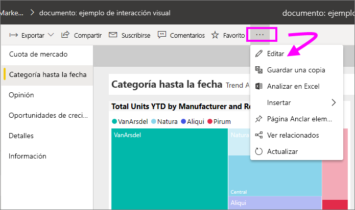
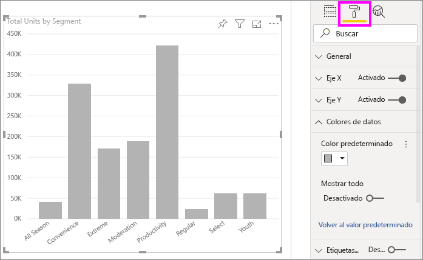
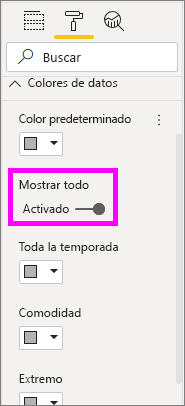
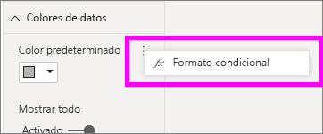
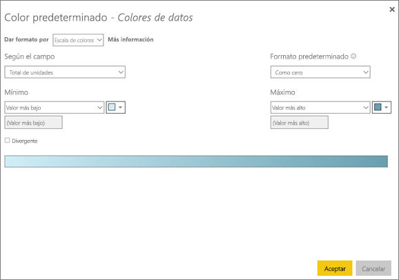
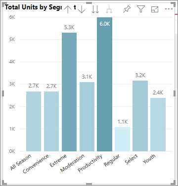
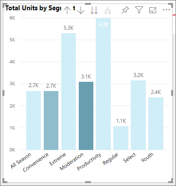
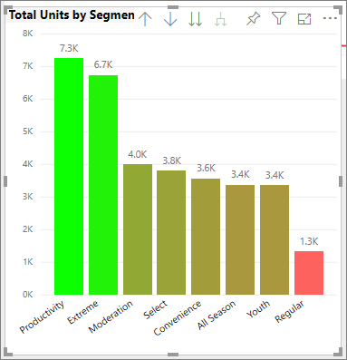
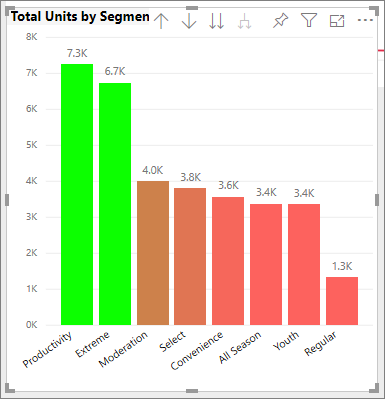
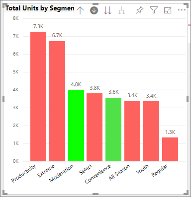

# Sugerencias y trucos para el formato de color en Power BI
Power BI permite personalizar los paneles y los informes de muchas formas. En este artículo se detallan una serie de sugerencias para que las visualizaciones de Power BI resulten más atractivas, interesantes y personalizadas según sus necesidades.

A continuación se proporcionan varias sugerencias. ¿Tiene alguna otra? Magnífico. Envíenosla para que estudiemos si puede agregarse a esta lista.

* Cambiar el color de un solo punto de datos
* Basar los colores de un gráfico en un valor numérico
* Basar el color de los puntos de datos en un valor de campo
* Personalizar los colores de la escala de colores
* Usar escalas de colores divergentes
* Cómo deshacer acciones en Power BI

Para realizar cambios, debe modificar un informe. Abra el informe y seleccione **Editar informe** en el área del menú superior, como se muestra en la siguiente imagen.

Cuando aparezcan los paneles **Filtros** y **Visualizaciones** en el lado derecho del lienzo del informe, podrá comenzar el proceso de personalización. Si no aparece el panel, seleccione la flecha, en la esquina superior derecha, para abrirlo.

## Cambiar el color de un solo punto de datos
En ocasiones deseará resaltar un punto de datos determinado. Tal vez sea una cifra de ventas para el lanzamiento de un producto nuevo, o el aumento de los resultados de calidad tras lanzar un nuevo programa. Con Power BI, puede resaltar un punto de datos determinado cambiándole el color.

La visualización siguiente clasifica unidades vendidas por segmento de producto. 

Ahora suponga que desea destacar el segmento **Convenience** para mostrar su buen rendimiento utilizando para ello color. Estos son los pasos que debe realizar:

Expanda la sección **Colores de datos** y active el control deslizante para **Mostrar todo**. De este modo, se muestran los colores de cada elemento de datos en la visualización. Al mantener el puntero sobre los puntos de datos, se habilita el desplazamiento para permitirnos modificar cualquiera de estos.

Establezca **Convenience** en naranja. 

Una vez seleccionado, el punto de datos de **Convenience** aparece en un bonito tono naranja que, ciertamente, consigue destacar.

Si lo desea, puede cambiar los tipos de visualización y volver después: Power BI recordará su selección y mantendrá **Convenience** en naranja.

Puede cambiar el color de un punto de datos para uno, varios o todos los elementos de datos en la visualización. Quizás desee que el objeto visual imite sus colores corporativos. 

Se puede hacer de todo con los colores. En la siguiente sección, echamos un vistazo a los degradados.

## Basar los colores de un gráfico en un valor numérico
Los gráficos suelen establecer dinámicamente el color en función del valor numérico de un campo. De este modo, es posible mostrar un valor diferente al que se usa para el tamaño de una barra y mostrar dos valores en un solo gráfico. También puede usar esta opción para resaltar los puntos de datos por encima (o por debajo) de un valor determinado (por ejemplo, para resaltar las áreas de baja rentabilidad).

Las secciones siguientes muestran distintos mecanismos para basar el color en un valor numérico.

## Basar el color de los puntos de datos en un valor
Para cambiar el color según un valor, abra el panel de formato y seleccione la opción **Formato condicional**.  

En el panel de colores predeterminado, use las listas desplegables para identificar los campos que se usarán para el formato condicional. En este ejemplo, hemos seleccionado el campo **Datos de ventas** > **Total de unidades** y hemos seleccionado azul claro para el **valor más bajo** y azul oscuro para el **valor más alto**. 

También puede dar formato al color del objeto visual mediante un campo que no forma parte del objeto visual. En la siguiente imagen, se usa **%Market Share SPLY YTD**. 

Como puede ver, aunque hemos vendido más unidades de **Productivity** y **Extreme** (sus columnas son superiores), **Moderation** tiene un valor más elevado de **%Market Share SPLY YTD** (su columna tiene más de saturación de color).

## Personalizar los colores de la escala de colores
También puede cambiar la forma en que los valores se asignan a estos colores. En la imagen siguiente, los colores de **Mínimo** y **Máximo** están establecidos en naranja y verde, respectivamente.

En esta primera imagen, fíjese en que las barras del gráfico reflejan el degradado que se muestra en la barra. El valor más alto es verde, el más bajo es naranja y las barras del medio están coloreadas con tonos del espectro existente entre estos dos colores.

Ahora, veamos qué sucede si se proporcionan valores numéricos en los cuadros de texto **Mínimo** y **Máximo**. Establezcamos el valor **Mínimo** en 3 500 y el **Máximo**, en 6 000.

Si se establecen estos valores, el degradado ya no se aplica a los valores del gráfico que están por debajo del **Mínimo** o por encima del **Máximo**. Todas las barras con valores por encima del **Máximo** se colorean de verde, y las que tienen valores por debajo del **Mínimo** se colorean de rojo.

## Usar escalas de colores divergentes
A veces los datos pueden tener una escala que diverge de forma natural. Por ejemplo, un intervalo de temperatura tiene un centro natural en el punto de congelación, y los resultados de rentabilidad tienen un punto medio natural (cero).

Para usar escalas de colores divergentes, seleccione la opción **Divergente**. Cuando se activa **Divergente**, aparece un selector de colores adicional denominado **Centro**, tal como indica la imagen siguiente.

Al activar el control deslizante **Divergente** , pueden establecerse los colores **Mínimo**, **Máximo** y **Centro** por separado. En la imagen siguiente, **Centro** está establecido en 0.2 para **% Market Share SPLY YTD**, por lo que las barras con valores superiores a 0.2 presentan un tono degradado verde y las barras con valores inferiores a uno presentan tonos rojos.

## Cómo deshacer acciones en Power BI
Al igual que muchos otros servicios y software de Microsoft, Power BI permite deshacer el último comando fácilmente. Por ejemplo, pongamos que cambia el color de un punto de datos o de una serie de puntos de datos y no le gusta el color cuando aparece en la visualización. No recuerda exactamente qué color tenía antes, pero sabe que desea recuperar ese color.

Para **deshacer** la última acción, o las últimas acciones, lo único que debe hacer es:

- Escribir CTRL+Z.

## Comentarios
¿Tiene una sugerencia que le gustaría compartir? Envíenosla para que estudiemos si puede agregarse a esta lista.

>[!NOTE]
>Estas personalizaciones del color, de los ejes y otras relacionadas, disponibles cuando se selecciona el icono **Formato**, también están disponibles en Power BI Desktop.

## Pasos siguientes
[Introducción a las propiedades de eje y formato de color](service-getting-started-with-color-formatting-and-axis-properties.md)

